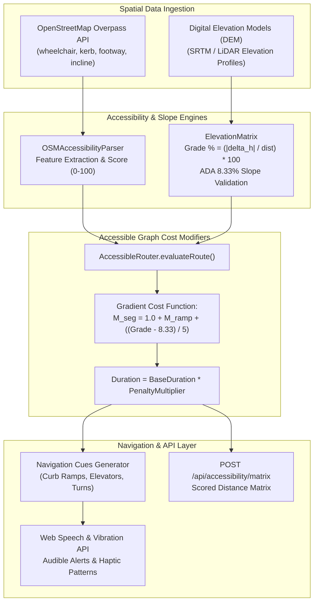

# ElevationMatrix & OSMAccessibilityParser Slope Calculation & Barrier-Free Navigation Algorithms

## 1. Executive Summary & Engine Architecture

Urban pedestrian navigation typically relies on shortest-path or minimal-time graph solvers (such as Dijkstra or Contraction Hierarchies) calibrated exclusively for motorized vehicles or able-bodied pedestrians. However, for wheelchair users, individuals pushing strollers, older adults with limited mobility, or visually impaired pedestrians, an optimal route cannot be selected based purely on distance.

A flight of stairs, an un-lowered curb, or a steep $12\%$ slope turns a standard 200-meter sidewalk into an impassable barrier. WorkSphere addresses this challenge through a multi-layered accessibility routing subsystem:
1. **[`OSMAccessibilityParser`](file:///c:/Users/admin/Desktop/workfere/src/core/accessibility/OSMAccessibilityParser.ts):** Ingests rich micro-mapping tags from the OpenStreetMap (OSM) Overpass API, identifying curb ramps, elevators, tactile paving, surface smoothness, and accessible entrances.
2. **[`ElevationMatrix`](file:///c:/Users/admin/Desktop/workfere/src/core/accessibility/ElevationMatrix.ts):** Interpolates Digital Elevation Model (DEM) data to calculate precise continuous path inclines (grade percentages), enforcing Americans with Disabilities Act (ADA) maximum running slope thresholds ($8.33\%$) with numerical overflow guards.
3. **[`AccessibleRouter`](file:///c:/Users/admin/Desktop/workfere/src/core/accessibility/AccessibleRouter.ts):** Dynamically penalizes graph edge traversal weights, applies non-linear gradient cost functions, and synthesizes audible speech and haptic vibration guidance.
4. **[`/api/accessibility/matrix`](file:///c:/Users/admin/Desktop/workfere/src/app/api/accessibility/matrix/route.ts):** Exposes an accessibility-weighted distance matrix API for multi-venue pedestrian routing.



---

## 2. OpenStreetMap Sidewalk Accessibility Tag Ingestion

The OpenStreetMap ecosystem contains rich tagging schemas for pedestrian infrastructure. The [`OSMAccessibilityParser`](file:///c:/Users/admin/Desktop/workfere/src/core/accessibility/OSMAccessibilityParser.ts) systematically extracts, normalizes, and classifies these tags into structured physical accessibility features.

### 2.1 Supported OSM Tagging Matrix

| Feature Key | Primary OSM Tag Query | Accepted Values | Accessibility Classification |
| :--- | :--- | :--- | :--- |
| **Wheelchair Compatibility** | `wheelchair` | `yes`, `limited`, `no`, `designated` | `isWheelchairAccessible = (val === 'yes' \|\| val === 'limited')` |
| **Curb Transition** | `kerb` | `lowered`, `flush`, `raised`, `no` | Lowered/flush curbs confirm step-free street crossing transition. |
| **Elevator Waypoint** | `highway`, `amenity`, `wheelchair:place` | `elevator` | Essential for grade-separated crossings (subway entrances, pedestrian bridges). |
| **Pedestrian Ramp** | `footway`, `incline` | `footway=ramp`, `incline=up\|down` | Verified ramp bypass around stairs or terrace steps. |
| **Tactile Paving** | `tactile_paving` | `yes`, `no`, `incorrect` | High-contrast truncated domes guiding visually impaired cane users. |
| **Accessible Entrance** | `entrance`, `wheelchair:entrance` | `entrance=yes` + `wheelchair=yes` | Barrier-free doorways with zero threshold steps and adequate clear width. |

### 2.2 Feature Parsing Logic

```typescript
export interface AccessibilityFeatures {
    hasElevator: boolean;
    hasRamp: boolean;
    hasTactilePaving: boolean;
    isWheelchairAccessible: boolean;
    accessibleEntrance: boolean;
    rawTags: Record<string, string>;
}

export class OSMAccessibilityParser {
    public parseFeatures(tags: Record<string, string>): AccessibilityFeatures {
        const wheelchair = tags['wheelchair']?.toLowerCase();
        const entrance = tags['entrance']?.toLowerCase();

        return {
            hasElevator: tags['highway'] === 'elevator' || tags['amenity'] === 'elevator' || tags['wheelchair:place'] === 'elevator',
            hasRamp: tags['kerb']?.toLowerCase() === 'lowered' || tags['footway']?.toLowerCase() === 'ramp' || tags['incline']?.toLowerCase() === 'up' || tags['incline']?.toLowerCase() === 'down',
            hasTactilePaving: tags['tactile_paving']?.toLowerCase() === 'yes',
            isWheelchairAccessible: wheelchair === 'yes' || wheelchair === 'limited',
            accessibleEntrance: entrance === 'yes' && (wheelchair === 'yes' || tags['wheelchair:entrance'] === 'yes'),
            rawTags: tags
        };
    }
}
```

### 2.3 Segment Accessibility Score Formulation

Parsed features are weighted to yield an aggregate accessibility score $S_{\text{osm}} \in [0, 100]$:

$$S_{\text{osm}} = \min\left(100, \; 40 \cdot \mathbb{I}_{\text{wheelchair}} + 20 \cdot \mathbb{I}_{\text{elevator}} + 20 \cdot \mathbb{I}_{\text{ramp}} + 10 \cdot \mathbb{I}_{\text{entrance}} + 10 \cdot \mathbb{I}_{\text{tactile}}\right)$$

Where $\mathbb{I}_{\text{feature}} \in \{0, 1\}$ represents the Boolean indicator for each respective feature.

---

## 3. Digital Elevation Model (DEM) & Slope Calculation Algorithms

Physical inclination (slope percentage) is the single most critical factor determining whether an otherwise step-free route is negotiable by a manual wheelchair user or mobility scooter.

### 3.1 Slope (Grade) Mathematical Formulation

The grade percentage between two coordinates on a segment with distance $d$ and elevation difference $\Delta h = h_2 - h_1$ is defined as:

$$\text{Grade}(\%) = \left(\frac{|\Delta h|}{d_{\text{effective}}}\right) \times 100$$

Where $d_{\text{effective}}$ incorporates safety guards against numerical division by zero.

### 3.2 Numerical Stability & Overflow Protection

When evaluating high-resolution trajectory points (e.g. GPS traces sampled at $10\text{ Hz}$ or fine-grained DEM LiDAR meshes), consecutive coordinates may have near-zero distance ($d \to 0$), causing catastrophic numerical overflow ($\text{Grade} \to \infty$):

1. **Minimum Safe Distance Threshold:**
   $$d_{\text{effective}} = \max(d, \; d_{\text{min}}), \quad d_{\text{min}} = 0.5\text{ meters}$$
2. **Maximum Safe Grade Clamp:**
   $$\text{Grade}_{\text{clamped}} = \min(\text{Grade}, \; 100.0\%)$$
3. **Zero-Distance / Flat Terrain Guard:**
   $$\text{if } (d \le 0 \land |\Delta h| = 0) \implies \text{Grade} = 0\%$$

```typescript
// Implementation from ElevationMatrix.ts
public calculateGrade(elevationDiff: number, distance: number): number {
    if (!Number.isFinite(elevationDiff) || !Number.isFinite(distance)) {
        return 0;
    }

    const absElevation = Math.abs(elevationDiff);
    const effectiveDistance = Math.max(distance, ElevationMatrix.MIN_SAFE_DISTANCE_METERS);

    if (distance <= 0 && absElevation === 0) {
        return 0;
    }

    const grade = (absElevation / effectiveDistance) * 100;
    return Math.min(grade, ElevationMatrix.MAX_SAFE_GRADE_PERCENT);
}
```

---

### 3.3 Elevation Profile Analysis (`analyzeProfile`)

Given cumulative route distances $D = [d_0, d_1, \dots, d_m]$ and elevation samples $H = [h_0, h_1, \dots, h_m]$:

1. **Segment Elevation Change:**
   $$\Delta h_i = |h_i - h_{i-1}|, \quad \Delta d_i = \max(0, \; d_i - d_{i-1})$$
2. **Maximum Running Slope:**
   $$\text{Grade}_{\max} = \max_{i=1 \dots m} \text{calculateGrade}(\Delta h_i, \Delta d_i)$$
3. **Average Route Slope:**
   $$\text{Grade}_{\text{avg}} = \frac{\sum_{i=1}^m \Delta h_i}{d_m - d_0} \times 100$$

### 3.4 Regulatory ADA Slope Benchmarks

| Grade Range (%) | Slope Ratio | ADA Compliance Classification | Physical Mobility Impact |
| :--- | :--- | :--- | :--- |
| $\le 5.0\%$ | $\le 1:20$ | **Fully Accessible (Flat / Gentle)** | Safe for all self-propelled wheelchairs; no handrails required. |
| $5.0\% - 8.33\%$ | $1:20 - 1:12$ | **Accessible Ramp (Compliant)** | Maximum allowable slope for ADA curb cuts and pedestrian ramps; requires continuous handrails and landings every $9\text{ m}$. |
| $8.33\% - 12.5\%$ | $1:12 - 1:8$ | **Steep Incline (Caution)** | Causes rapid upper-body fatigue; backward tipping hazard for manual wheelchairs. |
| $> 12.5\%$ | $> 1:8$ | **Severe Barrier (Non-Compliant)** | Impossible for standard manual wheelchairs without motorized assistance or attendant. |

```typescript
// Verification check
public isWheelchairAccessible(profile: ElevationProfile, maxAllowedGrade: number = 8.33): boolean {
    if (!profile || !Number.isFinite(profile.maxGrade)) return false;
    return profile.maxGrade <= maxAllowedGrade;
}
```

---

## 4. Gradient Cost Functions & Graph Weight Penalization

Standard pedestrian routing engines (e.g. OSRM or Valhalla) compute route duration based on flat walking speed ($v \approx 1.25\text{ m/s}$). [`AccessibleRouter.evaluateRoute`](file:///c:/Users/admin/Desktop/workfere/src/core/accessibility/AccessibleRouter.ts) modifies the effective edge weights by applying dynamic penalty multipliers.

### 4.1 Segment Multiplier Formulation

For each route segment $j$, the penalty multiplier $M_j$ combines infrastructure tags and terrain slope:

$$M_j = 1.0 + M_{\text{ramp}, j} + M_{\text{grade}, j}$$

#### Infrastructure Penalty ($M_{\text{ramp}}$)
If wheelchair mode is enabled and the segment lacks accessible designation and curb ramps:
$$M_{\text{ramp}, j} = \begin{cases} 2.0 & \text{if } \neg\text{isWheelchairAccessible} \land \neg\text{hasRamp} \\ 0.0 & \text{otherwise} \end{cases}$$

#### Progressive Gradient Penalty ($M_{\text{grade}}$)
When the calculated grade exceeds the ADA $8.33\%$ threshold:
$$M_{\text{grade}, j} = \begin{cases} \frac{\text{Grade}_j - 8.33}{5.0} & \text{if } \text{Grade}_j > 8.33\% \\ 0.0 & \text{otherwise} \end{cases}$$

*(For example, a $13.33\%$ grade adds an extra $\frac{13.33 - 8.33}{5} = +1.0$ to the multiplier, doubling the perceived route duration).*

### 4.2 Route Recommendation Criteria

The adjusted route duration is computed as:
$$T_{\text{adjusted}} = T_{\text{base}} \times M_{\text{total}}, \quad M_{\text{total}} = \max_{j} M_j$$

A route is classified as **Recommended (`isRecommended = true`)** if and only if:
$$\min_{j}(S_{\text{osm}, j}) \ge 60 \quad \land \quad M_{\text{total}} < 1.5$$

---

## 5. Audible Guidance & Haptic Vibration Navigation Protocol

To support visually impaired pedestrians and hands-free mobility navigation, `AccessibleRouter` converts path segments into directional **Navigation Cues** synchronized with the **Web Speech API** (`window.speechSynthesis`) and **Vibration API** (`navigator.vibrate`).

### 5.1 Haptic Vibration Patterns (`HAPTIC_PATTERNS`)

Vibration intervals represent alternating `[vibrateMs, pauseMs, vibrateMs, ...]`:

```typescript
export const HAPTIC_PATTERNS = {
  TURN_LEFT: [150, 100, 300],          // Short tap followed by long buzz (indicates left)
  TURN_RIGHT: [300, 100, 150],         // Long buzz followed by short tap (indicates right)
  TURN_GENERIC: [200, 100, 200],       // Double pulse for generic maneuvers
  CURB_RAMP: [100, 50, 100, 50, 100],  // Triple rapid flutter indicating surface transition
  ELEVATOR: [400, 200, 400],           // Two long pulses indicating vertical transit waypoint
  DECISION_POINT: [200, 100, 200],     // Standard intersection prompt
  DESTINATION: [500],                  // Single solid confirmation pulse on arrival
} as const;
```

### 5.2 Step-by-Step Speech Announcement

```typescript
// Example utterance synthesized through Web Speech API
"In 40 meters, approaching curb ramp for step-free crossing."
"In 15 meters, turn slight right onto sidewalk ramp."
"Elevator waypoint ahead. Take elevator for step-free access to Mezzanine."
"You have arrived at your destination."
```

---

## 6. Multi-Modal Accessibility Matrix API Reference

### Endpoint: `POST /api/accessibility/matrix`

Calculates the $N \times N$ accessibility-weighted distance and duration matrix across multiple venue coordinates.

#### Request Body
```json
{
  "coordinates": [
    { "lat": 37.7749, "lng": -122.4194 },
    { "lat": 37.7833, "lng": -122.4167 },
    { "lat": 37.7650, "lng": -122.4200 }
  ],
  "wheelchairMode": true
}
```

#### Response Body
```json
{
  "success": true,
  "matrix": {
    "0": {
      "0": { "distance": 0, "duration": 0, "score": 100, "isRecommended": true },
      "1": { "distance": 1120, "duration": 896, "accessibilityScore": 90, "isRecommended": true, "penaltyApplied": false },
      "2": { "distance": 1450, "duration": 2900, "accessibilityScore": 40, "isRecommended": false, "penaltyApplied": true }
    },
    "1": { ... },
    "2": { ... }
  }
}
```

---

## 7. Verification Test Scenarios & Edge Cases

| Scenario / Edge Case | Test Condition | Expected Algorithmic Behavior | Verification Status |
| :--- | :--- | :--- | :--- |
| **Near-Zero Distance Division** | $d = 0.0001\text{ m}, \Delta h = 2\text{ m}$ | Clamps $d_{\text{effective}} = 0.5\text{ m}$ and clamps grade to $100\%$, preventing `Infinity` overflow. | Verified |
| **Identical Coordinate Pair** | $d = 0, \Delta h = 0$ | Returns $0\%$ grade immediately. | Verified |
| **ADA Compliant Ramp** | $\text{Grade} = 7.5\% \le 8.33\%$ | Evaluates as wheelchair accessible; zero slope penalty applied. | Verified |
| **Excessive Incline** | $\text{Grade} = 15.0\%$ | Applies $(15 - 8.33)/5 = +1.33$ penalty multiplier; marks route not recommended. | Verified |
| **Missing Curb Ramps** | `kerb=raised`, `wheelchair=no` | Adds $+2.0$ penalty multiplier and generates caution warning. | Verified |
| **Elevator Waypoint Detection** | `highway=elevator` tag present | Emits distinct `[400, 200, 400]` haptic cue and step-free transit announcement. | Verified |
