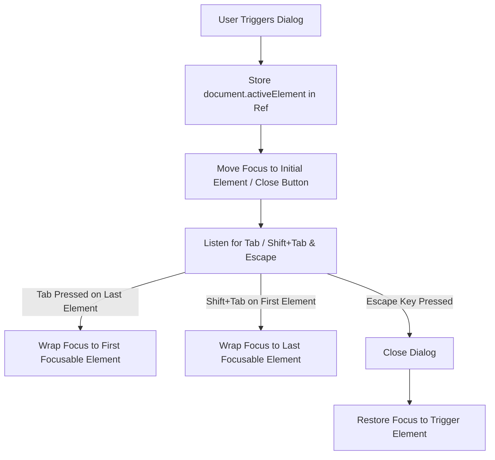

# Accessibility Guide: Keyboard Navigation & Shortcuts

## Overview

WorkSphere is built in accordance with W3C WAI-ARIA 1.2 authoring practices and WCAG 2.1 Level AA accessibility standards. All interactive dialogs, floor plan canvases, venue selection drawers, search bars, and reservation wizards are fully navigable using a standard keyboard without requiring pointer interaction.

This reference cheat sheet documents keyboard interactions, focus trap management, shortcut bindings, and assistive technology testing recipes across WorkSphere's core booking dialogs.

---

## 1. Global & Dialog Keyboard Shortcuts Matrix

| Context / Dialog | Shortcut / Key | Target Element | Action / Behavior |
| :--- | :--- | :--- | :--- |
| **Global Workspace** | `Ctrl + K` / `⌘ + K` | Venue Search Bar | Focuses search input and activates search auto-complete dropdown from anywhere in the application. |
| **Global Modals & Drawers** | `Escape` | Active Dialog / Sheet / Modal | Closes current dialog, restores focus to the invoking trigger element, and resets pending uncommitted state. |
| **Search Bar** | `Escape` | Search Input | Clears current query string, triggers `onSearch("")`, closes suggestions dropdown, and blurs input focus. |
| **Modal / Dialog Windows** | `Tab` | Next focusable element | Advances focus sequentially forward within the active dialog container (enforced by focus trap). |
| **Modal / Dialog Windows** | `Shift + Tab` | Previous focusable element | Moves focus backward within the active dialog container. Wraps around from first to last element. |
| **Floor Plan Canvas** | `Arrow Keys` (↑, ↓, ←, →) | Floor Plan Grid / Seat Nodes | Navigates between adjacent desks/seats on the interactive floor canvas with sound/haptic feedback. |
| **Floor Plan Canvas** | `Home` / `End` | Floor Plan Grid | Jumps focus to the first or last desk in the current floor plan zone. |
| **Floor Plan Canvas** | `+` / `-` | Floor Plan Canvas | Zooms floor plan map view in or out. |
| **Seat & Desk Selection** | `Enter` / `Space` | Focused Seat / Desk Node | Selects or reserves the highlighted desk and opens booking confirmation drawer. |
| **Booking Date / Time Picker** | `Arrow Keys` | Calendar Grid Cells | Moves day-by-day (Left/Right) or week-by-week (Up/Down) across available reservation slots. |
| **Booking Date / Time Picker** | `Enter` / `Space` | Calendar Cell / Time Slot | Selects reservation date or start/end time bracket. |
| **Combobox / Autocomplete** | `Arrow Down` / `Arrow Up` | Suggestions Listbox | Traverses search results dropdown without losing cursor context in the input. |
| **Combobox / Autocomplete** | `Enter` | Selected Listbox Option | Commits venue selection, updates search query, and closes dropdown. |
| **Waitlist & Action Buttons** | `Enter` / `Space` | Buttons & Interactive Badges | Activates primary button actions (e.g., "Join Waitlist", "Confirm Booking", "Clear Filter"). |

---

## 2. Focus Trap & Tab Order Architecture

All dialogs, modals, and slide-over drawers implement strict focus trap mechanics to prevent focus leakage into the background DOM:

### Key Principles:
1. **Initial Focus Management:** When a modal opens, focus automatically transitions to the first interactive element or the primary input (e.g., search input or first available date).
2. **Tab Cycling (Focus Containment):** Pressing `Tab` while focused on the last interactive element within the modal immediately wraps focus back to the first interactive element. Pressing `Shift + Tab` on the first element wraps to the last.
3. **Trigger Restoration:** Upon dismissal (via `Escape`, Cancel button, or backdrop click), focus returns directly to the button or card that initiated the modal (`triggerRef.current.focus()`).
4. **`aria-hidden` Siblings:** Background DOM trees outside the modal have `aria-hidden="true"` applied to prevent screen readers from announcing non-visible elements.

---

## 3. Component-Specific Navigation Details

### 3.1 Venue Search Bar (`SearchBar.tsx`)
- `Ctrl+K` / `Cmd+K`: Globally focuses the search bar from anywhere on the page.
- `Escape`: When the query input contains text, pressing `Escape` clears the input text, clears search parameters, closes the results menu, and blurs the input element.
- `ArrowDown` / `ArrowUp`: Navigates through search result options (`role="option"`).
- `Enter`: Selects the highlighted option.

### 3.2 Floor Plan Seat Navigation (`FloorPlanCanvas.tsx`)
- `Tab`: Navigates to the floor plan canvas container.
- `Arrow Keys`: Moves directional focus across desks (orthogonally: up/down/left/right) based on relative Cartesian coordinates `(x, y)`.
- `Space` / `Enter`: Claims or selects the desk for reservation. Desks report status via `aria-label` (e.g., *"Desk 14B, Standing Desk, Quiet Zone, Available"*).

### 3.3 Booking Confirmation & Split Bill (`RescheduleModal.tsx`, `SplitBillModal.tsx`)
- `Tab` / `Shift+Tab`: Cycles through form fields, guest count steppers, payment split selectors, and action buttons.
- `Escape`: Dismisses modal without persisting uncommitted changes.
- `Enter`: Submits form or proceeds to next checkout step.

---

## 4. Screen Reader Testing Recipes

Verify keyboard and screen reader accessibility using these step-by-step test scripts.

### Recipe 1: VoiceOver on macOS (Safari / Chrome)
1. **Start VoiceOver:** Press `Cmd + F5`.
2. **Global Search:** Press `Ctrl + Option + U` to open rotor, or press `Cmd + K` to activate search.
   - *Verification:* VoiceOver announces "Search venues by name, address, or tag, edit text".
3. **Type & Clear:** Type "Cafe". Press `Escape`.
   - *Verification:* VoiceOver announces input cleared, and live region reads updated venue count.
4. **Modal Launch:** Navigate to any venue card with `VO + Right Arrow` and press `VO + Space`.
   - *Verification:* Modal opens, VoiceOver announces dialog role and title (e.g., "Reserve Desk Modal, dialog").
5. **Focus Trap:** Press `Tab` continuously until reaching the end of the modal.
   - *Verification:* Focus must not escape the dialog into the background header or footer.

### Recipe 2: NVDA on Windows (Edge / Chrome)
1. **Start NVDA:** Press `Ctrl + Alt + N`.
2. **Enter Browse Mode:** Press `NVDA + Space` if in focus mode.
3. **Navigate to Floor Plan:** Press `Tab` until reaching the floor plan canvas.
4. **Seat Traversal:** Use `Arrow Keys` to move between desks.
   - *Verification:* NVDA announces desk names, quiet zone status, and availability.
5. **Modal Dismissal:** Press `Escape`.
   - *Verification:* NVDA announces dialog closed and refocuses the previously focused trigger button.
