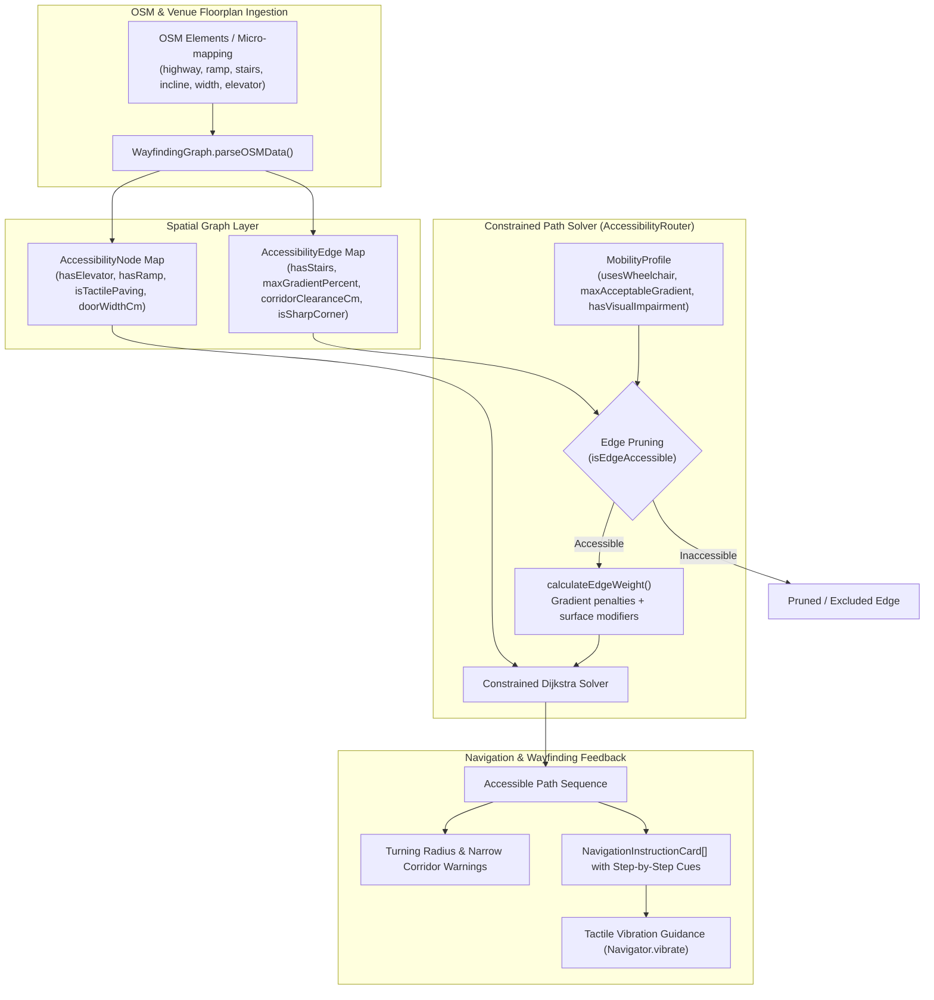

# WayfindingGraph Edge Weighting, ADA Ramp Compliance & Step-Free Indoor Routing Rules

## 1. Overview & Architecture

Modern indoor transit in dense coworking hubs, multi-level venues, and campuses presents severe navigation barriers for wheelchair users, people with mobility impairments, and visually impaired visitors. Unlike conventional Euclidean pathfinding algorithms that minimize raw distance or travel time alone, WorkSphere's indoor navigation subsystem evaluates routing candidates based on physical accessibility constraints and Americans with Disabilities Act (ADA) architectural standards.

The core architecture consists of two tightly integrated engines:
1. **[`WayfindingGraph`](file:///c:/Users/admin/Desktop/workfere/src/core/accessibility/WayfindingGraph.ts):** Constructs a directed spatial graph tagged with accessibility attributes (stairs, maximum gradient percentages, corridor clearance widths, surface smoothness, automated elevators, ramps, tactile paving, and sharp corner detection).
2. **[`AccessibilityRouter`](file:///c:/Users/admin/Desktop/workfere/src/core/accessibility/AccessibilityRouter.ts):** Executes a constrained Dijkstra shortest-path traversal across `WayfindingGraph`. Inaccessible edges (such as stairs or slopes exceeding user tolerance) are strictly pruned via infinite penalties, while tactile paving, corridor clearances, and surface types modulate edge weights.



---

## 2. ADA Compliance Slope & Gradient Thresholds

### 2.1 Standard Running Slope & Ramp Specifications
The Americans with Disabilities Act (ADA) Standards for Accessible Design govern permissible running slopes and cross slopes along accessible routes:
- **Maximum Ramp Slope:** $1:12$ ratio (an $8.33\%$ grade). Any slope steeper than $1:12$ is inaccessible to standard non-motorized wheelchair users without personal assistance.
- **Low Incline Walkways:** Walkways with running slope $\le 1:20$ ($5.0\%$) are treated as accessible flat corridors.
- **Steep Gradient Warning Trigger:** When an edge incline exceeds $5.0\%$, `AccessibilityRouter` automatically flags the segment with warning notes (`Steep gradient (X%) on segment to target`).

### 2.2 Gradient Edge Cost Function
When a wheelchair user traverses an accessible ramp segment with gradient between $5\%$ and the profile's `maxAcceptableGradient`:
$$\text{Weight}(e) = \text{DistanceMeters} \times \left(1 + \frac{\text{Gradient}\%}{10}\right)$$

If an edge gradient exceeds `profile.maxAcceptableGradient` (e.g., standard manual wheelchair default of $8.33\%$), the edge is completely eliminated from graph traversal:
```typescript
if (this.profile.usesWheelchair && edge.maxGradientPercent > this.profile.maxAcceptableGradient) {
    return false; // Edge pruned
}
```

---

## 3. Corridor Clearance & Door Width Attributes

### 3.1 ADA Clear Width Standards
- **Standard Corridor Width (`ADA_MIN_CORRIDOR_WIDTH_CM`):** $91\text{ cm}$ ($36\text{ inches}$) minimum continuous clear width. Corridors narrower than $91\text{ cm}$ generate tight clearance warnings.
- **Turning Radius Corridor Width (`ADA_MIN_TURN_CORRIDOR_WIDTH_CM`):** $100\text{ cm}$ clear width required at $90^\circ$ sharp turns to permit a standard wheelchair $60\text{ inch}$ ($152.5\text{ cm}$) turning circle.
- **Door Clear Opening:** `doorWidthCm` on `AccessibilityNode` documents doorway clearances. Clear openings below $81.5\text{ cm}$ ($32\text{ inches}$) are flagged for restricted entry.

### 3.2 Sharp Corner & Turning Radius Validation
When `isSharpCorner` is tagged on an edge (`tags.corner === 'sharp'`, `turn === '90_degree'`, or `sharp_turn === 'yes'`), the router validates whether the corridor width affords sufficient turning clearance:
```typescript
if (this.profile.usesWheelchair) {
    if (clearance !== undefined && clearance < ADA_MIN_CORRIDOR_WIDTH_CM) {
        warningBadge = {
            label: `Tight Corridor: ${clearance}cm`,
            severity: clearance < 80 ? 'critical' : 'warning',
            code: 'NARROW_CORRIDOR',
        };
    } else if (isSharpCorner && (clearance === undefined || clearance < ADA_MIN_TURN_CORRIDOR_WIDTH_CM)) {
        warningBadge = {
            label: 'Tight Turning Radius',
            severity: 'warning',
            code: 'TIGHT_TURNING_RADIUS',
        };
    }
}
```

---

## 4. Automated Elevator & Step-Free Vertical Routing

### 4.1 Floor-to-Floor Elevator Edge Modeling
Multi-level venues represent elevator banks as nodes with `hasElevator: true` (`tags.highway === 'elevator'` or `tags.amenity === 'elevator'`).
1. **Vertical Transition:** When connecting nodes across differing floor elevations, edges with `hasStairs: true` are strictly avoided when `profile.usesWheelchair === true`.
2. **Priority Weighting:** Elevators have step-free vertical clearance and negligible lateral distance ($0\text{ to }2\text{ meters}$), providing optimal weight transitions between disparate floor graphs.
3. **Detour Recommendations:** When a destination floor has no accessible route (e.g., mezzanine with stairs only), `AccessibilityRouter` returns:
   ```json
   {
       "success": false,
       "reason": "NO_ACCESSIBLE_PATH_EXISTS",
       "message": "No accessible path exists between node-A and node-B...",
       "detourRecommendations": [
           "Target location is connected via stairs. Check for an alternative elevator or ramp entrance.",
           "Use venue elevator to the nearest accessible floor and approach via corridor."
       ]
   }
   ```

---

## 5. Visual Impairment & Tactile Feedback Rules

### 5.1 Surface Type Penalty
For users with visual impairments (`profile.hasVisualImpairment === true`):
- `rough` or uneven surfaces increase edge traversal weight by $1.5\times$:
  $$\text{Weight} = \text{DistanceMeters} \times 1.5$$
- Nodes tagged with `isTactilePaving: true` provide preferred tactile wayfinding paths.

### 5.2 Mobile Tactile Vibration Turn Signatures (`Navigator.vibrate`)
`WayfindingGraph` emits distinct haptic vibration signatures at decision points to assist navigation without requiring continuous screen inspection:
- **Left Turn:** Single pulse (`[200]`)
- **Right Turn:** Double pulse (`[150, 100, 150]`)
- **Straight:** Confirmation pulse (`[100]`)
- **Destination Arrival:** Long confirmation pulse (`[600]`)
- **Sharp Corner / Decision Point:** Multi-pulse alert (`[100, 80, 100, 80, 100]`)

---

## 6. Verification & Implementation Reference

- Graph construction: [`src/core/accessibility/WayfindingGraph.ts`](file:///c:/Users/admin/Desktop/workfere/src/core/accessibility/WayfindingGraph.ts)
- Constrained router: [`src/core/accessibility/AccessibilityRouter.ts`](file:///c:/Users/admin/Desktop/workfere/src/core/accessibility/AccessibilityRouter.ts)
- Navigation cues & haptics: [`src/core/accessibility/AccessibleRouter.ts`](file:///c:/Users/admin/Desktop/workfere/src/core/accessibility/AccessibleRouter.ts)
- Unit tests: [`src/__tests__/core/AccessibleRouter.test.ts`](file:///c:/Users/admin/Desktop/workfere/src/__tests__/core/AccessibleRouter.test.ts)
