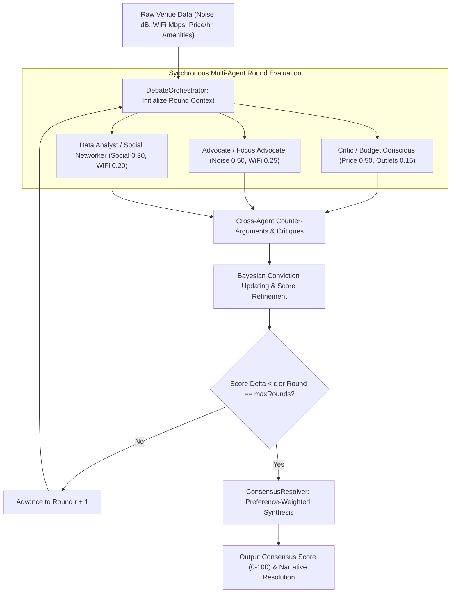
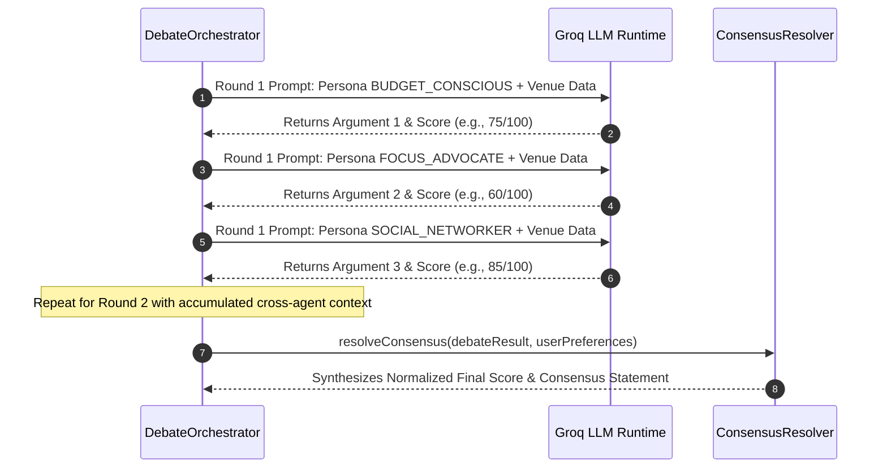

# DebateOrchestrator: Game-Theoretic Multi-Agent Consensus Protocols

This architecture document details the multi-agent consensus engine implemented in [`src/core/agents/debate/DebateOrchestrator.ts`](file:///c:/Users/admin/Desktop/workfere/src/core/agents/debate/DebateOrchestrator.ts), [`src/core/agents/debate/AgentPersona.ts`](file:///c:/Users/admin/Desktop/workfere/src/core/agents/debate/AgentPersona.ts), and [`src/core/agents/debate/ConsensusResolver.ts`](file:///c:/Users/admin/Desktop/workfere/src/core/agents/debate/ConsensusResolver.ts). It formalizes how autonomous AI agents evaluate contested workspace venues through structured debate rounds, Bayesian conviction updates, and game-theoretic consensus resolution.

---

## 1. Protocol Architecture & Game-Theoretic Framework

Evaluating coworking spaces and cafes involves conflicting multi-objective trade-offs (e.g., price affordability vs. acoustic isolation vs. collaborative atmosphere). Rather than relying on a single monolithic LLM prompt that suffers from cognitive bias and hallucinations, WorkSphere deploys an adversarial multi-agent debate framework based on non-cooperative game theory and Bayesian epistemic peer disagreement.



---

## 2. Agent Persona Definitions & Objective Functions

Each agent operates under an explicit epistemic persona characterized by targeted evaluation weights $w_i$:

### 2.1 The Budget Conscious (`BUDGET_CONSCIOUS` - The Critic)
- **Primary Goal:** Maximize value-to-cost ratio, minimize bill shock, verify free amenities.
- **Biases:** Highly critical of overpriced workspaces, mandatory food minimums, or paid power outlets.
- **Weight Vector:**
  $$w_{\text{budget}} = \begin{bmatrix} \text{price}: 0.50, \, \text{wifi}: 0.20, \, \text{amenities}: 0.15, \, \text{noise}: 0.10, \, \text{social}: 0.05 \end{bmatrix}$$

### 2.2 The Focus Advocate (`FOCUS_ADVOCATE` - The Acoustic Purist)
- **Primary Goal:** Ensure deep-work acoustic isolation and reliable low-jitter connectivity.
- **Biases:** Heavily penalizes background chatter, music, street noise, and crowded seating.
- **Weight Vector:**
  $$w_{\text{focus}} = \begin{bmatrix} \text{noise}: 0.50, \, \text{wifi}: 0.25, \, \text{price}: 0.10, \, \text{amenities}: 0.10, \, \text{social}: 0.05 \end{bmatrix}$$

### 2.3 The Social Networker (`SOCIAL_NETWORKER` - The Collaborative Analyst)
- **Primary Goal:** Identify high-vibe networking opportunities, shared tables, and social energy.
- **Biases:** Favors community events, communal tables, and moderate bustle over tomb-like silence.
- **Weight Vector:**
  $$w_{\text{social}} = \begin{bmatrix} \text{social}: 0.30, \, \text{wifi}: 0.20, \, \text{amenities}: 0.20, \, \text{noise}: 0.15, \, \text{price}: 0.15 \end{bmatrix}$$

---

## 3. Mathematical Foundations: Bayesian Conviction Updating

When agent $i$ receives an opposing argument and score $S_j^{(r)}$ from peer agent $j$ during round $r$, it updates its posterior conviction score $S_i^{(r+1)}$ using a Bayesian bounded belief update:

### 3.1 Bounded Epistemic Confidence Update

Let $S_i^{(r)} \in [0, 100]$ be agent $i$'s score at round $r$, and $\Delta_{ij}^{(r)} = S_j^{(r)} - S_i^{(r)}$ be the score discrepancy with peer $j$. The update equation is:

$$S_i^{(r+1)} = S_i^{(r)} + \alpha_i \sum_{j \neq i} \kappa_{ij} \cdot \tanh\left(\frac{S_j^{(r)} - S_i^{(r)}}{\sigma}\right)$$

Where:
- $\alpha_i \in (0, 1)$ is agent $i$'s epistemic plasticity rate (learning rate).
- $\kappa_{ij} \in [0, 1]$ is the cross-persona credibility weight (measuring factual validity of peer $j$'s cited data).
- $\sigma$ is a temperature scaling parameter controlling resistance to extreme persuasion.

### 3.2 Convergence Criterion

The debate terminates when the collective variance $\text{Var}(S^{(r)})$ or the maximum pairwise discrepancy falls below threshold $\varepsilon$, or when $r$ reaches $R_{\max} = 2$:

$$\max_{i, j} \left| S_i^{(r)} - S_j^{(r)} \right| < \varepsilon \quad \lor \quad r \ge R_{\max}$$

---

## 4. Prompt Templates & Structured Dialogue Flow

Prompts are constructed deterministically to inject system persona instructions along with the raw venue telemetry payload:

```typescript
export function getPersonaPrompt(personaType: PersonaType, venueData: Record<string, unknown>): string {
    const config = PERSONA_CONFIGS[personaType];
    return `${config.systemPrompt}\n\nEvaluate the following venue data based on your persona's priorities:\n${JSON.stringify(venueData, null, 2)}`;
}
```

### Prompt Execution Flow



---

## 5. Consensus Resolution & Termination Proofs

### 5.1 Weighted Preference Synthesis

The final venue score $S^* \in [0, 100]$ is computed by [`ConsensusResolver`](file:///c:/Users/admin/Desktop/workfere/src/core/agents/debate/ConsensusResolver.ts) using normalized user preference weights:

$$S^* = \text{round}\left( \bar{S}_{\text{budget}} \cdot \tilde{w}_{\text{budget}} + \bar{S}_{\text{focus}} \cdot \tilde{w}_{\text{focus}} + \bar{S}_{\text{social}} \cdot \tilde{w}_{\text{social}} \right)$$

where normalized weights satisfy:

$$\tilde{w}_k = \frac{w_k}{\sum_{m} w_m}, \quad \sum_{k} \tilde{w}_k = 1.0$$

### 5.2 Termination Proof

Let $R_{\max} \in \mathbb{N}$ be a strictly bounded integer ($R_{\max} = 2$). Since:
1. Each round iterates over a strictly finite set of personas $P = \{ \text{BUDGET\_CONSCIOUS}, \text{FOCUS\_ADVOCATE}, \text{SOCIAL\_NETWORKER} \}$ ($|P| = 3$),
2. Network calls are bound by HTTP execution timeouts ($300\text{ ms} - 5000\text{ ms}$),
3. The round index $r$ increments strictly monotonically by $1$ per loop cycle:

$$\sum_{r=1}^{R_{\max}} |P| = 2 \times 3 = 6 \text{ evaluations}$$

The algorithm is guaranteed to terminate in finite time $O(R_{\max} \cdot |P|)$ without deadlocks, infinite loops, or non-terminating epistemic cycles.

---

## 6. Integration Example

```typescript
import { DebateOrchestrator } from "@/core/agents/debate/DebateOrchestrator";
import { ConsensusResolver } from "@/core/agents/debate/ConsensusResolver";

// 1. Initialize orchestrator with 2 debate rounds
const orchestrator = new DebateOrchestrator(2);

// 2. Execute multi-agent debate
const debateResult = await orchestrator.runDebate({
    name: "Shibuya Cyber Coworking",
    hourlyRate: 8.50,
    noiseLevelDb: 42,
    wifiSpeedMbps: 650,
    hasFreeCoffee: true,
    socialVibeRating: 8.2,
});

// 3. Resolve final consensus with custom user preferences
const resolver = new ConsensusResolver();
const verdict = resolver.resolveConsensus(debateResult, {
    focusWeight: 0.60,
    budgetWeight: 0.30,
    socialWeight: 0.10,
});

console.log("Consensus Score:", verdict.finalScore); // e.g. 71/100
console.log("Verdict Statement:", verdict.consensusStatement);
```
