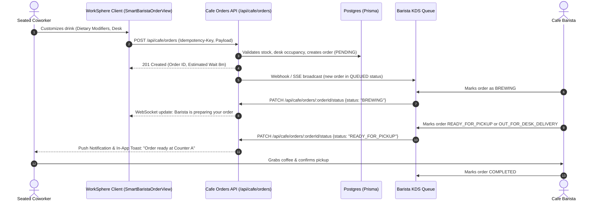
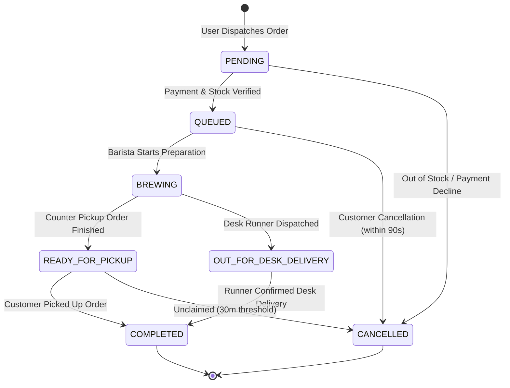

# Smart Barista Order View & Cafe Ordering API Specification

Comprehensive API reference and architectural documentation for WorkSphere's **Smart Barista Ordering System (`SmartBaristaOrderView`)**. This subsystem enables co-working space occupants to order artisan coffee, specialty teas, and nutritional snacks directly to their designated desk, conference booth, or pickup counter without disrupting their deep-work flow.

---

## 1. System Overview & Order Lifecycle Architecture

The Smart Barista order pipeline connects client-side seat ordering, desk geofencing, real-time Kitchen Display Systems (KDS), and push notifications:



---

## 2. OpenAPI 3.0 Specification

```yaml
openapi: 3.0.3
info:
  title: WorkSphere Smart Barista Cafe Orders API
  version: 1.0.0
  description: Endpoints for browsing menus, dispatching seat-side coffee orders, and barista fulfillment.
paths:
  /api/cafe/orders:
    post:
      summary: Place a new cafe order
      description: Submits a new drink or snack order with custom dietary modifiers and desk delivery metadata.
      operationId: createCafeOrder
      tags:
        - Cafe Orders
      security:
        - BearerAuth: []
        - CookieAuth: []
      parameters:
        - name: Idempotency-Key
          in: header
          required: false
          schema:
            type: string
            format: uuid
      requestBody:
        required: true
        content:
          application/json:
            schema:
              $ref: '#/components/schemas/CreateCafeOrderRequest'
      responses:
        '201':
          description: Order successfully created and queued
          content:
            application/json:
              schema:
                $ref: '#/components/schemas/CafeOrderResponse'
        '400':
          description: Invalid modifier combination or malformed payload
        '409':
          description: Item out of stock or venue cafe offline
    get:
      summary: List user cafe orders
      description: Returns active and past orders for the authenticated user at the current venue.
      operationId: listCafeOrders
      tags:
        - Cafe Orders
      responses:
        '200':
          description: List of cafe orders
          content:
            application/json:
              schema:
                type: array
                items:
                  $ref: '#/components/schemas/CafeOrderResponse'

  /api/cafe/orders/{orderId}/status:
    patch:
      summary: Update order fulfillment status
      description: Barista endpoint to transition order state (QUEUED -> BREWING -> READY -> COMPLETED).
      operationId: updateCafeOrderStatus
      tags:
        - Barista KDS
      parameters:
        - name: orderId
          in: path
          required: true
          schema:
            type: string
      requestBody:
        required: true
        content:
          application/json:
            schema:
              $ref: '#/components/schemas/UpdateOrderStatusRequest'
      responses:
        '200':
          description: Order status updated successfully
          content:
            application/json:
              schema:
                $ref: '#/components/schemas/CafeOrderResponse'
```

---

## 3. Order Data Schemas & TypeScript Definitions

### 3.1 TypeScript Type Definitions

```typescript
export type CafeOrderStatus =
  | "PENDING"
  | "QUEUED"
  | "BREWING"
  | "READY_FOR_PICKUP"
  | "OUT_FOR_DESK_DELIVERY"
  | "COMPLETED"
  | "CANCELLED";

export type MilkOption =
  | "whole"
  | "skim"
  | "oat"
  | "almond"
  | "soy"
  | "coconut"
  | "none";

export type SweetenerLevel =
  | "none"
  | "light"
  | "regular"
  | "extra";

export type TemperatureOption =
  | "hot"
  | "extra_hot"
  | "warm_kids"
  | "iced_regular"
  | "iced_light"
  | "iced_no_ice"
  | "cold_brew";

export type EspressoRoast =
  | "house_blend"
  | "single_origin_ethiopia"
  | "decaf_swiss_water"
  | "half_caf";

export interface DietaryModifierFlags {
  isGlutenFreeRequired: boolean;
  isNutAllergyAlert: boolean;
  isVegan: boolean;
  isKeto: boolean;
  isDiabeticFriendly: boolean;
  customAllergyNotes?: string;
}

export interface CafeOrderItem {
  itemId: string;
  name: string;
  quantity: number;
  unitPrice: number;
  size: "small" | "medium" | "large";
  temperature: TemperatureOption;
  espressoRoast?: EspressoRoast;
  shotsCount?: number; // 0, 1, 2, 3, 4
  milk: MilkOption;
  sweetener: SweetenerLevel;
  flavorSyrups?: Array<{
    flavor: "vanilla" | "caramel" | "hazelnut" | "sugar_free_vanilla" | "lavender";
    pumps: number;
  }>;
  dietaryFlags: DietaryModifierFlags;
  specialInstructions?: string;
}

export interface DeliveryLocation {
  type: "DESK_DELIVERY" | "COUNTER_PICKUP";
  venueId: string;
  deskId?: string;
  deskLabel?: string;
  floorZone?: string;
}

export interface CreateCafeOrderPayload {
  venueId: string;
  items: CafeOrderItem[];
  delivery: DeliveryLocation;
  tipAmount?: number;
  scheduledPickupTime?: string; // Optional ISO date string for pre-orders
}

export interface CafeOrderResponse {
  id: string;
  orderNumber: string; // e.g. "WS-BAR-042"
  userId: string;
  userName: string;
  venueId: string;
  status: CafeOrderStatus;
  items: CafeOrderItem[];
  delivery: DeliveryLocation;
  subtotal: number;
  tax: number;
  tip: number;
  total: number;
  estimatedWaitMinutes: number;
  orderedAt: string;
  updatedAt: string;
  completedAt?: string;
}
```

---

## 4. Dietary Modifier Flags & Nutritional Guardrails

To protect coworkers with severe food allergies and specific dietary regimens, every order payload includes structured boolean flags that highlight warnings directly on the Barista Kitchen Display:

| Modifier Key | Permitted Values | Safety Impact & Kitchen Action |
| :--- | :--- | :--- |
| `isNutAllergyAlert` | `boolean` | **CRITICAL:** Barista must purge steam wand, sanitize milk pitcher, and ensure almond milk cross-contamination is eliminated. |
| `isGlutenFreeRequired` | `boolean` | Bakery tongs sanitized; ensures gluten-free oat milk certified brand. |
| `isVegan` | `boolean` | Verifies plant-based milk and excludes animal syrups (e.g. real honey, dairy caramel). |
| `isKeto` | `boolean` | Replaces standard sugar syrups with heavy cream and monk fruit / stevia sweetening. |
| `isDiabeticFriendly` | `boolean` | Hard blocks full-sugar cane syrups, defaults to unsweetened or sugar-free vanilla. |

---

## 5. Order State Machine & Fulfillment Lifecycle



### Transition Permissions & Invariants
1. **Cancellation Window:** Customers may cancel only while status is `PENDING` or `QUEUED`. Once status transitions to `BREWING`, cancellation is locked to prevent food waste.
2. **Estimated Wait Calculation:**
   $$\text{Wait Time} = \text{Base Queue Latency} + \left(\sum \text{Active Items in Queue} \times 2.5\text{ mins}\right)$$
3. **Idempotency Guarantee:** Requests containing the `Idempotency-Key` header prevent duplicate billing if network retries occur.

---

## 6. Error Codes & HTTP Responses

| HTTP Status | Error Code | Description & Client Resolution |
| :--- | :--- | :--- |
| `400 Bad Request` | `INVALID_MODIFIERS` | Conflicting options (e.g., `iced_no_ice` selected with hot drink size). |
| `403 Forbidden` | `NOT_CHECKED_IN` | Desk delivery requested, but user does not hold an active check-in for the venue. |
| `409 Conflict` | `ITEM_DEPLETED` | Specialty milk or coffee roast ran out of stock during checkout. |
| `422 Unprocessable`| `VENUE_CAFE_CLOSED` | Order submitted outside cafe operating hours. |
