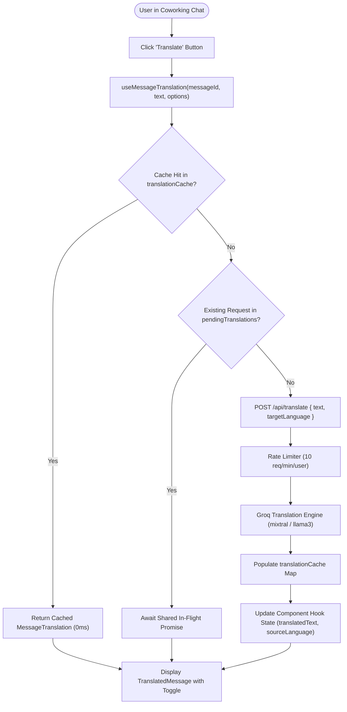

# Message Translation Hook API & Supported Locale Codes

This technical API reference documents the `useMessageTranslation` React hook ([`src/hooks/useMessageTranslation.ts`](file:///c:/Users/admin/Desktop/workfere/src/hooks/useMessageTranslation.ts)) and its underlying backend translation service ([`src/app/api/translate/route.ts`](file:///c:/Users/admin/Desktop/workfere/src/app/api/translate/route.ts)). It covers hook parameters, return signatures, in-memory caching mechanisms, request deduplication, supported ISO 639-1 language codes, and sample React integration components.

---

## 1. Executive Summary & Architecture Overview

WorkSphere brings together remote professionals and digital nomads from diverse cultural and linguistic backgrounds into shared coworking chat channels, direct messaging, and community boards.

The **Message Translation Subsystem** enables real-time message localization on-demand without disrupting conversation flow:
1. **Client-Side Deduplication & Caching:** Caches translated messages in an in-memory key-value map (`[text, targetLanguage]`) and collapses duplicate in-flight requests into a shared promise.
2. **Groq LLM Acceleration:** Powers low-latency contextual translations preserving technical developer slang, venue amenity jargon, and conversational tone.
3. **Locale Auto-Resolution:** Automatically detects the user’s target locale from `react-i18next` or `navigator.language`, with support for explicit target language overrides.
4. **Original vs. Translated Toggle:** Provides immediate toggling between source and localized text.



---

## 2. Hook API Signature & Options

### 2.1 Hook Interface

```typescript
export interface UseMessageTranslationOptions {
  /** Explicit target language ISO code (e.g., 'es', 'ja', 'hi'). Defaults to user's active locale. */
  targetLanguage?: string;
  /** Whether in-memory caching is enabled for this hook instance. Defaults to true. */
  enableCache?: boolean;
}

export interface MessageTranslation {
  /** The localized output string returned by the translation engine */
  translatedText: string;
  /** The detected ISO or descriptive name of the original message language */
  sourceLanguage: string;
}

export interface UseMessageTranslationReturn {
  /** Translation data object if translation succeeded; otherwise null */
  translation: MessageTranslation | null;
  /** Error message string if translation failed; otherwise null */
  error: string | null;
  /** Loading state indicator while the network translation request is pending */
  isLoading: boolean;
  /** Whether the user currently toggled to view the original source text */
  showOriginal: boolean;
  /** Imperative trigger function to initiate the translation request */
  translate: () => Promise<void>;
  /** Toggles between showing the original text and the translated text */
  toggleOriginal: () => void;
}
```

### 2.2 Parameters Breakdown

| Parameter | Type | Required | Description |
| :--- | :---: | :---: | :--- |
| `messageId` | `string` | **Yes** | Unique identifier of the message, used to re-initialize state on ID transitions. |
| `text` | `string` | **Yes** | Raw string content of the chat message to translate. |
| `options.targetLanguage` | `string` | Optional | Target ISO 639-1 language code (e.g., `"es"`, `"de"`, `"ja"`). Defaults to `i18n.resolvedLanguage`. |
| `options.enableCache` | `boolean` | Optional | Controls whether translation results are stored in and retrieved from the global cache (default: `true`). |

---

## 3. Supported Language Codes & Allowlist

The backend translation API enforces a strict language code allowlist ([`src/app/api/translate/route.ts`](file:///c:/Users/admin/Desktop/workfere/src/app/api/translate/route.ts)) to safeguard against prompt injection attacks:

| ISO 639-1 Code | Language Name | Native Script | Primary Coworking Region |
| :---: | :--- | :--- | :--- |
| **`en`** | English | English | Global / International Hubs |
| **`es`** | Spanish | Español | Latin America, Spain |
| **`fr`** | French | Français | France, Canada, West Africa |
| **`de`** | German | Deutsch | Germany, Austria, Switzerland |
| **`ja`** | Japanese | 日本語 | Japan (Tokyo, Shibuya, Kyoto) |
| **`zh`** | Chinese | 中文 (Simplified / Traditional) | Greater China, Singapore |
| **`hi`** | Hindi | हिन्दी | India (Bengaluru, Mumbai, Delhi) |
| **`it`** | Italian | Italiano | Italy |
| **`pt`** | Portuguese | Português | Brazil, Portugal |
| **`ko`** | Korean | 한국어 | South Korea (Seoul, Gangnam) |
| **`ar`** | Arabic | العربية | Middle East, North Africa |
| **`nl`** | Dutch | Nederlands | Netherlands, Belgium |
| **`ru`** | Russian | Русский | Eastern Europe, Central Asia |
| **`vi`** | Vietnamese | Tiếng Việt | Vietnam (Ho Chi Minh City, Da Nang) |
| **`th`** | Thai | ไทย | Thailand (Bangkok, Chiang Mai) |
| **`id`** | Indonesian | Bahasa Indonesia | Indonesia (Bali, Jakarta) |

> [!NOTE]
> The API accepts both two-letter ISO 639-1 language codes (e.g. `"ja"`) and full English common names (e.g. `"japanese"`). Text inputs exceeding **2,000 characters** are rejected with `400 Bad Request`.

---

## 4. In-Memory Caching & Request Deduplication Mechanisms

### 4.1 Composite Key In-Memory Cache
Translations are held in a module-level `Map<string, MessageTranslation>`:
$$\text{CacheKey} = \text{JSON.stringify}([\text{text}, \text{targetLanguage}])$$

- **Zero-Roundtrip Re-Renders:** If a user navigates between chat rooms or re-renders message list virtualizers, cached translations appear instantaneously ($0\text{ ms}$).
- **Thread-Safe Scope:** The cache is shared across all component instances within the active browser session.

### 4.2 In-Flight Promise De-duplication
If multiple participants in a shared room click translate on the same pinned announcement concurrently:
```typescript
const pending = pendingTranslations.get(key);
if (pending) return pending;
```
The system binds all callers to a single shared network promise, preventing redundant network requests and protecting API rate limits.

---

## 5. React Integration Example

Below is a complete, accessible React implementation demonstrating the hook in a message bubble:

```tsx
"use client";

import React from "react";
import { Languages, Loader2, RotateCcw } from "lucide-react";
import { useMessageTranslation } from "@/hooks/useMessageTranslation";

interface ChatMessageBubbleProps {
  messageId: string;
  senderName: string;
  text: string;
  timestamp: string;
}

export function ChatMessageBubble({
  messageId,
  senderName,
  text,
  timestamp,
}: ChatMessageBubbleProps) {
  const {
    translation,
    error,
    isLoading,
    showOriginal,
    translate,
    toggleOriginal,
  } = useMessageTranslation(messageId, text);

  return (
    <div className="flex flex-col gap-1 p-3 rounded-lg bg-zinc-900 border border-zinc-800 text-zinc-100 max-w-md">
      <div className="flex justify-between items-center text-xs text-zinc-400">
        <span className="font-semibold text-zinc-300">{senderName}</span>
        <span>{timestamp}</span>
      </div>

      {/* Translation Attribution Header */}
      {translation && (
        <div className="flex items-center gap-2 text-[11px] text-blue-400 font-medium">
          <span>Translated from {translation.sourceLanguage}</span>
          <button
            type="button"
            onClick={toggleOriginal}
            className="underline underline-offset-2 hover:text-blue-300 transition-colors"
            aria-label={showOriginal ? "Show translation" : "Show original text"}
          >
            {showOriginal ? "Show translation" : "Show original"}
          </button>
        </div>
      )}

      {/* Main Message Text Display */}
      <p className="text-sm whitespace-pre-wrap leading-relaxed text-zinc-200">
        {translation && !showOriginal ? translation.translatedText : text}
      </p>

      {/* Error Feedback */}
      {error && (
        <p role="alert" className="text-xs text-rose-500 mt-1">
          {error}
        </p>
      )}

      {/* Translate Action Trigger */}
      {!translation && (
        <button
          type="button"
          onClick={() => void translate()}
          disabled={isLoading || !text.trim()}
          className="mt-1 flex items-center gap-1.5 text-xs text-zinc-400 hover:text-zinc-200 transition-colors disabled:opacity-50"
          aria-label={error ? "Retry translation" : "Translate message"}
        >
          {isLoading ? (
            <>
              <Loader2 className="h-3.5 w-3.5 animate-spin" aria-hidden="true" />
              <span>Translating…</span>
            </>
          ) : (
            <>
              {error ? (
                <RotateCcw className="h-3.5 w-3.5" aria-hidden="true" />
              ) : (
                <Languages className="h-3.5 w-3.5" aria-hidden="true" />
              )}
              <span>{error ? "Retry translation" : "Translate"}</span>
            </>
          )}
        </button>
      )}
    </div>
  );
}
```

---

## 6. Backend API Endpoint Specification

- **Endpoint:** `POST /api/translate`
- **Authentication:** Clerk Session (`userId` required via `auth()`).
- **Rate Limit:** 10 requests / minute per authenticated user.

### Request Payload:
```json
{
  "text": "Nomad hub Shibuya features electric standing desks and soundproof booths.",
  "targetLanguage": "ja"
}
```

### Response (`200 OK`):
```json
{
  "translatedText": "ノマドハブ渋谷には電動スタンディングデスクと防音ブースが備わっています。",
  "sourceLanguage": "English"
}
```
