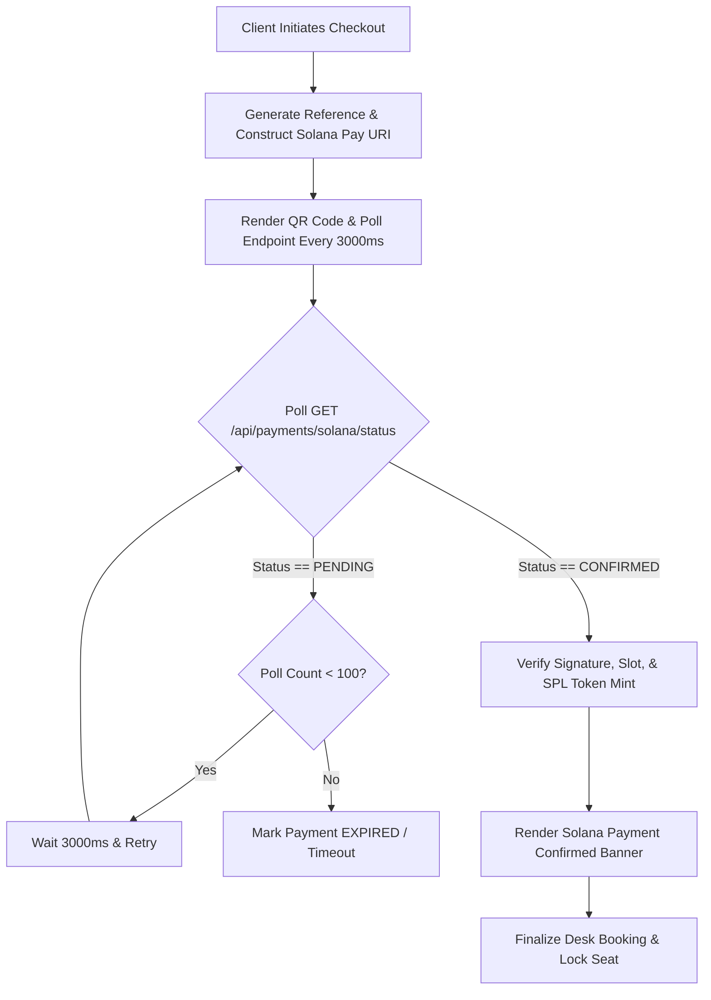

# Solana Pay API & Protocol Specification

## 1. Executive Summary & Overview

WorkSphere integrates **Solana Pay** to facilitate instantaneous, sub-second, low-fee micro-transactions using **USDC (SPL-Token)** on the Solana blockchain for desk bookings and workspace reservations. By encoding recipient wallet addresses, invoice amounts, SPL token mint parameters, and unique transaction references into standardized URI schemes, WorkSphere allows users to pay directly via mobile wallet apps (Phantom, Solflare, Backpack) by scanning a QR code or tapping a deep link.

```
+-----------------------------------------------------------------------------------+
|                            MULTICURRENCY DESK CHECKOUT                            |
|                       (MultiCurrencyDeskCheckout.tsx)                             |
+-----------------------------------------+-----------------------------------------+
                                          |
                      1. Generate Reference & Solana Pay URI
                                          |
                                          v
+-----------------------------------------------------------------------------------+
|                        SOLANA PAY URI & QR CODE GENERATION                        |
|  solana:<recipient>?amount=<amount>&spl-token=<usdc_mint>&reference=<ref>...     |
+-----------------------------------------+-----------------------------------------+
                    |                                       |
  2. Render QR / Deep Link                                  3. Poll Transaction Status
                    v                                       v
+-----------------------+                         +---------------------------------+
| USER MOBILE WALLET    |                         |  SOLANA STATUS POLLING API      |
| (Phantom / Solflare)  |                         |  GET /api/payments/solana/status|
+-----------+-----------+                         +----------------+----------------+
            |                                                      |
  4. Submit On-Chain Tx                                            |
            v                                                      v
+-----------------------+                         +---------------------------------+
| SOLANA MAINNET RPC    |========================>| CONFIRMED STATUS DISPATCH       |
| (Slot / Signature)    |  5. Transaction Verified| (Booking Finalized)             |
+-----------------------+                         +---------------------------------+
```

Key objectives:
- **Standardized Merchant URI Scheme:** Compliant with official Solana Pay URI specifications.
- **USDC SPL-Token Settlement:** Built-in validation for mainnet USDC mint (`EPjFWdd5AufqSSqeM2qN1xzybapC8G4wEGGkZwyTDt1v`).
- **Real-Time Status Polling:** Client polling loop checking reference confirmation every $3000\text{ms}$.
- **Zero-Fee Merchant Ingress:** Peer-to-peer wallet-to-treasury transfer without middleman credit card processing fees.

---

## 2. Solana Pay Merchant URL Scheme Specification

Solana Pay URIs follow the `solana:` custom URL scheme as defined in the Solana Pay specification (`src/lib/payments/solanaPay.ts`).

### 2.1 Standard URI Format

```
solana:<recipient>?amount=<amount>&spl-token=<splToken>&reference=<reference>&label=<label>&message=<message>&memo=<memo>
```

### 2.2 Parameter Definitions

| Parameter | Type | Required | Default Value | Description |
| :--- | :--- | :--- | :--- | :--- |
| `recipient` | Base58 String | **Yes** | `WorkSpHere5oLanaPayUSDC111111111111111111111` | Base58 public key of the merchant treasury wallet |
| `amount` | Decimal String | **Yes** | N/A | Amount to transfer formatted to 2 decimal places (e.g. `15.50`) |
| `spl-token` | Base58 String | **Yes** | `EPjFWdd5AufqSSqeM2qN1xzybapC8G4wEGGkZwyTDt1v` | Solana SPL Token mint address for USDC |
| `reference` | String | Optional | `tx_sol_<timestamp>_<random>` | Unique Base58 public key or reference ID for transaction tracking |
| `label` | URL Encoded | Optional | `WorkSphere Desk Booking` | Merchant or service name displayed in user wallet |
| `message` | URL Encoded | Optional | `Desk Booking at <VenueName>` | Brief invoice summary displayed in user wallet |
| `memo` | URL Encoded | Optional | `booking_<id>` | On-chain memo instruction payload |

### 2.3 Example Solana Pay URI

```
solana:WorkSpHere5oLanaPayUSDC111111111111111111111?amount=25.00&spl-token=EPjFWdd5AufqSSqeM2qN1xzybapC8G4wEGGkZwyTDt1v&reference=tx_sol_1728504000000_abc1234&label=WorkSphere+Desk+Booking&message=Desk+Booking+Checkout&memo=booking_desk_42
```

---

## 3. API Reference & Polling Endpoints

WorkSphere provides dedicated API endpoints (`src/app/api/payments/solana/status/route.ts`) to query transaction confirmation status by reference ID.

### 3.1 Get Transaction Status (`GET /api/payments/solana/status`)

Checks if a transaction associated with a specific reference ID has been confirmed on the Solana network.

#### Request Query Parameters:
- `reference` (string, **required**): The unique reference ID generated during URI creation.
- `simulate` (boolean, optional): If `true`, returns a simulated `CONFIRMED` state for testing.

#### Example Request:
```http
GET /api/payments/solana/status?reference=tx_sol_1728504000000_abc1234 HTTP/1.1
Host: worksphere.app
Accept: application/json
```

#### Response Fields (`SolanaPayStatusResponse`):

| Field | Type | Description |
| :--- | :--- | :--- |
| `reference` | String | The query transaction reference ID |
| `status` | String | Payment status: `PENDING`, `PROCESSING`, `CONFIRMED`, `FAILED`, `EXPIRED` |
| `signature` | String (optional) | Base58 transaction signature string when confirmed |
| `slot` | Number (optional) | Solana slot number in which transaction was included |
| `timestamp` | ISO String (optional) | ISO 8601 UTC timestamp of confirmation |
| `error` | String (optional) | Error message if payment failed or expired |

#### Success Response (`200 OK` - Confirmed State):
```json
{
  "reference": "tx_sol_1728504000000_abc1234",
  "status": "CONFIRMED",
  "signature": "5K2xMockSolanaTxSignature123456789987654321",
  "slot": 248901234,
  "timestamp": "2026-10-09T20:50:00.000Z"
}
```

#### Success Response (`200 OK` - Pending State):
```json
{
  "reference": "tx_sol_1728504000000_abc1234",
  "status": "PENDING",
  "timestamp": "2026-10-09T20:49:30.000Z"
}
```

#### Error Response (`400 Bad Request`):
```json
{
  "error": "Missing required 'reference' query parameter"
}
```

---

### 3.2 Update Transaction Status (`POST /api/payments/solana/status`)

Trigger endpoint used by dev simulation tools or backend webhooks to manually update or confirm a transaction reference status.

#### Request Body Schema:
```json
{
  "reference": "tx_sol_1728504000000_abc1234",
  "action": "confirm"
}
```

#### Success Response (`200 OK`):
```json
{
  "reference": "tx_sol_1728504000000_abc1234",
  "status": "CONFIRMED",
  "signature": "5K2xMockSolanaTxSignature987654321012345678",
  "slot": 248901234,
  "timestamp": "2026-10-09T20:50:00.000Z"
}
```

---

## 4. Transaction Confirmation & Validation Criteria



### 4.1 On-Chain Verification Rules
When verifying a transaction on-chain via Solana RPC (`getSignaturesForAddress2` / `getParsedTransaction`):
1. **Mint Verification:** The transferred token mint MUST match `SOLANA_USDC_MINT_MAINNET` (`EPjFWdd5AufqSSqeM2qN1xzybapC8G4wEGGkZwyTDt1v`).
2. **Recipient Verification:** The token account owner MUST equal the merchant treasury public key (`DEFAULT_TREASURY_SOLANA_ADDRESS`).
3. **Amount Verification:** Transferred token quantity MUST equal or exceed invoice `amount`.
4. **Commitment Level:** Transaction status requires `confirmed` or `finalized` commitment.

---

## 5. Summary Configuration Reference

| Property | Value | Description |
| :--- | :--- | :--- |
| **USDC Mint Address** | `EPjFWdd5AufqSSqeM2qN1xzybapC8G4wEGGkZwyTDt1v` | SPL-Token mint for mainnet USDC |
| **Treasury Public Key** | `WorkSpHere5oLanaPayUSDC111111111111111111111` | Primary merchant settlement wallet |
| **Client Poll Interval** | $3,000\text{ms}$ ($3\text{s}$) | Polling frequency for transaction confirmation |
| **Max Poll Count** | $100$ checks ($5\text{ minutes}$) | Timeout window before marking checkout expired |
| **Supported Wallets** | Phantom, Solflare, Backpack, Glow | Web3 mobile & browser extension wallets |
