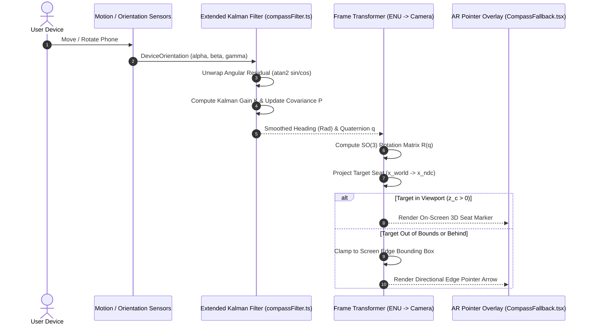
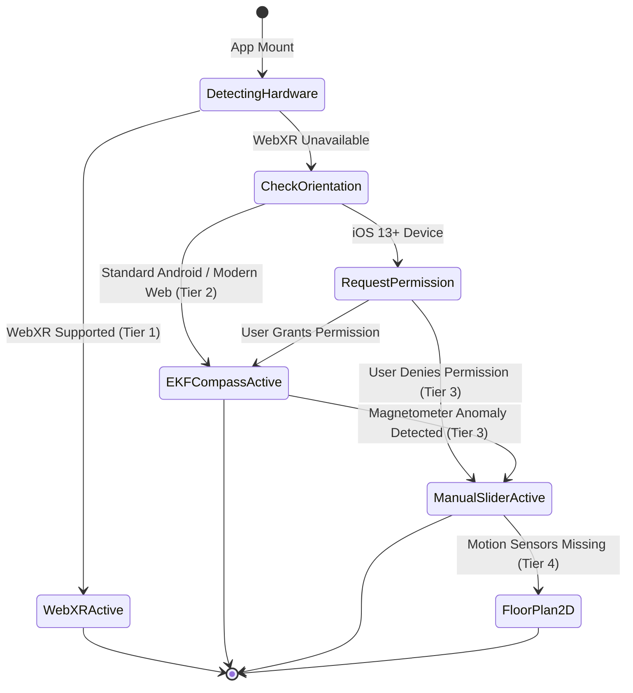

# AR Sensor Fusion Algorithm & Coordinate Transformation Pipeline

This document provides a formal architectural and mathematical specification for WorkSphere's indoor Augmented Reality (AR) seat navigation system, sensor fusion engine (`src/lib/spatial/compassFilter.ts` & `src/lib/spatial/indoorPdrEngine.ts`), coordinate transformation pipeline, and multi-tier device fallback mechanics (`src/components/ar/CompassFallback.tsx`).

---

## Table of Contents

1. [Executive Summary & Architectural Goals](#1-executive-summary--architectural-goals)
2. [Coordinate Reference Frames & Spatial Math](#2-coordinate-reference-frames--spatial-math)
   - [East-North-Up (ENU) Local Tangent Plane](#east-north-up-enu-local-tangent-plane)
   - [Camera & Viewport Device Coordinates](#camera--viewport-device-coordinates)
3. [Quaternion Kinematics & Rotation Matrices](#3-quaternion-kinematics--rotation-matrices)
   - [Euler Angles ($\alpha, \beta, \gamma$) to Unit Quaternion $\mathbf{q}$](#euler-angles-\alpha-\beta-\gamma-to-unit-quaternion-\mathbfq)
   - [Quaternion to $\mathbb{SO}(3)$ Rotation Matrix Transformation](#quaternion-to-\mathbbso3-rotation-matrix-transformation)
4. [Extended Kalman Filter (EKF) Fusion Engine](#4-extended-kalman-filter-ekf-fusion-engine)
   - [1D Circular Heading Kalman Filter (`CompassKalmanFilter`)](#1d-circular-heading-kalman-filter-compasskalmanfilter)
   - [6-DOF State Space Formulation (`ExtendedKalmanFilter6D`)](#6-dof-state-space-formulation-extendedkalmanfilter6d)
   - [Modular Angular Unwrapping ($0^\circ \leftrightarrow 360^\circ$)](#modular-angular-unwrapping-0^\circ-\leftrightarrow-360^\circ)
5. [World-to-Screen Perspective Projection Pipeline](#5-world-to-screen-perspective-projection-pipeline)
   - [Camera Pinhole Matrix Model](#camera-pinhole-matrix-model)
   - [Normalized Device Coordinates (NDC) to Viewport Pixels](#normalized-device-coordinates-ndc-to-viewport-pixels)
   - [Off-Screen Edge Pointer Clamping & Target Distance Rendering](#off-screen-edge-pointer-clamping--target-distance-rendering)
6. [Multi-Tier Sensor Degradation & Fallback Mechanics](#6-multi-tier-sensor-degradation--fallback-mechanics)
   - [Hardware Capability Detection](#hardware-capability-detection)
   - [Fallback Execution State Machine](#fallback-execution-state-machine)
7. [Architecture & Sequence Flow Diagrams](#7-architecture--sequence-flow-diagrams)
   - [Sensor Data Pipeline Sequence](#sensor-data-pipeline-sequence)
   - [Sensor Fallback State Machine Diagram](#sensor-fallback-state-machine-diagram)
8. [React & TypeScript Component Guide](#8-react--typescript-component-guide)

---

## 1. Executive Summary & Architectural Goals

WorkSphere's AR Seat Pointer guides users directly to their reserved desk, booth, or meeting pod inside large corporate campuses and co-working venues.

Challenges in mobile web environments include:
- **High Sensor Noise:** Device magnetometers suffer from indoor electromagnetic interference (hard/soft iron distortion from steel beams, HVAC systems, and power conduits).
- **Angular Discontinuity:** Standard filters fail when angles wrap across $0^\circ \leftrightarrow 360^\circ$ boundaries ($0^\text{rad} \leftrightarrow 2\pi\text{ rad}$).
- **Heterogeneous Hardware:** Mobile devices vary significantly in hardware capabilities—from WebXR 6-DOF tracking phones to budget devices missing magnetometers or gyroscopes.

WorkSphere resolves these issues using a two-stage **Extended Kalman Filter (EKF)** sensor fusion engine and a 4-tier graceful degradation fallback model.

---

## 2. Coordinate Reference Frames & Spatial Math

### East-North-Up (ENU) Local Tangent Plane

The indoor venue environment is mapped into a right-handed East-North-Up (ENU) Cartesian frame centered at the venue origin $(x_0, y_0, z_0)$:

$$\begin{aligned}
x_{\text{ENU}} &\to \text{East (meters)} \\
y_{\text{ENU}} &\to \text{North (meters)} \\
z_{\text{ENU}} &\to \text{Up / Altitude (meters)}
\end{aligned}$$

Geodetic WGS-84 coordinates (Latitude $\phi$, Longitude $\lambda$, Altitude $h$) are transformed into local ENU displacement vectors $(\Delta x, \Delta y)$ using Great-Circle Haversine approximation or WGS-84 ellipsoidal transformation:

$$\begin{aligned}
\Delta x &= R_E \cdot (\lambda_{\text{target}} - \lambda_{\text{ref}}) \cdot \cos\left(\frac{\phi_{\text{ref}} + \phi_{\text{target}}}{2}\right) \\
\Delta y &= R_E \cdot (\phi_{\text{target}} - \phi_{\text{ref}})
\end{aligned}$$

Where $R_E = 6,378,137\text{ m}$ is Earth's equatorial radius.

### Camera & Viewport Device Coordinates

The AR viewport operates in normalized screen space $[-1, +1] \times [-1, +1]$:
- Screen center: $(0, 0)$
- Top-Right corner: $(+1, +1)$
- Bottom-Left corner: $(-1, -1)$

---

## 3. Quaternion Kinematics & Rotation Matrices

### Euler Angles ($\alpha, \beta, \gamma$) to Unit Quaternion $\mathbf{q}$

Browser `DeviceOrientationEvent` provides raw Euler orientation angles:
- $\alpha$: Compass Z-axis rotation / Yaw $[0^\circ, 360^\circ)$
- $\beta$: Pitch $[-180^\circ, 180^\circ)$
- $\gamma$: Roll $[-90^\circ, 90^\circ)$

To eliminate gimbal lock, Euler angles are converted into a unit quaternion $\mathbf{q} = (q_w, q_x, q_y, q_z)$:

$$\mathbf{q} = \begin{bmatrix}
q_w \\
q_x \\
q_y \\
q_z
\end{bmatrix} = \begin{bmatrix}
\cos(\gamma/2) \cos(\beta/2) \cos(\alpha/2) + \sin(\gamma/2) \sin(\beta/2) \sin(\alpha/2) \\
\sin(\gamma/2) \cos(\beta/2) \cos(\alpha/2) - \cos(\gamma/2) \sin(\beta/2) \sin(\alpha/2) \\
\cos(\gamma/2) \sin(\beta/2) \cos(\alpha/2) + \sin(\gamma/2) \cos(\beta/2) \sin(\alpha/2) \\
\cos(\gamma/2) \cos(\beta/2) \sin(\alpha/2) - \sin(\gamma/2) \sin(\beta/2) \cos(\alpha/2)
\end{bmatrix}$$

### Quaternion to $\mathbb{SO}(3)$ Rotation Matrix Transformation

The unit quaternion $\mathbf{q}$ expands into the 3D camera rotation matrix $\mathbf{R}(\mathbf{q}) \in \mathbb{SO}(3)$:

$$\mathbf{R}(\mathbf{q}) = \begin{bmatrix}
1 - 2(q_y^2 + q_z^2) & 2(q_x q_y - q_z q_w) & 2(q_x q_z + q_y q_w) \\
2(q_x q_y + q_z q_w) & 1 - 2(q_x^2 + q_z^2) & 2(q_y q_z - q_x q_w) \\
2(q_x q_z - q_y q_w) & 2(q_y q_z + q_x q_w) & 1 - 2(q_x^2 + q_y^2)
\end{bmatrix}$$

---

## 4. Extended Kalman Filter (EKF) Fusion Engine

File: [src/lib/spatial/compassFilter.ts](file:///c:/Users/admin/Desktop/workfere/src/lib/spatial/compassFilter.ts)

### 1D Circular Heading Kalman Filter (`CompassKalmanFilter`)

The heading filter smoothes raw compass readings using process noise variance $Q$ and measurement noise variance $R$:

```typescript
export class CompassKalmanFilter {
  private x: number = 0; // State estimate (radians)
  private p: number = 1; // Error covariance
  private q: number;    // Process noise variance (default: 0.05)
  private r: number;    // Measurement noise variance (default: 0.5)

  public update(measurement: number): number {
    // 1. Prediction Step
    const xPred = this.x;
    const pPred = this.p + this.q;

    // 2. Compute Angular Residual with 0 / 2pi Wraparound Unwrapping
    let residual = measurement - xPred;
    while (residual > Math.PI) residual -= 2 * Math.PI;
    while (residual < -Math.PI) residual += 2 * Math.PI;

    // 3. Compute Kalman Gain & Update State
    const kalmanGain = pPred / (pPred + this.r);
    this.x = xPred + kalmanGain * residual;
    this.p = (1 - kalmanGain) * pPred;

    // Normalize final state to [0, 2pi)
    if (this.x < 0) this.x += 2 * Math.PI;
    if (this.x >= 2 * Math.PI) this.x -= 2 * Math.PI;

    return this.x;
  }
}
```

### 6-DOF State Space Formulation (`ExtendedKalmanFilter6D`)

File: [src/lib/spatial/indoorPdrEngine.ts](file:///c:/Users/admin/Desktop/workfere/src/lib/spatial/indoorPdrEngine.ts)

The 6-DOF EKF tracks user position, velocity, orientation, and sensor bias:

$$\mathbf{x}_k = \begin{bmatrix} x & y & v_x & v_y & \theta & b_g \end{bmatrix}^T$$

- **Prediction State Equation:**
  $$\mathbf{x}_k^- = \mathbf{f}(\mathbf{x}_{k-1}, \mathbf{u}_k) = \begin{bmatrix} 
  x_{k-1} + v_{x, k-1} \Delta t \\ 
  y_{k-1} + v_{y, k-1} \Delta t \\ 
  v_{x, k-1} \\ 
  v_{y, k-1} \\ 
  \theta_{k-1} + (\omega_k - b_{g, k-1}) \Delta t \\ 
  b_{g, k-1} 
  \end{bmatrix}$$

- **Kalman Gain Computation:**
  $$\mathbf{K}_k = \mathbf{P}_k^- \mathbf{H}_k^T (\mathbf{H}_k \mathbf{P}_k^- \mathbf{H}_k^T + \mathbf{R}_k)^{-1}$$

### Modular Angular Unwrapping ($0^\circ \leftrightarrow 360^\circ$)

When a user turns across north ($359^\circ \to 1^\circ$), naive linear interpolation causes a $358^\circ$ backward jump. WorkSphere unwraps the innovation residual:

$$\text{residual} = \text{atan2}\big(\sin(\theta_{\text{meas}} - \theta_{\text{pred}}), \cos(\theta_{\text{meas}} - \theta_{\text{pred}})\big)$$

---

## 5. World-to-Screen Perspective Projection Pipeline

### Camera Pinhole Matrix Model

Target seat point $\mathbf{P}_{\text{world}} = [x_w, y_w, z_w, 1]^T$ is projected to camera Coordinates $\mathbf{P}_{\text{camera}}$ via the Extrinsic Matrix $[\mathbf{R} \mid \mathbf{t}]$:

$$\mathbf{P}_{\text{camera}} = \begin{bmatrix} x_c \\ y_c \\ z_c \end{bmatrix} = \mathbf{R}(\mathbf{q}) \cdot (\mathbf{P}_{\text{world}} - \mathbf{P}_{\text{user}})$$

### Normalized Device Coordinates (NDC) to Viewport Pixels

Applying intrinsic projection matrix $\mathbf{K}$ with Field-of-View angle $\theta_{\text{fov}}$ and aspect ratio $A$:

$$\begin{bmatrix} x_{\text{ndc}} \\ y_{\text{ndc}} \end{bmatrix} = \begin{bmatrix} \frac{x_c}{z_c \cdot \tan(\theta_{\text{fov}}/2) \cdot A} \\ \frac{y_c}{z_c \cdot \tan(\theta_{\text{fov}}/2)} \end{bmatrix}$$

Viewport Pixel Coordinates $(X_{\text{screen}}, Y_{\text{screen}})$:

$$\begin{aligned}
X_{\text{screen}} &= \frac{W}{2} \cdot (1 + x_{\text{ndc}}) \\
Y_{\text{screen}} &= \frac{H}{2} \cdot (1 - y_{\text{ndc}})
\end{aligned}$$

### Off-Screen Edge Pointer Clamping & Target Distance Rendering

When a target seat lies behind the camera ($z_c < 0$) or outside the active viewport boundary ($|x_{\text{ndc}}| > 1$ or $|y_{\text{ndc}}| > 1$), the pointer clamps to the screen border:

```typescript
export function clampToScreenEdge(
  ndcX: number,
  ndcY: number,
  isBehind: boolean
): { clampedX: number; clampedY: number; angleRad: number } {
  let x = isBehind ? -ndcX : ndcX;
  let y = isBehind ? -ndcY : ndcY;

  const angleRad = Math.atan2(y, x);

  // Clamp to screen bounding box [-0.85, +0.85] margin
  const margin = 0.85;
  const scale = Math.min(
    Math.abs(margin / (x || 1e-5)),
    Math.abs(margin / (y || 1e-5))
  );

  return {
    clampedX: x * Math.min(scale, 1),
    clampedY: y * Math.min(scale, 1),
    angleRad,
  };
}
```

---

## 6. Multi-Tier Sensor Degradation & Fallback Mechanics

File: [src/components/ar/CompassFallback.tsx](file:///c:/Users/admin/Desktop/workfere/src/components/ar/CompassFallback.tsx)

WorkSphere detects available hardware capabilities and seamlessly transitions across four operation tiers:

| Tier Level | Name | Sensor Requirements | Capability Description |
| :--- | :--- | :--- | :--- |
| **Tier 1** | WebXR 6-DOF Tracking | WebXR API + Camera + Motion Hardware | Full 6-degree-of-freedom spatial hit-testing & 3D anchor positioning. |
| **Tier 2** | EKF Compass Fusion | Magnetometer + Gyroscope + DeviceOrientation | Smoothed 3D AR pointer using `CompassKalmanFilter` overlay. |
| **Tier 3** | Manual Orientation & GPS | Accelerometer + Manual Compass Touch Slider | Touch-slider compass calibration with accelerometer pitch/roll. |
| **Tier 4** | Static 2D Floor Plan | Standard Web Browser / No Sensors | Interactive 2D SVG venue map with destination path highlighting. |

### Hardware Capability Detection

```typescript
export async function detectArSensorTier(): Promise<number> {
  if (typeof navigator !== "undefined" && "xr" in navigator) {
    const isSupported = await (navigator as any).xr.isSessionSupported("immersive-ar");
    if (isSupported) return 1; // Tier 1: WebXR 6-DOF
  }

  if (typeof window !== "undefined" && "DeviceOrientationEvent" in window) {
    // Check for iOS 13+ permission request requirement
    if (typeof (DeviceOrientationEvent as any).requestPermission === "function") {
      return 2; // Tier 2: EKF Compass Fusion (Pending Permission)
    }
    return 2; // Tier 2: Standard DeviceOrientation
  }

  return 4; // Tier 4: Static 2D Fallback
}
```

---

## 7. Architecture & Sequence Flow Diagrams

### Sensor Data Pipeline Sequence



### Sensor Fallback State Machine Diagram



---

## 8. React & TypeScript Component Guide

```tsx
import React from "react";
import { CompassFallback } from "@/components/ar/CompassFallback";

export default function ARSeatNavigationPage({ venueId, targetSeat }: { venueId: string; targetSeat: any }) {
  return (
    <div className="relative h-screen w-screen overflow-hidden bg-black">
      {/* Live Camera Video Feed */}
      <video
        autoPlay
        playsInline
        muted
        className="absolute inset-0 h-full w-full object-cover"
      />

      {/* AR Seat Pointer Overlay with Kalman Filter Smoothing */}
      <CompassFallback
        targetLat={targetSeat.latitude}
        targetLng={targetSeat.longitude}
        seatName={targetSeat.name}
        kalmanQ={0.05}
        kalmanR={0.5}
        onTierChange={(tier) => console.log(`Active AR Tier: ${tier}`)}
      />
    </div>
  );
}
```
