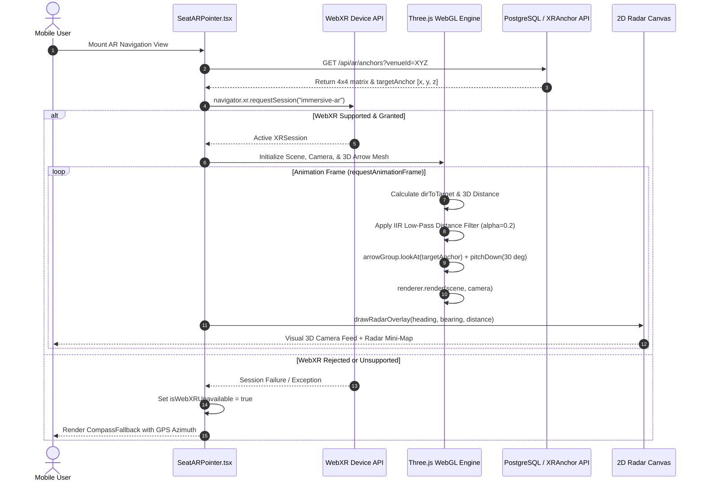
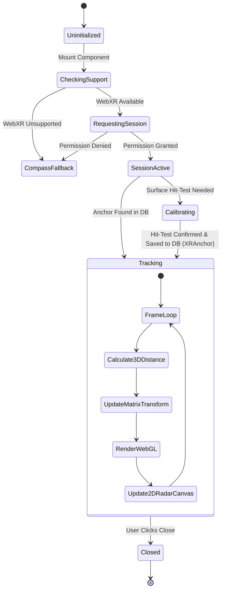

# WebXR Spatial Anchors Persistence & Three.js Matrix Transforms Specification

This document provides a comprehensive technical guide for the Augmented Reality (AR) indoor desk navigation system in WorkSphere, focusing on WebXR Spatial Anchors persistence, Three.js 4x4 affine matrix transformations, persistent cloud anchor database models (`XRAnchor`), and 2D canvas radar projection trigonometry as implemented in [`src/components/ar/SeatARPointer.tsx`](file:///c:/Users/admin/Desktop/workfere/src/components/ar/SeatARPointer.tsx), [`src/lib/ar/radarCanvas.ts`](file:///c:/Users/admin/Desktop/workfere/src/lib/ar/radarCanvas.ts), and [`src/app/api/ar/anchors/route.ts`](file:///c:/Users/admin/Desktop/workfere/src/app/api/ar/anchors/route.ts).

---

## Table of Contents

1. [Executive Summary & System Architecture](#1-executive-summary--system-architecture)
2. [WebXR Device API & Spatial Anchor Mechanics](#2-webxr-device-api--spatial-anchor-mechanics)
   - [Reference Spaces (`local-floor`, `viewer`, `bounded-floor`)](#reference-spaces-local-floor-viewer-bounded-floor)
   - [WebXR Anchor Lifecycle (`XRAnchor`, `createAnchor`)](#webxr-anchor-lifecycle-xranchor-createanchor)
   - [Hit-Testing & Surface Detection Pipeline](#hit-testing--surface-detection-pipeline)
3. [4x4 Affine Transformation Matrices in Three.js](#3-4x4-affine-transformation-matrices-in-threejs)
   - [Homogeneous Coordinate Representations](#homogeneous-coordinate-representations)
   - [Affine Transformation Decomposition: Rotation, Scale, Translation](#affine-transformation-decomposition-rotation-scale-translation)
   - [Model-View-Projection (MVP) Coordinate Transformations](#model-view-projection-mvp-coordinate-transformations)
   - [Camera-Relative Pointer Direction and LookAt Quaternions](#camera-relative-pointer-direction-and-lookat-quaternions)
4. [Persistent Cloud Anchor Storage Architecture (`XRAnchor` Prisma Model)](#4-persistent-cloud-anchor-storage-architecture-xranchor-prisma-model)
   - [Prisma Schema Definition](#prisma-schema-definition)
   - [Column-Major 16-Element Float Array Serialization](#column-major-16-element-float-array-serialization)
   - [Anchor Synchronization & Persistence REST Endpoints](#anchor-synchronization--persistence-rest-endpoints)
   - [Drift Compensation & Coordinate Frame Alignment](#drift-compensation--coordinate-frame-alignment)
5. [2D Canvas Radar Projection Trigonometry](#5-2d-canvas-radar-projection-trigonometry)
   - [Camera Heading vs. World Bearing Angles](#camera-heading-vs-world-bearing-angles)
   - [Azimuthal Relative Angle Trigonometry](#azimuthal-relative-angle-trigonometry)
   - [Polar to Cartesian Viewport Projection Mapping](#polar-to-cartesian-viewport-projection-mapping)
   - [HUD Elements: Heading Cones, Range Rings, and Beacon Pulsing](#hud-elements-heading-cones-range-rings-and-beacon-pulsing)
6. [Distance Smoothing & Floor Elevation Calculations](#6-distance-smoothing--floor-elevation-calculations)
   - [3D Euclidean Distance vs. Planar Distance](#3d-euclidean-distance-vs-planar-distance)
   - [Low-Pass Infinite Impulse Response (IIR) Exponential Filter](#low-pass-infinite-impulse-response-iir-exponential-filter)
   - [Multi-Floor Elevation Classification](#multi-floor-elevation-classification)
7. [Graceful Degradation & Multi-Tier Fallback Hierarchy](#7-graceful-degradation--multi-tier-fallback-hierarchy)
   - [Hardware Capability Assessment](#hardware-capability-assessment)
   - [Sensor Compass Fallback Mode](#sensor-compass-fallback-mode)
   - [Interactive 2D Floor Plan Fallback](#interactive-2d-floor-plan-fallback)
8. [Data Contracts, Types & Component Architecture](#8-data-contracts-types--component-architecture)
   - [`SeatARPointerProps` Interface](#seatarpointerprops-interface)
   - [Sub-Component Hierarchy & React Hooks Integration](#sub-component-hierarchy--react-hooks-integration)
9. [End-to-End Sequence & State Machine Diagrams](#9-end-to-end-sequence--state-machine-diagrams)

---

## 1. Executive Summary & System Architecture

WorkSphere empowers desk workers, hot-deskers, and enterprise employees to effortlessly locate reserved desks, collaborative pods, and private phone booths inside dense multi-story corporate venues. In labyrinthine co-working spaces spanning tens of thousands of square meters, traditional 2D static floor maps frequently confuse users regarding orientation, turning points, and floor elevation.

The WorkSphere Augmented Reality (AR) navigation suite bridges this physical-digital gap by superimposing contextual 3D visual guidance directly into the real-world environment through the user's mobile device camera.

```
┌────────────────────────────────────────────────────────────────────────────┐
│                       WorkSphere Mobile Browser Client                     │
└─────────────────────────────────────┬──────────────────────────────────────┘
                                      │
            ┌─────────────────────────┴─────────────────────────┐
            ▼                                                   ▼
┌───────────────────────────────┐               ┌───────────────────────────────┐
│     WebXR Device Engine       │               │      Sensors Fallback Engine  │
│  - Immersive AR Session       │               │  - DeviceOrientation API      │
│  - 6-DOF Local-Floor Tracking │               │  - Geolocation WGS-84         │
│  - Hit-Testing & Anchors      │               │  - Compass Bearing Calc       │
└───────────────┬───────────────┘               └───────────────┬───────────────┘
                │                                               │
                ▼                                               ▼
┌───────────────────────────────┐               ┌───────────────────────────────┐
│  Three.js WebGL Scene Graph   │               │   HTML5 2D Canvas Radar HUD   │
│  - 4x4 Affine Matrix Engine   │               │  - Polar Projection Math      │
│  - 3D Bobbing Floating Arrow  │               │  - Real-time Range Rings      │
│  - Ground Pulsing Ring Marker │               │  - Relative Heading Cones     │
└───────────────┬───────────────┘               └───────────────┬───────────────┘
                │                                               │
                └───────────────────────┬───────────────────────┘
                                        │
                                        ▼
┌────────────────────────────────────────────────────────────────────────────┐
│                    PostgreSQL / Prisma Database Engine                     │
│           - Persistent Cloud Spatial Anchors Model: XRAnchor               │
│           - 16-element Float Array 4x4 World Transformation Matrix         │
│           - Desk ID, Venue ID, Floor Level, and Timestamp Relational Index │
└────────────────────────────────────────────────────────────────────────────┘
```

The system combines:
1. **WebXR AR Subsystem:** Employs modern WebXR device features (`local-floor`, `anchors`, `hit-test`) to project a floating 3D directional arrow pointing toward the desk's physical coordinates.
2. **Matrix Mathematics:** Uses Three.js 4x4 affine matrices to project and rotate virtual markers relative to the user's moving camera perspective.
3. **Persistent Cloud Spatial Anchors:** Stores anchor transformation matrices in PostgreSQL via Prisma's `XRAnchor` model, linking digital reservations to persistent physical world coordinates.
4. **2D Radar Canvas Overlay:** Provides a top-down tactical mini-map rendering user heading, relative azimuth, and destination beacons using high-speed canvas trigonometry.

---

## 2. WebXR Device API & Spatial Anchor Mechanics

The WebXR Device API exposes low-level access to mobile Augmented Reality hardware, including SLAM (Simultaneous Localization and Mapping), plane detection, camera feature tracking, and 6 Degrees of Freedom (6-DOF) pose estimation.

### Reference Spaces (`local-floor`, `viewer`, `bounded-floor`)

To construct a coherent coordinate system between virtual 3D assets and physical floors, [`SeatARPointer`](file:///c:/Users/admin/Desktop/workfere/src/components/ar/SeatARPointer.tsx#L76) initiates an `immersive-ar` session requesting the `local-floor` reference space:

```typescript
const session = await requestSession("immersive-ar", {
  requiredFeatures: ["local-floor"],
  optionalFeatures: ["hit-test", "anchors", "dom-overlay"],
});
```

- **`viewer` Reference Space:** Tracks the user's device camera. The coordinate origin is rigidly pinned to the camera lens $(0, 0, 0)$, moving and rotating directly with the phone.
- **`local-floor` Reference Space:** Establishes a gravity-aligned, metric coordinate frame where:
  - The $+Y$ axis points upward parallel to the gravitational vector.
  - The $Y = 0$ horizontal plane represents the estimated physical floor.
  - The $+X$ and $+Z$ axes lie on the floor plane, with scale measured in real-world SI meters.

### WebXR Anchor Lifecycle (`XRAnchor`, `createAnchor`)

Without spatial anchors, virtual objects placed in WebXR drift over time as the device accumulates SLAM tracking error (odometry drift). Spatial anchors anchor a coordinate frame to physical surfaces:

1. **Instantiation:** When venue admins scan or calibrate a desk, an anchor is created at the desk center via `frame.createAnchor(pose, referenceSpace)`.
2. **Tracking Updates:** During each animation frame, the browser's underlying AR engine (ARCore on Android, ARKit via WebXR viewers on iOS) refines the anchor's transformation matrix to correct for visual feature recalibration.
3. **Extraction:** The 4x4 transform is queried via `XRFrame.getPose(anchor.anchorSpace, referenceSpace).transform.matrix`.

### Hit-Testing & Surface Detection Pipeline

During desk calibration, hit-testing casts an imaginary ray from the center of the mobile screen into the real world:

$$\mathbf{R}(t) = \mathbf{P}_{\text{camera}} + t \cdot \mathbf{D}_{\text{view}}, \quad t > 0$$

Where $\mathbf{P}_{\text{camera}}$ is the camera position in world space and $\mathbf{D}_{\text{view}}$ is the normalized forward optical axis vector. The WebXR `hit-test` module detects intersection with physical horizontal surfaces (such as desk desktops or floor surfaces), returning an intersection pose composed of translation $(x, y, z)$ and orientation $(\mathbf{q}_x, \mathbf{q}_y, \mathbf{q}_z, \mathbf{q}_w)$.

---

## 3. 4x4 Affine Transformation Matrices in Three.js

Three.js manages spatial relationships, hierarchies, and scene graph positioning via 4x4 affine transformation matrices represented by the `THREE.Matrix4` class.

### Homogeneous Coordinate Representations

In 3D Euclidean geometry, linear transformations (rotation, scaling) cannot express translation without an extra dimension. By using 4D homogeneous coordinates where point $\mathbf{P} = [x, y, z, 1]^T$ and direction vector $\mathbf{V} = [x, y, z, 0]^T$, any combination of translation, rotation, and non-uniform scaling can be expressed as a single matrix multiplication:

$$\mathbf{M} = \begin{bmatrix}
m_{11} & m_{12} & m_{13} & t_x \\
m_{21} & m_{22} & m_{23} & t_y \\
m_{31} & m_{32} & m_{33} & t_z \\
0 & 0 & 0 & 1
\end{bmatrix}$$

### Affine Transformation Decomposition: Rotation, Scale, Translation

Any 4x4 affine transform matrix $\mathbf{M}$ is decomposed into three elementary transformations:

$$\mathbf{M} = \mathbf{T} \cdot \mathbf{R} \cdot \mathbf{S}$$

Where:

1. **Translation Matrix ($\mathbf{T}$):** Displaces the coordinate origin to the physical desk location:
   $$\mathbf{T}(t_x, t_y, t_z) = \begin{bmatrix}
   1 & 0 & 0 & t_x \\
   0 & 1 & 0 & t_y \\
   0 & 0 & 1 & t_z \\
   0 & 0 & 0 & 1
   \end{bmatrix}$$

2. **Rotation Matrix ($\mathbf{R}$):** Represents 3D orientation via a unit quaternion $\mathbf{q} = (w, x, y, z)$:
   $$\mathbf{R}(\mathbf{q}) = \begin{bmatrix}
   1 - 2(y^2 + z^2) & 2(xy - wz) & 2(xz + wy) & 0 \\
   2(xy + wz) & 1 - 2(x^2 + z^2) & 2(yz - wx) & 0 \\
   2(xz - wy) & 2(yz + wx) & 1 - 2(x^2 + y^2) & 0 \\
   0 & 0 & 0 & 1
   \end{bmatrix}$$

3. **Scale Matrix ($\mathbf{S}$):** Modulates sizing for pulse rings and indicator markers:
   $$\mathbf{S}(s_x, s_y, s_z) = \begin{bmatrix}
   s_x & 0 & 0 & 0 \\
   0 & s_y & 0 & 0 \\
   0 & 0 & s_z & 0 \\
   0 & 0 & 0 & 1
   \end{bmatrix}$$

### Model-View-Projection (MVP) Coordinate Transformations

Rendering a 3D desk pointer onto a mobile phone screen requires transforming vertices across four distinct coordinate systems:

$$\mathbf{P}_{\text{screen}} = \mathbf{M}_{\text{viewport}} \cdot \mathbf{M}_{\text{projection}} \cdot \mathbf{M}_{\text{view}} \cdot \mathbf{M}_{\text{model}} \cdot \mathbf{P}_{\text{local}}$$

1. **Model Matrix ($\mathbf{M}_{\text{model}}$):** Transforms arrow geometry from local mesh space into WebXR world metric coordinates.
2. **View Matrix ($\mathbf{M}_{\text{view}} = \mathbf{M}_{\text{camera}}^{-1}$):** Transforms world coordinates into the camera coordinate system (eye space).
3. **Projection Matrix ($\mathbf{M}_{\text{projection}}$):** Applies perspective division based on the camera's field of view ($\text{FOV} = 70^\circ$), aspect ratio, and near/far clipping planes ($0.01\text{m} \le z \le 20.0\text{m}$):
   $$\mathbf{M}_{\text{proj}} = \begin{bmatrix}
   \frac{1}{\text{aspect} \cdot \tan(\text{FOV}/2)} & 0 & 0 & 0 \\
   0 & \frac{1}{\tan(\text{FOV}/2)} & 0 & 0 \\
   0 & 0 & -\frac{f + n}{f - n} & -\frac{2fn}{f - n} \\
   0 & 0 & -1 & 0
   \end{bmatrix}$$
4. **Normalized Device Coordinates (NDC):** Yields $(x_{\text{ndc}}, y_{\text{ndc}}, z_{\text{ndc}}) \in [-1, 1]^3$.

### Camera-Relative Pointer Direction and LookAt Quaternions

In [`SeatARPointer.tsx`](file:///c:/Users/admin/Desktop/workfere/src/components/ar/SeatARPointer.tsx#L198-L213), the directional arrow is rendered $1.2\text{ meters}$ directly in front of the camera view frustum while continually pointing its tip toward the desk target anchor $\mathbf{T}$:

```typescript
const dirToTarget = new THREE.Vector3().subVectors(
  targetVector,
  currentCameraPos,
);

// Calculate yaw bearing angle
const rad = Math.atan2(dirToTarget.x, -dirToTarget.z);
const deg = normalizeAngle((rad * 180) / Math.PI);

// Project 1.2m directly in front of camera
arrowGroup.position.set(0, 0.8, -1.2);
arrowGroup.lookAt(targetVector.x, arrowGroup.position.y, targetVector.z);

// Pitch down by 30 degrees (pi / 6) to direct user vision toward the physical desk
arrowGroup.rotateX(Math.PI / 6);
```

The mathematical operation `arrowGroup.lookAt(target)` constructs a rotation matrix whose forward column vector $\mathbf{F}$ aligns with the normalized direction vector $\mathbf{D}$:

$$\mathbf{F} = \frac{\mathbf{T} - \mathbf{P}_{\text{arrow}}}{\|\mathbf{T} - \mathbf{P}_{\text{arrow}}\|}, \quad \mathbf{R} = \frac{\mathbf{U}_{\text{world}} \times \mathbf{F}}{\|\mathbf{U}_{\text{world}} \times \mathbf{F}\|}, \quad \mathbf{U} = \mathbf{F} \times \mathbf{R}$$

---

## 4. Persistent Cloud Anchor Storage Architecture (`XRAnchor` Prisma Model)

Local WebXR anchors exist only for the lifespan of an active browser session. To make spatial anchors accessible across different users, different devices, and subsequent days, WorkSphere persists anchor poses into the central PostgreSQL database.

### Prisma Schema Definition

Located in [`prisma/schema.prisma`](file:///c:/Users/admin/Desktop/workfere/prisma/schema.prisma#L509-L532):

```prisma
model XRAnchor {
  id              String      @id @default(cuid())
  userId          String
  user            User        @relation(fields: [userId], references: [id], onDelete: Cascade)
  venueId         String
  venue           Venue       @relation(fields: [venueId], references: [id], onDelete: Cascade)
  seatId          String?
  seat            VenueSeat?  @relation(fields: [seatId], references: [id], onDelete: SetNull)
  bookingId       String?

  anchorPersistId String      @unique
  matrix          Float[]     // 16-element 4x4 affine matrix in column-major order
  label           String?

  createdAt       DateTime    @default(now())
  updatedAt       DateTime    @updatedAt
  lastTrackedAt   DateTime    @default(now())

  @@index([venueId])
  @@index([userId])
  @@index([seatId])
  @@index([bookingId])
  @@index([anchorPersistId])
}
```

### Column-Major 16-Element Float Array Serialization

WebGL, WebXR, and Three.js store matrix components in **column-major order**, whereas conventional mathematical textbooks write matrices in row-major order. The `Float[]` array stores the 16 transformation entries:

$$\mathbf{M} = \begin{bmatrix}
m[0] & m[4] & m[8] & m[12] \\
m[1] & m[5] & m[9] & m[13] \\
m[2] & m[6] & m[10] & m[14] \\
m[3] & m[7] & m[11] & m[15]
\end{bmatrix}$$

- Indices `0, 1, 2`: Basis vector $\mathbf{X}$ (Right direction)
- Indices `4, 5, 6`: Basis vector $\mathbf{Y}$ (Up direction)
- Indices `8, 9, 10`: Basis vector $\mathbf{Z}$ (Forward/Back direction)
- Indices `12, 13, 14`: Position vector $\mathbf{T} = [t_x, t_y, t_z]^T$ in physical metric coordinates
- Indices `3, 7, 11`: Perspective projective scale (always `0, 0, 0` for affine transforms)
- Index `15`: Homogeneous scalar (always `1.0`)

Converting between Three.js and PostgreSQL:

```typescript
// Extracting from Three.js Matrix4 to array for database storage:
const matrixArray: number[] = object3D.matrixWorld.toArray();

// Hydrating from PostgreSQL array back into Three.js Matrix4:
const hydratedMatrix = new THREE.Matrix4().fromArray(xrAnchor.matrix);
targetMesh.applyMatrix4(hydratedMatrix);
```

### Anchor Synchronization & Persistence REST Endpoints

Implemented in [`src/app/api/ar/anchors/route.ts`](file:///c:/Users/admin/Desktop/workfere/src/app/api/ar/anchors/route.ts):

1. **`GET /api/ar/anchors?venueId=<ID>`:** Retrieves all active cloud anchors registered for a venue. Returns desk numbers, seat associations, and 16-element matrices.
2. **`POST /api/ar/anchors`:** Enforces authenticated Clerk admin/staff access and creates a new spatial anchor:
   - Validates matrix payload length (`matrix.length === 16`).
   - Prevents duplicate seat anchors via `seatId` unique check.
   - Applies rate limiting (`rateLimit("ar-anchor:${userId}", 30)`).
3. **`DELETE /api/ar/anchors/:id`:** Removes obsolete or recalibrated spatial anchors.

### Drift Compensation & Coordinate Frame Alignment

When a client enters a venue:
1. The camera scans a high-contrast physical QR fiducial code mounted at the venue reception entrance.
2. The known world transform $\mathbf{M}_{\text{fiducial}}$ of the QR code establishes the reference frame origin.
3. Every stored desk anchor is adjusted by the fiducial offset:
   $$\mathbf{M}_{\text{local\_desk}} = \mathbf{M}_{\text{device\_origin}} \cdot \mathbf{M}_{\text{fiducial}}^{-1} \cdot \mathbf{M}_{\text{stored\_anchor}}$$

---

## 5. 2D Canvas Radar Projection Trigonometry

In addition to 3D in-camera arrows, [`SeatARPointer.tsx`](file:///c:/Users/admin/Desktop/workfere/src/components/ar/SeatARPointer.tsx#L258-L272) renders an interactive top-down circular radar HUD overlay on an HTML5 `<canvas>` via [`drawRadarOverlay`](file:///c:/Users/admin/Desktop/workfere/src/lib/ar/radarCanvas.ts#L29).

### Camera Heading vs. World Bearing Angles

Two angles govern the radar display:
1. **Device Compass Azimuth ($\theta_{\text{heading}}$):** The compass angle between True North and the top edge of the mobile phone, clockwise in degrees $[0^\circ, 360^\circ)$.
2. **Destination Target Bearing ($\theta_{\text{bearing}}$):** The absolute world angle from the user's position to the reserved seat:
   $$\theta_{\text{bearing}} = \text{atan2}(\Delta x, -\Delta z) \times \frac{180}{\pi} \pmod{360^\circ}$$
   In standard ENU metric space, $\Delta x = x_{\text{seat}} - x_{\text{user}}$ (East displacement) and $-\Delta z = -(z_{\text{seat}} - z_{\text{user}})$ (North displacement).

### Azimuthal Relative Angle Trigonometry

In a user-centric radar view, the **top of the circle** ($12\text{ o'clock}$) must always correspond to the user's current line of sight.

The relative angular offset $\phi_{\text{rel}}$ between the user's heading and the destination desk is:

$$\phi_{\text{rel}} = \text{normalizeAngle}(\theta_{\text{bearing}} - \theta_{\text{heading}})$$

```typescript
const relativeAngleDeg = normalizeAngle(bearingAngle - heading);
const relativeAngleRad = (relativeAngleDeg - 90) * (Math.PI / 180);
```

*Note: In HTML5 2D Canvas coordinates, $0\text{ radians}$ points to $3\text{ o'clock}$ (positive X axis). Therefore, an angular phase shift of $-90^\circ$ ($-\frac{\pi}{2}\text{ rad}$) is applied to align $0^\circ$ relative angle with $12\text{ o'clock}$ (top of canvas).*

### Polar to Cartesian Viewport Projection Mapping

The radial distance on the radar canvas is mapped linearly or quadratically against the configured maximum range radius ($R_{\text{max}} = 10\text{ meters}$):

$$\rho = R_{\text{canvas}} \times \min\left(\frac{d_{\text{target}}}{R_{\text{max}}}, 0.92\right)$$

Converting polar coordinates $(\rho, \phi_{\text{rel}})$ to canvas pixel coordinates $(X_{\text{beacon}}, Y_{\text{beacon}})$:

$$\begin{aligned}
X_{\text{beacon}} &= C_x + \rho \cdot \cos(\phi_{\text{rel}}) \\
Y_{\text{beacon}} &= C_y + \rho \cdot \sin(\phi_{\text{rel}})
\end{aligned}$$

Where $(C_x, C_y) = (\text{size} / 2, \text{size} / 2)$ is the center origin of the canvas.

```typescript
const clampedDistanceRatio = Math.min(distance / maxRange, 0.92);
const beaconDistPx = radius * clampedDistanceRatio;

const beaconX = cx + Math.cos(relativeAngleRad) * beaconDistPx;
const beaconY = cy + Math.sin(relativeAngleRad) * beaconDistPx;
```

### HUD Elements: Heading Cones, Range Rings, and Beacon Pulsing

1. **Range Rings:** Concentric circles drawn at $33\%$, $66\%$, and $100\%$ radius indicate distance intervals ($3.3\text{m}$, $6.6\text{m}$, $10\text{m}$).
2. **Heading Vision Cone:** A $60^\circ$ ($\pm 30^\circ$) arc drawn with a radial opacity gradient represents the active optical field of view.
3. **Pulsing Destination Beacon:** An animated emerald circle whose radius expands sinusoidally over time:
   $$r_{\text{pulse}} = 5 + 7 \times \frac{\sin(4t) + 1}{2} \text{ pixels}$$

---

## 6. Distance Smoothing & Floor Elevation Calculations

Raw camera odometry and GPS readings contain high-frequency noise caused by hand tremor, optical jitter, and imperfect feature tracking.

### 3D Euclidean Distance vs. Planar Distance

The distance engine in [`src/types/ar.ts`](file:///c:/Users/admin/Desktop/workfere/src/types/ar.ts) computes both 3D Euclidean distance and planar horizontal distance:

$$d_{\text{3D}} = \sqrt{(x_{\text{target}} - x_{\text{user}})^2 + (y_{\text{target}} - y_{\text{user}})^2 + (z_{\text{target}} - z_{\text{user}})^2}$$

$$d_{\text{planar}} = \sqrt{(x_{\text{target}} - x_{\text{user}})^2 + (z_{\text{target}} - z_{\text{user}})^2}$$

Elevation delta is the vertical difference:

$$\Delta y = y_{\text{target}} - y_{\text{user}}$$

### Low-Pass Infinite Impulse Response (IIR) Exponential Filter

To eliminate display flickering on distance readouts, [`applyDistanceSmoothing`](file:///c:/Users/admin/Desktop/workfere/src/types/ar.ts) applies an exponential low-pass filter:

$$d_{\text{smoothed}}[k] = \alpha \cdot d_{\text{raw}}[k] + (1 - \alpha) \cdot d_{\text{smoothed}}[k-1]$$

Where:
- $\alpha \in [0.01, 1.0]$ is the smoothing factor (default $\alpha = 0.20$).
- When $\alpha = 0.20$, $80\%$ of the previous filtered value is retained, dampening jitter while remaining responsive to forward walking motion ($1.2\text{ m/s}$).

### Multi-Floor Elevation Classification

The elevation delta is translated into clear user guidance via [`formatElevationIndicator`](file:///c:/Users/admin/Desktop/workfere/src/types/ar.ts):

| Elevation Delta ($\Delta y$) | Display Classification | Guidance Message |
| :--- | :--- | :--- |
| $\Delta y > +2.2\text{ meters}$ | Higher Floor | `Floor {N} (Upstairs +{H}m)` |
| $+0.6\text{m} \le \Delta y \le +2.2\text{m}$ | Elevated Platform | `Elevated Area (+{H}m)` |
| $-0.6\text{m} < \Delta y < +0.6\text{m}$ | Same Level | `Same Level (+0.0m)` |
| $-2.2\text{m} \le \Delta y \le -0.6\text{m}$ | Lower Platform | `Lower Platform (-{H}m)` |
| $\Delta y < -2.2\text{ meters}$ | Lower Floor | `Floor {N} (Downstairs -{H}m)` |

---

## 7. Graceful Degradation & Multi-Tier Fallback Hierarchy

Mobile web browsers exhibit diverse capabilities. WorkSphere implements a deterministic 3-tier fallback hierarchy:

```
┌────────────────────────────────────────────────────────┐
│               Hardware Detection Layer                 │
└──────────────────────────┬─────────────────────────────┘
                           │
             Is WebXR Immersive-AR Supported?
             ├── YES ──> [Tier 1: Full WebXR 3D AR Experience]
             │           (Three.js Camera Feed + 3D Mesh + Radar Canvas)
             │
             └── NO ───> Can DeviceOrientation API be Accessed?
                         ├── YES ──> [Tier 2: CompassFallback Mode]
                         │           (Full-Screen Digital Gyro Compass + GPS)
                         │
                         └── NO ───> [Tier 3: 2D Static Floor Map]
                                     (SVG Architectural Floorplan Viewer)
```

### Hardware Capability Assessment

1. `useWebXR()` checks `navigator.xr.isSessionSupported("immersive-ar")`.
2. If unsupported (or if the user denies camera permissions), `SeatARPointer` transitions seamlessly to [`CompassFallback.tsx`](file:///c:/Users/admin/Desktop/workfere/src/components/ar/CompassFallback.tsx).

### Sensor Compass Fallback Mode

[`CompassFallback.tsx`](file:///c:/Users/admin/Desktop/workfere/src/components/ar/CompassFallback.tsx) renders a full-screen high-contrast gyroscope dial with:
- Gyroscope-stabilized compass needle pointing to target GPS coordinates (`targetGps.latitude`, `targetGps.longitude`).
- Large numeric distance display in meters or feet.
- "Retry AR" button allowing users to re-prompt WebXR permissions.

### Interactive 2D Floor Plan Fallback

When GPS signals are degraded indoors and WebXR is unavailable, users can toggle the interactive 2D SVG floor plan viewer ([`src/components/venue/floorplan/FloorPlanViewer.tsx`](file:///c:/Users/admin/Desktop/workfere/src/components/venue/floorplan/FloorPlanViewer.tsx)) with a highlighted desk polygon.

---

## 8. Data Contracts, Types & Component Architecture

### `SeatARPointerProps` Interface

Defined in [`src/components/ar/SeatARPointer.tsx`](file:///c:/Users/admin/Desktop/workfere/src/components/ar/SeatARPointer.tsx#L18-L37):

```typescript
export interface SeatARPointerProps {
  /** Target reserved seat information (e.g. "1A", "Desk-42") */
  seatNumber?: string;
  /** Relational database seat ID */
  seatId?: string;
  /** Human-readable venue name */
  venueName?: string;
  /** Floor level integer (e.g., 2 for Floor 2) */
  floorLevel?: number;
  /** Smoothing factor alpha for low-pass distance filter (0.01 to 1.0, default 0.2) */
  smoothingAlpha?: number;
  /** Spatial target anchor coordinates in local AR metric space */
  targetAnchor?: Vector3;
  /** Spatial user camera initial position */
  userAnchor?: Vector3;
  /** Target seat GPS coordinates (if outdoors/large campus) */
  targetGps?: {
    latitude: number;
    longitude: number;
  };
  /** Callback fired when user closes or minimizes the AR HUD */
  onClose?: () => void;
}
```

### Sub-Component Hierarchy & React Hooks Integration

```
<SeatARPointer>
  ├── useWebXR() ──────────────> Manages XRSession lifecycle & capability queries
  ├── useDeviceOrientation() ──> Subscribes to DeviceOrientationEvent (alpha, beta, gamma)
  │
  ├── <div> (WebGL Three.js Viewport)
  │     ├── THREE.PerspectiveCamera (FOV 70, Aspect W/H)
  │     ├── THREE.WebGLRenderer (xr.enabled = true, alpha = true)
  │     └── THREE.Group (Directional Arrow & Pulse Ring)
  │
  ├── <canvas ref={radarCanvasRef}>
  │     └── drawRadarOverlay() (2D Canvas Top-Down Radar Loop)
  │
  └── <CompassFallback> (Conditional render if WebXR unavailable)
```

---

## 9. End-to-End Sequence & State Machine Diagrams

### 9.1 AR Initialization & Three.js Frame Loop Sequence



### 9.2 Spatial Anchor Lifecycle State Machine



---

*This specification is maintained under the WorkSphere Spatial Computing and Augmented Reality Engineering Architecture.*
