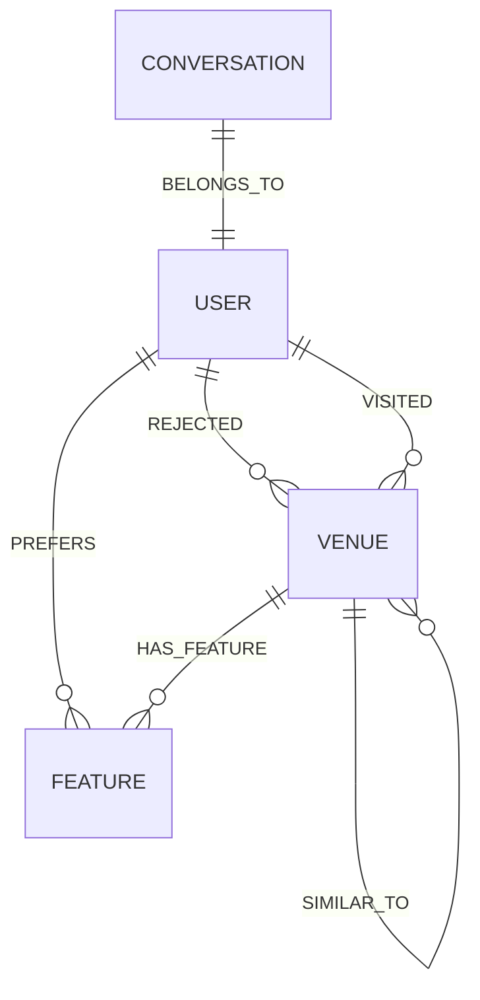
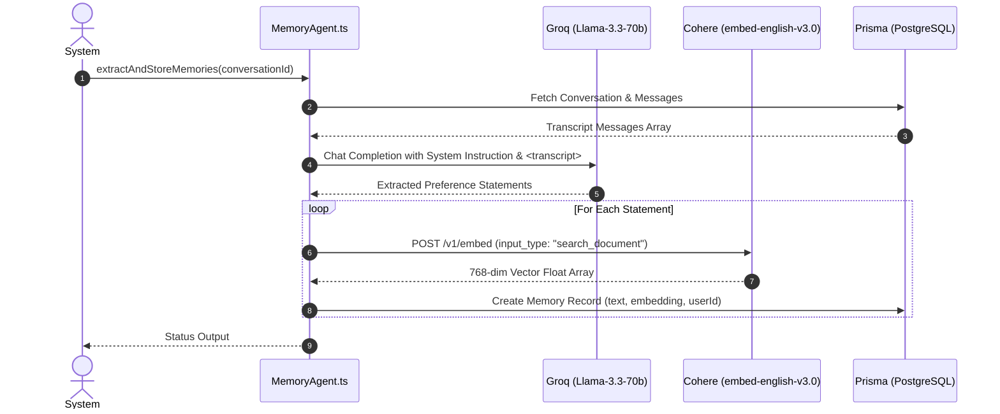

# GraphMemory: Multi-Hop Entity Retrieval & Cosine Similarity Indexing

## 1. Executive Summary & Architecture Overview

WorkSphere employs a hybrid **Graph-Augmented Retrieval-Augmented Generation (Graph RAG)** memory architecture to manage long-term user preferences, venue characteristics, historical interactions, and negative constraints (rejections). By combining a **Directed Property Graph** (`GraphMemory.ts`), a **Vector Embedding Index** (`EmbeddingIndex.ts`), an **AI Memory Extraction Agent** (`MemoryAgent.ts`), and a **Dynamic Prompt Assembler** (`PromptAssembler.ts`), WorkSphere delivers personalized, context-aware workspace recommendations while strictly enforcing user preferences and filtering out previously rejected venues.

```
+-----------------------------------------------------------------------------------+
|                              USER INTERACTION LAYER                               |
|                         (Chat API / Recommendation Engine)                        |
+-----------------------------------------+-----------------------------------------+
                                          |
                                          v  [User Query & Session State]
+-----------------------------------------------------------------------------------+
|                           HYBRID GRAPH RAG MEMORY SYSTEM                          |
|                                                                                   |
|  +-------------------------------------+   +-----------------------------------+  |
|  |     DIRECTED PROPERTY GRAPH         |   |      VECTOR EMBEDDING INDEX       |  |
|  |       (GraphMemory.ts)              |   |       (EmbeddingIndex.ts)         |  |
|  |                                     |   |                                   |  |
|  | - Nodes: User, Venue, Feature       |   | - Top-K Cosine Similarity Search  |  |
|  | - Edges: PREFERS, REJECTED, VISITED |   | - Cohere embed-english-v3.0       |  |
|  +------------------+------------------+   +-----------------+-----------------+  |
|                     |                                        |                    |
+---------------------+----------------------------------------+--------------------+
                      |                                        |
                      v  [Explicit Preferences]                v  [Semantic Context]
+-----------------------------------------------------------------------------------+
|                             DYNAMIC PROMPT ASSEMBLER                              |
|                               (PromptAssembler.ts)                                |
+-----------------------------------------+-----------------------------------------+
                                          |
                                          v  [Synthesized System Prompt]
+-----------------------------------------------------------------------------------+
|                            GROQ / LLAMA 3.3 LLM INFERENCE                         |
|                     (Strict Context & Constraint Enforced)                        |
+-----------------------------------------------------------------------------------+
```

### Core Architecture Objectives
- **Explicit Knowledge Graph Persistence:** Maintain deterministic node-edge relationships representing user feature preferences (`PREFERS`) and venue blacklists (`REJECTED`).
- **Multi-Hop Traversal:** Traversal across 2-hop and 3-hop paths to discover indirect feature correlations (e.g., $User \xrightarrow{PREFERS} Feature \xleftarrow{HAS\_FEATURE} Venue$).
- **Dense Vector Semantic Search:** Perform sub-millisecond cosine similarity searches over unstructured memory text embeddings.
- **Prompt Context Synthesis:** Dynamically assemble context-enriched system prompts that combine hard relational constraints with soft semantic similarity scores.
- **Prompt Injection Resilience:** Isolate user conversational transcripts within structural XML tags (`<transcript>`) to prevent memory extraction manipulation.

---

## 2. Directed Property Graph Model (`GraphMemory.ts`)

The `GraphMemory` class implements an in-memory directed property graph using adjacency maps to store entities and their weighted directional relationships.

### 2.1 Entity & Relationship Schema

```typescript
export type EntityType = 'USER' | 'VENUE' | 'FEATURE' | 'CONVERSATION';

export interface GraphNode {
  id: string;
  type: EntityType;
  properties: Record<string, string | number | boolean>;
  createdAt: number;
}

export interface GraphEdge {
  sourceId: string;
  targetId: string;
  relationship: 'PREFERS' | 'REJECTED' | 'HAS_FEATURE' | 'VISITED' | 'SIMILAR_TO';
  weight: number; // Relationship strength (0.0 to 1.0+)
  properties: Record<string, string | number | boolean>;
  createdAt: number;
}
```



### 2.2 Adjacency List Structure

`GraphMemory` maintains nodes and directed edges using Javascript `Map` primitives for $O(1)$ node lookups and efficient adjacency list iterations:

```typescript
export class GraphMemory {
  private nodes: Map<string, GraphNode>;
  private edges: Map<string, GraphEdge[]>; // Adjacency list: sourceId -> GraphEdge[]

  constructor() {
    this.nodes = new Map();
    this.edges = new Map();
  }

  public addNode(node: GraphNode): void {
    this.nodes.set(node.id, { ...node, createdAt: Date.now() });
    if (!this.edges.has(node.id)) {
      this.edges.set(node.id, []);
    }
  }

  public addEdge(edge: GraphEdge): void {
    if (!this.nodes.has(edge.sourceId) || !this.nodes.has(edge.targetId)) {
      throw new Error('Both source and target nodes must exist before adding an edge.');
    }
    
    const newEdge = { ...edge, createdAt: Date.now() };
    const sourceEdges = this.edges.get(edge.sourceId) || [];
    
    // Replace existing edge if targetId and relationship match; otherwise append
    const existingIndex = sourceEdges.findIndex(
      e => e.targetId === edge.targetId && e.relationship === edge.relationship
    );
    
    if (existingIndex !== -1) {
      sourceEdges[existingIndex] = newEdge;
    } else {
      sourceEdges.push(newEdge);
    }
    
    this.edges.set(edge.sourceId, sourceEdges);
  }
}
```

---

## 3. Multi-Hop Entity Retrieval Mechanics

Multi-hop graph traversal retrieves connected entities across multiple edge traversals, enabling deep context discovery that vector similarity alone cannot capture.

### 3.1 1-Hop Explicit Retrieval

1-hop queries retrieve direct node connections from the user node:
- **User Preference Features:** Traversing `USER --PREFERS--> FEATURE`.
- **User Rejections:** Traversing `USER --REJECTED--> VENUE`.

```typescript
public getUserPreferences(userId: string): { featureId: string; weight: number }[] {
  const preferredFeatures = this.getConnectedNodes(userId, 'PREFERS');
  return preferredFeatures.map(node => ({
    featureId: node.id,
    weight: this.edges.get(userId)?.find(
      e => e.targetId === node.id && e.relationship === 'PREFERS'
    )?.weight || 1
  }));
}

public getRejectedVenues(userId: string): string[] {
  return this.getConnectedNodes(userId, 'REJECTED').map(node => node.id);
}
```

### 3.2 2-Hop Candidate Venue Discovery

2-hop traversal evaluates candidates by expanding outward from user preferences to candidate venues that possess matching features:

$$\text{Path: } \text{User}_u \xrightarrow{\text{PREFERS}, w_1} \text{Feature}_f \xleftarrow{\text{HAS\_FEATURE}, w_2} \text{Venue}_v$$

#### Mathematical Multi-Hop Relevance Scoring

The aggregated multi-hop relevance score $S(u, v)$ for a candidate venue $v$ given user $u$ is the sum of path weight products across all shared feature nodes $F_{u,v}$:

$$S(u, v) = \sum_{f \in F_{u,v}} w(u \xrightarrow{\text{PREFERS}} f) \cdot w(v \xrightarrow{\text{HAS\_FEATURE}} f)$$

If $(u \xrightarrow{\text{REJECTED}} v)$ exists in the graph, the candidate score is forcibly overridden to $-\infty$:

$$S_{\text{final}}(u, v) = \begin{cases} -\infty & \text{if } (u, v) \in E_{\text{REJECTED}} \\ S(u, v) & \text{otherwise} \end{cases}$$

### 3.3 Multi-Hop Traversal Algorithm Implementation

```typescript
export interface MultiHopMatch {
  venueId: string;
  score: number;
  matchingFeatures: Array<{ featureId: string; weight: number }>;
}

export function findRecommendedVenuesMultiHop(
  graph: GraphMemory,
  userId: string,
  minScoreThreshold = 0.5
): MultiHopMatch[] {
  const preferences = graph.getUserPreferences(userId);
  const rejectedVenueIds = new Set(graph.getRejectedVenues(userId));

  const venueScores = new Map<string, { score: number; features: Array<{ featureId: string; weight: number }> }>();

  for (const pref of preferences) {
    // 2nd Hop: Find all venues that have this preferred feature
    const featureNode = graph.getNode(pref.featureId);
    if (!featureNode) continue;

    // Incoming edges to Feature or outgoing HAS_FEATURE edges
    const connectedVenues = graph.getConnectedNodes(pref.featureId, 'HAS_FEATURE');

    for (const venue of connectedVenues) {
      if (rejectedVenueIds.has(venue.id)) continue; // Hard filter rejection

      const current = venueScores.get(venue.id) || { score: 0, features: [] };
      const pathScore = pref.weight * 1.0; // Feature weight * edge weight

      current.score += pathScore;
      current.features.push({ featureId: pref.featureId, weight: pref.weight });
      venueScores.set(venue.id, current);
    }
  }

  return Array.from(venueScores.entries())
    .filter(([_, data]) => data.score >= minScoreThreshold)
    .map(([venueId, data]) => ({
      venueId,
      score: data.score,
      matchingFeatures: data.features,
    }))
    .sort((a, b) => b.score - a.score);
}
```

---

## 4. Vector Embedding Index & Cosine Similarity (`EmbeddingIndex.ts`)

While property graphs capture explicit relational constraints, unstructured textual memories (e.g., *"user mentioned liking quiet coffee shops with natural lighting"*) are stored as dense vector embeddings in `EmbeddingIndex`.

### 4.1 Vector Document Data Structure

```typescript
export interface VectorDocument {
  id: string;
  text: string;
  embedding: number[]; // Dense vector array (e.g., 768 dimensions for Cohere embed-english-v3.0)
  metadata: Record<string, string | number>;
}
```

### 4.2 Mathematical Cosine Similarity

Cosine similarity evaluates the angular alignment between query vector $\mathbf{a}$ and document vector $\mathbf{b}$, producing a normalized similarity score in $[-1, 1]$ (or $[0, 1]$ for non-negative embeddings):

$$\text{CosineSimilarity}(\mathbf{a}, \mathbf{b}) = \frac{\mathbf{a} \cdot \mathbf{b}}{\|\mathbf{a}\| \|\mathbf{b}\|} = \frac{\sum_{i=1}^{d} a_i b_i}{\sqrt{\sum_{i=1}^{d} a_i^2} \sqrt{\sum_{i=1}^{d} b_i^2}}$$

#### Boundary Conditions & Zero Vector Handling
If either vector norm is zero ($\|\mathbf{a}\| = 0$ or $\|\mathbf{b}\| = 0$), the implementation returns $0.0$ to avoid division by zero:

$$\text{CosineSimilarity}(\mathbf{a}, \mathbf{b}) = 0 \quad \text{if } \|\mathbf{a}\| = 0 \lor \|\mathbf{b}\| = 0$$

### 4.3 Vector Search Implementation

```typescript
export class EmbeddingIndex {
  private documents: Map<string, VectorDocument>;

  constructor() {
    this.documents = new Map();
  }

  public addDocument(doc: VectorDocument): void {
    this.documents.set(doc.id, doc);
  }

  public removeDocument(id: string): void {
    this.documents.delete(id);
  }

  private cosineSimilarity(vecA: number[], vecB: number[]): number {
    if (vecA.length !== vecB.length) {
      throw new Error(`Vector dimensions must match: ${vecA.length} vs ${vecB.length}`);
    }

    let dotProduct = 0;
    let normA = 0;
    let normB = 0;

    for (let i = 0; i < vecA.length; i++) {
      dotProduct += vecA[i] * vecB[i];
      normA += vecA[i] * vecA[i];
      normB += vecB[i] * vecB[i];
    }

    if (normA === 0 || normB === 0) return 0;
    return dotProduct / (Math.sqrt(normA) * Math.sqrt(normB));
  }

  public search(queryEmbedding: number[], topK = 5): { doc: VectorDocument; score: number }[] {
    const scores: { doc: VectorDocument; score: number }[] = [];

    for (const doc of this.documents.values()) {
      const score = this.cosineSimilarity(queryEmbedding, doc.embedding);
      scores.push({ doc, score });
    }

    scores.sort((a, b) => b.score - a.score);
    return scores.slice(0, topK);
  }
}
```

---

## 5. AI Memory Extraction Agent (`MemoryAgent.ts`)

The `MemoryAgent` inspects multi-turn conversational transcripts, extracts long-term preferences using **Llama 3.3 70B** on Groq, computes dense embeddings via **Cohere API**, and persists them to PostgreSQL/Prisma.

### 5.1 Extraction Pipeline & Security Isolation

To prevent prompt injection attacks inside user chat transcripts from hijacking the memory agent, transcripts are strictly scoped within `<transcript>` tags.



### 5.2 Extraction & Embedding Workflow Excerpt

```typescript
export async function extractAndStoreMemories(conversationId: string) {
  const conversation = await prisma.conversation.findUnique({
    where: { id: conversationId },
    include: { messages: { orderBy: { createdAt: "asc" } } },
  });

  if (!conversation || conversation.messages.length === 0) {
    return { status: "no_messages" };
  }

  const transcript = conversation.messages
    .map((m) => `${m.role}: ${m.content}`)
    .join("\n");

  const systemInstruction = `You are an AI Memory Extraction Agent. Analyze the conversation transcript between a user and an assistant inside the <transcript> tags.
Identify if the user explicitly stated any long-term preferences, requirements, or constraints.
Examples: "I need fast wifi", "I prefer quiet places", "I always want standing desks".
Do NOT include temporary session constraints.
If no preferences found, output: NO_PREFERENCES`;

  const completion = await getGroqClient().chat.completions.create({
    messages: [
      { role: "system", content: systemInstruction },
      { role: "user", content: `<transcript>\n${transcript}\n</transcript>` },
    ],
    model: "llama-3.3-70b-versatile",
    temperature: 0,
  });

  const responseText = completion.choices[0]?.message?.content?.trim() || "";
  if (responseText === "NO_PREFERENCES" || responseText === "") {
    return { status: "no_preferences" };
  }

  const preferences = responseText
    .split("\n")
    .map((p) => p.replace(/^[-*•\d.]\s*/, "").trim())
    .filter((p) => p.length > 0 && p !== "NO_PREFERENCES" && p.length <= 500);

  const cohereApiKey = process.env.COHERE_API_KEY;

  for (const prefClean of preferences) {
    const embedRes = await fetch("https://api.cohere.ai/v1/embed", {
      method: "POST",
      headers: {
        Authorization: `Bearer ${cohereApiKey}`,
        "Content-Type": "application/json",
      },
      body: JSON.stringify({
        texts: [prefClean],
        model: "embed-english-v3.0",
        input_type: "search_document",
      }),
    });

    const embedData = await embedRes.json();
    const embedding = embedData.embeddings[0];

    await prisma.memory.create({
      data: {
        userId: conversation.userId,
        content: prefClean,
        embedding: embedding,
      },
    });
  }

  return { status: "success", count: preferences.length };
}
```

---

## 6. Prompt Context Synthesis (`PromptAssembler.ts`)

The `PromptAssembler` merges explicit relational graph facts (`GraphMemory`) with semantic vector documents (`EmbeddingIndex`) to generate an enriched system prompt for downstream LLM reasoning.

### 6.1 Prompt Context Interface & Assembly Logic

```typescript
export interface PromptContext {
  userId: string;
  currentQuery: string;
  queryEmbedding?: number[];
}

export class PromptAssembler {
  private graphMemory: GraphMemory;
  private embeddingIndex: EmbeddingIndex;

  constructor(graphMemory: GraphMemory, embeddingIndex: EmbeddingIndex) {
    this.graphMemory = graphMemory;
    this.embeddingIndex = embeddingIndex;
  }

  public async assembleSystemPrompt(context: PromptContext): Promise<string> {
    const { userId, currentQuery, queryEmbedding } = context;
    
    // 1. Fetch explicit user preferences & rejections from Graph
    const preferences = this.graphMemory.getUserPreferences(userId);
    const rejectedVenues = this.graphMemory.getRejectedVenues(userId);
    
    let preferenceText = 'The user has no explicit recorded preferences.';
    if (preferences.length > 0) {
      preferenceText = `The user strongly prefers venues with these features: ${preferences
        .map(p => `Feature ID: ${p.featureId} (Weight: ${p.weight})`)
        .join(', ')}.`;
    }

    let rejectionText = '';
    if (rejectedVenues.length > 0) {
      rejectionText = `DO NOT recommend these previously rejected venue IDs: ${rejectedVenues.join(', ')}.`;
    }

    // 2. Fetch semantically similar past interactions
    let historicalContext = '';
    if (queryEmbedding) {
      const similarDocs = this.embeddingIndex.search(queryEmbedding, 3);
      if (similarDocs.length > 0) {
        historicalContext = `Relevant past interactions:\n${similarDocs
          .map(d => `- [Score: ${d.score.toFixed(2)}] ${d.doc.text}`)
          .join('\n')}`;
      }
    }

    // 3. Synthesize final system prompt
    return `
You are an intelligent workspace discovery agent for WorkSphere.
Your goal is to recommend the best workspaces based on the user's query, while strictly adhering to their historical preferences and rejections.

### USER PROFILE & HISTORY
${preferenceText}
${rejectionText}

### SEMANTIC CONTEXT
${historicalContext || 'No specific historical semantic matches found.'}

### CURRENT QUERY
"${currentQuery}"

### INSTRUCTIONS
1. Analyze the current query.
2. Cross-reference with the user's explicit preferences and rejections.
3. Use the semantic context to understand nuanced needs.
4. Provide a reasoned, context-aware recommendation. Do not recommend rejected venues.
`.trim();
  }
}
```

---

## 7. Memory API Interface (`src/app/api/agents/memory/route.ts`)

WorkSphere exposes a RESTful endpoint to mutate knowledge graph nodes/edges, index vector documents, and generate synthesized system prompts.

### 7.1 Action Endpoint Dispatcher

```typescript
import { NextRequest, NextResponse } from 'next/server';
import { GraphMemory, GraphNode, GraphEdge } from '@/core/agents/memory/GraphMemory';
import { EmbeddingIndex, VectorDocument } from '@/core/agents/memory/EmbeddingIndex';
import { PromptAssembler, PromptContext } from '@/core/agents/memory/PromptAssembler';

const globalGraphMemory = new GraphMemory();
const globalEmbeddingIndex = new EmbeddingIndex();
const promptAssembler = new PromptAssembler(globalGraphMemory, globalEmbeddingIndex);

export async function POST(request: NextRequest) {
  try {
    const body = await request.json();
    const { action, payload } = body;

    if (action === 'ADD_NODE') {
      globalGraphMemory.addNode(payload as GraphNode);
      return NextResponse.json({ success: true, message: 'Node added' }, { status: 200 });
    }

    if (action === 'ADD_EDGE') {
      globalGraphMemory.addEdge(payload as GraphEdge);
      return NextResponse.json({ success: true, message: 'Edge added' }, { status: 200 });
    }

    if (action === 'ADD_DOCUMENT') {
      globalEmbeddingIndex.addDocument(payload as VectorDocument);
      return NextResponse.json({ success: true, message: 'Document indexed' }, { status: 200 });
    }

    if (action === 'GENERATE_PROMPT') {
      const prompt = await promptAssembler.assembleSystemPrompt(payload as PromptContext);
      return NextResponse.json({ success: true, prompt }, { status: 200 });
    }

    return NextResponse.json({ error: 'Invalid action' }, { status: 400 });
  } catch (error) {
    console.error('Memory API error:', error);
    return NextResponse.json({ error: 'Internal server error' }, { status: 500 });
  }
}
```

---

## 8. Summary Configuration & Data Type Matrix

| Data Structure / Class | File Path | Core Function / Interface | Description |
| :--- | :--- | :--- | :--- |
| `GraphNode` | `GraphMemory.ts` | `{ id, type, properties, createdAt }` | Entity node representation (`USER`, `VENUE`, `FEATURE`) |
| `GraphEdge` | `GraphMemory.ts` | `{ sourceId, targetId, relationship, weight }` | Directed relationship edge (`PREFERS`, `REJECTED`, `HAS_FEATURE`) |
| `GraphMemory` | `GraphMemory.ts` | `addNode`, `addEdge`, `getUserPreferences` | In-memory adjacency list graph store and multi-hop accessor |
| `VectorDocument` | `EmbeddingIndex.ts` | `{ id, text, embedding, metadata }` | Dense vector document wrapper |
| `EmbeddingIndex` | `EmbeddingIndex.ts` | `search(queryEmbedding, topK)` | Cosine similarity vector search engine |
| `MemoryAgent` | `MemoryAgent.ts` | `extractAndStoreMemories(conversationId)` | Groq/Llama-3.3 preference extraction & Cohere embedding agent |
| `PromptAssembler` | `PromptAssembler.ts` | `assembleSystemPrompt(context)` | Hybrid RAG prompt synthesizer combining graph & vector memory |
