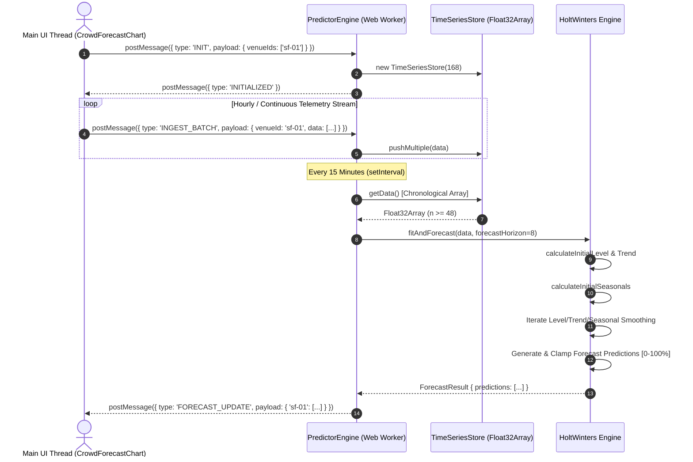

# Holt-Winters Triple Exponential Smoothing & Venue Demand Forecasting

## 1. Executive Summary & Mathematical Overview

WorkSphere employs the **Holt-Winters Triple Exponential Smoothing algorithm** to forecast real-time venue crowd density, seat occupancy, and workspace utilization up to 24 hours in advance. Running within high-performance Web Workers (`src/workers/forecasting/`), this engine models time-series data by decomposing raw telemetry into three dynamic components:
1. **Level ($L_t$):** The baseline average occupancy intensity.
2. **Trend ($b_t$):** The linear growth or decline slope over time.
3. **Seasonality ($S_t$):** The repeating diurnal (24-hour) utilization cycle.

```
+-----------------------------------------------------------------------------------+
|                           REAL-TIME TELEMETRY INGESTION                           |
|                      (Check-ins, WiFi Sensors, Seat Locks)                        |
+-----------------------------------------+-----------------------------------------+
                                          |
                                          v  [Float32Array Telemetry Stream]
+-----------------------------------------------------------------------------------+
|                           CIRCULAR TIME-SERIES BUFFER                             |
|                        (TimeSeriesStore.ts: 168 Hours)                            |
+-----------------------------------------+-----------------------------------------+
                                          |
                                          v  [Chronological Time-Series Data]
+-----------------------------------------------------------------------------------+
|                        HOLT-WINTERS SMOOTHING ENGINE                              |
|                          (HoltWinters.ts Worker)                                  |
|                                                                                   |
|  +-----------------------+  +----------------------+  +------------------------+  |
|  | Level Smoothing (α)   |  | Trend Smoothing (β)  |  | Seasonal Smoothing (γ) |  |
|  +-----------------------+  +----------------------+  +------------------------+  |
+-----------------------------------------+-----------------------------------------+
                                          |
                                          v  [Multiplicative Forecast Output]
+-----------------------------------------------------------------------------------+
|                           PREDICTOR ENGINE ORCHESTRATOR                           |
|               (PredictorEngine.ts: Clamped 0-100% Occupancy Array)                |
+-----------------------------------------------------------------------------------+
```

Key technical characteristics:
- **Diurnal Seasonality Modeling:** Accommodates 24-period hourly daily cycles ($L = 24$).
- **Multiplicative Seasonal Decomposition:** Scales seasonal amplitude proportionally to overall level changes.
- **Worker Thread Offloading:** Computes background forecasts asynchronously without blocking the UI rendering loop.
- **Circular Buffer Memory Management:** Uses bounded `Float32Array` buffers ($168$ elements = $1$ week) to ensure zero GC overhead.

---

## 2. Mathematical Formulation & Parameter Equations

The multiplicative Holt-Winters model updates level, trend, and seasonal components at each time step $t$, and projects future values $h$ steps ahead.

### 2.1 Parameter Specification

| Parameter | Symbol | Range | Default Value | Description |
| :--- | :--- | :--- | :--- | :--- |
| **Level Smoothing** | $\alpha$ | $[0, 1]$ | $0.30$ | Controls weight given to recent observations vs. prior level estimation |
| **Trend Smoothing** | $\beta$ | $[0, 1]$ | $0.10$ | Controls weight given to recent trend slopes vs. prior trend estimation |
| **Seasonal Smoothing**| $\gamma$ | $[0, 1]$ | $0.40$ | Controls weight given to current seasonal factor vs. prior season index |
| **Season Length** | $L$ | Integer | $24$ | Number of time periods per cycle ($24$ hours for daily periodicity) |

---

### 2.2 Initialization Equations ($t = 0 \dots L-1$)

Before iterating through historical observations, the initial level $L_0$, initial trend $b_0$, and initial seasonal factors $S_0 \dots S_{L-1}$ are calculated from the first two full seasons ($2L = 48$ observations).

#### 2.2.1 Initial Level ($L_0$)
The initial baseline level is the arithmetic mean of the first season:

$$L_0 = \frac{1}{L} \sum_{i=0}^{L-1} y_i$$

#### 2.2.2 Initial Trend ($b_0$)
The initial trend represents the average step-wise change between the first and second seasons:

$$b_0 = \frac{1}{L^2} \left[ \sum_{i=0}^{L-1} y_{L+i} - \sum_{i=0}^{L-1} y_i \right]$$

#### 2.2.3 Initial Seasonal Factors ($S_i$)
For each period $i \in [0, L-1]$ in the season:

$$S_i = \frac{y_i}{L_0 + (i + 1) \cdot b_0}$$

---

### 2.3 Smoothing Iteration Update Equations ($t = L \dots N-1$)

At each historical observation step $t$, given observed data point $y_t$ and seasonal index $k = t \bmod L$:

#### 2.3.1 Level Update ($L_t$)
The updated level removes the seasonal effect from $y_t$ and blends it with the trend-adjusted prior level:

$$L_t = \alpha \left( \frac{y_t}{S_{t \bmod L}} \right) + (1 - \alpha) (L_{t-1} + b_{t-1})$$

#### 2.3.2 Trend Update ($b_t$)
The updated trend evaluates the change in level and blends it with the prior trend:

$$b_t = \beta (L_t - L_{t-1}) + (1 - \beta) b_{t-1}$$

#### 2.3.3 Seasonal Factor Update ($S_{t \bmod L}$)
The updated seasonal factor isolates the ratio of observed value to level and blends it with the prior seasonal index:

$$S_{t \bmod L} = \gamma \left( \frac{y_t}{L_t} \right) + (1 - \gamma) S_{t \bmod L}$$

---

### 2.4 Forecasting & Clamping Equation

To predict occupancy $\hat{y}_{N+h}$ for $h$ steps beyond the dataset length $N$:

$$\hat{y}_{N+h} = \left( L_N + h \cdot b_N \right) \cdot S_{(N + h - 1) \bmod L}$$

#### Clamping Boundary:
Since venue seat occupancy is physically bounded between $0\%$ and $100\%$, raw predictions are clamped:

$$\hat{y}_{\text{clamped}} = \max\left(0, \min\left(100, \hat{y}_{N+h}\right)\right)$$

---

## 3. Implementation Codebase Analysis

### 3.1 `HoltWinters.ts` Complete Implementation

```typescript
/**
 * HoltWinters.ts
 * Implementation of the Holt-Winters triple exponential smoothing algorithm for time-series forecasting.
 * Accounts for level, trend, and daily seasonality in venue occupancy data.
 */

export interface HoltWintersParams {
    alpha: number; // Level smoothing (0-1)
    beta: number;  // Trend smoothing (0-1)
    gamma: number; // Seasonality smoothing (0-1)
    seasonLength: number; // Number of periods in a season (e.g., 24 for hourly daily data)
}

export interface ForecastResult {
    predictions: number[];
    finalLevel: number;
    finalTrend: number;
    finalSeasonals: number[];
}

export class HoltWinters {
    private params: HoltWintersParams;

    constructor(params: HoltWintersParams) {
        this.params = params;
    }

    /**
     * Fits the model to historical data and forecasts future periods.
     * @param data Historical time-series data points.
     * @param forecastHorizon Number of future periods to predict.
     */
    public fitAndForecast(data: number[], forecastHorizon: number): ForecastResult {
        const { alpha, beta, gamma, seasonLength } = this.params;
        const n = data.length;

        if (n < seasonLength * 2) {
            throw new Error('Insufficient data for seasonality detection. Need at least 2 full seasons.');
        }

        // Initialize level, trend, and seasonal components
        let level = this.calculateInitialLevel(data, seasonLength);
        let trend = this.calculateInitialTrend(data, seasonLength);
        const seasonals = this.calculateInitialSeasonals(data, seasonLength, level, trend);

        // Smoothing phase
        for (let t = seasonLength; t < n; t++) {
            const prevLevel = level;
            const seasonalIndex = t % seasonLength;

            // Update level
            level = alpha * (data[t] / seasonals[seasonalIndex]) + (1 - alpha) * (prevLevel + trend);

            // Update trend
            trend = beta * (level - prevLevel) + (1 - beta) * trend;

            // Update seasonal component
            seasonals[seasonalIndex] = gamma * (data[t] / level) + (1 - gamma) * seasonals[seasonalIndex];
        }

        // Forecasting phase
        const predictions: number[] = [];
        for (let h = 1; h <= forecastHorizon; h++) {
            const seasonalIndex = (n + h - 1) % seasonLength;
            const forecast = (level + h * trend) * seasonals[seasonalIndex];
            predictions.push(Math.max(0, Math.min(100, forecast))); // Clamp to 0-100% occupancy
        }

        return {
            predictions,
            finalLevel: level,
            finalTrend: trend,
            finalSeasonals: [...seasonals]
        };
    }

    private calculateInitialLevel(data: number[], seasonLength: number): number {
        let sum = 0;
        for (let i = 0; i < seasonLength; i++) {
            sum += data[i];
        }
        return sum / seasonLength;
    }

    private calculateInitialTrend(data: number[], seasonLength: number): number {
        let sum1 = 0;
        let sum2 = 0;
        for (let i = 0; i < seasonLength; i++) {
            sum1 += data[seasonLength + i];
            sum2 += data[i];
        }
        return (sum1 - sum2) / (seasonLength * seasonLength);
    }

    private calculateInitialSeasonals(
        data: number[],
        seasonLength: number,
        initialLevel: number,
        initialTrend: number
    ): number[] {
        const seasonals = new Array(seasonLength).fill(0);
        for (let i = 0; i < seasonLength; i++) {
            seasonals[i] = data[i] / (initialLevel + (i + 1) * initialTrend);
        }
        return seasonals;
    }
}
```

---

### 3.2 `PredictorEngine.ts` Complete Implementation

```typescript
/**
 * PredictorEngine.ts
 * Main worker orchestrator that schedules periodic forecast recalculations and emits events 
 * to the main thread with updated occupancy predictions.
 */

import { HoltWinters } from './HoltWinters';
import { TimeSeriesStore } from './TimeSeriesStore';

interface ForecastRequest {
    venueId: string;
    historicalData: number[];
    forecastHours: number;
}

class PredictorEngine {
    private stores: Map<string, TimeSeriesStore>;
    private forecastInterval: ReturnType<typeof setInterval> | null = null;
    private readonly FORECAST_HORIZON = 8; // Predict next 8 hours

    constructor() {
        this.stores = new Map();
    }

    public initialize(venueIds: string[]): void {
        for (const id of venueIds) {
            if (!this.stores.has(id)) {
                this.stores.set(id, new TimeSeriesStore(168)); // 1 week hourly buffer
            }
        }
        this.startForecastLoop();
    }

    public ingestTelemetry(venueId: string, occupancyPercentage: number): void {
        let store = this.stores.get(venueId);
        if (!store) {
            store = new TimeSeriesStore(168);
            this.stores.set(venueId, store);
        }
        store.push(occupancyPercentage);
    }

    public ingestBatchTelemetry(venueId: string, data: number[]): void {
        let store = this.stores.get(venueId);
        if (!store) {
            store = new TimeSeriesStore(168);
            this.stores.set(venueId, store);
        }
        store.pushMultiple(data);
    }

    private startForecastLoop(): void {
        if (this.forecastInterval) return;

        // Recalculate forecasts every 15 minutes
        this.forecastInterval = setInterval(() => {
            this.generateAndEmitForecasts();
        }, 15 * 60 * 1000);
    }

    private generateAndEmitForecasts(): void {
        const results: Record<string, number[]> = {};
        const hw = new HoltWinters({ alpha: 0.3, beta: 0.1, gamma: 0.4, seasonLength: 24 });

        for (const [venueId, store] of this.stores.entries()) {
            const data = store.getData();
            if (data.length >= 48) { // Require at least 2 days of data for meaningful seasonality
                try {
                    const forecast = hw.fitAndForecast(data, this.FORECAST_HORIZON);
                    results[venueId] = forecast.predictions;
                } catch (error) {
                    console.error(`Forecast failed for venue ${venueId}:`, error);
                }
            }
        }

        if (Object.keys(results).length > 0) {
            self.postMessage({
                type: 'FORECAST_UPDATE',
                payload: results
            });
        }
    }

    public getImmediateForecast(venueId: string): number[] | null {
        const store = this.stores.get(venueId);
        if (!store) return null;

        const data = store.getData();
        if (data.length < 48) return null;

        const hw = new HoltWinters({ alpha: 0.3, beta: 0.1, gamma: 0.4, seasonLength: 24 });
        try {
            return hw.fitAndForecast(data, this.FORECAST_HORIZON).predictions;
        } catch {
            return null;
        }
    }
}

const engine = new PredictorEngine();

self.onmessage = (event: MessageEvent) => {
    const { type, payload } = event.data;

    if (type === 'INIT') {
        engine.initialize(payload.venueIds);
        self.postMessage({ type: 'INITIALIZED' });
    } else if (type === 'INGEST_SINGLE') {
        engine.ingestTelemetry(payload.venueId, payload.occupancy);
    } else if (type === 'INGEST_BATCH') {
        engine.ingestBatchTelemetry(payload.venueId, payload.data);
    } else if (type === 'GET_FORECAST') {
        const forecast = engine.getImmediateForecast(payload.venueId);
        self.postMessage({
            type: 'FORECAST_RESPONSE',
            payload: { venueId: payload.venueId, forecast }
        });
    }
};
```

---

### 3.3 `TimeSeriesStore.ts` Complete Implementation

```typescript
/**
 * TimeSeriesStore.ts
 * Circular buffer logic for efficiently storing and retrieving historical occupancy telemetry 
 * without unbounded memory growth in the Web Worker environment.
 */

export class TimeSeriesStore {
    private buffer: Float32Array;
    private capacity: number;
    private head: number;
    private count: number;

    constructor(capacity: number = 168) { // Default to 1 week of hourly data (168 hours)
        this.capacity = capacity;
        this.buffer = new Float32Array(capacity);
        this.head = 0;
        this.count = 0;
    }

    public push(value: number): void {
        this.buffer[this.head] = value;
        this.head = (this.head + 1) % this.capacity;
        if (this.count < this.capacity) {
            this.count++;
        }
    }

    public pushMultiple(values: number[]): void {
        for (const value of values) {
            this.push(value);
        }
    }

    /**
     * Returns the data in chronological order (oldest to newest).
     */
    public getData(): number[] {
        const result = new Array(this.count);
        for (let i = 0; i < this.count; i++) {
            const index = (this.head - this.count + i + this.capacity) % this.capacity;
            result[i] = this.buffer[index];
        }
        return result;
    }

    public getCount(): number {
        return this.count;
    }

    public clear(): void {
        this.buffer.fill(0);
        this.head = 0;
        this.count = 0;
    }
}
```

---

## 4. Execution Workflow & Worker Architecture



---

## 5. Summary Parameter & Architecture Reference

| Component | Identifier | Setting / Value | Description |
| :--- | :--- | :--- | :--- |
| **Minimum Required History** | `MIN_DATA_POINTS` | $48$ hours ($2$ full seasons) | Ensures sufficient baseline data for seasonal decomposition |
| **Default Forecast Horizon** | `FORECAST_HORIZON` | $8$ hours ahead | Number of future periods generated per forecast iteration |
| **Forecast Recalculation Loop**| `RECALC_INTERVAL` | $15$ minutes ($900,000\text{ms}$) | Frequency of Web Worker prediction updates |
| **TimeSeries Store Capacity** | `BUFFER_CAPACITY` | $168$ hours ($1$ week) | Circular `Float32Array` memory limit per venue |
| **Occupancy Clamping Bounds** | `CLAMP_RANGE` | $[0, 100]\%$ | Hard upper and lower boundaries enforced on predictions |
