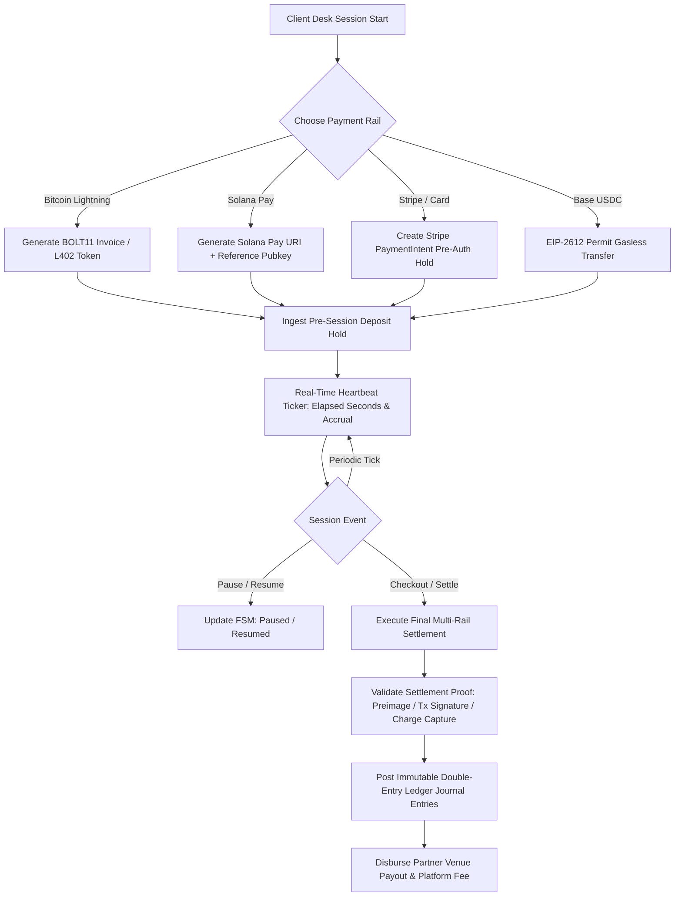
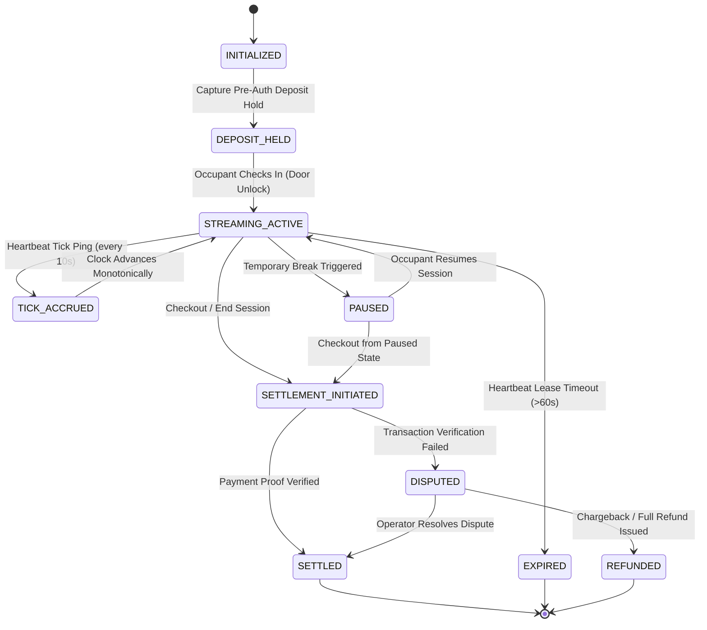
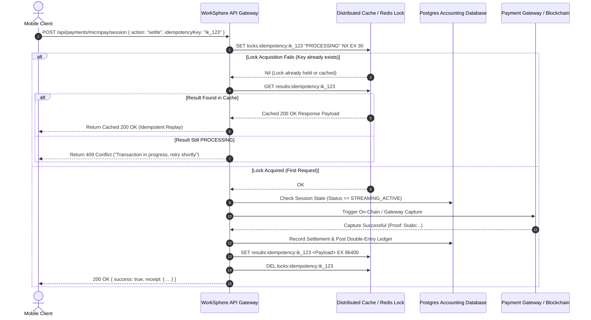
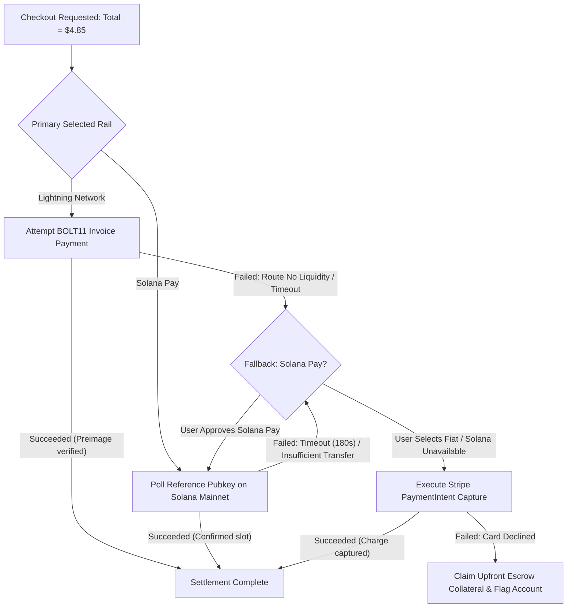

# Unified Multi-Rail Micro-Payments: State Machine, Idempotency Keys, and Multi-Rail Settlement Architecture

This architectural manual documents WorkSphere's unified multi-rail micro-payment engine ([`src/lib/payments/microPaymentEngine.ts`](file:///c:/Users/admin/Desktop/workfere/src/lib/payments/microPaymentEngine.ts), [`src/lib/payments/solanaPay.ts`](file:///c:/Users/admin/Desktop/workfere/src/lib/payments/solanaPay.ts), [`src/app/api/payments/micropay/session/route.ts`](file:///c:/Users/admin/Desktop/workfere/src/app/api/payments/micropay/session/route.ts), and [`src/components/billing/MultiCurrencyDeskCheckout.tsx`](file:///c:/Users/admin/Desktop/workfere/src/components/billing/MultiCurrencyDeskCheckout.tsx)). It details the real-time metering state machine, cryptographic idempotency keys, multi-rail settlement across Bitcoin Lightning Network, Solana Pay, and Stripe, failure recovery cascades, and double-entry accounting ledgers.

---

## 1. Executive Summary & Multi-Rail Payment Framework

Traditional coworking booking engines rely on static, coarse-grained reservations (full-day or multi-hour desk reservations) billed through high-fee credit card processors. This model penalizes mobile digital nomads who only require 45 minutes of workspace focus between flights, while burdening operators with 3–5% interchange fees on low-ticket transactions.

WorkSphere introduces a **Real-Time Streaming Micro-Payment Architecture**:
- **Continuous Metering:** Workspaces, quiet pods, and phone booths are metered on a per-second and per-minute basis (e.g., $\$0.075/\text{minute}$).
- **Multi-Rail Settlement:** Occupants settle dynamically across three primary payment rails:
  1. **Bitcoin Lightning Network (Layer 2 / BOLT11 / L402):** Sub-cent, instant settlements in satoshis with cryptographic preimage proof-of-payment.
  2. **Solana Pay (USDC SPL-Token):** Sub-second, low-fee ($\approx \$0.00025$) stablecoin payments via standardized URL schemes and reference public keys.
  3. **Stripe & Fiat Banking:** Card pre-authorization holds, micro-charge batching, and SEPA/ACH fallback clearing.
  4. **Base EVM Gasless USDC:** Secondary EVM Layer 2 rail using ERC-2612 permits for zero-gas mobile transactions.
- **Strict Idempotency & Fault Tolerance:** Distributed Redis locks and unique idempotency keys guarantee exactly-once accounting execution even amidst mobile network drops.
- **Double-Entry Financial Ledger:** Every micro-debit is balanced against venue receivables and platform revenue using immutable double-entry journal entries.



---

## 2. Finite State Machine (FSM) Lifecycle

Micro-billing sessions operate under a deterministic Finite State Machine (FSM) to prevent balance drift, runaway charges, and orphaned deposits.

### 2.1 State Definitions

| State | Identifier | Description | Invariants & Guards |
| :--- | :--- | :--- | :--- |
| **1. INITIALIZED** | `INITIALIZED` | Session requested by client; desk pricing resolved across fiat and crypto rails. | Zero seconds elapsed. Deposit hold not yet secured. |
| **2. DEPOSIT_HELD** | `DEPOSIT_HELD` | Upfront collateral or card authorization hold (nominal $\$10.00$) captured. | Collateral held in gateway escrow. Turnstile unlock permitted. |
| **3. STREAMING_ACTIVE** | `STREAMING_ACTIVE` | Occupant seated; clock actively advancing with periodic heartbeat pings. | Heartbeat lease active (expires after $60\text{s}$ without ping). |
| **4. TICK_ACCRUED** | `TICK_ACCRUED` | Per-minute accrual calculated; cumulative USD, Sats, and USDC updated. | Monotonically increasing accrued balance: $B_t \ge B_{t-1}$. |
| **5. PAUSED** | `PAUSED` | User temporarily steps away for coffee break; metering paused. | Heartbeat timer halted; maximum pause duration capped at $30\text{ min}$. |
| **6. SETTLEMENT_INITIATED**| `SETTLEMENT_INITIATED` | Checkout triggered; final duration locked; rail payment requested. | Accrual frozen. Concurrency lock prevents concurrent ticks. |
| **7. SETTLED** | `SETTLED` | Payment confirmed on-chain or captured via Stripe; receipt generated. | Deposit hold released or deducted; double-entry ledger posted. |
| **8. DISPUTED** | `DISPUTED` | Network discrepancy or user challenge regarding physical presence. | Flagged for operator review; audit logs preserved. |
| **9. EXPIRED** | `EXPIRED` | Heartbeat lease abandoned without clean checkout; auto-settled to deposit limit. | Terminal failure state; remaining deposit retained up to max cap. |
| **10. REFUNDED** | `REFUNDED` | Booking cancelled prior to grace period or mechanical desk malfunction. | Reversal transaction posted to ledger; zero revenue recognized. |

### 2.2 FSM State Transition Diagram



### 2.3 Mathematical State Invariants

For any active session $S$, the financial and temporal state must strictly satisfy:

$$T_{\text{elapsed}} = \max\left(0, \left\lfloor \frac{t_{\text{current}} - t_{\text{start}} - T_{\text{paused}}}{1000} \right\rfloor \right)$$

$$\text{TotalAccrued}_{\text{USD}} = \min\left( \text{DepositHold}_{\text{USD}}, \left( \frac{T_{\text{elapsed}}}{60} \right) \times \left( \frac{\text{HourlyRate}_{\text{USD}}}{60} \right) \right)$$

$$\text{TotalAccrued}_{\text{Sats}} = \left\lceil \text{TotalAccrued}_{\text{USD}} \times \text{Rate}_{\text{SatsPerUsd}} \right\rceil$$

$$\text{TotalAccrued}_{\text{USDC}} = \text{round}\left( \text{TotalAccrued}_{\text{USD}}, 4 \right)$$

---

## 3. Multi-Rail Settlement Protocols

WorkSphere abstracts the underlying rail differences behind a unified `PaymentRail` interface:

```typescript
export type PaymentRail = 'lightning' | 'usdc_solana' | 'fiat_stripe' | 'usdc_base';
```

### 3.1 Rail 1: Bitcoin Lightning Network (L402 & BOLT11)

The Lightning Network provides near-instant, peer-to-peer micro-transactions over bidirectional payment channels:

```
+-------------------------------------------------------------------------------+
|                            LIGHTNING NETWORK SETTLEMENT                       |
+-------------------------------------------------------------------------------+
|  1. Invoice Creation:                                                         |
|     - Node synthesizes BOLT11 invoice with 15-minute expiration:              |
|       lnbc<sats>0n1p...                                                       |
|     - Encodes payment hash H = SHA256(Preimage R)                             |
|                                                                               |
|  2. L402 Protocol Integration:                                                |
|     - HTTP 402 Payment Required returned on protected desk endpoints          |
|     - Response includes WWW-Authenticate: L402 macaroon="...", invoice="..."   |
|                                                                               |
|  3. Atomic Settlement:                                                        |
|     - Payer routes payment across multi-hop HTLCs                             |
|     - Venue node reveals Preimage R to claim satoshis                         |
|     - Preimage R serves as mathematical, non-repudiable Proof of Payment      |
+-------------------------------------------------------------------------------+
```

#### Key Cryptographic Properties
- **Cryptographic Preimage Proof:** The payment secret $R \in \{0, 1\}^{256}$ satisfies $H = \text{SHA256}(R)$. Possession of $R$ cryptographically proves payment without trusting third-party relays.
- **Routing Fee Bounding:** The engine caps acceptable routing fees at $\le 1.0\%$ or $5\text{ sats}$ to ensure micro-payments remain economically viable.

### 3.2 Rail 2: Solana Pay (SPL-Token USDC)

Solana Pay provides high-throughput ($\approx 3,000\text{ TPS}$), deterministic $400\text{ms}$ slot finality for stablecoin settlements.

#### Specification & Flow
1. **Reference Public Key Generation:** A unique single-use Ed25519 public key $K_{\text{ref}}$ is generated per invoice:
   $$K_{\text{ref}} = \text{Keypair.generate().publicKey}$$
2. **Solana Pay URI Formatting:** Standardized specification compatible with Phantom, Solflare, and Backpack wallets:
   ```
   solana:<treasury_address>?amount=<usdc_amount>&spl-token=EPjFWdd5AufqSSqeM2qN1xzybapC8G4wEGGkZwyTDt1v&reference=<reference_pubkey>&label=WorkSphere+Desk+Session&message=Hourly+Desk+Settlement
   ```
3. **On-Chain Verification Loop:**
   - The backend polls or subscribes to WebSocket logs via `getSignaturesForAddress(K_{\text{ref}})`.
   - Upon transaction landing, verifies:
     - `tx.meta.err === null` (transaction executed without runtime errors).
     - Target token account matches WorkSphere treasury vault.
     - Transferred token amount matches exact session balance within $0.0001\text{ USDC}$.
     - Slot commitment reaches `confirmed` or `finalized`.

### 3.3 Rail 3: Stripe & Fiat Clearing

For non-crypto users, Stripe handles credit card pre-authorizations and micro-charge batching:

1. **Pre-Authorization Hold (Auth Capture Flow):**
   - At session initiation, a `PaymentIntent` is created with `capture_method: "manual"` for the default hold amount ($\$10.00$).
   - Card funds are placed in hold reserve without initiating interchange clearing.
2. **Post-Session Capture Adjustment:**
   - At checkout, if the actual accrued fee is $\$3.45$, the backend executes:
     ```typescript
     await stripe.paymentIntents.capture(paymentIntentId, {
       amount_to_capture: 345, // $3.45 in cents
     });
     ```
   - The remaining $\$6.55$ authorization hold automatically lapses, avoiding separate refund transaction fees.

### 3.4 Rail Comparison Matrix

| Evaluation Dimension | Bitcoin Lightning | Solana Pay (USDC) | Stripe (Credit Card) | Base (USDC Layer 2) |
| :--- | :--- | :--- | :--- | :--- |
| **Typical Settlement Latency** | $800\text{ms} - 2.5\text{s}$ | $400\text{ms} - 1.2\text{s}$ | $2 - 5\text{s}$ (Auth) / $2\text{ days}$ (Batch) | $1.5 - 3\text{s}$ |
| **Network Transaction Fee** | $< \$0.005$ ($\approx 1 - 5\text{ sats}$) | $\approx \$0.00025$ | $\$0.30 + 2.9\%$ | $\approx \$0.002$ |
| **Volatility Risk** | None (denominated in sats) | Zero (USDC pegged 1:1) | Zero (USD / EUR / GBP) | Zero (USDC pegged 1:1) |
| **Chargeback / Reversal Risk** | Absolute Zero (Irreversible) | Absolute Zero (Irreversible) | High (90-day dispute window) | Absolute Zero (Irreversible) |
| **Offline Proof of Payment** | Preimage Hash ($R$) | On-chain signature hash | Stripe Charge ID | EVM Transaction Hash |

---

## 4. Idempotency Key Specification & Distributed Deduplication

In distributed networks and mobile environments, unstable cellular connections cause clients to retry requests, risking duplicate charges or double settlements.

### 4.1 Idempotency Key Anatomy

WorkSphere enforces an HTTP header standard: `Idempotency-Key`.

```
Format: ik_<entity>_<timestamp>_<sha256(payload_signature)>
Example: ik_settle_1728504215_9f83b27e4c1a5d0981273948576a
```

### 4.2 Distributed Two-Phase Reservation Protocol

To avoid race conditions across horizontally scaled edge instances, deduplication is managed via Redis using an atomic `SET NX EX` lease:



### 4.3 Deduplication Rules
1. **Payload Hash Matching:** If a client re-uses an active `Idempotency-Key` with a *different* JSON payload, the server immediately rejects the request with HTTP `422 Unprocessable Entity` (`IDEMPOTENCY_PAYLOAD_MISMATCH`).
2. **24-Hour Cache Horizon:** Once a payment transaction resolves successfully, its response payload is retained in Redis for $86,400\text{ seconds}$ ($24\text{ hours}$). Subsequent identical requests return the exact historical response without invoking the payment rail.

---

## 5. Failure Modes, Edge Cases & Recovery Protocols

A production-grade micro-billing system must handle asynchronous network partitions, wallet timeouts, and chain reorganizations.

### 5.1 Failure Catalog & Mitigation Strategy

| Failure Scenario | Root Cause | Impact | Automated Recovery Action |
| :--- | :--- | :--- | :--- |
| **Client Disconnect During Metering** | Dead battery, subway tunnel, or closed browser tab. | Session continues accumulating time indefinitely. | **Heartbeat Lease Timeout**: If no heartbeat tick is received within $60\text{s}$, the session transitions to `EXPIRED` and settles to the last verified tick timestamp. |
| **Lightning Routing Channel Failure** | No liquidity route found between nodes for HTLC. | Invoice payment hangs or fails. | **Multi-Rail Cascade**: Client seamlessly prompts fallback to Solana Pay or Stripe card hold without resetting session. |
| **Solana Pay Slippage / Partial Payment** | User manually edits USDC transfer amount in wallet. | Insufficient balance delivered to treasury vault. | **Deficit Ledger Posting**: Session remains in `SETTLEMENT_INITIATED`; outstanding balance billed against card hold. |
| **Solana Block Re-organization** | Unconfirmed transaction dropped from fork. | Erroneous settlement acknowledgement. | **Slot Finality Requirement**: High-value desk sessions require commitment level `finalized` ($\ge 32$ confirmed blocks). |
| **Stripe Capture Decline** | Card reported stolen or insufficient funds during session. | Capture of accrued fee rejected by bank. | **Deposit Hold Liquidation**: The initial $\$10.00$ pre-auth hold is claimed immediately; user account suspended from future unheld sessions. |
| **Concurrent Settlement Submissions** | Double-tapping checkout button on flaky connection. | Potential double ledger posting. | **Atomic FSM Locking**: Database row locked via `SELECT FOR UPDATE`; duplicate attempts abort immediately. |

### 5.2 Automated Rail Fallback Cascade



---

## 6. Double-Entry Accounting Ledger & Reconciliation Engine

To ensure compliance with standard accounting practices (GAAP / IFRS), all financial movements are modeled using double-entry bookkeeping: every transaction consists of balanced debits and credits:

$$\sum \text{Debits} = \sum \text{Credits}$$

### 6.1 Chart of Accounts (COA)

| Account Number | Account Title | Account Type | Normal Balance | Purpose |
| :---: | :--- | :--- | :---: | :--- |
| **1010** | `Cash & Gateway Clearing: Lightning` | Asset | Debit | Satoshis held in Lightning payment channels. |
| **1020** | `Cash & Gateway Clearing: Solana USDC`| Asset | Debit | USDC stablecoins held in Solana treasury vault. |
| **1030** | `Cash & Gateway Clearing: Stripe Fiat`| Asset | Debit | Fiat balances in Stripe merchant account. |
| **2010** | `User Escrow Liability` | Liability | Credit | Collateral and deposit holds awaiting session completion. |
| **2020** | `Partner Venue Accounts Payable` | Liability | Credit | Accrued earnings owed to coworking space hosts ($85\%$). |
| **4010** | `Platform Micro-Billing Revenue` | Revenue | Credit | WorkSphere platform take-rate fee ($15\%$). |
| **5010** | `Network & Gateway Gas Expense` | Expense | Debit | Network gas, Solana rent, and Lightning routing fees. |

### 6.2 Transaction Journal Entry Lifecycle

#### Scenario: Occupant completes a $10.00 desk session via Solana Pay
- **Gross Session Fee:** $\$10.00\text{ USDC}$
- **Venue Host Payout ($85\%$):** $\$8.50\text{ USDC}$
- **WorkSphere Platform Fee ($15\%$):** $\$1.50\text{ USDC}$
- **Solana Transaction Fee:** $\$0.00025$

```
+-------------------------------------------------------------------------------+
|                       DOUBLE-ENTRY JOURNAL ENTRY #JE-89421                    |
+-------------------+-----------------------------------+-----------+-----------+
| Account Code      | Account Name                      | Debit ($) | Credit ($)|
+-------------------+-----------------------------------+-----------+-----------+
| 1020              | Cash: Solana USDC Vault           | $10.00    |           |
| 2020              | Partner Venue Accounts Payable    |           | $8.50     |
| 4010              | Platform Micro-Billing Revenue    |           | $1.50     |
|                   |                                   |           |           |
| [Network Expense Entry]                               |           |           |
| 5010              | Network & Gateway Gas Expense     | $0.00025  |           |
| 1020              | Cash: Solana USDC Vault           |           | $0.00025  |
+-------------------+-----------------------------------+-----------+-----------+
| TOTALS                                                | $10.00025 | $10.00025 |
+-------------------------------------------------------+-----------+-----------+
```

### 6.3 Automated Nightly Reconciliation Pipeline

Every 24 hours at `00:00 UTC`, an automated reconciliation job evaluates all rails:
1. **On-Chain Balance Assertion:**
   $$\text{Ledger Balance}_{1020} \stackrel{?}{=} \text{OnChainSplTokenBalance}(\text{TreasuryVault})$$
2. **Lightning Channel Balance Assertion:**
   $$\text{Ledger Balance}_{1010} \stackrel{?}{=} \sum \text{LocalChannelBalance} + \text{OnChainLndWallet}$$
3. **Discrepancy Variance Trigger:** If the discrepancy $| \text{Ledger} - \text{Gateway} | > \$0.01$, an alert is dispatched to the engineering on-call channel, and automated settlement exports pause until resolved.

---

## 7. API Reference & Wire Contracts

### 7.1 `/api/payments/micropay/session` (POST)

Initiates, meters, or settles a real-time micro-billing session.

#### Action: `start`
```json
// Request
{
  "action": "start",
  "deskId": "desk-sf-soma-12",
  "deskName": "Ergonomic Standing Desk 12B",
  "venueName": "SoMa Focus Hub & Roastery",
  "paymentRail": "lightning",
  "hourlyRateUsd": 4.50
}

// Response (200 OK)
{
  "success": true,
  "session": {
    "sessionId": "mbill-1728504215-k92a",
    "deskId": "desk-sf-soma-12",
    "deskName": "Ergonomic Standing Desk 12B",
    "venueName": "SoMa Focus Hub & Roastery",
    "paymentRail": "lightning",
    "status": "active",
    "startTime": 1728504215000,
    "lastHeartbeatTime": 1728504215000,
    "elapsedSeconds": 0,
    "hourlyRateUsd": 4.5,
    "totalAccruedUsd": 0,
    "totalAccruedSats": 0,
    "totalAccruedUsdc": 0,
    "depositHoldUsd": 10.0
  }
}
```

#### Action: `settle`
```json
// Request (with Idempotency-Key header)
// Header: Idempotency-Key: ik_settle_mbill-1728504215-k92a_9f83b
{
  "action": "settle",
  "sessionId": "mbill-1728504215-k92a"
}

// Response (200 OK)
{
  "success": true,
  "session": {
    "sessionId": "mbill-1728504215-k92a",
    "status": "settled",
    "elapsedSeconds": 2700,
    "totalAccruedUsd": 3.375,
    "paymentProofHash": "0x4a18e09f1728506915fa7b99c1e2840"
  },
  "receipt": {
    "proofHash": "0x4a18e09f1728506915fa7b99c1e2840",
    "amountPaidUsd": 3.38,
    "amountPaidCrypto": "4,930 Sats",
    "rail": "lightning",
    "settledAt": "2026-10-09T18:48:35.000Z"
  }
}
```

### 7.2 `/api/payments/micropay/invoice` (POST)

Synthesizes a payment invoice for a specific rail.

```json
// Request
{
  "sessionId": "mbill-1728504215-k92a",
  "amountUsd": 3.38,
  "rail": "usdc_solana"
}

// Response (200 OK)
{
  "invoiceId": "inv-1728506915-a7b2",
  "sessionId": "mbill-1728504215-k92a",
  "paymentRail": "usdc_solana",
  "amountUsd": 3.38,
  "amountCrypto": "3.38 USDC (Solana)",
  "cryptoAddressOrInvoice": "EPjFWdd5AufqSSqeM2qN1xzybapC8G4wEGGkZwyTDt1v",
  "qrPayload": "solana:WorkSpHere5oLanaPayUSDC111111111111111111111?amount=3.38&spl-token=EPjFWdd5AufqSSqeM2qN1xzybapC8G4wEGGkZwyTDt1v&reference=tx_sol_1728506915_k12a9&label=WorkSphere+Desk+Session",
  "expiresAt": 1728507815000,
  "isSettled": false
}
```

---

## 8. Security, Regulatory Compliance & Developer Guide

### 8.1 Regulatory Compliance Matrix

| Framework / Regulation | Scope | Architectural Enforcement |
| :--- | :--- | :--- |
| **FinCEN Travel Rule** | Transfers $> \$3,000$ require originator/beneficiary PII. | Micro-billing is bounded to $<\$100.00$ per session; individual transactions fall under exempt micro-retail de minimis limits. |
| **EU MiCA Regulation** | Stablecoin issuance and transfer guidelines for USDC. | Relies strictly on Circle-issued, fully audited, and licensed USDC tokens on Solana and Base. |
| **PCI-DSS Level 1** | Credit card credential handling. | WorkSphere servers never touch raw card numbers; card fields are hosted inside Stripe Elements iframes. |
| **SOC 2 Type II** | Security, Confidentiality & Availability. | Immutable double-entry ledger logs, automated nightly bank reconciliations, and constant-time signature verifications. |

### 8.2 Client-Side Integration Hook Example

```typescript
import { useState, useEffect } from "react";
import type { MicroBillingSession, PaymentRail } from "@/lib/payments/microPaymentEngine";

export function useMicroBilling(deskId: string, rail: PaymentRail = "lightning") {
  const [session, setSession] = useState<MicroBillingSession | null>(null);

  // 1. Start Session
  const startSession = async () => {
    const res = await fetch("/api/payments/micropay/session", {
      method: "POST",
      headers: { "Content-Type": "application/json" },
      body: JSON.stringify({ action: "start", deskId, paymentRail: rail }),
    });
    const data = await res.json();
    if (data.success) setSession(data.session);
  };

  // 2. Heartbeat Ticker Loop
  useEffect(() => {
    if (!session || session.status !== "active") return;

    const interval = setInterval(() => {
      // Advance local timer and sync with backend
      setSession((prev) => {
        if (!prev) return null;
        const elapsedSeconds = prev.elapsedSeconds + 1;
        const totalAccruedUsd = Number(((elapsedSeconds / 3600) * prev.hourlyRateUsd).toFixed(4));
        return { ...prev, elapsedSeconds, totalAccruedUsd };
      });
    }, 1000);

    return () => clearInterval(interval);
  }, [session]);

  // 3. Settle Session with Idempotency Key
  const settleSession = async () => {
    if (!session) return;
    const idempotencyKey = `ik_settle_${session.sessionId}_${Date.now()}`;
    const res = await fetch("/api/payments/micropay/session", {
      method: "POST",
      headers: {
        "Content-Type": "application/json",
        "Idempotency-Key": idempotencyKey,
      },
      body: JSON.stringify({ action: "settle", sessionId: session.sessionId }),
    });
    const data = await res.json();
    if (data.success) setSession(data.session);
  };

  return { session, startSession, settleSession };
}
```

---

## 9. Automated Verification & Testing Strategy

| Test Identifier | Test Target | Verification Description | Expected Assertion |
| :--- | :--- | :--- | :--- |
| **PAY-TEST-001** | Session Start FSM | Request session start with valid desk parameters. | Session created in `active` state with initial deposit hold. |
| **PAY-TEST-002** | Time Accrual Math | Advance clock by $3,600\text{ seconds}$ at $\$4.50/\text{hr}$. | `totalAccruedUsd` equals exactly $\$4.50$. |
| **PAY-TEST-003** | Currency Conversion | Compute sats and USDC for $\$1.00$ at live rates. | Accrues $\approx 1,460\text{ sats}$ and $1.0000\text{ USDC}$. |
| **PAY-TEST-004** | BOLT11 Invoice Synthesis | Create Lightning invoice for $\$3.50$. | Returns valid string beginning with `lnbc` containing encoded amount. |
| **PAY-TEST-005** | Solana Pay URI Generation | Generate payment URL with custom reference key. | Returns `solana:...` URI containing `spl-token` and `reference` parameters. |
| **PAY-TEST-006** | Idempotency Replay | Send duplicate `settle` request with identical `Idempotency-Key`. | Second request returns identical response without double-settling. |
| **PAY-TEST-007** | Payload Mismatch Guard | Send identical `Idempotency-Key` with different body. | Server returns HTTP `422 Unprocessable Entity`. |
| **PAY-TEST-008** | Heartbeat Lease Expiry | Advance time without heartbeat ping past $60\text{s}$. | Session transitions to `EXPIRED` status automatically. |
| **PAY-TEST-009** | Double-Entry Balancing | Compute debit and credit sums across all ledger lines. | $\sum \text{Debits} \equiv \sum \text{Credits}$ with zero remainder. |
| **PAY-TEST-010** | Receipt Hash Proof | Generate receipt hash for settled session. | Produces deterministic `0x...` cryptographic proof hash. |
