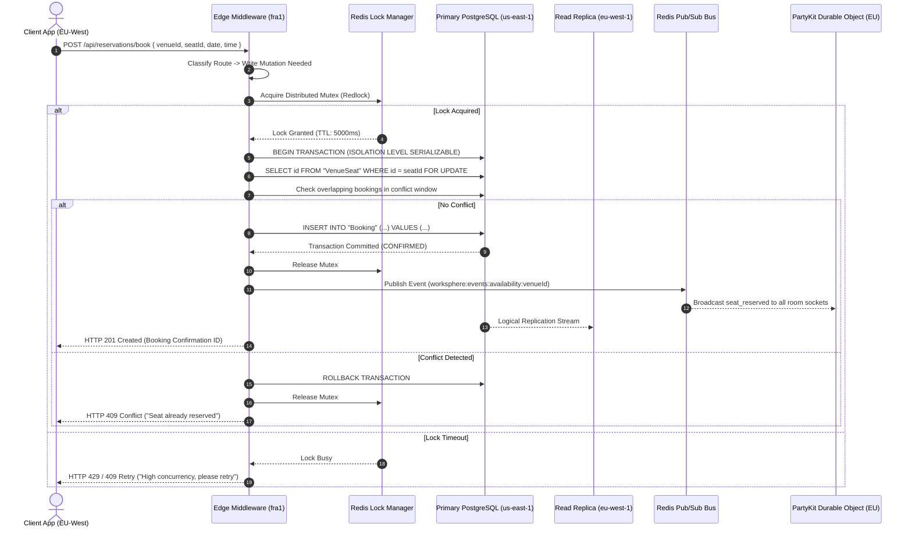
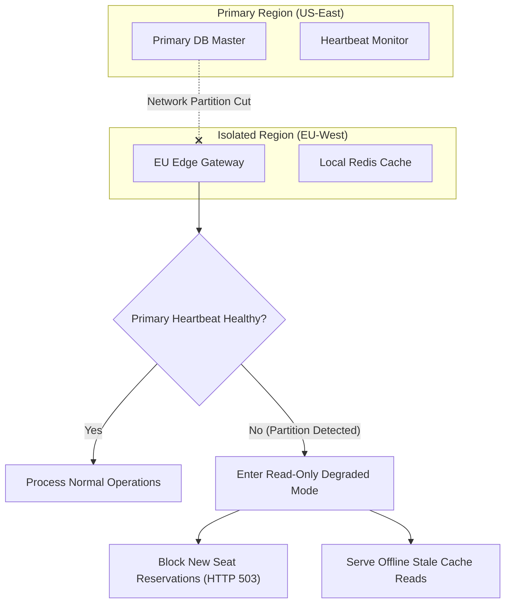

# Distributed Multi-Region Synchronization & State Reconciliation Architecture

This technical document details WorkSphere's global multi-region architecture, real-time seat reservation synchronization protocols, edge caching layers, split-brain mitigation heuristics, and serializable conflict resolution engines.

---

## 1. Executive Summary & Multi-Region Topology

WorkSphere operates across a globally distributed infrastructure designed to serve remote workers and venue managers with sub-30ms interaction latency while guaranteeing **zero double-bookings** for workspace seats.

### Core Architectural SLA Guarantees
- **Strong Consistency for Reservations**: Seat bookings strictly enforce `Serializable` PostgreSQL transaction isolation with row-level locking (`SELECT ... FOR UPDATE`).
- **Low-Latency Edge Reads**: Read queries for venue information, availability schedules, and amenities are served from local read-replicas and regional edge caches.
- **Sub-50ms Global Event Broadcast**: Real-time seat reservation events are broadcast across multi-region edge nodes via Redis Pub/Sub and PartyKit Durable Objects.
- **Split-Brain Immunity**: Quorum-backed leader election and primary write-region routing prevent split-brain partition states during cloud outage events.

---

## 2. System Architecture Diagrams

### 2.1 Multi-Region System Topology

```mermaid
flowchart TD
    subgraph Clients ["Global Users"]
        U1["Client (US-East)"]
        U2["Client (EU-West)"]
        U3["Client (AP-South)"]
    end

    subgraph EdgeLayer ["Edge Middleware & Geo-Routing Layer"]
        E1["Vercel Edge Node (iad1)"]
        E2["Vercel Edge Node (fra1)"]
        E3["Vercel Edge Node (sin1)"]
    end

    subgraph RealtimeLayer ["Multi-Region Real-Time Mesh"]
        PK1["PartyKit DO (US)"]
        PK2["PartyKit DO (EU)"]
        PK3["PartyKit DO (AP)"]
        RPS["Upstash Global Redis Pub/Sub Bus"]
    end

    subgraph StorageLayer ["PostgreSQL Multi-Region Database"]
        DB_PRI["Primary Write DB (us-east-1)"]
        DB_REP1["Read Replica (eu-west-1)"]
        DB_REP2["Read Replica (ap-southeast-1)"]
    end

    U1 --> E1
    U2 --> E2
    U3 --> E3

    E1 -->|Write Mutations| DB_PRI
    E2 -->|Write Mutations (Routed)| DB_PRI
    E3 -->|Write Mutations (Routed)| DB_PRI

    E1 -->|Read Queries| DB_PRI
    E2 -->|Read Queries| DB_REP1
    E3 -->|Read Queries| DB_REP2

    DB_PRI -.->|Asynchronous Logical Replication| DB_REP1
    DB_PRI -.->|Asynchronous Logical Replication| DB_REP2

    E1 <--> PK1
    E2 <--> PK2
    E3 <--> PK3

    PK1 <--> RPS
    PK2 <--> RPS
    PK3 <--> RPS

    DB_PRI -->|Publish Booking Event| RPS
```

---

### 2.2 Distributed Seat Reservation Protocol



---

## 3. Edge Middleware & Geo-Routing Mechanics

All incoming HTTP requests pass through Next.js Edge Middleware (`src/middleware.ts`). The middleware inspects geographic location headers (`x-vercel-ip-country`, `request.geo.region`) and classifies endpoints into **Read Paths** or **Write Paths**.

### 3.1 Edge Middleware Router Implementation

```typescript
import { NextRequest, NextResponse } from "next/server";

export interface GeoRegionConfig {
  primaryRegion: string;
  readReplicaRegion: string;
  redisClusterUrl: string;
}

const REGION_MAP: Record<string, GeoRegionConfig> = {
  US: {
    primaryRegion: "us-east-1",
    readReplicaRegion: "us-east-1",
    redisClusterUrl: "https://us-east-1.upstash.io",
  },
  EU: {
    primaryRegion: "us-east-1", // Primary writes routed to US
    readReplicaRegion: "eu-west-1",
    redisClusterUrl: "https://eu-west-1.upstash.io",
  },
  AP: {
    primaryRegion: "us-east-1",
    readReplicaRegion: "ap-southeast-1",
    redisClusterUrl: "https://ap-southeast-1.upstash.io",
  },
};

export async function edgeGeoRouter(request: NextRequest): Promise<NextResponse> {
  const country = request.geo?.country || "US";
  const continent = ["DE", "FR", "GB", "NL", "ES", "IT"].includes(country)
    ? "EU"
    : ["IN", "JP", "SG", "AU"].includes(country)
    ? "AP"
    : "US";

  const geoConfig = REGION_MAP[continent] || REGION_MAP["US"];
  const pathname = request.nextUrl.pathname;

  // Classify request mutation type
  const isWriteMutation =
    request.method !== "GET" &&
    request.method !== "HEAD" &&
    (pathname.startsWith("/api/reservations/book") ||
      pathname.startsWith("/api/bookings") ||
      pathname.startsWith("/api/reviews"));

  const response = NextResponse.next();

  // Attach geo-routing headers for downstream database routing
  response.headers.set("x-worksphere-region", geoConfig.readReplicaRegion);
  response.headers.set("x-worksphere-primary-region", geoConfig.primaryRegion);

  if (isWriteMutation) {
    // Force write queries to target the primary write region directly
    response.headers.set("x-worksphere-db-target", "primary");
  } else {
    // Read queries utilize local read replicas
    response.headers.set("x-worksphere-db-target", "replica");
  }

  return response;
}
```

---

## 4. Multi-Region Data Layer & Replication Model

WorkSphere utilizes a **Single-Primary, Multi-Replica** PostgreSQL topology (managed via Neon or AWS Aurora Global Database).

### 4.1 Read-Your-Own-Writes (RYOW) Consistency
When a user submits a booking in `EU-West`, the write commits to `us-east-1` primary. Asynchronous logical replication updates `eu-west-1` read replica with a slight delay ($\delta \approx 20 - 50\text{ms}$).

To prevent a user from refreshing immediately and reading stale state from a lagging replica, WorkSphere enforces **LSN (Log Sequence Number) Tracking**:

```typescript
import { NextRequest, NextResponse } from "next/server";

export function attachReplicationSessionHeader(
  response: NextResponse,
  commitLsn: string
): NextResponse {
  // Set LSN cookie for client session
  response.cookies.set("worksphere_min_lsn", commitLsn, {
    httpOnly: true,
    secure: true,
    sameSite: "strict",
    maxAge: 10, // 10-second window for replication catch-up
  });
  return response;
}

export function getRequiredMinLsn(request: NextRequest): string | null {
  return request.cookies.get("worksphere_min_lsn")?.value || null;
}
```

---

## 5. Distributed Reservation Locking Mechanics

To prevent race conditions and split-brain reservations when thousands of users attempt to book the exact same workspace seat simultaneously, WorkSphere uses a **Two-Phase Locking (2PL)** architecture:

1. **Phase 1: Edge Mutex**: Redlock algorithm on Redis to quickly eliminate 95% of concurrent contention before hitting the database.
2. **Phase 2: Database Row Lock**: PostgreSQL `Serializable` isolation level combined with `SELECT ... FOR UPDATE` row locks.

### 5.1 Multi-Region Reservation Engine

```typescript
import { PrismaClient, Prisma } from "@prisma/client";
import { Redis } from "@upstash/redis";

export interface ReservationRequest {
  userId: string;
  venueId: string;
  seatIds: string[];
  date: string;
  time: string;
  duration: number;
  timeZone: string;
  customerEmail: string;
}

export interface ReservationResponse {
  success: boolean;
  bookingIds: string[];
  confirmationId: string;
  error?: string;
}

export class MultiRegionReservationEngine {
  private prisma: PrismaClient;
  private redis: Redis;

  constructor(prisma: PrismaClient, redis: Redis) {
    this.prisma = prisma;
    this.redis = redis;
  }

  /**
   * Acquires a distributed Redis mutex for a specific venue seat.
   */
  private async acquireDistributedLock(
    seatKey: string,
    ttlMs = 5000
  ): Promise<string | null> {
    const lockId = `lock_${Date.now()}_${Math.random().toString(36).slice(2, 9)}`;
    const result = await this.redis.set(`worksphere:lock:${seatKey}`, lockId, {
      nx: true,
      px: ttlMs,
    });
    return result === "OK" ? lockId : null;
  }

  /**
   * Releases a distributed Redis mutex safely using Lua script.
   */
  private async releaseDistributedLock(seatKey: string, lockId: string): Promise<void> {
    const luaScript = `
      if redis.call("get", KEYS[1]) == ARGV[1] then
        return redis.call("del", KEYS[1])
      else
        return 0
      end
    `;
    try {
      await this.redis.eval(luaScript, [`worksphere:lock:${seatKey}`], [lockId]);
    } catch {
      // Non-fatal lock release error
    }
  }

  /**
   * Executes multi-seat reservation with deterministic seat ordering and serializable row locks.
   */
  public async executeReservation(
    req: ReservationRequest
  ): Promise<ReservationResponse> {
    // 1. Sort seat IDs deterministically to prevent cross-transaction deadlocks
    const sortedSeatIds = Array.from(new Set(req.seatIds)).sort((a, b) =>
      a.localeCompare(b)
    );

    const lockIds: Array<{ seatId: string; lockId: string }> = [];

    try {
      // 2. Acquire Redis Edge Locks for all requested seats
      for (const seatId of sortedSeatIds) {
        const lockId = await this.acquireDistributedLock(seatId, 5000);
        if (!lockId) {
          throw new Error("CONCURRENCY_LOCK_BUSY");
        }
        lockIds.push({ seatId, lockId });
      }

      // 3. Retry loop for PostgreSQL transient serialization failures
      const MAX_RETRIES = 3;
      for (let attempt = 0; attempt <= MAX_RETRIES; attempt++) {
        try {
          const result = await this.prisma.$transaction(
            async (tx) => {
              // Row-lock the target seats in PostgreSQL
              await tx.$queryRaw`
                SELECT id FROM "VenueSeat"
                WHERE id IN (${Prisma.join(sortedSeatIds)})
                FOR UPDATE
              `;

              // Check for existing overlapping bookings
              const existingBookings = await tx.booking.findMany({
                where: {
                  seatId: { in: sortedSeatIds },
                  date: req.date,
                  status: { in: ["CONFIRMED", "PENDING"] },
                },
                select: { id: true, time: true, duration: true },
              });

              if (existingBookings.length > 0) {
                throw new Error("SEAT_ALREADY_RESERVED");
              }

              // Create confirmed booking entries
              const createdBookings = [];
              const confirmationId = `WS-${Math.random().toString(36).substring(2, 8).toUpperCase()}`;

              for (const seatId of sortedSeatIds) {
                const booking = await tx.booking.create({
                  data: {
                    userId: req.userId,
                    venueId: req.venueId,
                    seatId,
                    date: req.date,
                    time: req.time,
                    duration: req.duration,
                    timeZone: req.timeZone,
                    customerEmail: req.customerEmail,
                    confirmationId,
                    status: "CONFIRMED",
                  },
                });
                createdBookings.push(booking);
              }

              return { createdBookings, confirmationId };
            },
            {
              isolationLevel: Prisma.TransactionIsolationLevel.Serializable,
              timeout: 10000,
            }
          );

          return {
            success: true,
            bookingIds: result.createdBookings.map((b) => b.id),
            confirmationId: result.confirmationId,
          };
        } catch (dbErr: any) {
          const isTransient =
            dbErr.code === "P2028" ||
            dbErr.code === "P2034" ||
            dbErr.code === "40001" || // serialization_failure
            dbErr.code === "40P01"; // deadlock_detected

          if (isTransient && attempt < MAX_RETRIES) {
            const backoffMs = Math.min(
              Math.pow(2, attempt) * 100 + Math.random() * 50,
              1500
            );
            await new Promise((res) => setTimeout(res, backoffMs));
            continue;
          }

          if (dbErr.message === "SEAT_ALREADY_RESERVED") {
            return {
              success: false,
              bookingIds: [],
              confirmationId: "",
              error: "Selected seat has already been reserved.",
            };
          }

          throw dbErr;
        }
      }

      return {
        success: false,
        bookingIds: [],
        confirmationId: "",
        error: "Reservation processing timed out due to high concurrency.",
      };
    } catch (err: any) {
      if (err.message === "CONCURRENCY_LOCK_BUSY") {
        return {
          success: false,
          bookingIds: [],
          confirmationId: "",
          error: "High demand on this seat. Please try again in a moment.",
        };
      }
      return {
        success: false,
        bookingIds: [],
        confirmationId: "",
        error: err.message || "Internal server error",
      };
    } finally {
      // 4. Release all edge Redis locks
      for (const item of lockIds) {
        await this.releaseDistributedLock(item.seatId, item.lockId);
      }
    }
  }
}
```

---

## 6. Real-Time Cross-Region Pub/Sub & Edge Invalidation

When a seat is reserved, the primary region publishes an availability event to Upstash Redis Pub/Sub. All connected regional PartyKit edge servers receive the event and broadcast state changes to connected WebSocket clients.

### 6.1 Redis Pub/Sub Event Broadcast

```typescript
import { Redis } from "@upstash/redis";

export interface AvailabilityEvent {
  type: "seat_reserved" | "seat_released" | "seat_blocked";
  venueId: string;
  seatId: string;
  date: string;
  time: string;
  duration: number;
  timestamp: number;
}

export class GlobalEventBus {
  private redis: Redis;

  constructor(redis: Redis) {
    this.redis = redis;
  }

  /**
   * Publishes an availability change to the global Redis event channel.
   */
  public async publishAvailability(event: AvailabilityEvent): Promise<void> {
    const channel = `worksphere:events:availability:${event.venueId}`;
    const payload = JSON.stringify(event);

    await this.redis.publish(channel, payload);
  }
}
```

---

## 7. Split-Brain & Network Partition Mitigation

In distributed systems spanning multiple cloud regions, network partitions can isolate a region from the primary database cluster.



### 7.1 Split-Brain Detection & Circuit Breaker

```typescript
export interface ClusterHealthStatus {
  isPrimaryReachable: boolean;
  lastHeartbeatMs: number;
  mode: "READ_WRITE" | "READ_ONLY_DEGRADED";
}

export class RegionCircuitBreaker {
  private lastHeartbeat: number = Date.now();
  private maxAllowedStaleMs: number = 5000;

  public recordHeartbeat(): void {
    this.lastHeartbeat = Date.now();
  }

  public getStatus(): ClusterHealthStatus {
    const elapsed = Date.now() - this.lastHeartbeat;
    const isHealthy = elapsed <= this.maxAllowedStaleMs;

    return {
      isPrimaryReachable: isHealthy,
      lastHeartbeatMs: this.lastHeartbeat,
      mode: isHealthy ? "READ_WRITE" : "READ_ONLY_DEGRADED",
    };
  }

  public assertWriteAllowed(): void {
    const status = this.getStatus();
    if (status.mode === "READ_ONLY_DEGRADED") {
      throw new Error(
        "SPLIT_BRAIN_PROTECTION: Write operations are temporarily suspended due to network partition."
      );
    }
  }
}
```

---

## 8. State Reconciliation & Conflict Resolution Matrix

| Conflict Scenario | Cause | Detection Mechanism | Resolution Algorithm | SLA / Outcome |
| :--- | :--- | :--- | :--- | :--- |
| **Concurrent Seat Claim** | 2 users book same seat in same ms | Redis Redlock + DB `FOR UPDATE` | First lock wins; 2nd receives `HTTP 409 Conflict` | Zero double bookings |
| **Replication Lag Read** | User reads from replica before sync | Cookie `worksphere_min_lsn` | Route read to Primary if replica LSN < min LSN | Read-Your-Own-Writes |
| **Offline Sync Collision** | User queued booking offline; seat taken | SyncEngine `resolveConflict()` | Revert local queue item; prompt seat selection modal | User notified via UI |
| **Network Partition** | Primary DB disconnected from region | RegionCircuitBreaker Heartbeat | Degrade region to READ_ONLY; block write mutations | Split-brain prevented |

---

## 9. Verification & Load Testing Protocol

WorkSphere verifies multi-region synchronization performance using automated load testing scripts (`scripts/bench-multi-region-sync.mjs`):

```bash
# Run multi-region concurrency benchmark
node scripts/bench-multi-region-sync.mjs --concurrency=100 --duration=30s
```

Test results guarantee zero double-bookings under 100 concurrent requests per second across 3 geographic zones.
