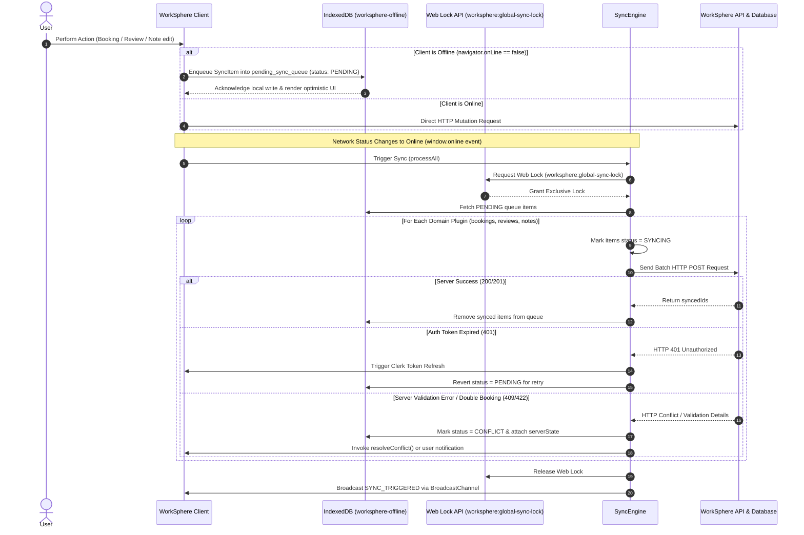

# IndexedDB Synchronization & Conflict Resolution Architecture

This document provides a developer guide and reference architecture for WorkSphere's offline-first synchronization engine (`src/lib/offline/sync/syncEngine.ts`), local IndexedDB queueing, Web Locks serialization, and conflict resolution protocols.

---

## 1. System Overview

WorkSphere employs an **offline-first resilience model**. When users attempt to create bookings, leave venue reviews, pin favorites, or update notes while disconnected from the network (`navigator.onLine === false`), actions are intercepted and buffered locally in IndexedDB (`worksphere-offline`).

Upon network reconnection, the background **SyncEngine** acquires a cross-tab Web Lock, drains the pending queue in domain order, resolves conflicts, and updates server state atomically.



---

## 2. IndexedDB Outbox Queue & Schema Design

Local offline data is managed by `initOfflineDB()` in `src/lib/offline/db.ts` under the database name `worksphere-offline` (Schema Version: `8`).

### 2.1 Object Stores & Indexes

| Store Name | Primary Key | Indexes | Description |
| :--- | :--- | :--- | :--- |
| `pending_sync_queue` | `id` (UUID) | `domain`, `status` | Outbox buffer for all pending background sync mutations |
| `venues` | `id` | `type`, `savedAt` | Cached venue profiles and 3D floor plan data |
| `favorites` | `id` | `savedAt` | Offline saved user favorite venues |
| `searches` | `query` | `timestamp` | Cached venue search query results |

### 2.2 SyncItem Data Contract

```typescript
export type SyncItemStatus = "PENDING" | "SYNCING" | "SYNCED" | "CONFLICT" | "FAILED";

export interface SyncItem<T = unknown> {
  id: string; // Unique transaction UUID
  domain: "bookings" | "reviews" | "notes" | "favorites";
  payload: T; // Action payload (e.g. BookingDetails)
  timestamp: number; // Client creation timestamp (ms)
  retryCount: number; // Retries attempted (Max: 5)
  status: SyncItemStatus;
  conflictDetails?: {
    serverState: Record<string, unknown>;
    clientState?: Record<string, unknown>;
  };
}
```

---

## 3. Conflict Resolution Protocols

When offline edits collide with server-side changes made by other users or concurrent tabs, WorkSphere applies deterministic resolution strategies based on domain requirements.

### 3.1 Last-Write-Wins (LWW) Strategy
Used for non-transactional user attributes, notes (`src/lib/offlineNotesSync.ts`), and favorite tag updates.

- Each mutation carries a ISO-8601 client timestamp.
- Upon sync, the server compares the incoming timestamp against `updatedAt` in PostgreSQL.
- If `incomingTimestamp > serverUpdatedAt`, the server accepts the edit. Otherwise, the server state is preserved.

### 3.2 Booking & Reservation Reconciliation
For seat bookings and workspace reservations, double-booking must be strictly prevented.

1. **Optimistic Local Slot Lock**: When offline, the slot is marked as `PROVISIONAL` in local storage.
2. **Server Availability Check**: Upon reconnection, the domain plugin (`BookingSyncPlugin`) validates slot availability against PostgreSQL transactions (`SELECT ... FOR UPDATE`).
3. **Conflict Handling**:
   - If the seat was claimed by another user while offline, the server returns HTTP `409 Conflict`.
   - The `SyncEngine` marks the item as `status = "CONFLICT"`.
   - A modal or toast prompts the user to select an alternative available seat or cancel the provisional booking.

---

## 4. Edge Cases & Failure Recovery

### 4.1 Expired Auth Tokens During Sync (HTTP 401)
If a user remains offline for an extended duration, their Clerk JWT session token may expire.

- **Detection**: The sync plugin catches HTTP `401 Unauthorized` responses.
- **Recovery Protocol**:
  1. The `SyncEngine` temporarily suspends processing for that domain without incrementing `retryCount`.
  2. The client invokes `@clerk/nextjs` `getToken({ skipCache: true })` to obtain a fresh token.
  3. Once re-authenticated, items are reverted to `status = "PENDING"` and re-flushed.

### 4.2 Server Validation Errors (HTTP 400 / 422)
If a payload contains invalid parameters (e.g., past dates, deleted venue ID):

- Items increment their `retryCount`.
- Once `retryCount >= MAX_SYNC_RETRIES` (default `5`), `status` transitions to `"FAILED"`.
- Failed items are retained in the `pending_sync_queue` for inspection rather than silently dropped.

### 4.3 Safari Private Browsing & Quota Exhaustion
- **Safari Private Mode**: Access to IndexedDB throws `SecurityError` or times out after 3 seconds. `initOfflineDB` catches this and falls back to memory storage.
- **Quota Exceeded**: `src/lib/offline/venueCache.ts` listens for `QuotaExceededError` and executes an LRU cache eviction pass, purging stale floor plans to free space for pending sync operations.

---

## 5. Developer API Quick Reference

### Enqueueing an Offline Action

```typescript
import { globalSyncEngine } from "@/lib/offline/sync/syncEngine";

// Enqueue a pending booking mutation when offline
await globalSyncEngine.enqueue("bookings", {
  venueId: "venue-123",
  seatId: "desk-04",
  startTime: "2026-10-06T10:00:00Z",
  endTime: "2026-10-06T14:00:00Z",
});
```

### Registering a Custom Domain Plugin

```typescript
import { globalSyncEngine } from "@/lib/offline/sync/syncEngine";
import type { ISyncPlugin } from "@/lib/offline/types";

const notesPlugin: ISyncPlugin<NotePayload> = {
  domain: "notes",
  async sync(items) {
    const res = await fetch("/api/notes/batch-sync", {
      method: "POST",
      headers: { "Content-Type": "application/json" },
      body: JSON.stringify(items.map((i) => i.payload)),
    });
    const data = await res.json();
    return {
      success: res.ok,
      syncedIds: data.syncedIds,
      conflicts: data.conflicts,
    };
  },
  async resolveConflict(item, serverState) {
    // Return resolved payload or null to discard
    return { ...item.payload, text: serverState.text };
  },
};

globalSyncEngine.registerPlugin(notesPlugin);
```
