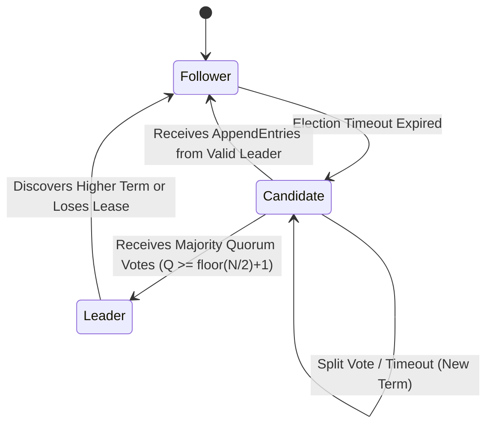
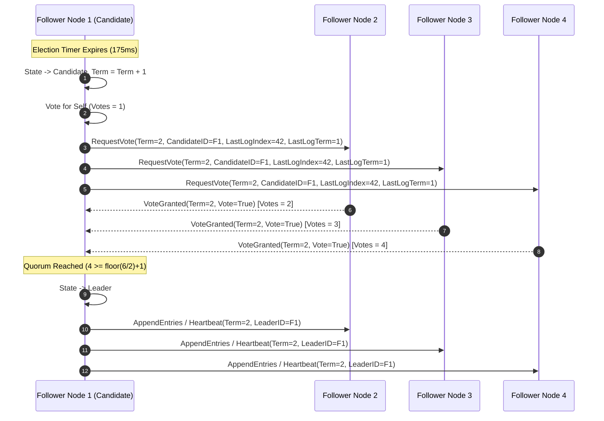

# PartyKit ConsensusProtocol & RegionRouter Mesh Consensus Mechanics

## 1. Architectural Executive Summary

WorkSphere operates a globally distributed real-time communication edge layer powered by **PartyKit** Durable Objects across regional edge hubs (`us-east`, `us-west`, `eu-west`, `eu-central`, `ap-south`, `ap-northeast`, `sa-east`). To guarantee strict consistency across seat bookings, presence indicators, spatial audio coordinates, and collaborative whiteboard states without sacrificing low-latency routing, WorkSphere employs a **Raft-inspired Consensus Protocol**, dynamic **Geolocation Region Routing**, active **Heartbeat Monitors**, and **State Replicators**.

```
+-----------------------------------------------------------------------------------+
|                              EDGE MESH ROUTING LAYER                              |
|                              (RegionRouter / Geo)                                 |
+--------------------------+--------------------------+-----------------------------+
                           |                          |
             +-------------v------------+  +----------v-------------+
             |    US-EAST REGION NODE   |  |    EU-CENTRAL NODE    |
             |   (Leader / Coordinator) |  |       (Follower)       |
             +-------------+------------+  +----------+-------------+
                           |                          |
                           +------------+-------------+
                                        |
                                        v
                       +---------------------------------+
                       |     INTER-SERVER EDGE MESH      |
                       |       (EdgeMeshSync / WAL)      |
                       +---------------------------------+
```

Key system objectives:
- **Sub-30ms Regional Routing:** Latency-optimized routing via IP headers (`CF-IPCountry`, `X-Vercel-IP-Country`) and spherical distance metrics.
- **Split-Brain Immunity:** Leader lease verification (`checkLeaderLease`) requiring active majority quorum acknowledgments before processing state mutations.
- **Conflict-Free State Replication:** CRDT-inspired state merge with Last-Write-Wins (LWW) resolution and state log replication.
- **Failover & Self-Healing:** Automated node eviction after $30,000\text{ms}$ heartbeat silence with binary exponential backoff reconnection.

---

## 2. Distributed Consensus Mechanics & Leader Election

The consensus protocol (`ConsensusProtocol.ts`) enforces a single authoritative coordinator node per cluster zone to serialise transactional state changes (such as seat reservations and lock acquisitions).

### 2.1 State Machine Roles

Each regional PartyKit node operates as a finite state machine occupying one of three roles:

1. **Follower:** Passive node that responds to `RequestVote` and `AppendEntries` RPCs from candidates and leaders.
2. **Candidate:** Active node conducting an election round upon detecting leader heartbeat timeout.
3. **Leader:** Authoritative node executing state updates, distributing state logs, and renewing leader leases.



### 2.2 Mathematical Formulations

#### 2.2.1 Majority Quorum Standard
To prevent split-brain scenarios and concurrent leader claims, any election or state commit requires explicit votes from a majority quorum $Q$ out of total active nodes $N$:

$$Q = \left\lfloor \frac{N}{2} \right\rfloor + 1$$

For a standard $6$-node global deployment ($N = 6$), the required majority quorum is:

$$Q = \left\lfloor \frac{6}{2} \right\rfloor + 1 = 4 \text{ nodes}$$

#### 2.2.2 Randomized Election Timeout
To minimize vote splitting where multiple candidates initiate elections simultaneously, election timeout intervals $T_{\text{elect}}$ are randomized per node:

$$T_{\text{elect}} \sim U(150\text{ms}, 300\text{ms})$$

Where $U(a, b)$ represents a uniform random variable between $150\text{ms}$ and $300\text{ms}$.

#### 2.2.3 Leader Lease Validation
A leader node retains write authorization only while its lease $T_{\text{lease}}$ remains valid. A lease is extended if the leader receives heartbeat acknowledgments from a majority quorum within the heartbeat threshold $T_{\text{hb\_timeout}}$:

$$T_{\text{lease}} = \max \left( \{ t_i \mid \text{Node } i \text{ acknowledged heartbeat} \} \right) + T_{\text{hb\_timeout}}$$

If $t_{\text{current}} > T_{\text{lease}}$, the leader immediately steps down to a `Follower` role and rejects incoming write operations.

---

## 3. Protocol Execution & Sequence Flows

### 3.1 Leader Election & Quorum Acquisition



---

## 4. Component Deep Dive

### 4.1 `ConsensusProtocol` (`src/party/mesh/ConsensusProtocol.ts` / `src/lib/edge/`)
Coordinates Raft state transitions, vote processing, and leader lease lifecycle:
- **`requestVote(candidateId, term, lastLogIndex, lastLogTerm)`:** Evaluates vote requests. Grants vote if `term > currentTerm` and candidate's log is at least as up-to-date as local log.
- **`appendEntries(leaderId, term, prevLogIndex, prevLogTerm, entries, leaderCommit)`:** Processes heartbeats and log entries. Updates local term and resets election timer upon receiving valid leader messages.
- **`checkLeaderLease()`:** Periodic check run by the leader every $300\text{ms}$. Counts active heartbeat acknowledgments from peers; if active count $< Q$, revokes leadership to prevent split-brain writes.

### 4.2 `RegionRouter` (`src/lib/edge/geoRouter.ts`)
Handles regional node selection and latency-based failover:
- **Header Parsing:** Evaluates incoming HTTP/WebSocket headers (`CF-IPCountry`, `X-Vercel-IP-Country`, `X-Country-Code`).
- **Country Table Lookup:** Direct mapping of ISO country codes to regional hubs (e.g., `IN` $\rightarrow$ `ap-south`, `DE` $\rightarrow$ `eu-central`, `US` $\rightarrow$ `us-east`).
- **Spherical Haversine Distance Fallback:** Computes surface distance for unmapped geographic points:

$$d = 2R \arcsin \left( \sqrt{ \sin^2\left(\frac{\Delta \phi}{2}\right) + \cos(\phi_1)\cos(\phi_2)\sin^2\left(\frac{\Delta \lambda}{2}\right) } \right)$$

where $R = 6371\text{ km}$, $\phi$ is latitude, and $\lambda$ is longitude.

- **Dynamic Health Weighting:** Adjusts routing preference based on monitored peer latency:

$$W_{\text{effective}} = W_{\text{base}} \times \left( \frac{100}{\max(10, \text{Latency}_{\text{ms}})} \right)$$

### 4.3 `HeartbeatMonitor` (`src/lib/edge/edgeMeshSync.ts`)
Manages periodic liveness checks and failure detection across peer connections:
- **Ping Frequency:** Dispatches `mesh_heartbeat` messages every $10,000\text{ms}$ ($10\text{s}$).
- **Stale Peer Detection:** Evaluates peer timestamps during pruning sweeps. If $\Delta t = t_{\text{current}} - t_{\text{last\_heartbeat}} > 30,000\text{ms}$, the peer is marked inactive and socket connections are terminated (`1001 Peer timed out`).
- **Exponential Backoff Reconnection:** Reconnection attempts follow binary exponential backoff:

$$D_k = D_{\text{base}} \times 2^{k-1} = 1000\text{ms} \times 2^{k-1}$$

capped at $k_{\text{max}} = 5$ attempts ($16,000\text{ms}$ max delay).

### 4.4 `StateReplicator` (`src/lib/edge/stateSync.ts`)
Executes cross-region durable state replication and conflict resolution:
- **CRDT Merge Protocol:** Merges venue presence maps (`CrossRegionState`) across regions using Last-Write-Wins (LWW) based on UTC timestamps ($t_{\text{update}}$).
- **Presence Stale Sweeps:** Automatically purges inactive presence records where $t_{\text{current}} - t_{\text{last\_update}} > 30,000\text{ms}$.
- **Sync Schedule:** Dispatches full state snapshot payloads (`mesh_state_sync`) every $5,000\text{ms}$ ($5\text{s}$) across all connected regional peers.

---

## 5. Summary Configuration Matrix

| Parameter | Configuration Property | Default Value | Description |
| :--- | :--- | :--- | :--- |
| **Quorum Threshold** | `majorityQuorum` | $\lfloor N/2 \rfloor + 1$ | Minimum votes required for election win and write commits |
| **Election Timeout** | `electionTimeoutMs` | $150\text{ms} - 300\text{ms}$ | Randomized timeout interval triggering election candidate state |
| **Heartbeat Interval** | `heartbeatIntervalMs` | $10,000\text{ms}$ | Frequency of liveness ping broadcasts |
| **Sync Broadcast** | `syncIntervalMs` | $5,000\text{ms}$ | Frequency of cross-region state sync payloads |
| **Peer Timeout** | `peerTimeoutMs` | $30,000\text{ms}$ | Maximum allowed silence before considering a peer dead |
| **Max Reconnect Attempts** | `maxReconnectAttempts` | $5$ attempts | Maximum consecutive reconnection tries before marking unreachable |
| **Base Reconnect Delay** | `reconnectBaseDelayMs` | $1,000\text{ms}$ | Initial delay multiplier for exponential backoff |
| **Presence TTL** | `PRESENCE_TTL_MS` | $30,000\text{ms}$ | Maximum lifetime of un-refreshed user presence records |
