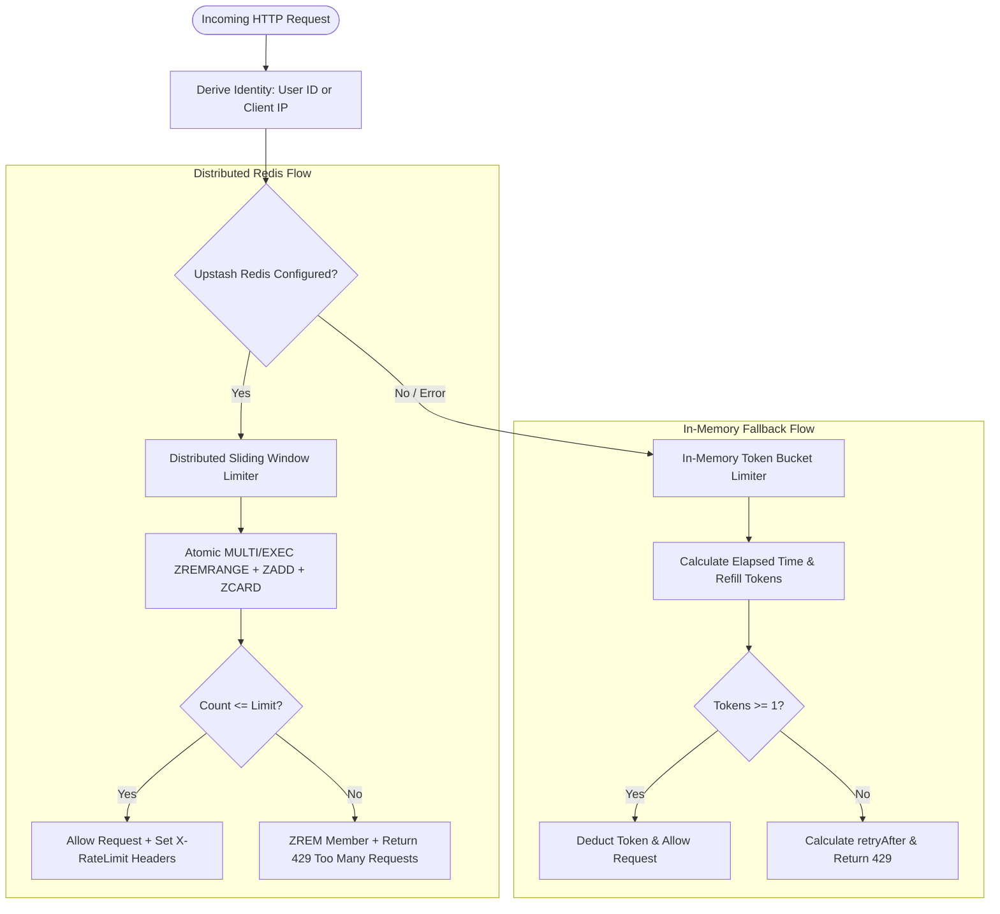

# Rate Limiting Strategies: In-Memory Token Bucket vs. Distributed Redis Sliding Window

## Overview

WorkSphere protects public endpoints, authentication pathways, and AI inference services from denial-of-service (DoS), brute-force attempts, and noisy-neighbor quota exhaustion using dual-tiered rate limiting strategies.

The rate limiting engine combines:
1. **In-Memory Token Bucket Limiters (`TokenBucketLimiter` & `MemoryRateLimitStore`)**: Zero-latency, thread-local, burst-tolerant limiting ideal for single-node development, testing, and edge workers.
2. **Distributed Redis Sliding Window Limiters (`upstashRateLimit` & Upstash `@upstash/ratelimit`)**: Multi-region, cluster-wide consistent rate limiting backed by Upstash Redis REST/TCP transactions (`MULTI`/`EXEC` and Lua scripts).

This architectural reference details mathematical formulas, data store tradeoffs, atomic execution scripts, route-level integration patterns, and middleware configurations.

---

## 1. Algorithm Comparison: Token Bucket vs. Sliding Window



### High-Level Comparison Table

| Dimension | In-Memory Token Bucket | Distributed Redis Sliding Window |
| :--- | :--- | :--- |
| **Primary Use Case** | Burst-tolerant requests, local dev, offline fallback, AI generation | Exact quota enforcement, global auth routes, billing APIs |
| **Storage Engine** | In-Memory JavaScript `Map` with LRU eviction | Upstash Redis Sorted Sets (`ZSET`) |
| **Burst Behavior** | Accommodates bursts up to bucket capacity ($C$) | Smooth window; strict ceiling over moving duration ($T$) |
| **Latency Overhead** | $< 0.05\text{ ms}$ (memory read/write) | $\sim 5\text{--}25\text{ ms}$ (Redis REST/TCP round-trip) |
| **Multi-Node Sync** | No (isolated per worker/process instance) | Yes (synchronized across all serverless/edge containers) |
| **Memory Footprint** | Capped by LRU threshold (`MAX_MEM_ENTRIES = 10,000`) | Managed by Redis key TTL expiry |

---

## 2. In-Memory Token Bucket Mechanics (`src/lib/rateLimit/limiters/tokenBucketLimiter.ts`)

The token bucket algorithm regulates traffic by maintaining a virtual bucket of tokens replenished continuously over time.

### 2.1 Mathematical Formulas

1. **Token Refill Calculation:**
   Given elapsed time $\Delta t = t_{\text{now}} - t_{\text{lastRefill}}$:

   $$\text{refillTokens} = \left(\frac{\Delta t}{\text{windowMs}}\right) \times \text{limit}$$

2. **Bucket Capacity Cap:**

   $$\text{tokens}_{\text{current}} = \min\left(\text{maxTokens}, \text{tokens}_{\text{previous}} + \text{refillTokens}\right)$$

3. **Token Consumption & Burst Allowance:**
   If $\text{tokens}_{\text{current}} \ge \text{pointsRequested}$:
   - Consume: $\text{tokens}_{\text{current}} \leftarrow \text{tokens}_{\text{current}} - \text{pointsRequested}$
   - Request allowed.
   - *Burst Allowance:* A client that has been idle can immediately execute up to $\text{maxTokens}$ requests without being throttled.

4. **Retry Delay when Depleted:**
   When tokens $< \text{pointsRequested}$, the wait time until the next token becomes available is:

   $$\text{timeToNextTokenMs} = \left\lceil \frac{1 - \text{tokens}}{\text{limit}} \times \text{windowMs} \right\rceil$$

   $$\text{retryAfter} = \max\left(1, \left\lceil \frac{\text{timeToNextTokenMs}}{1000} \right\rceil\right)$$

### 2.2 In-Memory LRU Memory Eviction (`MemoryRateLimitStore`)

To prevent unbounded memory consumption from millions of unique IP addresses, `MemoryRateLimitStore` implements LRU pruning:

```typescript
if (this.tokenBucketStore.size >= this.maxEntries) {
  // Prune expired entries first
  this.cleanupExpired();
  // Evict oldest inserted key if still exceeding capacity
  while (this.tokenBucketStore.size >= this.maxEntries) {
    const oldestKey = this.tokenBucketStore.keys().next().value;
    if (oldestKey === undefined) break;
    this.tokenBucketStore.delete(oldestKey);
  }
}
```

---

## 3. Distributed Redis Sliding Window Mechanics (`src/lib/rateLimit.ts`)

For distributed serverless deployments across Vercel and Cloudflare, WorkSphere leverages Upstash Redis Sorted Sets (`ZSET`).

### 3.1 Sliding Window Atomic Execution

Rather than using fixed window buckets (which suffer from $2\times$ boundary bursts at the edge of each window), WorkSphere maintains exact sliding logs using atomic `MULTI`/`EXEC` pipelines:

```typescript
const now = Date.now();
const windowStart = now - windowMs;
const windowSeconds = Math.ceil(windowMs / 1000);
const key = `worksphere:ratelimit:${identifier}`;
const member = `${now}:${Math.random().toString(36).slice(2, 10)}`;

const tx = redis.multi();
// 1. Remove timestamps outside the active sliding window
tx.zremrangebyscore(key, 0, windowStart);
// 2. Add current request timestamp
tx.zadd(key, { score: now, member });
// 3. Count remaining requests in the window
tx.zcard(key);
// 4. Reset TTL on the Redis key
tx.expire(key, windowSeconds);

const result = await tx.exec();
const count = Number(result?.[2] ?? 0);

if (count > limit) {
  // Over quota: roll back current member and reject
  await redis.zrem(key, member);
  return false;
}
return true;
```

---

## 4. Rate Limit Tiers & Configurations

WorkSphere organizes access into 5 hierarchical tiers (`src/lib/rateLimit.ts`):

```typescript
export const TIER_CONFIGS = {
  anonymous: {
    limit: 20,
    windowMs: 60_000,
    windowDuration: "1 m",
    description: "Unauthenticated IP addresses",
  },
  free: {
    limit: 60,
    windowMs: 60_000,
    windowDuration: "1 m",
    description: "Authenticated standard users",
  },
  pro: {
    limit: 200,
    windowMs: 60_000,
    windowDuration: "1 m",
    description: "Pro workspace members",
  },
  enterprise: {
    limit: 1000,
    windowMs: 60_000,
    windowDuration: "1 m",
    description: "Enterprise tier / partner APIs",
  },
  internal: {
    limit: 5000,
    windowMs: 60_000,
    windowDuration: "1 m",
    description: "Internal microservices and webhooks",
  },
} as const;
```

---

## 5. API Route Implementation Example

### Protecting an API Route (`src/app/api/example/route.ts`)

```typescript
import { NextResponse } from "next/server";
import { 
  checkTieredRateLimit, 
  createRateLimitResponse, 
  applyRateLimitHeaders 
} from "@/lib/rateLimit";

export async function POST(req: Request) {
  // 1. Evaluate rate limit based on caller session/IP
  const rateCheck = await checkTieredRateLimit(req, {
    namespace: "venue-booking",
  });

  // 2. Check if limit exceeded
  if (!rateCheck.allowed) {
    return createRateLimitResponse(rateCheck);
  }

  // 3. Perform business logic
  const payload = { success: true, timestamp: Date.now() };

  // 4. Attach standard headers (X-RateLimit-Limit, X-RateLimit-Remaining)
  const response = NextResponse.json(payload);
  return applyRateLimitHeaders(response, rateCheck);
}
```

---

## 6. Next.js Middleware Protection Example (`src/middleware.ts`)

```typescript
import { NextResponse } from "next/server";
import type { NextRequest } from "next/server";
import { rateLimit, getClientIp } from "@/lib/rateLimit";

export async function middleware(req: NextRequest) {
  const { pathname } = req.nextUrl;

  // Protect sensitive endpoints: Auth, OTP, Passkeys
  if (pathname.startsWith("/api/auth/passkey")) {
    const ip = getClientIp(req);
    const allowed = await rateLimit(`auth:${ip}`, 10, 60_000); // 10 requests / minute

    if (!allowed) {
      return NextResponse.json(
        { error: "Too many authentication attempts. Please wait 60 seconds." },
        { 
          status: 429, 
          headers: { 
            "Retry-After": "60",
            "Content-Type": "application/json"
          } 
        }
      );
    }
  }

  return NextResponse.next();
}

export const config = {
  matcher: ["/api/:path*"],
};
```

---

## 7. HTTP Response Headers Standard

Every rate-limited endpoint provides standard diagnostic headers:

| Header | Example | Description |
| :--- | :--- | :--- |
| `X-RateLimit-Limit` | `60` | Maximum requests permitted within the evaluation window. |
| `X-RateLimit-Remaining` | `42` | Requests remaining for the current identity in the active window. |
| `Retry-After` | `18` | Seconds the client must wait before sending another request (returned on HTTP 429). |
