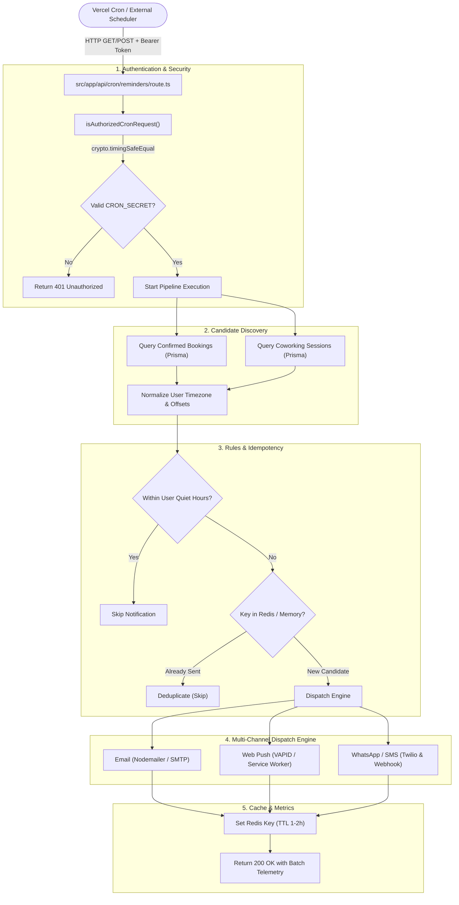
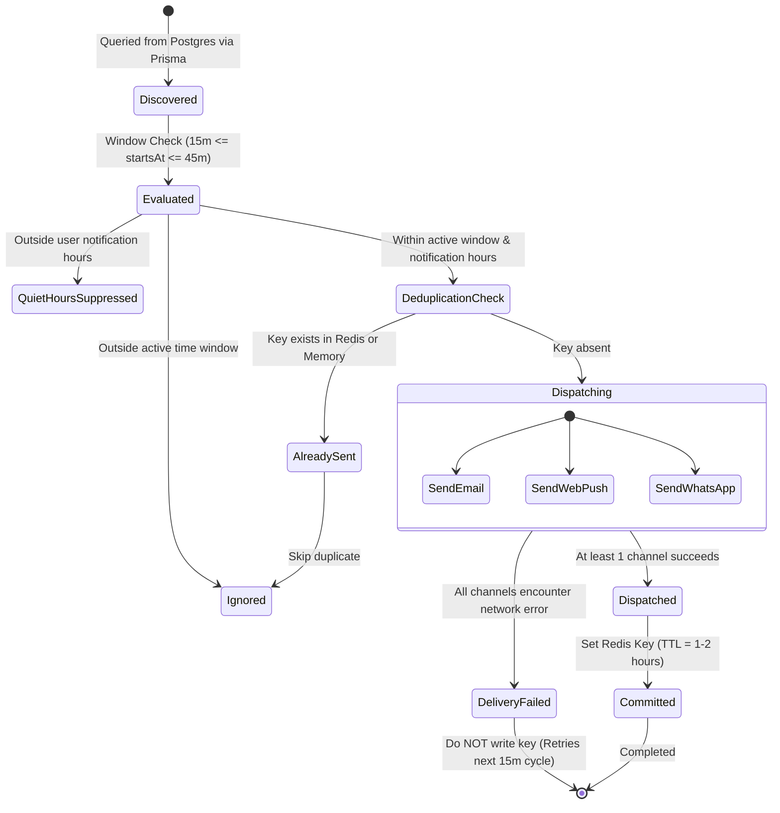

# Architecture Guide: Automated Background Reminder Scheduler & Notification Dispatch Pipeline

## 1. Executive Summary & Architecture Overview

WorkSphere relies on a background cron execution pipeline to deliver time-critical reminders to workspace occupants and coworking session attendees. Scheduled reminders significantly reduce reservation no-shows, improve desk utilization turnover, and provide attendees with transit directions and check-in credentials prior to session start times.

The reminder pipeline is implemented in [`src/app/api/cron/reminders/route.ts`](file:///c:/Users/admin/Desktop/workfere/src/app/api/cron/reminders/route.ts) with supporting business logic distributed across [`src/lib/reminderCron.ts`](file:///c:/Users/admin/Desktop/workfere/src/lib/reminderCron.ts), [`src/lib/cronAuth.ts`](file:///c:/Users/admin/Desktop/workfere/src/lib/cronAuth.ts), and the unified notification subsystem [`src/lib/notifications/dispatcher.ts`](file:///c:/Users/admin/Desktop/workfere/src/lib/notifications/dispatcher.ts).

### End-to-End Pipeline Workflow:
1. **Periodic Invocation:** Triggered every 15 minutes by an external scheduler (e.g., Vercel Cron, Kubernetes CronJob, or GitHub Actions).
2. **Timing-Safe Authentication:** Request headers are inspected for `Authorization: Bearer <CRON_SECRET>` using constant-time cryptographic comparison (`timingSafeEqual`) to prevent timing attack vulnerabilities.
3. **Database Candidate Querying:** Queries Postgres via Prisma for upcoming desk bookings (starting in 15–45 minutes) and coworking community sessions (starting within 30 minutes).
4. **Timezone Normalization:** Evaluates starting timestamps against each attendee's localized IANA timezone (`user.timezone`) and respects individual quiet hours (`notificationStart` to `notificationEnd`).
5. **Distributed Deduplication:** Queries Redis distributed cache for idempotency keys (`booking-reminder:<id>` and `session-reminder:<session>:<user>`) with automatic in-memory fallback.
6. **Multi-Channel Dispatch:** Broadcasts alerts across Email (Nodemailer/SMTP), Web Push (VAPID via Service Workers), and WhatsApp/SMS (Twilio and custom webhooks).
7. **Idempotency Finalization & Telemetry:** Sets Redis TTL keys upon successful dispatch and outputs structured diagnostic metrics.



---

## 2. Cron Schedule Frequency & API Authorization

### 2.1 Schedule Cadence

The reminder worker is scheduled to run every 15 minutes (`*/15 * * * *`). This frequency provides an optimal balance between notification timeliness, database workload, and cloud execution budget:

| Parameter | Configuration | Rationale |
| :--- | :--- | :--- |
| **Cron Expression** | `*/15 * * * *` | Fires at :00, :15, :30, and :45 of every hour. |
| **Lookahead Window** | 15–45 minutes (`targetMin` to `targetMax`) | Ensures reservations starting at any arbitrary time are caught in at least two cron execution sweeps while preventing spam via Redis deduplication. |
| **Max Duration** | `export const maxDuration = 60` | Caps Next.js / Vercel Serverless Function execution to 60 seconds to avoid hung socket leaks. |
| **Dynamic Execution** | `export const dynamic = "force-dynamic"` | Prohibits Next.js static page optimization or route caching. |
| **HTTP Methods** | `GET` and `POST` | Vercel Cron sends HTTP `GET`; external enterprise schedulers typically issue `POST`. Both invoke the unified `run()` handler. |

### 2.2 Vercel Cron Configuration (`vercel.json`)

To register the recurring task on Vercel infrastructure, the repository root specifies:

```json
{
  "crons": [
    {
      "path": "/api/cron/reminders",
      "schedule": "*/15 * * * *"
    }
  ]
}
```

### 2.3 API Authorization & Timing-Safe Validation

To prevent unauthorized third parties from triggering notification floods or enumerating customer reservations, the cron endpoint enforces strict token authentication via [`src/lib/cronAuth.ts`](file:///c:/Users/admin/Desktop/workfere/src/lib/cronAuth.ts):

```typescript
import { timingSafeEqual } from "crypto";

export function isAuthorizedCronRequest(req: Request): boolean {
  const secret = process.env.CRON_SECRET;
  if (!secret) {
    // Allows local development execution without configuring secrets;
    // fails closed in production.
    return process.env.NODE_ENV !== "production";
  }

  const header = req.headers.get("authorization") ?? "";
  const expected = `Bearer ${secret}`;
  const a = Buffer.from(header);
  const b = Buffer.from(expected);
  
  // Guard against variable-length inputs before running timingSafeEqual
  return a.length === b.length && timingSafeEqual(a, b);
}
```

#### Security Attributes:
*   **Constant-Time Evaluation:** Standard string equality (`===`) short-circuits on the first mismatched byte, creating timing leaks that allow adversaries to guess tokens character-by-character. `crypto.timingSafeEqual` enforces equal evaluation latency regardless of where character discrepancies occur.
*   **Fail-Closed Production Security:** In production (`NODE_ENV === "production"`), if `CRON_SECRET` is unset, the handler immediately refuses all requests with `401 Unauthorized`.
*   **Local Developer Ergonomics:** Outside production, requests without a secret are permitted to facilitate automated testing and manual curl verification without managing environment secrets.

---

## 3. Database Query Architecture & Timezone Localization

### 3.1 Multi-Day UTC Boundary Expansion

Because WorkSphere supports remote professionals across global time zones, a reservation booked for "October 9th at 09:00 AM" in Tokyo (UTC+9) corresponds to "October 8th at 00:00 UTC". 

To prevent querying errors caused by timezone date boundaries, the reservation loader in [`src/lib/reminderCron.ts`](file:///c:/Users/admin/Desktop/workfere/src/lib/reminderCron.ts) queries a 3-day sliding window:

```typescript
const day = 24 * 60 * 60 * 1000;
const candidateDates = [
  isoDate(new Date(now.getTime() - day)), // Previous UTC day
  isoDate(now),                          // Current UTC day
  isoDate(new Date(now.getTime() + day)), // Next UTC day
];

const bookings = await prisma.booking.findMany({
  where: {
    date: { in: candidateDates },
    status: "CONFIRMED",
  },
  include: {
    user: true,
    venue: true,
  },
});
```

### 3.2 Timezone Conversion & Booking Start Calculation

Once raw candidates are loaded, `bookingStartsAt(booking, booking.user?.timezone)` maps the stored date string (`YYYY-MM-DD`) and time string (`HH:MM`) into an exact JavaScript `Date` instance evaluated in the user's explicit timezone.

```typescript
const targetMin = now.getTime() + 15 * 60 * 1000; // +15 mins
const targetMax = now.getTime() + 45 * 60 * 1000; // +45 mins

const startsAt = bookingStartsAt(booking, booking.user?.timezone);
if (!startsAt) continue;

// Verify booking falls within the active dispatch horizon
if (startsAt.getTime() < targetMin || startsAt.getTime() > targetMax) {
  continue;
}
```

---

## 4. User Notification Window & Quiet Hours Filtering

Users can define personalized daily quiet hours in their settings (e.g., Do Not Disturb between 22:00 and 07:00). WorkSphere filters candidates through [`src/lib/notificationWindow.ts`](file:///c:/Users/admin/Desktop/workfere/src/lib/notificationWindow.ts):

```typescript
export function isWithinNotificationWindow(
  now: Date,
  notificationStart?: string | null, // e.g., "08:00"
  notificationEnd?: string | null,   // e.g., "21:00"
  userTimezone?: string | null       // e.g., "America/New_York"
): boolean {
  if (!notificationStart || !notificationEnd) return true;

  // Convert `now` to user's localized HH:MM
  const userLocalTime = getMinutesSinceMidnight(now, userTimezone || "UTC");
  const startMinutes = parseTimeString(notificationStart);
  const endMinutes = parseTimeString(notificationEnd);

  if (startMinutes <= endMinutes) {
    // Normal window: e.g. 08:00 to 20:00
    return userLocalTime >= startMinutes && userLocalTime <= endMinutes;
  } else {
    // Overnight window: e.g. 21:00 to 06:00
    return userLocalTime >= startMinutes || userLocalTime <= endMinutes;
  }
}
```

If the cron runs while the recipient is outside their permitted notification window, the message is skipped for that execution cycle without recording an idempotency key. If the session begins during quiet hours, users are shielded from disruptive sounds or alerts.

---

## 5. Duplicate Notification Prevention & State Machine

Because the cron runs every 15 minutes and checks a 30-minute window (15m to 45m ahead), a reservation is eligible for pickup during at least two consecutive cron executions. Distributed deduplication guarantees each reminder is delivered exactly once.

### 5.1 Deduplication Keys & TTL Lifecycle

| Resource Type | Idempotency Key Format | Redis TTL | Rationale |
| :--- | :--- | :--- | :--- |
| **Desk Booking** | `booking-reminder:${booking.id}` | 7,200 sec (2 hours) | Prevents re-dispatch on subsequent runs; expires after booking has begun. |
| **Coworking Session** | `session-reminder:${session.id}:${person.id}` | 3,600 sec (1 hour) | Scoped per attendee; guarantees host and RSVP members receive exactly 1 alert. |

### 5.2 Two-Tier Storage (Redis + In-Memory Fallback)

To ensure zero downtime during Redis cold starts, failovers, or local test environments, the system employs a two-tier strategy:

```typescript
// Fallback in-memory map for single-instance or serverless cold executions
const sentInMemory = new Map<string, number>();

async function wasSent(key: string, redisClient?: ReturnType<typeof getRedis>): Promise<boolean> {
  const redis = redisClient !== undefined ? redisClient : getRedis();
  if (redis) {
    try {
      return Boolean(await redis.get(key));
    } catch {
      // Fall through to memory fallback on connection error
    }
  }
  const expiresAt = sentInMemory.get(key);
  return expiresAt !== undefined && expiresAt > Date.now();
}

async function markSent(key: string, ttlSeconds: number, redisClient?: ReturnType<typeof getRedis>): Promise<void> {
  const redis = redisClient !== undefined ? redisClient : getRedis();
  if (redis) {
    try {
      await redis.set(key, "sent", { ex: ttlSeconds });
      return;
    } catch {
      // Fall through to memory
    }
  }
  sentInMemory.set(key, Date.now() + ttlSeconds * 1000);
}
```

### 5.3 Reminder State Machine



---

## 6. Multi-Channel Reminder Dispatch Architecture

WorkSphere broadcasts alerts across three core channels, managed through direct handlers and the [`NotificationDispatcher`](file:///c:/Users/admin/Desktop/workfere/src/lib/notifications/dispatcher.ts) hub.

### 6.1 Channel 1: Email Dispatch (Nodemailer / SMTP)

Emails provide rich graphical details, directions, and direct access links.

```typescript
function createMailer(): Transporter | null {
  const { SMTP_USER, SMTP_PASS } = process.env;
  if (!SMTP_USER || !SMTP_PASS) return null;
  return nodemailer.createTransport({
    host: process.env.SMTP_HOST || "smtp.gmail.com",
    port: parseInt(process.env.SMTP_PORT || "587"),
    secure: process.env.SMTP_SECURE === "true",
    auth: { user: SMTP_USER, pass: SMTP_PASS },
  });
}
```

#### Email Security & Formatting Features:
*   **HTML Escaping:** All user-supplied strings (`person.firstName`, `session.title`, `venue.name`, `venue.address`) are sanitized using `escapeHtml()` to eliminate HTML injection and cross-site scripting in email clients.
*   **Deep Links:**
    *   **Venue Overview:** `https://worksphere.app/venues/{venueId}`
    *   **Google Maps Transit:** `https://www.google.com/maps/dir/?api=1&destination={latitude},{longitude}`

### 6.2 Channel 2: Web Push Notifications (VAPID / Service Workers)

Web Push alerts reach users on desktop and mobile browsers even when the WorkSphere browser tab is closed.

*   **VAPID Configuration:** Configured in [`src/lib/notifications/channels/webPushChannel.ts`](file:///c:/Users/admin/Desktop/workfere/src/lib/notifications/channels/webPushChannel.ts) using `web-push`:
    *   `NEXT_PUBLIC_VAPID_PUBLIC_KEY`
    *   `VAPID_PRIVATE_KEY`
    *   `VAPID_SUBJECT` (e.g., `mailto:admin@worksphere.app`)
*   **Payload Shape:**
    ```json
    {
      "title": "Upcoming Workspace Reservation",
      "body": "Your desk at Tech Hub Central starts in 30 minutes.",
      "icon": "/icons/icon-192x192.png",
      "badge": "/icons/badge-72x72.png",
      "data": {
        "url": "/dashboard/reservations/res_12345",
        "bookingId": "res_12345"
      }
    }
    ```
*   **Stale Subscription Cleanup:** When the push endpoint returns HTTP `410 Gone` or `404 Not Found`, the worker flags the push endpoint as expired in the database to prevent futile outbound network requests.

### 6.3 Channel 3: WhatsApp & SMS Dispatch (Twilio & Webhook)

For users who opt into SMS alerts (`person.smsAlertsEnabled = true`), mobile messaging provides instant offline connectivity:

```typescript
function createSmsClient() {
  const { TWILIO_ACCOUNT_SID, TWILIO_AUTH_TOKEN, TWILIO_PHONE_NUMBER } = process.env;
  if (!TWILIO_ACCOUNT_SID || !TWILIO_AUTH_TOKEN || !TWILIO_PHONE_NUMBER) {
    return null;
  }
  return twilio(TWILIO_ACCOUNT_SID, TWILIO_AUTH_TOKEN);
}
```

Additionally, [`src/lib/notifications/channels/whatsAppChannel.ts`](file:///c:/Users/admin/Desktop/workfere/src/lib/notifications/channels/whatsAppChannel.ts) handles customer-configured webhook integration (`whatsappWebhookUrl`), delivering structured JSON payloads containing session start alerts and check-in QR codes.

---

## 7. Error Handling, Resilience & Telemetry

### 7.1 Fault Isolation via `Promise.allSettled`

Channel failures must never cascade or abort the entire batch. If an external SMS gateway fails or a user's email server rejects a connection, remaining notifications continue uninterrupted:

```typescript
const settled = await Promise.allSettled(
  names.map((name) => this.dispatch(name, message))
);
```

### 7.2 Structured API Response Telemetry

Upon completion, the endpoint returns a structured summary consumed by cloud logging and monitoring dashboards:

```json
{
  "success": true,
  "timestamp": "2026-10-08T11:30:00.000Z",
  "bookingRemindersSent": 14,
  "sessionsProcessed": 5,
  "emailsSent": 22,
  "smsSent": 8
}
```

If an unhandled exception occurs, the endpoint logs the stack trace and responds with HTTP `500 Internal Server Error`, triggering alerting rules in Datadog or Vercel Monitoring.

---

## 8. Database Schema & Query Optimization

### 8.1 Target Prisma Schema Models

The reminder cron interacts primarily with the `Booking`, `CoworkingSession`, `User`, and `Venue` models:

```prisma
model Booking {
  id            String         @id @default(cuid())
  userId        String
  user          User           @relation(fields: [userId], references: [id])
  venueId       String
  venue         Venue          @relation(fields: [venueId], references: [id])
  date          String         // Format: YYYY-MM-DD
  time          String         // Format: HH:MM or HH:MM-HH:MM
  status        BookingStatus  @default(CONFIRMED)
  createdAt     DateTime       @default(now())

  @@index([date, status])
  @@index([userId, status])
}

model CoworkingSession {
  id            String         @id @default(cuid())
  hostId        String
  host          User           @relation("SessionHost", fields: [hostId], references: [id])
  venueId       String
  venue         Venue          @relation(fields: [venueId], references: [id])
  title         String
  slug          String         @unique
  startsAt      DateTime
  endsAt        DateTime
  rsvps         SessionRsvp[]

  @@index([startsAt])
}
```

### 8.2 Indexing Considerations

*   **Composite Index on `[date, status]`:** Guarantees index-only scan when filtering upcoming bookings across candidate dates. Avoids sequential table scans as reservation history grows past $10^5$ records.
*   **Index on `startsAt`:** Powers lightning-fast range queries (`startsAt > now AND startsAt <= soon`) for coworking sessions.

---

## 9. Automated Testing Harness & Recipes

Comprehensive unit testing verifies timing calculations, authorization checks, and channel failure isolation without sending real emails or SMS messages.

### 9.1 Unit Test Recipe: `cronAuth.test.ts`

```typescript
import { isAuthorizedCronRequest } from "@/lib/cronAuth";

describe("isAuthorizedCronRequest", () => {
  const originalEnv = process.env;

  beforeEach(() => {
    jest.resetModules();
    process.env = { ...originalEnv, CRON_SECRET: "test-secret-12345" };
  });

  afterAll(() => {
    process.env = originalEnv;
  });

  it("authorizes requests with matching Bearer token", () => {
    const req = new Request("http://localhost/api/cron/reminders", {
      headers: { authorization: "Bearer test-secret-12345" },
    });
    expect(isAuthorizedCronRequest(req)).toBe(true);
  });

  it("rejects requests with missing or invalid token", () => {
    const invalidReq = new Request("http://localhost/api/cron/reminders", {
      headers: { authorization: "Bearer wrong-secret" },
    });
    expect(isAuthorizedCronRequest(invalidReq)).toBe(false);

    const emptyReq = new Request("http://localhost/api/cron/reminders");
    expect(isAuthorizedCronRequest(emptyReq)).toBe(false);
  });
});
```

### 9.2 Unit Test Recipe: `reminderCron.test.ts` (Mocking Redis & Mailer)

```typescript
import { processUpcomingReservationAlerts } from "@/lib/reminderCron";
import { prisma } from "@/lib/prisma";
import nodemailer from "nodemailer";

jest.mock("@/lib/prisma", () => ({
  prisma: {
    booking: { findMany: jest.fn() },
  },
}));

jest.mock("nodemailer");

describe("processUpcomingReservationAlerts", () => {
  const mockSendMail = jest.fn().mockResolvedValue(true);

  beforeEach(() => {
    jest.clearAllMocks();
    (nodemailer.createTransport as jest.Mock).mockReturnValue({
      sendMail: mockSendMail,
    });
    process.env.SMTP_USER = "test@worksphere.app";
    process.env.SMTP_PASS = "test-pass";
  });

  it("dispatches email alert for bookings starting in 30 minutes", async () => {
    const fakeNow = new Date("2026-10-08T10:00:00.000Z");
    
    (prisma.booking.findMany as jest.Mock).mockResolvedValue([
      {
        id: "book-1",
        date: "2026-10-08",
        time: "10:30",
        customerEmail: "user@example.com",
        status: "CONFIRMED",
        user: { firstName: "Alex", timezone: "UTC" },
        venue: { id: "v1", name: "Downtown Loft", latitude: 37.77, longitude: -122.41 },
      },
    ]);

    const result = await processUpcomingReservationAlerts(fakeNow);
    expect(result.sent).toBe(1);
    expect(mockSendMail).toHaveBeenCalledWith(
      expect.objectContaining({
        to: "user@example.com",
        subject: expect.stringContaining("Downtown Loft"),
      })
    );
  });
});
```

---

## 10. Operational Runbook & Production Incident Response

### 10.1 Diagnostic Runbook Table

| Alert / Symptom | Root Cause | Immediate Action |
| :--- | :--- | :--- |
| **HTTP 401 Unauthorized** | Missing/mismatched `CRON_SECRET` in caller headers. | Cross-check Vercel environment variable `CRON_SECRET` against GitHub Actions / external scheduler config. |
| **Redis Connection Refused** | Redis cluster node failover or network partition. | The pipeline gracefully falls back to memory. Verify Redis endpoint uptime and memory capacity. |
| **SMTP Authentication Failure** | App password expired or SMTP credentials revoked. | Rotate SMTP credentials; verify outbound TLS connectivity on port 587. |
| **Twilio 21614 Error** | Phone number not registered or unverified on Twilio trial. | Verify recipient phone number format is E.164 (`+1xxxxxxxxxx`). |
| **Function Timeout (> 60s)** | Large batch size causing serial network blocking. | Inspect `Promise.allSettled` execution; paginate candidates or reduce horizon window. |

### 10.2 Production curl Healthcheck

```bash
# Verify cron endpoint with auth
curl -i -X POST "https://worksphere.app/api/cron/reminders" \
  -H "Authorization: Bearer $CRON_SECRET" \
  -H "Content-Type: application/json"
```

Expected Output:
```http
HTTP/2 200 
content-type: application/json
date: Thu, 08 Oct 2026 11:25:00 GMT

{"success":true,"timestamp":"2026-10-08T11:25:00.124Z","bookingRemindersSent":0,"sessionsProcessed":0,"emailsSent":0,"smsSent":0}
```
