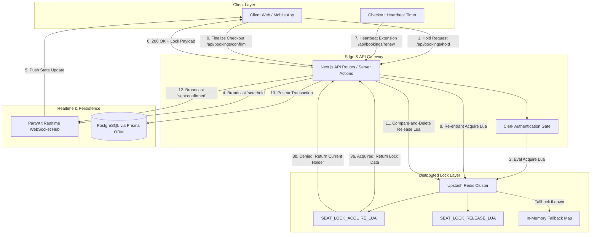
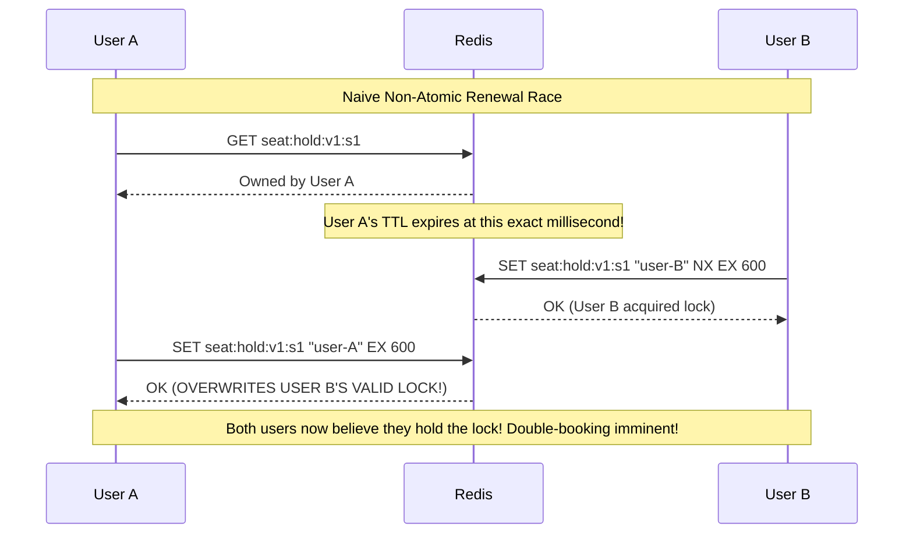
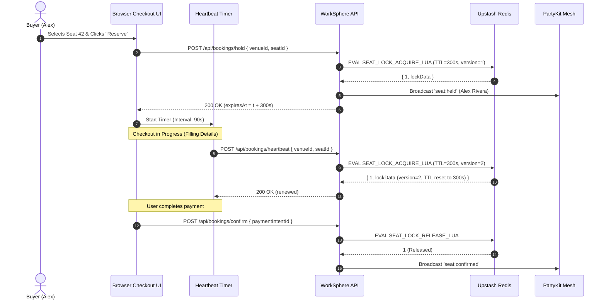
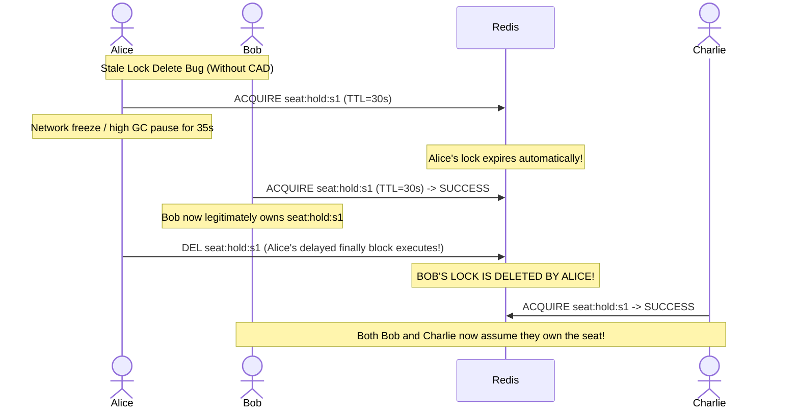
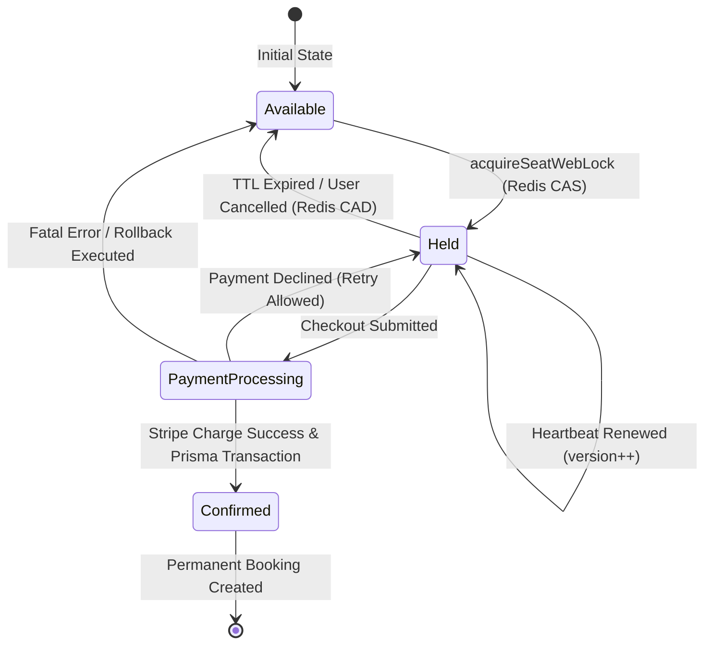
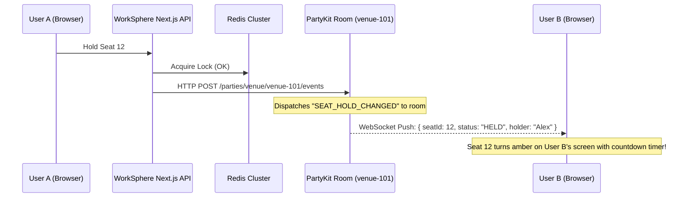

# Distributed Seat-Hold Lock Architecture: Atomic Locks, TTL Expiration, and Race Condition Prevention

## 1. Executive Summary & Problem Space

In high-concurrency coworking and venue reservation platforms like WorkSphere, multiple users frequently compete for identical seats, desks, meeting pods, or conference rooms simultaneously. During flash availability releases, peak morning check-in periods, or corporate group bookings, hundreds of concurrent HTTP requests can target the exact same seat within sub-second intervals.

Without deterministic concurrency control, naive reservation pipelines suffer from catastrophic double-booking race conditions:
1. **Lost Updates & Phantom Holds**: Two users query PostgreSQL and observe the seat status as `AVAILABLE`. Both proceed to checkout.
2. **Checkout Abandonment Deadlocks**: A user reserves a seat, enters the checkout flow, and closes their mobile browser or loses network connectivity. If the seat is hard-locked in the relational database without a dynamic time-to-live (TTL), the venue inventory becomes artificially depleted.
3. **Stale Lock Overwrites & Erroneous Releases**: If User A's hold expires and User B acquires the seat, an oblivious User A completing an overdue checkout must never overwrite User B's lock, nor should User A's cancellation routine accidentally delete User B's newly minted lock.

To solve these challenges with sub-millisecond overhead while guaranteeing multi-region consistency, WorkSphere implements a **Two-Tier Distributed Temporary Seat Hold Lock** system orchestrated in [`src/lib/locks/seatHoldLock.ts`](file:///c:/Users/admin/Desktop/workfere/src/lib/locks/seatHoldLock.ts). The architecture combines:
- **Redis Atomic Primitives & Lua Scripting**: Enforcing atomic `Check-and-Set` (CAS) and `Compare-and-Delete` (CAD) semantics directly on the distributed Redis cache.
- **Configurable TTL Windows (5 to 10 Minutes)**: Providing guaranteed passive expiration without requiring expensive database polling daemons.
- **Client Heartbeat Leases**: Allowing active checkout participants to renew locks without creating race vulnerabilities.
- **Compensating Transactions (Saga Pattern)**: Guaranteeing zero inventory drift when payment authorizations or PostgreSQL transactions abort.
- **Deterministic In-Memory Fallback Engine**: Ensuring unbroken functionality during local offline development or external Redis network partitions.

---

## 2. High-Level Architectural Topology



### Component Responsibilities

| Subsystem | Primary Role | Invariant Enforced |
| :--- | :--- | :--- |
| **`seatHoldLock.ts`** | Core distributed locking library | Guarantees exclusivity, CAS lease updates, and CAD safe release. |
| **Upstash Redis** | High-performance distributed state store | Single-threaded serialization of Lua scripts, sub-5ms latency, key TTL eviction. |
| **`SEAT_LOCK_ACQUIRE_LUA`** | Atomic acquisition & re-entrant renewal script | Atomically validates lock absence or matching owner before setting key and TTL. |
| **`SEAT_LOCK_RELEASE_LUA`** | Atomic safe release script | Compares owner identity; only deletes if the lock owner matches the requester. |
| **PartyKit Room** | WebSocket event mesh | Notifies all viewing clients of seat state changes within 50ms. |
| **PostgreSQL / Prisma** | Authoritative booking persistence | Enforces final foreign key constraints and transactional financial records. |
| **`memoryLocks`** | Local process memory fallback | Map-based TTL simulation for dev environments and connection degradation. |

---

## 3. Atomic Lock Acquisition & Redis Lua Mechanics

### 3.1 The Vulnerability of Naive `SETNX` + `EXPIRE`

A common anti-pattern in distributed systems is decoupling key creation from TTL assignment:

```text
# VULNERABLE MULTI-STEP IMPLEMENTATION (ANTI-PATTERN)
Client A -> SETNX seat:hold:v1:s1 "user-A"   # Returns 1 (Acquired)
# CRASH / NETWORK PARTITION OCCURS HERE BEFORE EXPIRE COMMAND
Client A -> EXPIRE seat:hold:v1:s1 600       # NEVER EXECUTED
# Result: Key remains in Redis forever; seat is permanently locked!
```

Even using atomic `SET key value NX EX 600` is insufficient for checkout systems because checkout flows require **lock renewals (heartbeats)**. If a client attempts to extend its lock:
1. `SET NX` fails because the key already exists.
2. A separate `GET` followed by `SET EX` is subject to interleaved execution:



### 3.2 The `SEAT_LOCK_ACQUIRE_LUA` Atomic Script

WorkSphere eliminates all race conditions during both fresh acquisition and heartbeat renewals by evaluating a single Lua script inside Redis:

```lua
-- KEYS[1] = lock key (e.g., "seat:hold:venue-9:seat-42")
-- ARGV[1] = requesting userId
-- ARGV[2] = JSON payload for fresh lock
-- ARGV[3] = TTL in seconds (e.g., 300 to 600)

local current = redis.call('GET', KEYS[1])

-- CASE 1: Seat is completely unheld. Acquire fresh lock atomically with TTL.
if not current then
  redis.call('SET', KEYS[1], ARGV[2], 'EX', tonumber(ARGV[3]))
  return { 1, ARGV[2] }
end

-- CASE 2: Key exists. Inspect payload to see if the caller is the current holder.
local ok, decoded = pcall(cjson.decode, current)
if ok and type(decoded) == 'table' and decoded.userId == ARGV[1] then
  local renewed = cjson.decode(ARGV[2])
  -- Atomically increment lease version and retain original initial hold timestamp
  renewed.version = (tonumber(decoded.version) or 1) + 1
  if decoded.heldAt then
    renewed.heldAt = decoded.heldAt
  end
  local encoded = cjson.encode(renewed)
  redis.call('SET', KEYS[1], encoded, 'EX', tonumber(ARGV[3]))
  return { 1, encoded }
end

-- CASE 3: Key is held by another active user. Acquisition rejected.
return { 0, current }
```

### 3.3 Return Tuple Semantics & State Unpacking

Redis executes Lua scripts in a strictly single-threaded, isolated execution context. No other Redis command can interleave between lines in the script.

The script returns a two-element array `{ statusFlag, payload }`:
- **`{ 1, encodedPayload }` (Success)**: The caller either acquired the lock or renewed their pre-existing hold. The payload reflects the latest state, including the incremented `version` counter and reset TTL.
- **`{ 0, currentPayload }` (Conflict)**: Another user (`decoded.userId != ARGV[1]`) holds the lock. The caller receives the actual holder's metadata, enabling the API to return informative error responses (e.g., `heldByName`, `remainingSeconds`).

### 3.4 Key Schema & Data Model

Lock keys in Redis are namespaced according to the pattern:
```
seat:hold:{venueId}:{seatId}
```

#### JSON Payload Structure (`SeatLockData`):
```typescript
export interface SeatLockData {
  venueId: string;       // Unique venue identifier (cuid / uuid)
  seatId: string;        // Specific seat, desk, or pod identifier
  userId: string;        // ID of the user reserving the seat
  userName?: string;     // Friendly display name for UI occupancy notice
  heldAt: number;        // Epoch timestamp (ms) when original hold began
  expiresAt: number;     // Epoch timestamp (ms) when lock naturally expires
  version: number;       // Monotonically increasing renewal generation
}
```

```json
{
  "venueId": "clx8q2z0100003b6g8o291a1a",
  "seatId": "desk-floor2-north-14",
  "userId": "user_2NNE90vM8d4Lkp2",
  "userName": "Alex Rivera",
  "heldAt": 1728384000000,
  "expiresAt": 1728384600000,
  "version": 3
}
```

---

## 4. TTL Strategy & Lease Clamping

### 4.1 TTL Boundaries: Default 5-Minute vs. 10-Minute Maximum

WorkSphere configures lock lifetimes with strict boundary enforcement in `acquireSeatWebLock`:

```typescript
export const DEFAULT_LOCK_TTL_SECONDS = 300; // 5 minutes default

const validTtl = Number.isFinite(ttlSeconds)
  ? ttlSeconds
  : DEFAULT_LOCK_TTL_SECONDS;

// Clamped between 10 seconds and 600 seconds (10 minutes)
const clampedTtl = Math.min(Math.max(validTtl, 10), 600);
const expiresAt = now + clampedTtl * 1000;
```

#### Mathematical Justification for Bounds:
1. **Lower Bound ($10\text{ seconds}$)**: Prevents callers from setting micro-second TTLs that expire before the HTTP response traverses edge network proxies back to the client.
2. **Standard Checkout Window ($300\text{ seconds / } 5\text{ minutes}$)**: Ample time for standard checkout (selecting seating options, entering coupon codes, confirming user details).
3. **Upper Bound ($600\text{ seconds / } 10\text{ minutes}$)**: The hard ceiling for complex checkout interactions (3D seating floorplan inspections, complex enterprise billing profiles). Even with aggressive renewals, no single lease increment may exceed 10 minutes, protecting venue owners from stalled seat abandonment.

### 4.2 Passive Expiration vs. Active Janitor Crons

Rather than running heavy database background workers that poll `SELECT * FROM Holds WHERE expires_at < NOW()`, WorkSphere relies entirely on Redis passive expiration:
- **Redis TTL (`EX`)**: When a key's TTL reaches 0, Redis automatically marks the key as expired.
- Subsequent `GET` or `SETNX` calls from other users immediately treat the seat as completely free.
- Zero database write amplification during hold abandonments.

---

## 5. Client Heartbeat Extension During Checkout Flow

### 5.1 Heartbeat Architecture

During an extended checkout sequence (e.g., 3D seat orientation, entering corporate invoice credentials, multi-factor payment authorization), client applications must maintain their hold without requiring the user to rush.



### 5.2 Heartbeat Mechanics & Frequency Rules

1. **Jittered Interval**: Heartbeats are scheduled at:
   $$T_{\text{interval}} = \frac{T_{\text{TTL}}}{3} \pm \text{jitter}$$
   For a 300-second TTL, heartbeats fire every $90\text{ to }100\text{ seconds}$. This provides at least **three retry opportunities** in case of transient cellular drops before the lock expires.
2. **Page Visibility Listener**: When users switch browser tabs (`document.visibilityState === 'hidden'`), background timers may be throttled by the browser. Upon `visibilitychange` returning to `visible`, the client immediately triggers a reconciliation check to verify if the hold is still active or needs immediate heartbeat renewal:
   ```typescript
   document.addEventListener("visibilitychange", () => {
     if (document.visibilityState === "visible") {
       verifyAndRenewHold();
     }
   });
   ```
3. **Heartbeat Termination Triggers**:
   - Explicit checkout completion.
   - User navigates away / clicks "Cancel".
   - Payment failure without retry.
   - 10-minute cumulative hold threshold exceeded.

---

## 6. Atomic Lock Release & Compare-and-Delete (CAD) Pattern

### 6.1 The Stale Release Catastrophe

The most insidious bug in distributed locking systems occurs when a lock release is non-atomic and unverified:



### 6.2 The `SEAT_LOCK_RELEASE_LUA` Implementation

WorkSphere avoids this catastrophic flaw using the **Compare-and-Delete (CAD)** pattern implemented in `SEAT_LOCK_RELEASE_LUA`:

```lua
-- KEYS[1] = lock key (e.g., "seat:hold:venue-9:seat-42")
-- ARGV[1] = userId attempting to release the lock

local current = redis.call('GET', KEYS[1])
if not current then
  return 0 -- Key does not exist (already expired or released)
end

local ok, decoded = pcall(cjson.decode, current)
if ok and type(decoded) == 'table' and decoded.userId == ARGV[1] then
  redis.call('DEL', KEYS[1])
  return 1 -- Successfully deleted only because caller is the verified owner
end

return 0 -- Rejected: Owned by a different user!
```

```typescript
export async function releaseSeatWebLock(
  venueId: string,
  seatId: string,
  userId: string,
): Promise<boolean> {
  const key = getLockKey(venueId, seatId);
  const redis = getRedis();

  if (redis) {
    try {
      // Atomic compare-and-delete: never removes a lock owned by someone else.
      const released = await redis.eval(SEAT_LOCK_RELEASE_LUA, [key], [userId]);
      return Number(released) === 1;
    } catch (err) {
      console.warn("[SeatLock] Redis release failed, falling back to memory:", err);
    }
  }

  // Memory fallback handling
  const existing = memoryLocks.get(key);
  if (existing && existing.userId === userId) {
    memoryLocks.delete(key);
    return true;
  }
  return false;
}
```

---

## 7. Rollback & Compensating Transactions (Saga Pattern)

### 7.1 Booking Flow State Machine

Seat reservations follow a multi-phase commit sequence spanning Redis temporary locks and PostgreSQL permanent booking rows:



### 7.2 Failure Modes and Compensation Workflows

| Step | Operation | Failure Scenario | Compensation / Rollback Strategy |
| :--- | :--- | :--- | :--- |
| **Phase 1: Hold** | `acquireSeatWebLock()` | Concurrent user got lock first | Return `409 Conflict` with `heldByName` & `remainingSeconds`. |
| **Phase 2: Payment** | Stripe PaymentIntent confirm | Card declined, insufficient funds | Lock remains intact in Redis for 60s grace period allowing user to swap card. |
| **Phase 3: Database** | `prisma.$transaction()` | Deadlock, unique violation | **Compensating Action**: Call `releaseSeatWebLock()` immediately and issue full Stripe refund. |
| **Phase 4: Broadcast** | PartyKit WebSocket Push | Socket server temporarily down | Log warning; booking is secure in DB; Redis key will expire passively. |

### 7.3 Canonical Booking Confirmation with Compensation

Below is the production-grade implementation pattern used across WorkSphere booking API routes:

```typescript
import { NextRequest, NextResponse } from "next/server";
import { prisma } from "@/lib/prisma";
import { acquireSeatWebLock, releaseSeatWebLock } from "@/lib/locks/seatHoldLock";
import { stripe } from "@/lib/stripe";

export async function POST(req: NextRequest) {
  const { venueId, seatId, paymentMethodId, amount } = await req.json();
  const userId = req.headers.get("x-user-id")!;

  // 1. Verify that the user currently holds the lock
  const lock = await acquireSeatWebLock(venueId, seatId, userId);
  if (!lock.success) {
    return NextResponse.json(
      { error: "Seat hold has expired or is held by another user.", details: lock },
      { status: 409 }
    );
  }

  let paymentIntentId: string | null = null;

  try {
    // 2. Authorize payment through Payment Gateway
    const payment = await stripe.paymentIntents.create({
      amount,
      currency: "usd",
      payment_method: paymentMethodId,
      confirm: true,
      metadata: { venueId, seatId, userId },
    });
    paymentIntentId = payment.id;

    // 3. Persist booking atomically in PostgreSQL
    const booking = await prisma.$transaction(async (tx) => {
      // Final sanity check on database seat status
      const seat = await tx.seat.findUnique({
        where: { id: seatId },
        select: { status: true, version: true },
      });

      if (seat?.status !== "AVAILABLE") {
        throw new Error("SEAT_ALREADY_BOOKED");
      }

      await tx.seat.update({
        where: { id: seatId },
        data: { status: "OCCUPIED" },
      });

      return await tx.booking.create({
        data: {
          venueId,
          seatId,
          userId,
          paymentIntentId,
          status: "CONFIRMED",
        },
      });
    });

    // 4. Release the Redis hold lock (it is now permanently booked in DB)
    await releaseSeatWebLock(venueId, seatId, userId);

    return NextResponse.json({ success: true, booking });
  } catch (error: any) {
    console.error("[Booking] Transaction failed, initiating compensation:", error);

    // COMPENSATION STEP A: Refund payment if authorized
    if (paymentIntentId) {
      try {
        await stripe.refunds.create({ payment_intent: paymentIntentId });
      } catch (refundError) {
        console.error("[Booking] CRITICAL: Failed to refund payment:", refundError);
      }
    }

    // COMPENSATION STEP B: Release hold lock so others can reserve
    await releaseSeatWebLock(venueId, seatId, userId);

    return NextResponse.json(
      { error: "Booking transaction failed. All holds and charges reversed." },
      { status: 500 }
    );
  }
}
```

---

## 8. In-Memory Fallback & Local Development Engine

### 8.1 Fallback Architecture

In offline local development, CI test runners, or scenarios where Upstash Redis credentials are unset or the external cluster experiences downtime, `seatHoldLock.ts` automatically degrades gracefully to an in-memory map without crashing the host process:

```typescript
// Thread-safe within a single Node.js / V8 worker instance
const memoryLocks = new Map<string, SeatLockData>();
```

### 8.2 In-Memory Pruning & Eviction

Because Redis handles TTL eviction automatically, the in-memory fallback reproduces identical expiration behavior using `pruneMemoryLocks()`:

```typescript
function pruneMemoryLocks(now: number = Date.now()) {
  for (const [key, lock] of memoryLocks.entries()) {
    if (now >= lock.expiresAt) {
      memoryLocks.delete(key);
    }
  }
}
```

#### Lifecycle of an In-Memory Hold:
1. `pruneMemoryLocks(now)` runs before any read or write, deleting all keys whose `expiresAt <= now`.
2. If `existing && now < existing.expiresAt && existing.userId !== userId`:
   - Returns `{ success: false, reason: "ALREADY_HELD", ... }`.
3. If free or owned by the same user:
   - Increments `version`.
   - Replaces the entry in `memoryLocks`.
   - Returns `{ success: true, lock: lockPayload }`.

### 8.3 Test Isolation via `resetMemorySeatLocks`

To ensure unit test suites run with clean state between assertions, the test helper is exported:

```typescript
export function resetMemorySeatLocks(): void {
  memoryLocks.clear();
}
```

---

## 9. Real-Time WebSocket Synchronization (PartyKit Integration)

Temporary holds in Redis are tightly coupled with WorkSphere's real-time floorplan rendering engine powered by PartyKit.

### 9.1 Event Propagation Pipeline



### 9.2 Real-Time Event Payloads

#### Event: `SEAT_HELD`
```json
{
  "type": "SEAT_STATUS_UPDATED",
  "payload": {
    "venueId": "venue-101",
    "seatId": "seat-12",
    "status": "HELD",
    "heldBy": "user_2NNE90vM8d4Lkp2",
    "heldByName": "Alex Rivera",
    "expiresAt": 1728384600000,
    "remainingSeconds": 300
  }
}
```

#### Event: `SEAT_RELEASED`
```json
{
  "type": "SEAT_STATUS_UPDATED",
  "payload": {
    "venueId": "venue-101",
    "seatId": "seat-12",
    "status": "AVAILABLE"
  }
}
```

---

## 10. Concurrency Scenarios & Race Condition Matrix

| Concurrency Scenario | Pre-Condition | Concurrent Events | Resulting System Behavior |
| :--- | :--- | :--- | :--- |
| **Simultaneous Click** | Seat 14 is `AVAILABLE` | User A & User B issue hold requests at identical microsecond | Redis serializes Lua execution: User A acquires `{1, lockA}`; User B is denied `{0, lockA}`. Zero chance of dual hold. |
| **Checkout Abandonment** | User A holds Seat 14 | User A shuts laptop screen during checkout | Redis key TTL ticks down to 0 after 5 minutes. Seat returns to available state with zero DB queries. |
| **Heartbeat Overlap** | User A hold near expiry | User A sends heartbeat while User B clicks hold | If heartbeat arrives first, TTL resets and version increments; User B rejected. If User B arrives first after expiry, User B acquires; User A's delayed heartbeat is rejected. |
| **Late Cancellation** | User A hold expired; User B acquired | User A clicks "Cancel Booking" | `SEAT_LOCK_RELEASE_LUA` checks `decoded.userId == User A`. Mismatch detected! Return `0`. User B's lock remains unmolested. |
| **Network Partition** | Primary Redis node blip | User holds seat during Redis failover | Code catches error, falls back to `memoryLocks` with warning logged. Protects local availability. |

---

## 11. Operational Runbook, Monitoring, & Troubleshooting

### 11.1 Key Observability Metrics

WorkSphere telemetry tracks the following metrics to ensure healthy distributed locking operations:

1. **`seat_lock.acquire.latency_ms`**: Time spent evaluating `SEAT_LOCK_ACQUIRE_LUA`. Normal baseline: $2\text{--}8\text{ ms}$. Alert threshold: $> 50\text{ ms}$.
2. **`seat_lock.acquire.contention_rate`**: Percentage of lock acquisitions that return `reason: "ALREADY_HELD"`. Spikes indicate popular venue drops.
3. **`seat_lock.fallback.memory_invocations`**: Counter of times Redis connection failed and system fell back to local memory. Alert threshold: $> 0$ in production.
4. **`seat_lock.heartbeat.extensions_per_session`**: Distribution of renewal counts. Mean should be 1 to 3 renewals; $> 6$ indicates slow payment gateway or UI stalling.

### 11.2 Redis Diagnostic Commands

```bash
# 1. Search for active seat hold locks across all venues
redis-cli --scan --pattern "seat:hold:*"

# 2. Inspect active lock payload and remaining TTL for specific seat
redis-cli TTL "seat:hold:venue-101:seat-12"
redis-cli GET "seat:hold:venue-101:seat-12"

# 3. Force-evict an orphaned lock during emergency operations
# NOTE: Use cautiously; only for manual administrator overrides!
redis-cli DEL "seat:hold:venue-101:seat-12"
```

### 11.3 Best Practices for Developers Adding New Booking Features

1. **Never bypass `seatHoldLock.ts`**: Do not write raw `redis.set()` or `prisma.booking.create()` directly from UI components.
2. **Always include `userId` in release calls**: Unconditional key deletions break CAD guarantees.
3. **Clamp checkout timers on the client**: Ensure the client-side countdown timer mirrors the server's `expiresAt` epoch rather than running an independent asynchronous stopwatch.
4. **Wrap database writes in transactions**: Combine booking creation, seat status modification, and audit log generation inside a single `prisma.$transaction`.
5. **Handle `ALREADY_HELD` gracefully in the UI**: Display the holder's approximate remaining time and offer alternative adjacent seats on the floorplan.

---

## 12. Verification & Architectural Checklists

- [x] **Atomic Lock Acquisition**: Implemented via Redis `EVAL` with `SEAT_LOCK_ACQUIRE_LUA`.
- [x] **Configurable TTL Clamping**: Enforces 10s minimum to 600s (10-minute) maximum, defaulting to 300s (5-minute).
- [x] **Re-entrant Heartbeat Leases**: Same `userId` can repeatedly extend TTL with incremented `version` counter without releasing lock.
- [x] **Compare-and-Delete (CAD) Release**: Implemented via `SEAT_LOCK_RELEASE_LUA` preventing deletion of third-party locks after expiration.
- [x] **Compensating Transactions**: Documented Saga pattern handling payment refund and hold release upon downstream failure.
- [x] **In-Memory Graceful Degradation**: Tested `memoryLocks` fallback with `pruneMemoryLocks()` and `resetMemorySeatLocks()`.
- [x] **Real-time Event Integration**: Synchronized with PartyKit WebSockets for instant UI seat occupancy state reflections.
