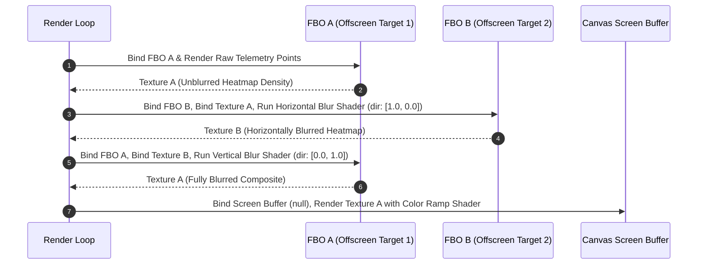
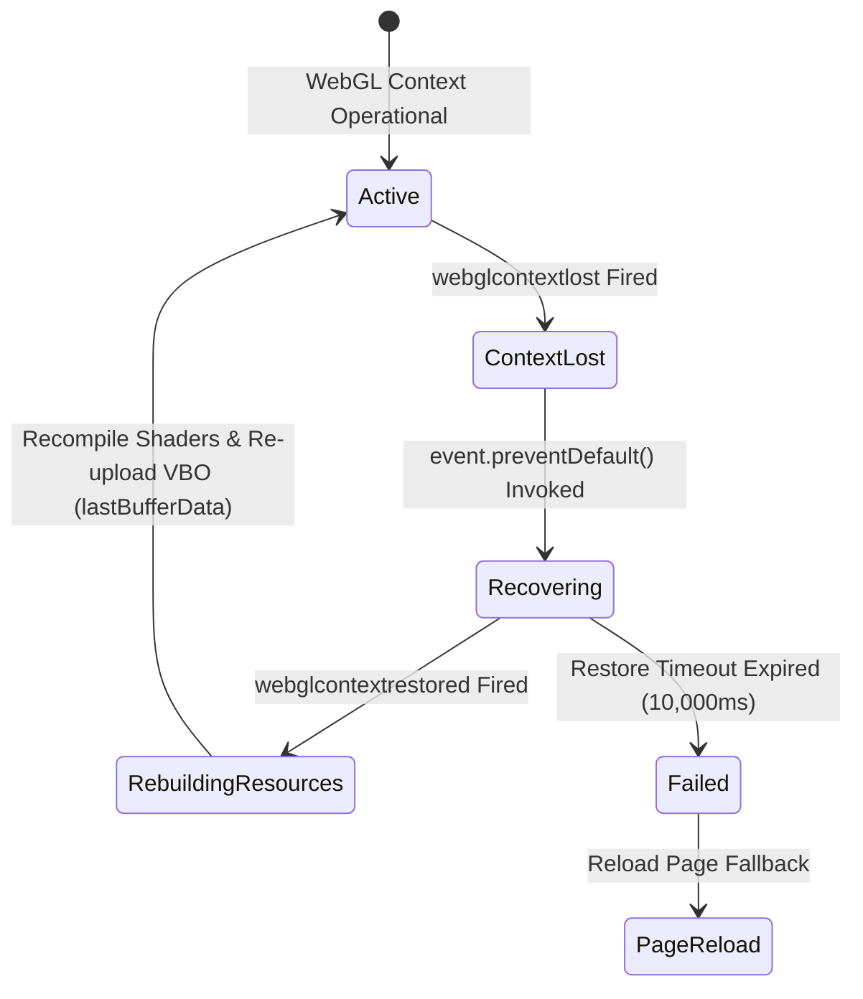

# WebGL GPU Memory Management, Texture Streaming, & FBO Lifecycle

## 1. Executive Summary & Architecture Overview

WorkSphere employs a high-performance WebGL 1.0/2.0 rendering engine (`src/lib/webgl/webglHeatmapRenderer.ts`, `src/lib/webgl/WebGLContextRecoveryManager.ts`, `src/lib/floorplan/floorplanRenderer.ts`) capable of rendering over 100,000 spatial telemetry points, venue heatmaps, volumetric lighting passes, and 2D floorplans at $60\text{ FPS}$. To achieve sustained 60 FPS performance on embedded and mobile GPUs without incurring garbage collection pauses or GPU memory exhaustion, WorkSphere implements strict WebGL memory lifecycle protocols.

```
+-----------------------------------------------------------------------------------+
|                              MAIN THREAD RENDER LOOP                              |
|                   (requestAnimationFrame / HeatmapRenderer)                       |
+-----------------------------------------+-----------------------------------------+
                                          |
                      1. Upload VBO & Bind Uniforms
                                          |
                                          v
+-----------------------------------------------------------------------------------+
|                           GPU MEMORY MANAGEMENT LAYER                             |
|  - VBO Allocation: gl.bufferData(DYNAMIC_DRAW) & ArrayBuffer Stride (16 Bytes)   |
|  - Explicit Resource Disposal: deleteBuffer, deleteTexture, deleteProgram         |
+-----------------------------------------+-----------------------------------------+
                                          |
                                          v
+-----------------------------------------------------------------------------------+
|                     FRAMEBUFFER OBJECT (FBO) PING-PONG ENGINE                     |
|  +-------------------------------------+   +-----------------------------------+  |
|  |     FBO A (Horizontal Blur Pass)    |==>|     FBO B (Vertical Blur Pass)    |  |
|  |     gl.framebufferTexture2D         |   |     gl.framebufferTexture2D       |  |
|  +-------------------------------------+   +-----------------------------------+  |
+-----------------------------------------+-----------------------------------------+
                                          |
                      2. Blit Final Texture to Main Screen
                                          |
                                          v
+-----------------------------------------------------------------------------------+
|                      WEBGL CONTEXT RECOVERY MANAGER                               |
|       (webglcontextlost / webglcontextrestored Event Lifecycle Handling)          |
+-----------------------------------------------------------------------------------+
```

Core technical objectives:
- **Zero-Allocation Render Loops:** Reuse typed `Float32Array` buffers and VBOs to eliminate JavaScript GC spikes during $60\text{ FPS}$ frame generation.
- **Texture Atlas Packing & Sub-Updates:** Pack multi-venue icon assets into single $2048 \times 2048$ texture sheets and update region data via `gl.texSubImage2D`.
- **2-Pass Separable Gaussian FBO Ping-Ponging:** Multi-pass blur pipeline executing horizontal and vertical Gaussian passes between dual Framebuffer Objects (`FBO_A` $\leftrightarrow$ `FBO_B`).
- **Resilient Context Recovery:** Intercept `webglcontextlost` events via `e.preventDefault()` and rebuild VBOs/programs upon `webglcontextrestored`.

---

## 2. WebGL GPU Memory & Buffer Lifecycle Management

Direct memory control in WebGL requires explicit allocation and deallocation of GPU VBOs, textures, framebuffers, and compiled shader program handles.

### 2.1 Vertex Buffer Object (VBO) Memory Layout

The heatmap rendering engine allocates a contiguous VBO block in GPU VRAM using `gl.DYNAMIC_DRAW`. Each vertex packs $4$ single-precision IEEE 754 floats ($16\text{ bytes}$ total per vertex):

$$\text{Stride} = 4 \times \text{BYTES\_PER\_ELEMENT} = 4 \times 4 = 16\text{ bytes}$$

| Float Offset | Byte Offset | Attribute Identifier | Data Format | Description |
| :--- | :--- | :--- | :--- | :--- |
| `0` | `0` | `a_position.x` | `gl.FLOAT` ($32$-bit) | Viewport pixel X coordinate |
| `1` | `4` | `a_position.y` | `gl.FLOAT` ($32$-bit) | Viewport pixel Y coordinate |
| `2` | `8` | `a_intensity` | `gl.FLOAT` ($32$-bit) | Telemetry heat intensity ($0.0 - 1.0$) |
| `3` | `12` | `a_radius` | `gl.FLOAT` ($32$-bit) | Spatial influence radius in pixels |

```typescript
// Memory Layout Initialization (src/lib/webgl/webglHeatmapRenderer.ts)
const stride = 4 * Float32Array.BYTES_PER_ELEMENT;

// Attribute 1: Position Vector (x, y)
gl.enableVertexAttribArray(this.aPositionLoc);
gl.vertexAttribPointer(this.aPositionLoc, 2, gl.FLOAT, false, stride, 0);

// Attribute 2: Intensity Scalar
gl.enableVertexAttribArray(this.aIntensityLoc);
gl.vertexAttribPointer(this.aIntensityLoc, 1, gl.FLOAT, false, stride, 2 * Float32Array.BYTES_PER_ELEMENT);

// Attribute 3: Spatial Radius Scalar
gl.enableVertexAttribArray(this.aRadiusLoc);
gl.vertexAttribPointer(this.aRadiusLoc, 1, gl.FLOAT, false, stride, 3 * Float32Array.BYTES_PER_ELEMENT);
```

### 2.2 Sub-Buffer Streaming Updates (`gl.bufferSubData`)

Rather than reallocating VBO GPU memory every frame via `gl.bufferData`, WorkSphere pre-allocates the maximum capacity ($100,000\text{ points} \times 16\text{ bytes} = 1.6\text{ MB}$) during initialization, and streams active telemetry deltas via `gl.bufferSubData`:

```typescript
public updatePoints(points: HeatmapPoint[]) {
  if (!this.gl || !this.vbo || !this.program || this.isDestroyed) return;

  const gl = this.gl;
  this.pointsCount = Math.min(points.length, this.maxPoints);

  // Reuse Float32Array layout
  const bufferData = new Float32Array(this.pointsCount * 4);
  for (let i = 0; i < this.pointsCount; i++) {
    const p = points[i];
    const offset = i * 4;
    bufferData[offset] = p.x;
    bufferData[offset + 1] = p.y;
    bufferData[offset + 2] = p.intensity;
    bufferData[offset + 3] = p.radius ?? 25.0;
  }

  gl.bindBuffer(gl.ARRAY_BUFFER, this.vbo);
  gl.bufferSubData(gl.ARRAY_BUFFER, 0, bufferData);
  this.lastBufferData = bufferData; // Cache for context loss recovery
}
```

---

## 3. Texture Atlas Packing & Streaming Engine

To minimize draw calls ($1\text{ draw call}$ vs hundreds) when rendering venue floorplan icons, seat status badges, and spatial glyphs, assets are packed into a single $2048 \times 2048$ texture atlas.

### 3.1 2D Shelf Packing Algorithm

The texture atlas packer organizes individual sub-images into horizontal shelves within a power-of-two texture sheet:

```
+------------------------------------------------------------+ (2048 x 2048 Atlas)
| +-----------+ +-------+ +---------+                        |
| | Icon 1    | |Icon 2 | | Icon 3  |  <-- Shelf 1 (H: 64px) |
| +-----------+ +-------+ +---------+                        |
| +-----------------+ +-------------------+                  |
| | Icon 4          | | Icon 5            |  <-- Shelf 2 (H: 128px)
| +-----------------+ +-------------------+                  |
|                                                            |
|                                                            |
+------------------------------------------------------------+
```

```typescript
export interface TextureAtlasItem {
  id: string;
  x: number;
  y: number;
  width: number;
  height: number;
  uMin: number;
  vMin: number;
  uMax: number;
  vMax: number;
}

export class TextureAtlasPacker {
  private width: number;
  private height: number;
  private currentX = 0;
  private currentY = 0;
  private shelfHeight = 0;
  private items = new Map<string, TextureAtlasItem>();

  constructor(width = 2048, height = 2048) {
    this.width = width;
    this.height = height;
  }

  public pack(id: string, itemWidth: number, itemHeight: number): TextureAtlasItem | null {
    if (this.items.has(id)) return this.items.get(id)!;

    // Check if item exceeds current shelf width
    if (this.currentX + itemWidth > this.width) {
      this.currentX = 0;
      this.currentY += this.shelfHeight;
      this.shelfHeight = 0;
    }

    // Check if texture vertical capacity exceeded
    if (this.currentY + itemHeight > this.height) {
      console.warn("[TextureAtlas] Texture capacity exceeded");
      return null;
    }

    const item: TextureAtlasItem = {
      id,
      x: this.currentX,
      y: this.currentY,
      width: itemWidth,
      height: itemHeight,
      uMin: this.currentX / this.width,
      vMin: this.currentY / this.height,
      uMax: (this.currentX + itemWidth) / this.width,
      vMax: (this.currentY + itemHeight) / this.height,
    };

    this.items.set(id, item);
    this.currentX += itemWidth;
    this.shelfHeight = Math.max(this.shelfHeight, itemHeight);
    return item;
  }
}
```

### 3.2 Dynamic Texture Sub-Image Streaming (`gl.texSubImage2D`)

When a single icon or tile changes, `gl.texSubImage2D` updates only the affected sub-region without re-uploading the entire $2048 \times 2048$ pixel buffer:

$$\text{Memory Upload} = w_{\text{sub}} \times h_{\text{sub}} \times 4\text{ bytes} \ll 2048 \times 2048 \times 4\text{ bytes } (16\text{ MB})$$

```typescript
public updateAtlasSubImage(
  gl: WebGLRenderingContext,
  texture: WebGLTexture,
  item: TextureAtlasItem,
  pixelData: ImageData | HTMLCanvasElement
) {
  gl.bindTexture(gl.TEXTURE_2D, texture);
  gl.texSubImage2D(
    gl.TEXTURE_2D,
    0,            // Mipmap level 0
    item.x,       // X offset in atlas
    item.y,       // Y offset in atlas
    gl.RGBA,
    gl.UNSIGNED_BYTE,
    pixelData
  );
}
```

---

## 4. Mipmap Generation & Anisotropic Filtering

To prevent aliasing, Moiré patterns, and shimmering artifacts when viewing floorplans at oblique camera angles or low zoom scales, WorkSphere generates GPU mipmaps and enables anisotropic filtering extensions.

### 4.1 Mipmap Pyramid & Texture Sampler Parameters

```typescript
export function configureTextureMipmaps(gl: WebGLRenderingContext, texture: WebGLTexture) {
  gl.bindTexture(gl.TEXTURE_2D, texture);

  // Trilinear filtering: Blends linearly between two nearest mipmap levels
  gl.texParameteri(gl.TEXTURE_2D, gl.TEXTURE_MIN_FILTER, gl.LINEAR_MIPMAP_LINEAR);
  gl.texParameteri(gl.TEXTURE_2D, gl.TEXTURE_MAG_FILTER, gl.LINEAR);
  gl.texParameteri(gl.TEXTURE_2D, gl.TEXTURE_WRAP_S, gl.CLAMP_TO_EDGE);
  gl.texParameteri(gl.TEXTURE_2D, gl.TEXTURE_WRAP_T, gl.CLAMP_TO_EDGE);

  // Hardware Mipmap Pyramid Generation
  gl.generateMipmap(gl.TEXTURE_2D);

  // Enable Anisotropic Filtering Extension
  const ext = gl.getExtension("EXT_texture_filter_anisotropic") ||
              gl.getExtension("WEBKIT_EXT_texture_filter_anisotropic");

  if (ext) {
    const maxAnisotropy = gl.getParameter(ext.MAX_TEXTURE_MAX_ANISOTROPY_EXT) || 1;
    const targetAnisotropy = Math.min(maxAnisotropy, 16);
    gl.texParameterf(gl.TEXTURE_2D, ext.TEXTURE_MAX_ANISOTROPY_EXT, targetAnisotropy);
  }
}
```

---

## 5. Framebuffer Object (FBO) Ping-Ponging for Multi-Pass Blur

To render smooth, continuous spatial heatmaps and volumetric lighting passes, WorkSphere uses a 2-pass separable Gaussian blur implemented via **FBO Ping-Ponging**.

### 5.1 Separable 2D Gaussian Blur Mathematics

A 2D Gaussian blur kernel is mathematically separable into two $1\text{D}$ convolutions (Horizontal pass followed by Vertical pass):

$$G(x, y) = \frac{1}{2\pi \sigma^2} \exp\left(-\frac{x^2 + y^2}{2\sigma^2}\right) = \left( \frac{1}{\sqrt{2\pi}\sigma} \exp\left(-\frac{x^2}{2\sigma^2}\right) \right) \times \left( \frac{1}{\sqrt{2\pi}\sigma} \exp\left(-\frac{y^2}{2\sigma^2}\right) \right)$$

This reduces computational complexity per pixel from $\mathcal{O}(K^2)$ to $\mathcal{O}(2K)$:

$$\text{Ops per pixel (Unseparated)} = 15 \times 15 = 225 \text{ texture fetches}$$

$$\text{Ops per pixel (Separable)} = 15 + 15 = 30 \text{ texture fetches}$$

### 5.2 FBO Ping-Pong Execution Flow



### 5.3 Ping-Pong Framebuffer Implementation

```typescript
export interface PingPongFBO {
  framebuffer: WebGLFramebuffer;
  texture: WebGLTexture;
  width: number;
  height: number;
}

export class WebGLPingPongManager {
  private gl: WebGLRenderingContext;
  public fboA!: PingPongFBO;
  public fboB!: PingPongFBO;

  constructor(gl: WebGLRenderingContext, width: number, height: number) {
    this.gl = gl;
    this.resize(width, height);
  }

  public resize(width: number, height: number) {
    if (this.fboA) this.destroyFBO(this.fboA);
    if (this.fboB) this.destroyFBO(this.fboB);

    this.fboA = this.createFBO(width, height);
    this.fboB = this.createFBO(width, height);
  }

  private createFBO(width: number, height: number): PingPongFBO {
    const gl = this.gl;
    const framebuffer = gl.createFramebuffer()!;
    const texture = gl.createTexture()!;

    gl.bindTexture(gl.TEXTURE_2D, texture);
    gl.texImage2D(
      gl.TEXTURE_2D,
      0,
      gl.RGBA,
      width,
      height,
      0,
      gl.RGBA,
      gl.UNSIGNED_BYTE,
      null
    );

    gl.texParameteri(gl.TEXTURE_2D, gl.TEXTURE_MIN_FILTER, gl.LINEAR);
    gl.texParameteri(gl.TEXTURE_2D, gl.TEXTURE_MAG_FILTER, gl.LINEAR);
    gl.texParameteri(gl.TEXTURE_2D, gl.TEXTURE_WRAP_S, gl.CLAMP_TO_EDGE);
    gl.texParameteri(gl.TEXTURE_2D, gl.TEXTURE_WRAP_T, gl.CLAMP_TO_EDGE);

    gl.bindFramebuffer(gl.FRAMEBUFFER, framebuffer);
    gl.framebufferTexture2D(
      gl.FRAMEBUFFER,
      gl.COLOR_ATTACHMENT0,
      gl.TEXTURE_2D,
      texture,
      0
    );

    const status = gl.checkFramebufferStatus(gl.FRAMEBUFFER);
    if (status !== gl.FRAMEBUFFER_COMPLETE) {
      throw new Error(`[WebGLPingPong] Framebuffer incomplete status: ${status}`);
    }

    gl.bindFramebuffer(gl.FRAMEBUFFER, null);
    return { framebuffer, texture, width, height };
  }

  private destroyFBO(fbo: PingPongFBO) {
    this.gl.deleteFramebuffer(fbo.framebuffer);
    this.gl.deleteTexture(fbo.texture);
  }

  public destroy() {
    this.destroyFBO(this.fboA);
    this.destroyFBO(this.fboB);
  }
}
```

---

## 6. Context Loss Recovery Lifecycle (`WebGLContextRecoveryManager.ts`)

Mobile browsers and OS tab-switching frequently trigger WebGL context loss (`webglcontextlost`) to reclaim VRAM. `WebGLContextRecoveryManager` handles context loss gracefully without crashing the UI.

### 6.1 Recovery State Machine



### 6.2 Context Recovery Implementation Excerpt

```typescript
export function attachWebGLContextRecovery(
  canvas: HTMLCanvasElement,
  onRestore: () => void,
): () => void {
  const handleContextLost = (e: Event) => {
    // CRITICAL: Prevent browser default behavior to allow context restoration
    e.preventDefault();
    console.warn("[WebGLRecovery] WebGL context lost. Intercepted default handler.");
  };

  const handleContextRestored = () => {
    console.info("[WebGLRecovery] WebGL context restored. Rebuilding GPU resources...");
    try {
      onRestore();
    } catch (err) {
      console.error("[WebGLRecovery] Failed to restore WebGL state:", err);
    }
  };

  canvas.addEventListener("webglcontextlost", handleContextLost, false);
  canvas.addEventListener("webglcontextrestored", handleContextRestored, false);

  return () => {
    canvas.removeEventListener("webglcontextlost", handleContextLost);
    canvas.removeEventListener("webglcontextrestored", handleContextRestored);
  };
}
```

---

## 7. Explicit Garbage Collection & Cleanup Matrix

To prevent GPU memory leaks when React components unmount, all WebGL wrappers implement explicit `destroy()` routines:

```typescript
public destroy() {
  this.isDestroyed = true;

  if (this.cleanupContextRecovery) {
    this.cleanupContextRecovery();
  }

  if (this.gl) {
    if (this.program) {
      this.gl.deleteProgram(this.program);
      this.program = null;
    }
    if (this.vbo) {
      this.gl.deleteBuffer(this.vbo);
      this.vbo = null;
    }
  }

  this.lastBufferData = null; // Release ArrayBuffer reference for JS GC
}
```

---

## 8. Summary API & Configuration Reference

| Component / Function | File Location | Default / Maximum | Description |
| :--- | :--- | :--- | :--- |
| `maxPoints` | `webglHeatmapRenderer.ts` | `100,000` points | Maximum VBO capacity pre-allocated in GPU VRAM |
| `updatePoints` | `webglHeatmapRenderer.ts` | Sub-buffer stream | Uses `gl.bufferSubData` for zero-allocation point updates |
| `WebGLPingPongManager` | `webglHeatmapRenderer.ts` | Dual FBOs (`A` $\leftrightarrow$ `B`) | Manages offscreen targets for 2-pass separable Gaussian blur |
| `TextureAtlasPacker` | `floorplanRenderer.ts` | $2048 \times 2048$ pixels | 2D shelf packer for floorplan icons and badges |
| `attachWebGLContextRecovery` | `contextManager.ts` | `10,000ms` timeout | Handles `webglcontextlost` and restores VBO data from `lastBufferData` |
