# AudioEqualizer: 5-Band Parametric Architecture & Biquad Filter Presets

## 1. Executive Summary

WorkSphere provides high-fidelity audio shaping and real-time noise masking through its 5-band parametric equalizer component ([`src/components/audio/AudioEqualizer.tsx`](file:///c:/Users/admin/Desktop/workfere/src/components/audio/AudioEqualizer.tsx)), supported by the [`useAudioEqualizer.ts`](file:///c:/Users/admin/Desktop/workfere/src/hooks/useAudioEqualizer.ts) hook and WASM peaking coefficient processing.

This technical guide documents:
- **5-Band Parametric Filter Architecture:** Band division (Low, Low-Mid, Mid, High-Mid, High) and cascading filter chain.
- **Web Audio `BiquadFilterNode` Configurations:** Filter types (`lowshelf`, `peaking`, `highshelf`), quality factors ($Q = 1.4$), and gain bounds.
- **Preset Frequency Curves:** Default gain allocations (`Flat`, `Speech Clarity`, `Bass Boost`, `Vocal Enhancer`, `Treble Boost`, `Warm`, `Music`, `Balanced`).
- **Dynamic Range Control & Battery Throttling:** Downstream `DynamicsCompressorNode` parameters and canvas render loop optimizations under low battery conditions.

---

## 2. Audio Processing Architecture

```mermaid
flowchart LR
    Source["Audio Source<br/>(Noise Buffer / WebRTC Remote Track)"] --> Band0["Band 0: Low<br/>60 Hz (lowshelf)"]
    Band0 --> Band1["Band 1: Low-Mid<br/>250 Hz (peaking, Q=1.4)"]
    Band1 --> Band2["Band 2: Mid<br/>1,000 Hz (peaking, Q=1.4)"]
    Band2 --> Band3["Band 3: High-Mid<br/>4,000 Hz (peaking, Q=1.4)"]
    Band3 --> Band4["Band 4: High<br/>12,000 Hz (highshelf)"]
    Band4 --> MasterGain["Master GainNode<br/>(Volume 0.0 - 1.0)"]
    MasterGain --> Compressor["DynamicsCompressorNode<br/>(Clamping at -24 dBFS)"]
    Compressor --> Analyser["AnalyserNode<br/>(fftSize = 64)"]
    Analyser --> Dest["AudioContext.destination<br/>(Speakers / Headphones)"]
```



### Signal Flow Highlights
1. **Serial Biquad Cascade:** The five filters are connected serially: `filter[0] -> filter[1] -> filter[2] -> filter[3] -> filter[4] -> masterGain`.
2. **Gain Clamping:** Each band supports gains from **−20 dB to +20 dB**. Any incoming values are clamped within this boundary to prevent numerical overflow in the Web Audio biquad solver.
3. **Smooth Transitions:** Parameter changes apply via `setValueAtTime()` or scheduled ramps to eliminate audible pops and clicks during live slider interactions.

---

## 3. 5-Band Parametric Equalizer Specifications

| Band Index | Band Name | Center / Shelf Frequency | Biquad Filter Type | Quality Factor ($Q$) | Target Acoustic Range |
| :---: | :---: | :---: | :---: | :---: | :--- |
| **0** | **Low** | $60\text{ Hz}$ | `lowshelf` | N/A ($S=1$) | Sub-bass rumble, HVAC hum, deep environmental vibrations |
| **1** | **Low-Mid** | $250\text{ Hz}$ | `peaking` | $1.4$ | Chest resonance, ambient room warmth, lower vocal fundamentals |
| **2** | **Mid** | $1,000\text{ Hz}$ ($1\text{ kHz}$) | `peaking` | $1.4$ | Core speech intelligibility, keyboard clatter, nasal harmonics |
| **3** | **High-Mid** | $4,000\text{ Hz}$ ($4\text{ kHz}$) | `peaking` | $1.4$ | Sibilance, presence, clarity, consonant articulation |
| **4** | **High** | $12,000\text{ Hz}$ ($12\text{ kHz}$) | `highshelf` | N/A ($S=1$) | Airiness, breath, coffee shop glass chimes, high-frequency hiss |

### Filter Implementation

```typescript
// Filter creation in AudioEqualizer.tsx
const filters: BiquadFilterNode[] = EQ_BANDS.map((freq, i) => {
  const filter = ctx.createBiquadFilter();
  if (i === 0) {
    filter.type = "lowshelf";
  } else if (i === EQ_BANDS.length - 1) {
    filter.type = "highshelf";
  } else {
    filter.type = "peaking";
    filter.Q.setValueAtTime(1.4, ctx.currentTime);
  }

  filter.frequency.setValueAtTime(freq, ctx.currentTime);
  filter.gain.setValueAtTime(bandGains[i] ?? 0, ctx.currentTime);
  return filter;
});
```

---

## 4. Preset Curves & Gain Profiles

WorkSphere provides pre-engineered curves optimized for coworking spaces, focus music, and remote conference audio.

### 4.1 Master Preset Gain Matrix (dB)

| Preset Name | Label | 60 Hz (Low) | 250 Hz (Low-Mid) | 1 kHz (Mid) | 4 kHz (High-Mid) | 12 kHz (High) | Recommended Environment |
| :--- | :--- | :---: | :---: | :---: | :---: | :---: | :--- |
| `flat` | Flat | $0\text{ dB}$ | $0\text{ dB}$ | $0\text{ dB}$ | $0\text{ dB}$ | $0\text{ dB}$ | Neutral audio reproduction, reference monitoring |
| `balanced` | Balanced | $0\text{ dB}$ | $0\text{ dB}$ | $0\text{ dB}$ | $0\text{ dB}$ | $0\text{ dB}$ | General workspace background audio |
| `speech-clarity` | Speech Clarity | $-2\text{ dB}$ | $-1\text{ dB}$ | $+3\text{ dB}$ | $+2\text{ dB}$ | $0\text{ dB}$ | Conference calls, noisy open-plan video meetings |
| `bass-boost` | Bass Boost | $+5\text{ dB}$ | $+3\text{ dB}$ | $0\text{ dB}$ | $0\text{ dB}$ | $0\text{ dB}$ | Electronic / Lo-Fi focus tracks, acoustic masking |
| `music` | Music | $+4\text{ dB}$ | $+1\text{ dB}$ | $-1\text{ dB}$ | $+2\text{ dB}$ | $+3\text{ dB}$ | Ambient coffee shop playlists, immersive soundscapes |
| `vocal-enhancer` | Vocal Enhancer | $-2\text{ dB}$ | $-1\text{ dB}$ | $+3\text{ dB}$ | $+2\text{ dB}$ | $0\text{ dB}$ | Podcast listening, remote interviews |
| `treble-boost` | Treble Boost | $0\text{ dB}$ | $0\text{ dB}$ | $0\text{ dB}$ | $+3\text{ dB}$ | $+5\text{ dB}$ | Muffled microphones, low-bitrate stream enhancement |
| `warm` | Warm | $+3\text{ dB}$ | $+2\text{ dB}$ | $+1\text{ dB}$ | $-1\text{ dB}$ | $-2\text{ dB}$ | Reducing ear fatigue during prolonged work sprints |

### 4.2 State Management & Persistence

1. **Local Storage Keys:**
   - `webrtc_eq_preset`: Stores the active preset identifier (e.g., `"speech-clarity"`).
   - `webrtc_eq_gains`: Serialized JSON array of 5 floating-point gain numbers (e.g., `[-2, -1, 3, 2, 0]`).
2. **Custom Mode:** If any band slider is manually adjusted, the active preset automatically toggles to `"custom"` while preserving current gain coordinates.

---

## 5. Dynamics Processing & Output Safeguards

To prevent digital clipping when multi-peer WebRTC audio or generated noise sources mix through the filter cascade, a `DynamicsCompressorNode` terminates the chain before master output:

```typescript
const compressor = ctx.createDynamicsCompressor();
compressor.threshold.value = -24; // dBFS
compressor.knee.value = 12;       // dB
compressor.ratio.value = 4;       // 4:1 compression ratio
compressor.attack.value = 0.003;  // 3 ms transient catch
compressor.release.value = 0.25;  // 250 ms smooth recovery
```

- **Threshold (-24 dBFS):** Compression activates when combined peer signals exceed -24 dBFS.
- **Ratio (4:1):** Provides transparent peak management without squashing audio dynamics.
- **Attack (3 ms):** Rapid transient containment preventing harsh clipping on sudden vocal plosives.

---

## 6. Battery-Aware Canvas Spectrum Throttling

Visualizing frequency response across real-time `AnalyserNode` streams can incur high CPU/GPU overhead on portable nomad devices.

`AudioEqualizer.tsx` utilizes the `navigator.getBattery()` API:
- **Normal Operation (AC / Battery > 20%):** Renders spectrum visualizer at native refresh rate ($60\text{ fps}$).
- **Power Saver Mode (Battery $\le 20\%$ & Unplugged):**
  - Throttles canvas frame loop using a delta timestamp limiter ($\sim 20\text{ fps}$).
  - Reduces FFT canvas draw calls, conserving laptop battery life during mobile coworking sessions.
