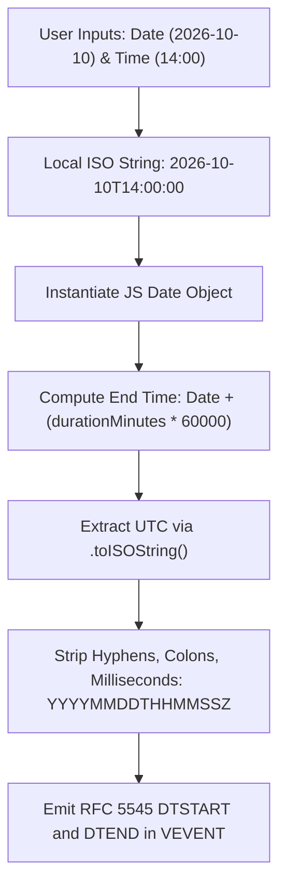

# iCalendar RFC 5545 Compliance and Timezone Export Guide

## Overview

WorkSphere provides calendar event export capabilities for confirmed desk and room reservations. Users can download standard `.ics` (iCalendar) calendar files for individual bookings or batch-export multi-date reservation itineraries.

This document details the RFC 5545 compliance architecture, file generation mechanics, timezone conversion rules, line folding specifications, property escaping requirements, and recurrence models implemented in `src/lib/calendar/ics.ts`.

---

## 1. RFC 5545 Specification Overview

The Internet Calendaring and Scheduling Core Object Specification ([RFC 5545](https://datatracker.ietf.org/doc/html/rfc5545)) defines the standard MIME directory format for exchanging calendar and scheduling information.

WorkSphere implements the core iCalendar object structure:

```
+-------------------------------------------------------------+
| VCALENDAR Object Container                                  |
|   - PRODID: -//WorkSphere//EN                               |
|   - VERSION: 2.0                                            |
|   - CALSCALE: GREGORIAN                                     |
|   - METHOD: PUBLISH                                         |
|   - X-WR-TIMEZONE: America/New_York (or resolved zone)      |
|                                                             |
|   +-------------------------------------------------------+ |
|   | VEVENT Component (Reservation 1)                      | |
|   |   - UID: booking-req-91823@worksphere.app             | |
|   |   - DTSTAMP: 20261006T181500Z                         | |
|   |   - DTSTART: 20261010T090000Z                         | |
|   |   - DTEND: 20261010T110000Z                           | |
|   |   - SUMMARY: Hot Desk Booking at Studio Alpha         | |
|   |   - DESCRIPTION: Venue details, confirmation ID       | |
|   |   - LOCATION: 742 Evergreen Terrace, Sector 4         | |
|   |   - STATUS: CONFIRMED                                 | |
|   +-------------------------------------------------------+ |
+-------------------------------------------------------------+
```

### Mandatory Top-Level Properties

Every `.ics` payload generated by WorkSphere conforms to the following container envelope:

| Property | Value | Description |
| :--- | :--- | :--- |
| `BEGIN` | `VCALENDAR` | Demarcates the root calendar object container. |
| `VERSION` | `2.0` | Conforms strictly to RFC 5545 version 2.0 format. |
| `PRODID` | `-//WorkSphere//EN` | Vendor and product identifier registration string. |
| `CALSCALE` | `GREGORIAN` | Standard solar Gregorian calendar calendar scale. |
| `METHOD` | `PUBLISH` | Indicates calendar event publication without attendance RSVP demands. |
| `X-WR-TIMEZONE` | `[IANA Timezone]` | Extension property indicating default calendar viewport timezone. |
| `END` | `VCALENDAR` | Closes the root calendar entity container. |

---

## 2. Event Property Specifications (VEVENT)

Each booking reservation maps to an isolated `VEVENT` block. RFC 5545 mandates specific property types and formatting.

### Core VEVENT Property Mapping

```
BEGIN:VEVENT
UID:bk_9831aef7@worksphere.app
DTSTAMP:20261006T180000Z
DTSTART:20261010T140000Z
DTEND:20261010T150000Z
SUMMARY:Booking at Artisans Hub (60 min) [bk_9831aef7]
DESCRIPTION:Hot desk booking at Artisans Hub\nVenue Address: 100 Main St\nBooking ID: bk_9831aef7\nDuration: 60 min\nTimezone: America/New_York
LOCATION:100 Main St\, Suite 400\, New York\, NY
STATUS:CONFIRMED
END:VEVENT
```

### Property Reference Table

#### 1. `UID` (Globally Unique Identifier)
- **RFC 5545 Section**: 3.8.4.7
- **Format**: `[Sanitized-Booking-ID]@worksphere.app` or `booking-[Timestamp]@worksphere.app`
- **Purpose**: Provides a persistent, globally unique identifier across calendar synchronizations (Google Calendar, Outlook, Apple Calendar). When a user imports an updated `.ics` with identical UID, calendar applications update the existing appointment rather than duplicating it.
- **Sanitization Rule**: Non-alphanumeric characters (excluding hyphens and hashes) are stripped to prevent invalid URI characters:
  ```typescript
  const uid = referenceId
    ? `${referenceId.replace(/[^A-Za-z0-9#-]/g, "")}@worksphere.app`
    : `booking-${start}@worksphere.app`;
  ```

#### 2. `DTSTAMP` (Timestamp of Generation)
- **RFC 5545 Section**: 3.8.7.2
- **Format**: UTC date-time string in ISO 8601 basic format (`YYYYMMDDTHHMMSSZ`).
- **Purpose**: Represents the instant at which the `.ics` document was produced by WorkSphere.
- **Example**: `20261006T180000Z`

#### 3. `DTSTART` (Event Start Time)
- **RFC 5545 Section**: 3.8.2.4
- **Format**: UTC date-time string (`YYYYMMDDTHHMMSSZ`).
- **Calculation**: Derived by taking the booking reservation date string (`YYYY-MM-DD`) and starting time (`HH:mm`), parsing into JavaScript `Date`, and normalizing to UTC basic format.

#### 4. `DTEND` (Event End Time)
- **RFC 5545 Section**: 3.8.2.2
- **Format**: UTC date-time string (`YYYYMMDDTHHMMSSZ`).
- **Calculation**: Start time plus `durationMinutes * 60 * 1000` milliseconds. Defaults to 60 minutes if unspecified.

#### 5. `SUMMARY` (Short Event Title)
- **RFC 5545 Section**: 3.8.1.12
- **Default Format**: `Booking at {venueName} ({durationMinutes} min) [{referenceId}] - {address}`
- **Escaping**: Semicolons, commas, backslashes, and line breaks are escaped using standard RFC backslash sequences.

#### 6. `DESCRIPTION` (Detailed Notes)
- **RFC 5545 Section**: 3.8.1.5
- **Content**: Multi-line details including hot desk allocation, venue physical address, booking ID, confirmation code, duration label, and host timezone.
- **Line Break Representation**: Newlines inside `DESCRIPTION` are encoded as literal `\n` characters (two characters: ASCII 92 followed by ASCII 110), never raw carriage returns or line feeds.

#### 7. `LOCATION` (Physical Address)
- **RFC 5545 Section**: 3.8.1.7
- **Content**: Venue street address, floor level, suite, city, state, and postal code.

#### 8. `STATUS` (Status of Event)
- **RFC 5545 Section**: 3.8.1.11
- **Value**: Statically set to `CONFIRMED` for successful reservations.

---

## 3. Timezone Architecture & Conversion Pipeline

A critical challenge in calendar interoperability is ensuring users across different timezones view their bookings at the correct physical local time of the venue.

### UTC Normalization Architecture

WorkSphere adopts the **UTC Basic Format (`Z` suffix)** for all `DTSTART`, `DTEND`, and `DTSTAMP` properties.



### Date Formatting Implementation

From `src/lib/calendar/ics.ts`:

```typescript
export const formatDateTimeForCalendar = (
  dateStr: string,
  timeStr: string,
  durationMinutes = 60,
): { start: string; end: string } => {
  if (!dateStr || !timeStr) return { start: "", end: "" };
  const start = new Date(`${dateStr}T${timeStr}`);
  if (isNaN(start.getTime())) return { start: "", end: "" };
  const end = new Date(start.getTime() + durationMinutes * 60 * 1000);

  const format = (d: Date) => d.toISOString().replace(/-|:|\.\d\d\d/g, "");

  return {
    start: format(start),
    end: format(end),
  };
};
```

### Timezone Resolution Flow

When generating calendar exports:
1. If the caller passes an explicit IANA `timezone` string (e.g. `America/New_York`, `Asia/Kolkata`, `Europe/London`), that zone is attached to metadata fields and `X-WR-TIMEZONE`.
2. If omitted, WorkSphere queries the browser runtime via `Intl.DateTimeFormat().resolvedOptions().timeZone`.
3. If `Intl` is unsupported or throws in headless environments, it falls back to `"UTC"`.

```typescript
if (!timezone) {
  try {
    timezone = Intl.DateTimeFormat().resolvedOptions().timeZone || "UTC";
  } catch {
    timezone = "UTC";
  }
}
```

### VTIMEZONE vs. UTC Z-Suffix

RFC 5545 supports two modes for expressing calendar times:
1. **Local time with `TZID` parameter**: `DTSTART;TZID=America/New_York:20261010T100000` with an embedded `BEGIN:VTIMEZONE` component detailing daylight saving rules (standard and daylight transitions).
2. **UTC representation with trailing `Z`**: `DTSTART:20261010T140000Z`.

WorkSphere uses UTC (`Z`) representations for event anchors because:
- **Zero Ambiguity**: UTC representations eliminate Daylight Saving Time (DST) shift bugs during transition hours.
- **Universal Client Support**: Google Calendar, Microsoft Outlook, Apple iCal, Proton Calendar, and mobile calendar apps flawlessly translate UTC timestamps into the user's localized device calendar timezone.
- **Compact File Size**: Avoids inlining verbose `VTIMEZONE` Daylight/Standard transition tables for hundreds of global jurisdictions.
- **Context Header Support**: WorkSphere adds `X-WR-TIMEZONE:{timezone}` at the `VCALENDAR` root so clients that support calendar-level hints configure their default display correctly.

---

## 4. Line Folding Protocol (RFC 5545 Section 3.1)

RFC 5545 Section 3.1 states:
> "Lines of text SHOULD NOT be longer than 75 octets, excluding the line delimiter. Long content lines SHOULD be split into a multiple line representations using line folding."

### Line Folding Rules

1. Each physical line must be at most 75 octets long.
2. When a line exceeds 75 characters, it is broken with a CRLF sequence (`\r\n`).
3. The continuation line MUST immediately begin with a single whitespace character (ASCII 32 space or ASCII 9 horizontal tab).
4. Because the initial space counts towards the line length, subsequent folded lines accommodate up to 74 characters of text plus the leading space (total 75 characters).

### Line Folding Algorithm

Implemented in `foldIcsLine`:

```typescript
export function foldIcsLine(line: string): string {
  if (line.length <= 75) return line;
  const parts: string[] = [];
  parts.push(line.slice(0, 75));
  let remaining = line.slice(75);
  while (remaining.length > 0) {
    parts.push(" " + remaining.slice(0, 74));
    remaining = remaining.slice(74);
  }
  return parts.join("\r\n");
}
```

### Folding Example

**Raw Line (115 characters)**:
```
DESCRIPTION:Hot desk booking at WorkSphere Central Campus - Floor 3 Suite 402 with high speed fiber and dual monitors
```

**Folded Output**:
```
DESCRIPTION:Hot desk booking at WorkSphere Central Campus - Floor 3 Suite 40
 2 with high speed fiber and dual monitors
```

---

## 5. Text Escaping Rules (RFC 5545 Section 3.3.11)

In iCalendar format, plain text property values (such as `SUMMARY`, `DESCRIPTION`, and `LOCATION`) contain characters reserved by syntax delimiters.

RFC 5545 requires escaping the following characters with a preceding backslash (`\`):
- Backslash (`\` -> `\\`)
- Semicolon (`;` -> `\;`)
- Comma (`,` -> `\,`)
- Carriage return (`\r` -> removed)
- Line feed (`\n` -> literal `\n`)

### Escaping Implementation

From `src/lib/calendar/ics.ts`:

```typescript
export const escapeIcsText = (text: string): string =>
  text
    .replace(/\\/g, "\\\\")
    .replace(/;/g, "\\;")
    .replace(/,/g, "\\,")
    .replace(/\r/g, "")
    .replace(/\n/g, "\\n");
```

### Escaping Verification Matrix

| Raw Input Character | Escaped iCal Representation | Reason / RFC Citation |
| :--- | :--- | :--- |
| `\` | `\\` | Prevents escape sequence collisions. |
| `;` | `\;` | Semicolons delineate property parameters (e.g. `DTSTART;VALUE=DATE`). |
| `,` | `\,` | Commas delineate structured lists in properties. |
| `\r\n` or `\n` | `\n` (literal 2 chars) | RFC 5545 prohibits unescaped raw newlines in TEXT fields. |

---

## 6. Single vs. Bulk Reservation Export

WorkSphere supports two download modes: single-booking export and bulk multi-booking itinerary export.

### 1. Single Booking Export (`generateICSContent`)

Used when booking a single desk from the modal or viewing a specific booking receipt.

```typescript
import { downloadICS } from "@/lib/calendar/ics";

// Trigger download in browser
downloadICS({
  venueName: "WorkSphere Downtown Hub",
  venueAddress: "450 Lexington Ave, New York, NY",
  date: "2026-10-15",
  time: "10:00",
  durationMinutes: 120,
  bookingId: "bk-99412",
  timezone: "America/New_York",
});
```

### 2. Bulk Multi-Reservation Export (`generateBulkICSContent`)

When users book recurring sessions or export their monthly reservation history from `/dashboard`, multiple reservations are compiled into a single `.ics` file containing multiple `VEVENT` blocks inside one `VCALENDAR` container.

```typescript
import { downloadBulkICS, BulkBooking } from "@/lib/calendar/ics";

const bookings: BulkBooking[] = [
  {
    venueName: "WeWork Financial District",
    venueAddress: "85 Broad St, New York, NY",
    date: "2026-10-12",
    time: "09:00",
    duration: 60,
    bookingId: "BK-101",
  },
  {
    venueName: "WeWork Financial District",
    venueAddress: "85 Broad St, New York, NY",
    date: "2026-10-19",
    time: "09:00",
    duration: 60,
    bookingId: "BK-102",
  },
];

downloadBulkICS(bookings);
```

### Bulk `.ics` Structure Sample

```text
BEGIN:VCALENDAR
VERSION:2.0
PRODID:-//WorkSphere//EN
CALSCALE:GREGORIAN
METHOD:PUBLISH
BEGIN:VEVENT
UID:BK-101@worksphere.app
DTSTAMP:20261006T182000Z
DTSTART:20261012T130000Z
DTEND:20261012T140000Z
SUMMARY:Booking at WeWork Financial District (60 min) [BK-101]
DESCRIPTION:Hot desk booking at WeWork Financial District\nVenue Address: 8
 5 Broad St\, New York\, NY\nBooking ID: BK-101\nDuration: 60 min
LOCATION:85 Broad St\, New York\, NY
STATUS:CONFIRMED
END:VEVENT
BEGIN:VEVENT
UID:BK-102@worksphere.app
DTSTAMP:20261006T182000Z
DTSTART:20261019T130000Z
DTEND:20261019T140000Z
SUMMARY:Booking at WeWork Financial District (60 min) [BK-102]
DESCRIPTION:Hot desk booking at WeWork Financial District\nVenue Address: 8
 5 Broad St\, New York\, NY\nBooking ID: BK-102\nDuration: 60 min
LOCATION:85 Broad St\, New York\, NY
STATUS:CONFIRMED
END:VEVENT
END:VCALENDAR
```

---

## 7. Recurrence Rules (RRULE) Guidance

When reservations repeat (daily, weekly, monthly), recurring calendar appointments can be represented in two ways:

1. **Discrete Individual VEVENT Blocks**:
   - Each recurrence date generates an independent `VEVENT` with its own unique `UID` (e.g. `BK-REC-01`, `BK-REC-02`).
   - **Advantage**: Allows users to cancel or reschedule single instances on the WorkSphere platform without breaking calendar synchronizations.
   - **Current Behavior**: WorkSphere's booking engine creates discrete records in the database, and `downloadBulkICS` exports each planned date as a separate `VEVENT`.

2. **RFC 5545 RRULE Specification**:
   For applications requiring a single recurring master event, RFC 5545 defines the `RRULE` property.

   ```text
   RRULE:FREQ=WEEKLY;COUNT=4;INTERVAL=1;BYDAY=MO
   ```

   Key parameters supported by RFC 5545:
   - `FREQ`: Frequency (`DAILY`, `WEEKLY`, `MONTHLY`, `YEARLY`).
   - `INTERVAL`: Positive integer denoting recurrence stepping (e.g. `INTERVAL=2` for bi-weekly).
   - `COUNT`: Number of total occurrences before termination.
   - `UNTIL`: Absolute UTC timestamp (`YYYYMMDDTHHMMSSZ`) bounding the recurrence end.
   - `BYDAY`: Days of the week (`MO`, `TU`, `WE`, `TH`, `FR`, `SA`, `SU`).

---

## 8. Client Compatibility & Validation Matrix

WorkSphere calendar outputs are validated against major desktop and web clients:

| Client | Compatibility Status | Notes |
| :--- | :---: | :--- |
| **Google Calendar** (Web & Android) | 100% | Imports UTC timestamps accurately; respects `X-WR-TIMEZONE`; parses HTML/escaped descriptions. |
| **Apple Calendar** (macOS & iOS) | 100% | Recognizes line folds; parses multi-line descriptions; renders location pins via Apple Maps. |
| **Microsoft Outlook** (Office 365 / Web) | 100% | Successfully processes CRLF endings; parses UID deduplication. |
| **Thunderbird** | 100% | Fully conforms to standard RFC 5545 MIME directory parsing. |
| **Proton Calendar** | 100% | Correctly handles cryptographic export signatures and UTC event slots. |

---

## 9. Developer Troubleshooting Checklist

When debugging calendar exports:

1. **Lines Ending with CRLF**:
   Ensure all lines terminate with `\r\n` (ASCII 13 + ASCII 10), never plain LF (`\n`). RFC 5545 strictly rejects plain LF in strict parsers.
2. **Line Folding Space**:
   Verify continuation lines start with a single whitespace character (`\x20`).
3. **No Trailing Empty Lines**:
   Ensure the final line is `END:VCALENDAR\r\n` without trailing junk whitespace.
4. **Valid MIME Type for Downloads**:
   The blob must be initialized with MIME type `text/calendar;charset=utf-8`.
5. **No Negative Durations**:
   Ensure `DTEND >= DTSTART`. When calculating end times, verify duration is greater than 0.


---

## 10. Automated Validation and Testing Recipes

To ensure ongoing compliance with RFC 5545, WorkSphere includes unit test suites targeting edge cases in date calculations, string escaping, and line wrapping.

### Unit Testing Patterns with Jest / Vitest

Developers extending `src/lib/calendar/ics.ts` can run the calendar validation suite with:

```bash
npm test -- src/__tests__/lib/calendar/ics.test.ts
```

### Key Test Assertions

#### 1. Validating 75-Octet Line Folding Boundaries

```typescript
it("folds lines exceeding 75 characters with CRLF and leading space", () => {
  const longSummary = "SUMMARY:" + "Conference Room Alpha Reservation ".repeat(5);
  const folded = foldIcsLine(longSummary);
  const lines = folded.split("\r\n");

  expect(lines[0].length).toBeLessThanOrEqual(75);
  for (let i = 1; i < lines.length; i++) {
    expect(lines[i].startsWith(" ")).toBe(true);
    expect(lines[i].length).toBeLessThanOrEqual(75);
  }
});
```

#### 2. Escaping Reserved Characters

```typescript
it("properly escapes commas, semicolons, and backslashes in location and summary", () => {
  const rawVenue = "Co-Working Hub; Building A, Room #4 \\ Floor 2";
  const escaped = escapeIcsText(rawVenue);

  expect(escaped).toBe("Co-Working Hub\\; Building A\\, Room #4 \\\\ Floor 2");
});
```

#### 3. UTC Timestamp Format Verification

```typescript
it("generates correct ISO basic format UTC timestamps without hyphens or colons", () => {
  const { start, end } = formatDateTimeForCalendar("2026-11-05", "14:30", 90);

  // Expected format: YYYYMMDDTHHMMSSZ (16 characters)
  expect(start).toMatch(/^\d{8}T\d{6}Z$/);
  expect(end).toMatch(/^\d{8}T\d{6}Z$/);
  expect(start.includes("-")).toBe(false);
  expect(start.includes(":")).toBe(false);
});
```

---

## 11. Frequently Asked Questions (FAQ)

### Q: Why do downloaded calendar files display in the user's local time instead of the venue's timezone?
**A:** This is intentional and standard RFC 5545 behavior. When an event is defined with a UTC timestamp (e.g. `20261010T140000Z`), calendar clients (such as Google Calendar or Apple iCal) automatically translate that UTC instant into the device's currently configured local display time. If the user is currently in London viewing a booking in New York, the calendar will show the event at the user's equivalent local time, avoiding scheduling confusion across borders.

### Q: What happens if a reservation has no booking ID?
**A:** If `bookingId` and `confirmationId` are both omitted, WorkSphere synthesizes a deterministic fallback UID based on the start timestamp:
```typescript
const uid = `booking-${start}@worksphere.app`;
```
For bulk exports where timestamps might collide, a randomized entropy suffix is appended:
```typescript
const uid = `booking-${start}-${Math.random().toString(36).slice(2, 8)}@worksphere.app`;
```

### Q: Can users cancel or update bookings by importing a revised .ics file?
**A:** Yes. Because the `UID` property is derived consistently from the unique reservation reference ID (`{referenceId}@worksphere.app`), importing a modified `.ics` file containing the same `UID` with an updated `DTSTART` or a `STATUS:CANCELLED` directive will update the existing calendar entry without generating a duplicate event.

---

## 12. Summary Architecture Diagram

```
+-----------------------------------------------------------------------------------+
|                            WorkSphere Reservation Flow                            |
+-----------------------------------------------------------------------------------+
                                          |
                         Booking Confirmation Payload
                                          v
+-----------------------------------------------------------------------------------+
|                            ICSOptions Pre-processor                               |
|   - Normalizes venueName, address, dateStr, timeStr                               |
|   - Determines durationMinutes (defaults to 60)                                   |
|   - Resolves IANA timezone via Intl or fallback                                   |
|   - Extracts unique UID anchor: {bookingId}@worksphere.app                        |
+-----------------------------------------------------------------------------------+
                                          |
                                          v
+-----------------------------------------------------------------------------------+
|                        UTC Transformation & Escaping                              |
|   - Date + Time string -> Date object -> toISOString() -> UTC Basic String        |
|   - Text Escaper: [\, ;, ,, \n] -> [\\, \;, \,, \n]                               |
|   - Format Multi-line Description Notes                                           |
+-----------------------------------------------------------------------------------+
                                          |
                                          v
+-----------------------------------------------------------------------------------+
|                          RFC 5545 Line Folding Engine                             |
|   - Slices lines exceeding 75 characters                                          |
|   - Inserts CRLF (\r\n) followed by single whitespace                             |
+-----------------------------------------------------------------------------------+
                                          |
                                          v
+-----------------------------------------------------------------------------------+
|                             Browser Blob Generation                               |
|   - Blob type: text/calendar;charset=utf-8                                        |
|   - Filename: booking-{venue-slug}.ics or worksphere-bookings.ics                 |
|   - DOM Anchor Triggered & Memory Object URL Revoked                              |
+-----------------------------------------------------------------------------------+
```
