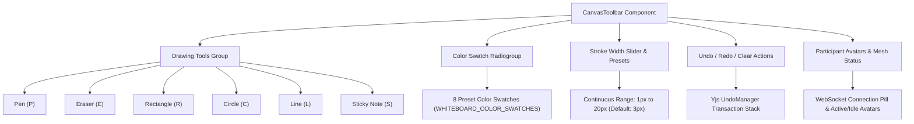

# CanvasToolbar: Drawing Tools, Hotkeys, Color Palettes, and Stroke Width Presets

This technical guide documents WorkSphere’s **CanvasToolbar** component ([`src/components/whiteboard/CanvasToolbar.tsx`](file:///c:/Users/admin/Desktop/workfere/src/components/whiteboard/CanvasToolbar.tsx)), which provides user controls for the collaborative real-time whiteboard canvas ([`src/components/whiteboard/CanvasWhiteboard.tsx`](file:///c:/Users/admin/Desktop/workfere/src/components/whiteboard/CanvasWhiteboard.tsx)). It details all drawing tools, keyboard shortcuts, color swatch palettes, stroke width adjustments, history controls, and presence indicators.

---

## 1. Executive Summary & Architecture Overview

The **CanvasToolbar** is a floating, glassmorphic control surface anchored above or within collaborative whiteboard sessions. It allows co-located and remote team members in WorkSphere hubs to sketch diagrams, annotate architectural blueprints, place agile sticky notes, and adjust vector properties synchronously.



### Key Capabilities
- **6 Vector & Annotation Tools:** Freehand pen, background eraser, geometric shapes (rectangles, circles, lines), and Markdown-ready sticky notes.
- **Keyboard Shortcut Ergonomics:** Immediate hotkey tool switching (`P`, `E`, `S`, etc.) allowing fluid sketching without toolbar clicking.
- **Accessible Color Swatches:** Radiogroup with ARIA roles, high-contrast active rings, keyboard focus navigation, and custom hex color representation.
- **Continuous Stroke Width Dynamics:** Granular adjustment slider ranging from delicate lines ($1\text{px}$) to bold markers ($20\text{px}$).
- **History & Collaboration Telemetry:** Undo/Redo stack hooks, destructive canvas wipe with pen reset, and live participant presence rings with idle timeouts.

---

## 2. Drawing Tools Specification

The toolbar supports 6 distinct tool types defined in `ToolType` ([`src/hooks/useCanvasWhiteboard.ts`](file:///c:/Users/admin/Desktop/workfere/src/hooks/useCanvasWhiteboard.ts)):

```typescript
export type ToolType = "pen" | "eraser" | "rect" | "circle" | "line" | "sticky";
```

### 2.1 Tool Catalog

| Tool ID | Label | Hotkey | Vector Rendering Engine | Primary Use Case |
| :--- | :--- | :---: | :--- | :--- |
| `pen` | **Pen** | <kbd>P</kbd> | Continuous point interpolation with round line caps/joins | Freeform sketching, handwriting, and whiteboard scribbles |
| `eraser` | **Eraser** | <kbd>E</kbd> | Background canvas stroke blending (`#1a1a2e`) | Erasing freehand strokes and clearing pencil markings |
| `rect` | **Rectangle** | <kbd>R</kbd> | Bounding-box coordinate stroke (`ctx.strokeRect`) | Wireframing layouts, system boundaries, and UI containers |
| `circle` | **Circle** | <kbd>C</kbd> | Parametric ellipse stroke (`ctx.ellipse`) | Process nodes, state machines, and highlight rings |
| `line` | **Line** | <kbd>L</kbd> | Direct origin-to-destination vector (`ctx.lineTo`) | Connectors, workflow arrows, and structural dividers |
| `sticky` | **Sticky Note** | <kbd>S</kbd> | HTML-over-Canvas absolute coordinate sticky card | Brainstorming thoughts, backlog items, and retro feedback |

### 2.2 Active State Visual Indicators

When a tool is selected:
- The active button receives high-contrast background highlights (`bg-zinc-700 text-white`).
- Inactive tools remain subdued (`text-zinc-400 hover:bg-zinc-800 hover:text-zinc-200`) to minimize visual distraction during deep collaboration.

---

## 3. Keyboard Shortcuts & Hotkey Reference

The whiteboard system listens for single-key inputs to switch active tools instantly.

### 3.1 Shortcut Reference Table

| Key | Action / Selected Tool | Target Component / State |
| :---: | :--- | :--- |
| <kbd>P</kbd> | Activate **Pen** tool | `onToolChange("pen")` |
| <kbd>E</kbd> | Activate **Eraser** tool | `onToolChange("eraser")` |
| <kbd>S</kbd> | Activate **Sticky Note** tool | `onToolChange("sticky")` |
| <kbd>R</kbd> | Activate **Rectangle** tool | `onToolChange("rect")` |
| <kbd>C</kbd> | Activate **Circle** tool | `onToolChange("circle")` |
| <kbd>L</kbd> | Activate **Line** tool | `onToolChange("line")` |
| <kbd>Ctrl</kbd> + <kbd>Z</kbd> / <kbd>⌘</kbd> + <kbd>Z</kbd> | **Undo** last action | `onUndo()` |
| <kbd>Ctrl</kbd> + <kbd>Y</kbd> / <kbd>⌘</kbd> + <kbd>Shift</kbd> + <kbd>Z</kbd> | **Redo** undone action | `onRedo()` |
| <kbd>Enter</kbd> / <kbd>Space</kbd> | Select focused color swatch | `onColorChange(swatch.hex)` |

> [!NOTE]
> Keyboard hotkeys are disabled when the user has focused a text input or textarea (such as editing a Sticky Note) to prevent accidental tool switching during typing.

---

## 4. Color Swatches & Palette Architecture

Colors are defined in `WHITEBOARD_COLOR_SWATCHES` ([`src/hooks/useCanvasWhiteboard.ts`](file:///c:/Users/admin/Desktop/workfere/src/hooks/useCanvasWhiteboard.ts)). The palette consists of 8 carefully tuned pigments optimized for both light and dark canvas backgrounds:

```typescript
export interface ColorSwatch {
  name: string;
  hex: string;
}

export const WHITEBOARD_COLOR_SWATCHES: readonly ColorSwatch[] = [
  { name: "Black",   hex: "#000000" },
  { name: "Indigo",  hex: "#6366f1" },
  { name: "Blue",    hex: "#3b82f6" },
  { name: "Emerald", hex: "#10b981" },
  { name: "Amber",   hex: "#f59e0b" },
  { name: "Rose",    hex: "#f43f5e" },
  { name: "Purple",  hex: "#a855f7" },
  { name: "Orange",  hex: "#f97316" },
] as const;
```

### 4.1 Swatch Palette Reference

| Swatch Name | Hex Code | Visual Preview | Recommended Use Case |
| :--- | :---: | :---: | :--- |
| **Black** | `#000000` | `■` | Primary lines, high-contrast text, outlines |
| **Indigo** | `#6366f1` | `■` | Architecture blocks, database entities |
| **Blue** | `#3b82f6` | `■` | Default drawing color, hyperlinks, UI flows |
| **Emerald** | `#10b981` | `■` | Approvals, success states, green-path milestones |
| **Amber** | `#f59e0b` | `■` | Sticky notes, warnings, work-in-progress markers |
| **Rose** | `#f43f5e` | `■` | Errors, blockers, critical bugs, deletions |
| **Purple** | `#a855f7` | `■` | Product design, creative review annotations |
| **Orange** | `#f97316` | `■` | Attention items, external integrations |

### 4.2 Accessibility & Keyboard Focus

The color palette container is marked up with semantic ARIA attributes:
- `role="radiogroup"` with `aria-label="Color palette"`.
- Each swatch button renders as `role="radio"` with `aria-checked={isActive}` and `aria-label="Select {name} color"`.
- Selecting an active swatch triggers a `scale-110` expansion, white border ring, and central indicator dot.
- Full keyboard navigation: users can press <kbd>Space</kbd> or <kbd>Enter</kbd> to activate the focused swatch.

---

## 5. Stroke Width Controls & Preset Dynamics

The stroke width control combines a numeric badge with an HTML5 range input for continuous calibration.

### 5.1 Stroke Width Parameters

| Parameter | Value | Details |
| :--- | :---: | :--- |
| **Minimum Width** | `1px` | Fine architectural lines and detailed text |
| **Default Width** | `3px` | Standard drawing and sketching width |
| **Maximum Width** | `20px` | Bold highlighting and thick structural borders |
| **Step Interval** | `1px` | Smooth linear increment |
| **Color Accent** | Blue (`accent-blue-500`) | Native browser slider thumb accent |

```tsx
<div className="flex items-center gap-1">
  <span className="text-xs text-zinc-400">{strokeWidth}</span>
  <input
    type="range"
    min={1}
    max={20}
    value={strokeWidth}
    onChange={(e) => onStrokeWidthChange(Number(e.target.value))}
    className="h-1 w-16 cursor-pointer accent-blue-500"
    title="Stroke width"
  />
</div>
```

---

## 6. History Actions & Presence Collaboration

### 6.1 Undo, Redo, and Clear Actions

- **Undo (`onUndo`):** Reverts the most recent shape or vector stroke created by the local user. Disabled (`opacity-30`) when `canUndo` is false.
- **Redo (`onRedo`):** Restores an undone action. Disabled (`opacity-30`) when `canRedo` is false.
- **Clear Canvas (`onClear`):** Destructive action that wipes local shape snapshots and broadcasts a purge to peers. Automatically resets the active tool back to `pen`.

### 6.2 Collaborative Presence Indicators

When other users join the room (`participants` prop):
- **Avatar Rings:** Displays circular participant avatars with border colors matching each participant's cursor hue.
- **Idle Status Badge:** If a participant is inactive for $\ge 45\text{s}$ (`IDLE_TIMEOUT_MS = 45000`), an amber badge appears on their avatar and their opacity drops to 50%.
- **Hover Tooltips:** Hovering over a participant displays their display name and status (e.g. `Jane Doe (Idle)`).
- **Network Status Pill:** Green dot indicates active WebRTC/WebSocket mesh connection; amber dot indicates connecting/reconnecting state.

---

## 7. Component API Reference (`CanvasToolbarProps`)

```typescript
export interface CanvasToolbarProps {
  /** Currently active tool */
  tool: ToolType;
  /** Currently selected color in hex string format (e.g., #3b82f6) */
  color: string;
  /** Current stroke width in pixels (1 - 20) */
  strokeWidth: number;
  /** Whether the undo stack has elements to revert */
  canUndo: boolean;
  /** Whether the redo stack has elements to reapply */
  canRedo: boolean;
  /** WebSocket or WebRTC mesh connectivity flag */
  isConnected: boolean;
  /** Optional list of connected room participants */
  participants?: WhiteboardParticipant[];
  /** Callback invoked when the user selects a drawing tool */
  onToolChange: (tool: ToolType) => void;
  /** Callback invoked when a color swatch is clicked */
  onColorChange: (color: string) => void;
  /** Callback invoked when the stroke width slider changes */
  onStrokeWidthChange: (width: number) => void;
  /** Callback invoked to revert the last local change */
  onUndo: () => void;
  /** Callback invoked to reapply an undone action */
  onRedo: () => void;
  /** Destructive action to wipe all shapes from the canvas */
  onClear: () => void;
}
```

---

## 8. Developer Integration Example

```tsx
import { useState } from "react";
import { CanvasToolbar } from "@/components/whiteboard/CanvasToolbar";
import type { ToolType } from "@/hooks/useCanvasWhiteboard";

export function CustomWhiteboardWorkspace() {
  const [tool, setTool] = useState<ToolType>("pen");
  const [color, setColor] = useState<string>("#3b82f6");
  const [strokeWidth, setStrokeWidth] = useState<number>(3);

  return (
    <div className="flex flex-col items-center p-4">
      <CanvasToolbar
        tool={tool}
        color={color}
        strokeWidth={strokeWidth}
        canUndo={true}
        canRedo={false}
        isConnected={true}
        onToolChange={setTool}
        onColorChange={setColor}
        onStrokeWidthChange={setStrokeWidth}
        onUndo={() => console.log("Undo")}
        onRedo={() => console.log("Redo")}
        onClear={() => {
          console.log("Canvas cleared");
          setTool("pen");
        }}
      />
    </div>
  );
}
```
