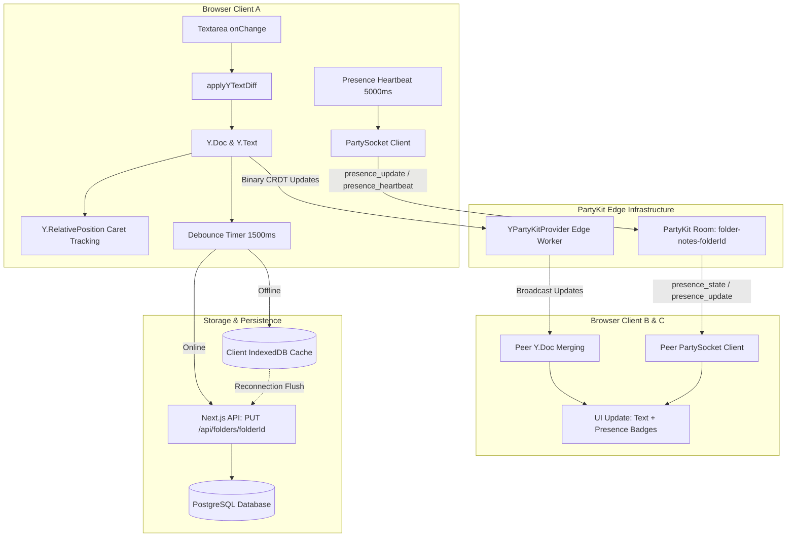
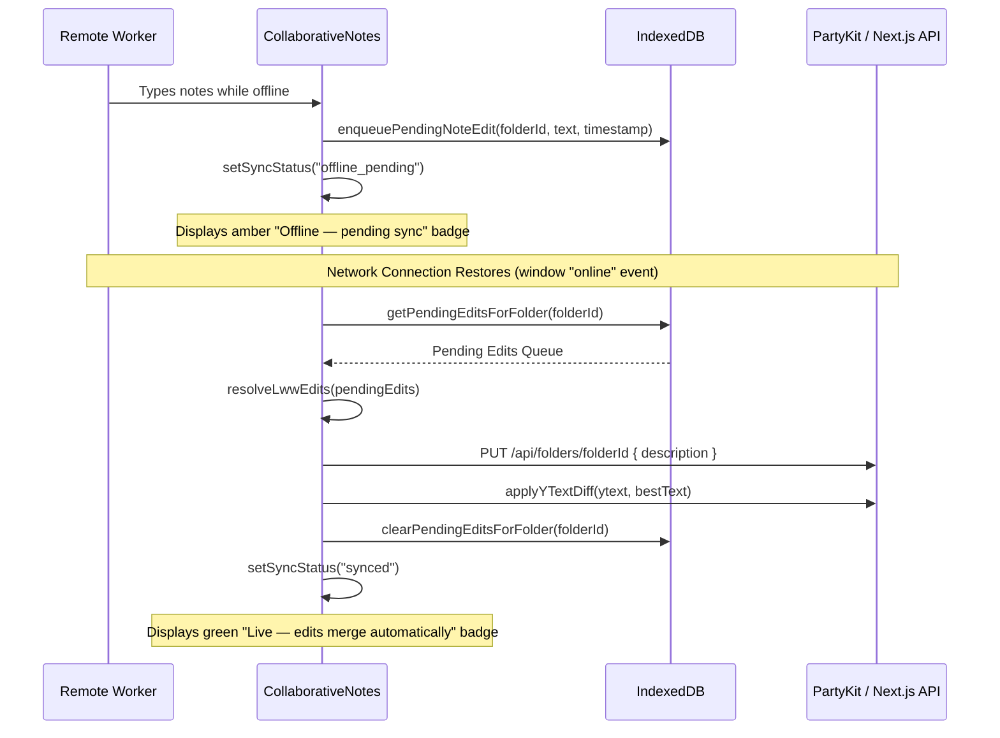

# `CollaborativeNotes` Component Guide: Architecture, State Management, and Markdown Formatting

## 1. Executive Summary & Architectural Overview

The `CollaborativeNotes` component ([`src/components/collections/CollaborativeNotes.tsx`](file:///c:/Users/admin/Desktop/workfere/src/components/collections/CollaborativeNotes.tsx)) provides real-time, conflict-free collaborative text editing for shared venue collections and workspace bookmark folders in WorkSphere. It enables distributed teams and remote coworkers to collaboratively annotate shared venue lists, compile meeting location agendas, and track venue logistical details (e.g., parking codes, WiFi credentials, noise levels) simultaneously without merge conflicts or lost updates.

### Core Architectural Pillars

1. **Conflict-Free Replicated Data Types (CRDT)**:
   - Uses **Yjs** (`Y.Doc` and `Y.Text`) as the mathematical substrate for deterministic character-level delta reconciliation.
   - Text diffs are calculated and applied using minimal character slice operations (`applyYTextDiff`), preventing cursor jumping and whole-string overwrites.
2. **Real-Time Edge Synchronization via PartyKit**:
   - Manages state replication over WebSocket channels backed by Cloudflare Workers and PartyKit (`y-partykit/provider` and `partysocket/react`).
   - Rooms are partitioned per folder: `folder-notes-{folderId}`.
3. **Presence & Awareness Protocol**:
   - Transmits live collaborator presence, cursor positions, and typing status every 5 seconds or upon active typing events.
   - Renders animated presence badges, active green indicators, and typing bubbles in the UI.
4. **Offline-First Resilience**:
   - Caches notes locally in **IndexedDB** (`offlineNotesSync.ts`).
   - Automatically enqueues pending offline edits when disconnected and flushes them using Last-Write-Wins (LWW) conflict resolution upon reconnection.
5. **PostgreSQL Snapshot Persistence**:
   - Debounces database writes (1500ms) to update `Folder.description` in PostgreSQL via `/api/folders/{id}` for fast SSR previews, PDF exports, and public share pages.

---

## 2. System Architecture & Data Flow



---

## 3. Component Props & TypeScript Signatures

### 3.1 `CollaborativeNotesProps` Interface

```typescript
export interface CollaborativeNotesProps {
  /**
   * The unique folder or collection identifier.
   * Resolves the PartyKit room name: `folder-notes-${folderId}`.
   * If omitted, falls back to `roomId` or "default-folder".
   */
  folderId?: string;

  /**
   * Optional direct PartyKit room name override.
   * If provided as `folder-notes-xyz`, automatically resolves `folderId` as `xyz`.
   */
  roomId?: string;

  /**
   * Initial seed text populated when the shared CRDT document is newly created.
   * Clamped to MAX_COLLECTION_NOTES_LENGTH (500 characters).
   * @default null
   */
  initialText?: string | null;

  /**
   * Whether the current active user has permission to edit the note.
   * When false, the textarea is set to read-only and actions (delete/edit) are disabled.
   * @default true
   */
  canEdit?: boolean;

  /**
   * Optional custom Tailwind CSS classes appended to the wrapper `<section>`.
   * @default ""
   */
  className?: string;

  /**
   * Custom user override object for testing or embedded environments where
   * Clerk authentication context is not directly mounted.
   */
  currentUser?: {
    userId?: string;
    userName?: string;
    avatarUrl?: string;
  };
}
```

### 3.2 Props Reference Table

| Prop Name | Type | Required | Default | Description |
| :--- | :--- | :--- | :--- | :--- |
| `folderId` | `string` | No* | `"default-folder"` | Unique collection identifier. *Must provide either `folderId` or `roomId`. |
| `roomId` | `string` | No | `undefined` | Room name identifier (e.g., `"folder-notes-123"`). |
| `initialText` | `string \| null` | No | `null` | Initial fallback/legacy text loaded from collection snapshot. |
| `canEdit` | `boolean` | No | `true` | Read/write permission toggle for current session. |
| `className` | `string` | No | `""` | Additional styling classes for the container. |
| `currentUser` | `object` | No | Clerk context | Explicit collaborator identity (`userId`, `userName`, `avatarUrl`). |

---

## 4. Presence & Collaborator Data Models

### 4.1 `CollaboratorPresence` Interface

Each active collaborator in the PartyKit room broadcasts their state across the socket connection:

```typescript
export interface CollaboratorPresence {
  userId: string;              // Unique user ID (from Clerk or prop)
  userName: string;            // Full display name or username
  avatarUrl?: string;          // User profile image URL
  cursorPosition?: number | null; // Caret offset inside textarea
  isTyping: boolean;           // True when user recently typed (<2500ms)
  lastActive: number;          // Epoch timestamp of last heartbeat
}
```

### 4.2 `SyncStatus` State Union

```typescript
type SyncStatus =
  | "synced"           // All changes saved in PostgreSQL and synced over WebSocket
  | "saving"           // Snapshot actively being persisted to /api/folders/{id}
  | "connecting"       // Initial WebSocket handshake in progress
  | "offline"          // Network offline; reading from IndexedDB
  | "offline_pending"; // Offline edits queued in IndexedDB awaiting network
```

---

## 5. State Management & Lifecycle Deep Dive

The component coordinates multiple internal React hooks, timers, and CRDT references to ensure seamless real-time collaboration.

### 5.1 Internal References (`useRef`)

```typescript
const isLocalTypingRef = useRef(false);
const typingTimerRef = useRef<ReturnType<typeof setTimeout> | null>(null);
const textareaRef = useRef<HTMLTextAreaElement>(null);
const ytextRef = useRef<Y.Text | null>(null);
const selectionRef = useRef<{
  start: Y.RelativePosition;
  end: Y.RelativePosition;
} | null>(null);
const snapshotTimerRef = useRef<ReturnType<typeof setTimeout> | null>(null);
const lastDeletedTextRef = useRef<string | null>(null);
```

### 5.2 Relative Caret Position Tracking

When remote collaborators insert or delete characters in the shared note, naive `textarea.value` updates force the local user's caret cursor to jump to the end of the text.

To prevent this disruptive behavior, `CollaborativeNotes` tracks cursor selection as **Yjs Relative Positions**:

```typescript
// 1. Capture caret position as relative to CRDT character tokens
const rememberSelection = useCallback(() => {
  const el = textareaRef.current;
  const ytext = ytextRef.current;
  if (!el || !ytext) return;
  selectionRef.current = {
    start: Y.createRelativePositionFromTypeIndex(ytext, el.selectionStart),
    end: Y.createRelativePositionFromTypeIndex(ytext, el.selectionEnd),
  };
}, []);

// 2. Restore absolute caret position after remote transaction merges
if (!event.transaction.local && el && sel && document.activeElement === el) {
  requestAnimationFrame(() => {
    const start = Y.createAbsolutePositionFromRelativePosition(sel.start, doc);
    const end = Y.createAbsolutePositionFromRelativePosition(sel.end, doc);
    if (start && end) {
      el.setSelectionRange(start.index, end.index);
    }
  });
}
```

### 5.3 Debounce Timing Constants

| Constant | Duration | Purpose |
| :--- | :--- | :--- |
| `SNAPSHOT_DEBOUNCE_MS` | `1500ms` | Debounces HTTP `PUT /api/folders/{id}` snapshot calls after local edits stop. |
| `TYPING_TIMEOUT_MS` | `2500ms` | Resets local user's `isTyping = false` presence status after inactivity. |
| `HEARTBEAT_INTERVAL_MS` | `5000ms` | Periodic socket ping transmitting presence and refreshing active state. |
| `MAX_COLLECTION_NOTES_LENGTH`| `500 chars`| Hard length ceiling mirroring database schema constraints. |

---

## 6. Supported Markdown Formatting Rules & Shortcuts

While `CollaborativeNotes` utilizes a lightweight, accessible `<textarea>` for optimal performance and mobile virtual keyboard compatibility, the text stored represents standard GitHub-Flavored Markdown (GFM).

The note content is consumed across WorkSphere in multiple presentation modes:
- **Rendered Markdown Mode**: In collection detail modals, PDF export engines, and public shared collection viewports.
- **Raw Textarea Mode**: Within the collaborative editor for rapid zero-latency annotation.

### 6.1 Markdown Formatting Reference Table

| Syntax Name | Markdown Pattern | Example Input | Rendered Result |
| :--- | :--- | :--- | :--- |
| **Heading 1** | `# Text` | `# Downtown Hubs` | <h1>Downtown Hubs</h1> |
| **Heading 2** | `## Text` | `## Wi-Fi & Seating` | <h2>Wi-Fi & Seating</h2> |
| **Heading 3** | `### Text` | `### Quiet Corner` | <h3>Quiet Corner</h3> |
| **Bold** | `**Text**` or `__Text__` | `**Password: guest2026**` | **Password: guest2026** |
| **Italic** | `*Text*` or `_Text_` | `*Bring headphones*` | *Bring headphones* |
| **Strikethrough** | `~~Text~~` | `~~No outlets available~~` | ~~No outlets available~~ |
| **Inline Code** | `` `code` `` | `` `SSID: WorkSphere_5G` `` | `SSID: WorkSphere_5G` |
| **Fenced Code** | ` ```lang\ncode\n``` ` | ` ```text\nCode: 9812\n``` ` | Preformatted code block |
| **Unordered List** | `- Item` or `* Item` | `- 2nd floor balcony\n- Quiet zone` | • 2nd floor balcony<br>• Quiet zone |
| **Ordered List** | `1. Item` | `1. Check-in\n2. Grab coffee` | 1. Check-in<br>2. Grab coffee |
| **Task Checkbox (Open)** | `- [ ] Task` | `- [ ] Book desk #12` | ☐ Book desk #12 |
| **Task Checkbox (Done)**| `- [x] Task` | `- [x] Verify fast WiFi` | ☑ Verify fast WiFi |
| **Blockquote** | `> Quote` | `> Closes early on Fridays` | ❝ Closes early on Fridays |
| **Hyperlink** | `[Label](url)` | `[Map Link](https://maps.google.com)`| <a href="...">Map Link</a> |
| **Venue Link** | `[Name](/venues/{id})` | `[Central Cafe](/venues/c101)` | Internal router link |
| **Horizontal Rule** | `---` or `***` | `---` | Divider line `<hr>` |

### 6.2 Recommended Keyboard & Text Conventions

```text
# Team Workspace Plan
- [x] Check power outlets near window
- [ ] Test upload speed for Zoom calls

> Door passcode: 4892# (valid until 8 PM)
```

> [!NOTE]
> Notes are capped at **500 characters** (`MAX_COLLECTION_NOTES_LENGTH`). Ensure team members use concise, bulleted markdown for optimal formatting.

---

## 7. Real-Time Presence & Multiplayer Protocol

### 7.1 WebSocket Socket Messages

The `usePartySocket` hook communicates with PartyKit via structured JSON messages:

#### 1. Outbound Presence Announcement (`presence_update`)
Fired immediately when the socket connects or when the user begins/stops typing:
```json
{
  "type": "presence_update",
  "userId": "user_2aBCde12345",
  "userName": "Sarah Connor",
  "avatarUrl": "https://img.clerk.com/avatar1.png",
  "cursorPosition": 42,
  "isTyping": true,
  "lastActive": 1728384000000
}
```

#### 2. Outbound Heartbeat (`presence_heartbeat`)
Fired periodically every 5000ms (`HEARTBEAT_INTERVAL_MS`):
```json
{
  "type": "presence_heartbeat",
  "userId": "user_2aBCde12345",
  "userName": "Sarah Connor",
  "avatarUrl": "https://img.clerk.com/avatar1.png",
  "isTyping": false,
  "lastActive": 1728384005000
}
```

#### 3. Inbound State Snapshot (`presence_state`)
Received upon room entry to populate all currently active collaborators:
```json
{
  "type": "presence_state",
  "users": [
    {
      "userId": "user_9xYZab67890",
      "userName": "Marcus Vance",
      "avatarUrl": "https://img.clerk.com/avatar2.png",
      "cursorPosition": 120,
      "isTyping": false,
      "lastActive": 1728384004000
    }
  ]
}
```

#### 4. Inbound Departure Notification (`presence_leave` / `presence_remove`)
Dispatched when a remote peer disconnects or experiences timeout pruning:
```json
{
  "type": "presence_leave",
  "userId": "user_9xYZab67890"
}
```

---

## 8. Offline-First Synchronization & Conflict Resolution

### 8.1 IndexedDB Local Storage Architecture

When remote workers work in low-connectivity spaces (e.g., transit, basements, cafes with captive portals), `CollaborativeNotes` automatically guarantees zero data loss via `src/lib/offlineNotesSync.ts`.



### 8.2 Last-Write-Wins (LWW) Resolution Logic

If a client produces multiple edits while disconnected, the offline sync engine sorts edits by high-resolution timestamps before applying them to the Yjs CRDT:

```typescript
export function resolveLwwEdits(edits: PendingNoteEdit[]): PendingNoteEdit | null {
  if (!edits.length) return null;
  return edits.reduce((latest, current) =>
    current.timestamp > latest.timestamp ? current : latest
  );
}
```

---

## 9. Undo & Recovery Workflow

To prevent accidental data loss when clearing notes, `CollaborativeNotes` implements an atomic delete and restore action backed by the WorkSphere toast notification system:

```typescript
const handleDeleteNotes = useCallback(() => {
  if (!canEdit || !text) return;
  const previousText = text;
  lastDeletedTextRef.current = previousText;

  // Clear local and CRDT state
  setText("");
  const ytext = ytextRef.current;
  if (ytext) {
    applyYTextDiff(ytext, "");
  }

  // Display Undo Toast
  toast("Notes deleted", "info", {
    label: "Undo",
    onClick: () => {
      if (lastDeletedTextRef.current !== null) {
        const restored = lastDeletedTextRef.current;
        setText(restored);
        const currentYtext = ytextRef.current;
        if (currentYtext) {
          applyYTextDiff(currentYtext, restored);
        }
        lastDeletedTextRef.current = null;
        toast("Notes restored", "success");
      }
    },
  });
}, [canEdit, text, toast]);
```

---

## 10. Code Integration Examples

### Example 1: Embedding in Venue Collection Page

Embed inside [`src/app/collections/[id]/page.tsx`](file:///c:/Users/admin/Desktop/workfere/src/app/collections/[id]/page.tsx):

```tsx
import React from "react";
import { CollaborativeNotes } from "@/components/collections/CollaborativeNotes";
import { getCollectionById } from "@/lib/data/collections";
import { auth } from "@clerk/nextjs/server";

interface CollectionPageProps {
  params: Promise<{ id: string }>;
}

export default async function CollectionDetailPage({ params }: CollectionPageProps) {
  const { id } = await params;
  const { userId } = await auth();
  const collection = await getCollectionById(id);

  const canEdit = collection.ownerId === userId || collection.isCollaborative;

  return (
    <main className="max-w-5xl mx-auto px-4 py-8">
      <header className="mb-6">
        <h1 className="text-2xl font-bold text-zinc-900 dark:text-zinc-100">
          {collection.title}
        </h1>
        <p className="text-sm text-zinc-500">
          Created by {collection.ownerName} • {collection.venues.length} venues
        </p>
      </header>

      {/* Embedded Real-Time Collaborative Notes */}
      <section className="bg-zinc-50 dark:bg-zinc-900/60 p-5 rounded-2xl border border-zinc-200 dark:border-zinc-800 mb-8">
        <CollaborativeNotes
          folderId={collection.id}
          initialText={collection.description}
          canEdit={canEdit}
          className="mt-0"
        />
      </section>

      {/* Venue Cards Grid */}
      <div className="grid grid-cols-1 md:grid-cols-2 gap-4">
        {collection.venues.map((venue) => (
          <VenueCard key={venue.id} venue={venue} />
        ))}
      </div>
    </main>
  );
}
```

### Example 2: Read-Only Guest Mode in Public Share Drawer

```tsx
import { CollaborativeNotes } from "@/components/collections/CollaborativeNotes";

export function SharedCollectionDrawer({
  collectionId,
  cachedDescription,
}: {
  collectionId: string;
  cachedDescription: string;
}) {
  return (
    <div className="p-4">
      <h3 className="text-sm font-semibold text-zinc-700 dark:text-zinc-300 mb-2">
        Shared Team Notes
      </h3>
      <CollaborativeNotes
        folderId={collectionId}
        initialText={cachedDescription}
        canEdit={false} // Read-only mode prevents edits and hides delete buttons
      />
    </div>
  );
}
```

### Example 3: Embedding with Custom User Override

For testing or headless container usage where Clerk session cookies are decoupled:

```tsx
import { CollaborativeNotes } from "@/components/collections/CollaborativeNotes";

export function TeamSpacePreview() {
  return (
    <CollaborativeNotes
      folderId="team-planning-2026"
      initialText="Meeting starts at 10 AM in the North Library."
      currentUser={{
        userId: "user_test_42",
        userName: "Dev Lead",
        avatarUrl: "/images/avatars/dev-lead.png",
      }}
    />
  );
}
```

### Example 4: Advanced Markdown Helper Toolbar Wrapper

Teams wishing to provide graphical shortcut buttons (Bold, Italic, Checklists) can wrap `CollaborativeNotes` with a quick formatting utility:

```tsx
"use client";

import React, { useRef } from "react";
import { CollaborativeNotes } from "@/components/collections/CollaborativeNotes";
import { Bold, Italic, List, CheckSquare, Link2 } from "lucide-react";

interface MarkdownToolbarProps {
  folderId: string;
  canEdit?: boolean;
}

export function CollaborativeNotesWithToolbar({ folderId, canEdit = true }: MarkdownToolbarProps) {
  const containerRef = useRef<HTMLDivElement>(null);

  const applyMarkdownPrefix = (prefix: string, suffix = "") => {
    if (!containerRef.current) return;
    const textarea = containerRef.current.querySelector("textarea");
    if (!textarea) return;

    const start = textarea.selectionStart;
    const end = textarea.selectionEnd;
    const val = textarea.value;
    const selected = val.substring(start, end);

    const replacement = `${prefix}${selected || "text"}${suffix}`;
    const nextVal = val.substring(0, start) + replacement + val.substring(end);

    // Trigger synthetic input event so React and Yjs pick up the change
    const nativeInputValueSetter = Object.getOwnPropertyDescriptor(
      window.HTMLTextAreaElement.prototype,
      "value"
    )?.set;
    nativeInputValueSetter?.call(textarea, nextVal);

    const ev = new Event("input", { bubbles: true });
    textarea.dispatchEvent(ev);
    textarea.focus();
    textarea.setSelectionRange(start + prefix.length, start + prefix.length + (selected.length || 4));
  };

  return (
    <div ref={containerRef} className="space-y-2">
      {canEdit && (
        <div className="flex items-center gap-1 bg-zinc-100 dark:bg-zinc-800/80 p-1.5 rounded-lg border border-zinc-200 dark:border-zinc-700/60 w-fit">
          <button
            type="button"
            onClick={() => applyMarkdownPrefix("**", "**")}
            aria-label="Bold text"
            className="p-1 rounded text-zinc-600 dark:text-zinc-300 hover:bg-white dark:hover:bg-zinc-700 transition"
            title="Bold (**text**)"
          >
            <Bold className="w-3.5 h-3.5" />
          </button>
          <button
            type="button"
            onClick={() => applyMarkdownPrefix("*", "*")}
            aria-label="Italic text"
            className="p-1 rounded text-zinc-600 dark:text-zinc-300 hover:bg-white dark:hover:bg-zinc-700 transition"
            title="Italic (*text*)"
          >
            <Italic className="w-3.5 h-3.5" />
          </button>
          <button
            type="button"
            onClick={() => applyMarkdownPrefix("- ")}
            aria-label="Bulleted list"
            className="p-1 rounded text-zinc-600 dark:text-zinc-300 hover:bg-white dark:hover:bg-zinc-700 transition"
            title="Bulleted list (- item)"
          >
            <List className="w-3.5 h-3.5" />
          </button>
          <button
            type="button"
            onClick={() => applyMarkdownPrefix("- [ ] ")}
            aria-label="Task item"
            className="p-1 rounded text-zinc-600 dark:text-zinc-300 hover:bg-white dark:hover:bg-zinc-700 transition"
            title="Task checkbox (- [ ] task)"
          >
            <CheckSquare className="w-3.5 h-3.5" />
          </button>
          <button
            type="button"
            onClick={() => applyMarkdownPrefix("[", "](https://)")}
            aria-label="Insert link"
            className="p-1 rounded text-zinc-600 dark:text-zinc-300 hover:bg-white dark:hover:bg-zinc-700 transition"
            title="Insert link ([label](url))"
          >
            <Link2 className="w-3.5 h-3.5" />
          </button>
        </div>
      )}

      <CollaborativeNotes folderId={folderId} canEdit={canEdit} />
    </div>
  );
}
```

---

## 11. Testing & Mocking Strategy

When testing components that embed `CollaborativeNotes`, Jest and Playwright require mocking the underlying WebSocket and PartyKit providers:

### 11.1 Mocking in Jest (`__tests__/components/CollaborativeNotes.test.tsx`)

```typescript
// Mock PartyKit Provider
jest.mock("y-partykit/provider", () => {
  return jest.fn().mockImplementation(() => ({
    on: jest.fn(),
    off: jest.fn(),
    destroy: jest.fn(),
    ws: { readyState: 1 },
  }));
});

// Mock PartySocket
jest.mock("partysocket/react", () => {
  return jest.fn().mockImplementation(({ onOpen, onMessage }) => ({
    readyState: 1,
    send: jest.fn(),
    close: jest.fn(),
  }));
});

// Mock IndexedDB Offline Sync
jest.mock("@/lib/offlineNotesSync", () => ({
  loadCachedNote: jest.fn().mockResolvedValue(null),
  cacheNoteLocally: jest.fn().mockResolvedValue(undefined),
  enqueuePendingNoteEdit: jest.fn().mockResolvedValue(undefined),
  getPendingEditsForFolder: jest.fn().mockResolvedValue([]),
  clearPendingEditsForFolder: jest.fn().mockResolvedValue(undefined),
  resolveLwwEdits: jest.fn().mockReturnValue(null),
}));
```

---

## 12. UI Styling, Dark Mode & Accessibility (a11y)

### 12.1 Tailwind CSS Class Hierarchy

- **Container**: `mt-4 ${className}` with `data-testid="collaborative-notes-container"`.
- **Presence Bar**: `flex items-center justify-between gap-3 border-b border-zinc-200 dark:border-zinc-800 pb-2.5 mb-2.5`.
- **Collaborator Chip**: `rounded-full bg-zinc-100 dark:bg-zinc-800/90 border border-zinc-200 dark:border-zinc-700/70 text-xs`.
- **Active Indicator**: `w-2 h-2 rounded-full bg-emerald-500 ring-1 ring-white dark:ring-zinc-900`.
- **Typing Bubble**: `rounded-full bg-blue-100 dark:bg-blue-950 border border-blue-300 dark:border-blue-800 text-blue-600 dark:text-blue-400`.
- **Textarea**: `w-full px-3.5 py-2.5 text-sm rounded-xl border border-zinc-200 dark:border-zinc-800 bg-white dark:bg-zinc-900 text-zinc-800 dark:text-zinc-200 placeholder:text-zinc-400 focus:outline-none focus:ring-2 focus:ring-blue-500/20 read-only:bg-zinc-50 dark:read-only:bg-zinc-900/50`.

### 12.2 Accessibility Checklist

- [x] **Accessible Form Association**: `<label>` with `htmlFor="collection-notes-input-{folderId}"` and matching `id` on `<textarea>`.
- [x] **Screen Reader Alerts**: Status indicator and typing banner utilize `aria-live="polite"` to announce presence and sync events without interrupting user screen-reader output.
- [x] **Descriptive ARIA Labels**: Active collaborator list features `aria-label="Active collaborators"`; online status indicators include hidden text `<span className="sr-only">Active</span>`.
- [x] **Focus Management**: Proper high-contrast focus rings (`focus:ring-2 focus:ring-blue-500/20`) adhering to WCAG 2.1 AA standards.
- [x] **Keyboard Accessibility**: Delete and undo actions can be triggered entirely via standard Tab and Enter / Space navigation.

---

## 13. Troubleshooting & FAQ

### Q1: Why does my cursor jump when a coworker types?
Ensure `rememberSelection()` is called on `onSelect`, `onKeyUp`, and `onClick`. The component uses `Y.RelativePosition` to map characters before and after remote transactions. If using an external custom wrapper, make sure not to trigger uncontrolled React re-mounts.

### Q2: How does the component handle the 500-character limit?
The textarea enforces `maxLength={MAX_COLLECTION_NOTES_LENGTH}` (500). If remote concurrent insertions cause the merged Yjs text to exceed 500 characters, the snapshot persistence slice (`currentContent.slice(0, MAX_COLLECTION_NOTES_LENGTH)`) ensures backend PostgreSQL schemas do not reject the payload.

### Q3: What happens if PartyKit WebSocket servers are temporarily down?
`CollaborativeNotes` automatically enters degraded offline mode (`syncStatus = "offline_pending"`). Edits are saved into IndexedDB and buffered. Once connection to the PartyKit host (`process.env.NEXT_PUBLIC_PARTYKIT_HOST`) is re-established, the queue flushes automatically.

---

## 14. Component Summary & Quick Reference

```typescript
// Quick Import
import { CollaborativeNotes } from "@/components/collections/CollaborativeNotes";

// Minimal Invocation
<CollaborativeNotes folderId="folder-uuid-123" />
```

- **Room URI Pattern**: `folder-notes-{folderId}`
- **Persistence Target**: `PUT /api/folders/{folderId}`
- **IndexedDB Store**: `collaborative-notes-store` (`offlineNotesSync.ts`)
- **CRDT Key**: `collection-notes` (`collectionNotes.ts`)
