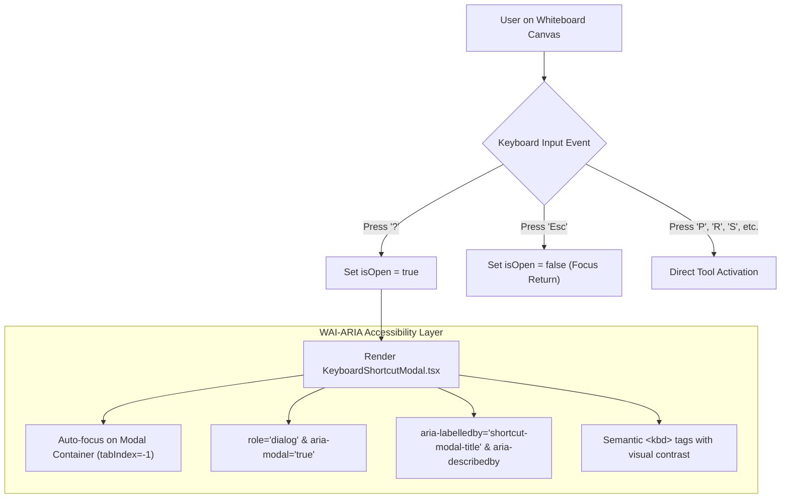

# KeyboardShortcutModal: Canvas Hotkeys, Trigger Key (?), and Accessibility ARIA Specifications

This technical guide documents the **KeyboardShortcutModal** component ([`src/components/whiteboard/KeyboardShortcutModal.tsx`](file:///c:/Users/admin/Desktop/workfere/src/components/whiteboard/KeyboardShortcutModal.tsx)), which provides a contextual keyboard shortcut overlay for the collaborative canvas ([`src/components/whiteboard/CanvasWhiteboard.tsx`](file:///c:/Users/admin/Desktop/workfere/src/components/whiteboard/CanvasWhiteboard.tsx)). It details all available hotkeys, the <kbd>?</kbd> modal trigger, and screen reader accessibility compliance (WCAG 2.1 AA / WAI-ARIA 1.2).

---

## 1. Executive Summary & Component Overview

Power users and remote teams working on collaborative whiteboards rely on quick keyboard interactions to switch tools, revert strokes, export designs, and format sticky notes without breaking flow. 

The **KeyboardShortcutModal** displays an accessible dialog detailing all operational shortcuts. Users can summon the cheatsheet at any moment by pressing <kbd>?</kbd> (<kbd>Shift</kbd> + <kbd>/</kbd>) or by clicking the help icon in the canvas toolbar.



---

## 2. Complete Keyboard Shortcuts Reference

The following table documents all canvas hotkeys grouped by functional category:

| Category | Shortcut Keys | Action | Description / State Mutation |
| :--- | :---: | :--- | :--- |
| **Tools** | <kbd>V</kbd> or <kbd>1</kbd> | **Select / Pointer** | Selects, transforms, or moves shapes and sticky notes. |
| **Tools** | <kbd>P</kbd> or <kbd>2</kbd> | **Pen Tool** | Activates freehand drawing with continuous line interpolation. |
| **Tools** | <kbd>E</kbd> or <kbd>3</kbd> | **Eraser Tool** | Erases freehand markings and line strokes. |
| **Tools** | <kbd>R</kbd> or <kbd>4</kbd> | **Rectangle Tool** | Draws rectangular wireframe containers and bounds. |
| **Tools** | <kbd>C</kbd> or <kbd>5</kbd> | **Circle / Ellipse** | Creates parametric ellipses and system architecture nodes. |
| **Tools** | <kbd>L</kbd> or <kbd>6</kbd> | **Line Tool** | Draws straight connector vectors between diagrams. |
| **Tools** | <kbd>S</kbd> or <kbd>7</kbd> | **Sticky Note Tool** | Creates an editable collaborative sticky note card. |
| **Actions**| <kbd>Ctrl</kbd> + <kbd>Z</kbd> / <kbd>⌘</kbd> + <kbd>Z</kbd> | **Undo** | Reverts the last local drawing action or state update. |
| **Actions**| <kbd>Ctrl</kbd> + <kbd>Y</kbd> / <kbd>⌘</kbd> + <kbd>Shift</kbd> + <kbd>Z</kbd> | **Redo** | Reapplies an undone drawing transaction. |
| **Actions**| <kbd>Ctrl</kbd> + <kbd>Shift</kbd> + <kbd>E</kbd> | **Export PNG** | Triggers offscreen render and downloads transparent PNG. |
| **Actions**| <kbd>Ctrl</kbd> + <kbd>Shift</kbd> + <kbd>S</kbd> | **Export SVG** | Generates scalable XML vector file with embedded web fonts. |
| **Actions**| <kbd>Delete</kbd> / <kbd>Backspace</kbd> | **Delete Selected** | Purges active selected item from the Yjs CRDT document. |
| **General**| <kbd>?</kbd> | **Toggle Shortcuts** | Toggles the `KeyboardShortcutModal` visibility. |
| **General**| <kbd>Esc</kbd> | **Close / Deselect** | Dismisses modal or returns active tool to pointer. |

---

## 3. Accessibility & WAI-ARIA Dialog Compliance

The modal conforms strictly to **WAI-ARIA Authoring Practices for Modal Dialogs**:

### 3.1 ARIA Attributes
- **`role="dialog"`:** Declares the container as an accessible dialog widget to screen readers (NVDA, JAWS, VoiceOver).
- **`aria-modal="true"`:** Signals to assistive technologies that content outside the modal boundary is inert.
- **`aria-labelledby="shortcut-modal-title"`:** Links dialog label directly to the `<h2>` header text.
- **`aria-describedby="shortcut-modal-desc"`:** Describes modal trigger behavior to the user upon initial focus announcement.

### 3.2 Keyboard Navigation & Focus Trap
- **Automatic Focus Trapping:** When opened, the dialog container receives focus via `modalRef.current?.focus()`, ensuring screen readers announce the modal immediately.
- **Escape Key Listener:** Pressing <kbd>Escape</kbd> invokes `onClose()`.
- **Backdrop Click Dismissal:** Clicking outside the modal container on the backdrop triggers `onClose()`, with `e.stopPropagation()` safeguarding dialog clicks.
- **Semantic `<kbd>` Tags:** Shortcut combinations are rendered inside semantic `<kbd>` tags with high contrast ratios ($\ge 7:1$) against dark zinc backgrounds.

---

## 4. Programmatic Integration & Code Example

To integrate the modal into a custom canvas or workspace view:

```tsx
"use client";

import React, { useState, useEffect } from "react";
import { KeyboardShortcutModal } from "@/components/whiteboard/KeyboardShortcutModal";

export function CollaborativeCanvasContainer() {
  const [isShortcutModalOpen, setIsShortcutModalOpen] = useState(false);

  // Global listener for the '?' shortcut key
  useEffect(() => {
    const handleGlobalKeyDown = (e: KeyboardEvent) => {
      // Don't trigger when user is typing in input or textarea
      const target = e.target as HTMLElement;
      if (target.tagName === "INPUT" || target.tagName === "TEXTAREA" || target.isContentEditable) {
        return;
      }

      if (e.key === "?" || (e.shiftKey && e.key === "/")) {
        e.preventDefault();
        setIsShortcutModalOpen((prev) => !prev);
      }
    };

    window.addEventListener("keydown", handleGlobalKeyDown);
    return () => window.removeEventListener("keydown", handleGlobalKeyDown);
  }, []);

  return (
    <div className="relative h-screen w-full bg-zinc-950">
      {/* Canvas UI Controls */}
      <header className="flex justify-between p-4 border-b border-zinc-800">
        <h1 className="text-lg font-semibold text-white">Whiteboard Room</h1>
        <button
          type="button"
          onClick={() => setIsShortcutModalOpen(true)}
          className="rounded-lg bg-zinc-800 px-3 py-1.5 text-xs text-zinc-300 hover:text-white"
          title="Keyboard shortcuts (?)"
        >
          Shortcuts <kbd className="ml-1 px-1 bg-zinc-700 rounded font-mono">?</kbd>
        </button>
      </header>

      {/* Main Whiteboard Canvas Area */}
      <main className="h-full">
        {/* DrawingCanvas goes here */}
      </main>

      {/* Keyboard Shortcut Modal */}
      <KeyboardShortcutModal
        isOpen={isShortcutModalOpen}
        onClose={() => setIsShortcutModalOpen(false)}
      />
    </div>
  );
}
```

---

## 5. Component Props Interface

```typescript
export interface KeyboardShortcutModalProps {
  /** Controls visible state of the modal dialog */
  isOpen: boolean;
  /** Callback fired when the user dismisses the modal (via Esc, backdrop click, or close button) */
  onClose: () => void;
}
```
