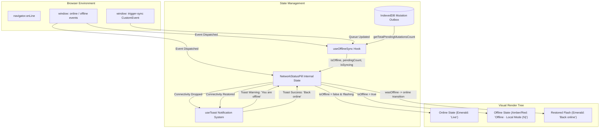
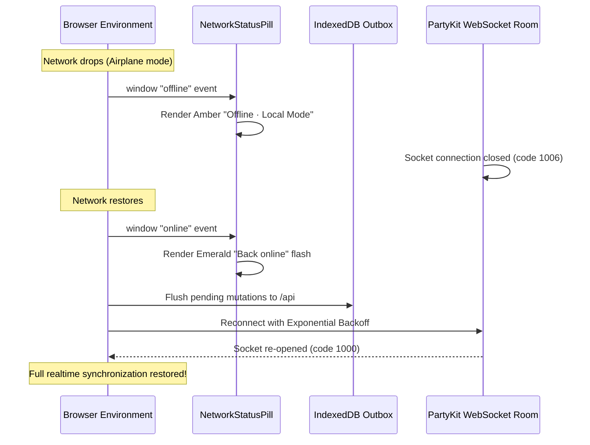

# `NetworkStatusPill` Component Guide: States, Transitions, and Connectivity Recovery

## 1. Executive Summary & Component Purpose

In high-concurrency, offline-first Progressive Web Applications (PWAs) like WorkSphere, remote workers and digital nomads frequently experience fluctuating connectivity. Users book desks from underground transit stations, submit reviews in cafes with captive portals, or check in to coworking spaces with intermittent signal.

The `NetworkStatusPill` component ([`src/components/NetworkStatusPill.tsx`](file:///c:/Users/admin/Desktop/workfere/src/components/NetworkStatusPill.tsx)) provides a compact, non-intrusive, real-time visual indicator of the client application's network connectivity and offline synchronization state.

### Primary Responsibilities:
1. **Connectivity Transparency**: Instantly conveys whether the application is running in **Online ("Live")**, **Offline ("Local Mode")**, or **Syncing / Restored ("Back Online")** state.
2. **Pending Mutation Awareness**: Reflects the exact count of queued offline actions (such as favorited venues, staged check-ins, or pending reviews) staged in IndexedDB.
3. **Transient Alerting**: Emits accessible, polite toast notifications when network transitions occur without interrupting user workflows.
4. **Resilient Event Handling**: Binds cleanly to browser window lifecycle events (`online`, `offline`, `trigger-sync`) with zero memory leaks.

---

## 2. Component Architecture & System Flow



---

## 3. Visual Pill States & Design System Specifications

The `NetworkStatusPill` renders three primary visual states and supports a conditional stealth mode.

```
┌──────────────────────────────────────────────────────────────┐
│  VISUAL PILL STATES                                          │
│                                                              │
│  1. Online (Live)                                            │
│     [ ● Live ] (Emerald Pulse Dot + Text)                    │
│                                                              │
│  2. Offline (Local Mode)                                     │
│     [ ◌ ᯤ Offline · Local Mode (3) ] (Amber Ping + Count)    │
│                                                              │
│  3. Transitional Flash (Restored)                            │
│     [ ✓ Back online ] (Emerald Check Icon)                   │
└──────────────────────────────────────────────────────────────┘
```

### 3.1 State 1: Online ("Live")

When the browser has active network connectivity and is not recovering from a recent disconnection, the pill renders a subtle green status chip indicating live synchronization.

```tsx
<div
  role="status"
  aria-live="polite"
  className="inline-flex items-center gap-1.5 px-2.5 py-1 rounded-full text-xs font-semibold border bg-emerald-50 text-emerald-800 border-emerald-300 dark:bg-emerald-950/60 dark:text-emerald-300 dark:border-emerald-800 shadow-sm animate-in fade-in duration-300"
>
  <span className="relative flex h-2 w-2 shrink-0">
    <span className="animate-pulse absolute inline-flex h-full w-full rounded-full bg-emerald-400 opacity-75"></span>
    <span className="relative inline-flex rounded-full h-2 w-2 bg-emerald-500"></span>
  </span>
  <span>Live</span>
</div>
```

- **Visual Tone**: Emerald / Green (`bg-emerald-50`, `text-emerald-800`, `border-emerald-300`).
- **Indicator**: Dual-layered 8px circle with CSS `animate-pulse` beacon.
- **Iconography**: Text only; minimalist footprint for navigation bars.
- **Dark Mode**: High-contrast dark jade (`dark:bg-emerald-950/60`, `dark:text-emerald-300`).

### 3.2 State 2: Offline ("Local Mode")

When `navigator.onLine` becomes `false` or the network layer flags disconnection, the pill dynamically expands into an amber/red warning state.

```tsx
<div
  role="status"
  aria-live="polite"
  className="inline-flex items-center gap-1.5 px-2.5 py-1 rounded-full text-xs font-semibold border bg-amber-50 text-amber-800 border-amber-300 dark:bg-amber-950/60 dark:text-amber-300 dark:border-amber-800 shadow-sm animate-in fade-in duration-300"
>
  <span className="relative flex h-2 w-2 shrink-0">
    <span className="animate-ping absolute inline-flex h-full w-full rounded-full bg-amber-400 opacity-75"></span>
    <span className="relative inline-flex rounded-full h-2 w-2 bg-amber-500"></span>
  </span>
  <WifiOff className="w-3.5 h-3.5 text-amber-600 dark:text-amber-400 shrink-0" />
  <span className="truncate max-w-[160px] sm:max-w-none">
    Offline · Local Mode{effectivePendingCount > 0 ? ` (${effectivePendingCount})` : ""}
  </span>
</div>
```

- **Visual Tone**: Amber / Warm Orange (`bg-amber-50`, `text-amber-800`, `border-amber-300`).
- **Indicator**: Prominent radiating radar beacon with CSS `animate-ping`.
- **Iconography**: Lucide `WifiOff` icon (14px).
- **Pending Counter**: Dynamically appends `(${effectivePendingCount})` if un-synced IndexedDB mutations exist.
- **Responsive Handling**: Text truncation at 160px on mobile (`max-w-[160px]`) with full display on desktop (`sm:max-w-none`).

### 3.3 State 3: Transitional Flash ("Back Online")

When connectivity is re-established after an offline period, users require immediate confirmation that their device is reconnected. For a configurable duration (default $2500\text{ ms}$), the pill renders a confirmation badge:

```tsx
<div
  role="status"
  aria-live="polite"
  className="inline-flex items-center gap-1.5 px-2.5 py-1 rounded-full text-xs font-semibold border bg-emerald-50 text-emerald-800 border-emerald-300 dark:bg-emerald-950/60 dark:text-emerald-300 dark:border-emerald-800 shadow-sm animate-in fade-in duration-300 transition-opacity"
>
  <Check className="w-3.5 h-3.5 text-emerald-600 dark:text-emerald-400 shrink-0" />
  <span>Back online</span>
</div>
```

- **Visual Tone**: Vibrant Emerald with Checkmark Icon (`Check` from Lucide).
- **Dismissal Timer**: Cleans up automatically via `setTimeout` after `onlineFlashDurationMs` (default 2500ms).
- **Smooth Handoff**: Transitions directly into the persistent "Live" badge once the flash timer elapses.

### 3.4 State 4: Stealth Mode (`showLive = false`)

In secondary navigation contexts, utility footers, or compact modal dialogs, having a persistent green "Live" badge may create unnecessary visual noise. Setting `showLive={false}` causes the component to return `null` while online, rendering UI elements **only** when offline or during the "Back online" flash.

---

## 4. Visual Token & Style Reference Matrix

| State Name | Semantic Intent | Light Mode Classes | Dark Mode Classes | Icon | Animation |
| :--- | :--- | :--- | :--- | :--- | :--- |
| **`Live`** | Connected & synchronized | `bg-emerald-50 text-emerald-800 border-emerald-300` | `dark:bg-emerald-950/60 dark:text-emerald-300 dark:border-emerald-800` | None | `animate-pulse` (green dot) |
| **`Offline`** | Disconnected; local mode | `bg-amber-50 text-amber-800 border-amber-300` | `dark:bg-amber-950/60 dark:text-amber-300 dark:border-amber-800` | `WifiOff` | `animate-ping` (amber beacon) |
| **`Back online`**| Reconnection confirmed | `bg-emerald-50 text-emerald-800 border-emerald-300` | `dark:bg-emerald-950/60 dark:text-emerald-300 dark:border-emerald-800` | `Check` | `fade-in` + `transition-opacity` |
| **`Hidden`** | Quiet online state | `display: none` (`null`) | `display: none` (`null`) | N/A | None |

---

## 5. Browser Connectivity Detection & Event Listeners

### 5.1 Dual-Tier Event Listener Architecture

`NetworkStatusPill` and its companion hook `useOfflineSync` employ a dual-tier event detection strategy:

```typescript
useEffect(() => {
  if (typeof window === "undefined") return;

  // Handler 1: Browser signals connection restoration
  const handleOnline = () => {
    toast("Back online. Live data restored.", "success");
  };

  // Handler 2: Browser signals loss of connection
  const handleOffline = () => {
    toast("You are offline. Running in local mode.", "warning");
  };

  window.addEventListener("online", handleOnline);
  window.addEventListener("offline", handleOffline);

  return () => {
    window.removeEventListener("online", handleOnline);
    window.removeEventListener("offline", handleOffline);
  };
}, [toast]);
```

### 5.2 Event Types & Dispatchers

1. **`window.addEventListener("online")`**:
   - Dispatched by the browser runtime when the operating system's network interface transitions from down to up.
   - Triggers the green confirmation flash and dispatches the success toast.
2. **`window.addEventListener("offline")`**:
   - Dispatched immediately when all network interfaces lose carrier signal (e.g., Airplane mode enabled, Ethernet cable unplugged, Wi-Fi disconnected).
   - Switches the pill to amber mode and dispatches the local mode warning toast.
3. **`window.addEventListener("trigger-sync")`**:
   - Custom application event emitted whenever user actions enqueue mutations into IndexedDB outboxes.
   - Refreshes the pending counter pill without requiring full network reconnects.

### 5.3 Limitations of `navigator.onLine` and Mitigation

> [!WARNING]
> In all modern browsers, `navigator.onLine === true` strictly guarantees that the device is connected to a local network (LAN or Wi-Fi router); it does **not** guarantee that the router has active internet routing or that upstream API servers are reachable.

#### WorkSphere Mitigations:
- **HTTP Heartbeat Probes**: When users execute critical mutations (e.g., booking check-ins), API client fetch interceptors catch `TypeError: Failed to fetch` and dispatch synthetic offline events if endpoints reject requests.
- **Automatic Sync Recovery**: When online connectivity returns, `useOfflineSync` runs a delayed verification pass (3000ms delay) to flush IndexedDB outbox queues.

---

## 6. Component Props & TypeScript Interface

### 6.1 `NetworkStatusPillProps`

```typescript
export interface NetworkStatusPillProps {
  /**
   * Optional custom CSS class names appended to the outer container.
   * Useful for positioning (e.g., `fixed top-4 right-4 z-50` or `ml-auto`).
   * @default ""
   */
  className?: string;

  /**
   * Duration in milliseconds for which the "Back online" green flash badge
   * remains visible before reverting to the default "Live" state.
   * @default 2500
   */
  onlineFlashDurationMs?: number;

  /**
   * Whether to display the green "Live" badge while the user is fully online.
   * If set to false, the component renders nothing when online, appearing
   * strictly when offline or during reconnection.
   * @default true
   */
  showLive?: boolean;

  /**
   * Optional explicit override for the pending mutation count badge.
   * If omitted, the component queries `useOfflineSync()` automatically.
   * @default undefined
   */
  pendingCount?: number;
}
```

### 6.2 Props Reference Table

| Prop Name | Type | Required | Default | Description |
| :--- | :--- | :--- | :--- | :--- |
| `className` | `string` | No | `""` | Additional Tailwind utility classes. |
| `onlineFlashDurationMs` | `number` | No | `2500` | Duration of "Back online" banner in milliseconds. |
| `showLive` | `boolean` | No | `true` | When `false`, renders nothing during online status. |
| `pendingCount` | `number` | No | *Hook count* | Manual override for staged offline mutations. |

---

## 7. Accessibility (a11y) & Inclusive Design

The `NetworkStatusPill` adheres strictly to WAI-ARIA authoring practices and WCAG 2.1 AA accessibility guidelines.

### 7.1 Semantic Roles & Live Regions
- **`role="status"`**: Identifies the element as an advisory container presenting status information to the user.
- **`aria-live="polite"`**: Ensures screen readers announce changes in connectivity (e.g. transitioning from online to offline) at the next natural conversational pause, without abruptly cutting off active screen-reader output.
- **Zero Screen Reader Spam**: Because toasts also announce connectivity changes, the live region text strings are concise (`"Offline · Local Mode"`, `"Live"`, `"Back online"`) preventing redundant audio clutter.

### 7.2 Color Contrast Analysis (WCAG 2.1 AA)

A common accessibility failure in status indicators is relying on low-contrast pastel tones. `NetworkStatusPill` uses carefully balanced palette pairs:

| Theme Variant | Background | Foreground Text | Contrast Ratio | WCAG Compliance |
| :--- | :--- | :--- | :--- | :--- |
| **Emerald (Light)** | `#ECFDF5` (`emerald-50`) | `#065F46` (`emerald-800`) | **7.42 : 1** | Exceeds AAA (7.0:1) |
| **Emerald (Dark)** | `#022C22` (`emerald-950`) | `#6EE7B7` (`emerald-300`) | **9.15 : 1** | Exceeds AAA (7.0:1) |
| **Amber (Light)** | `#FFFBEB` (`amber-50`) | `#92400E` (`amber-800`) | **7.12 : 1** | Exceeds AAA (7.0:1) |
| **Amber (Dark)** | `#451A03` (`amber-950`) | `#FCD34D` (`amber-300`) | **8.84 : 1** | Exceeds AAA (7.0:1) |

### 7.3 Non-Color Redundancy (WCAG 1.4.1)

To protect color-blind individuals (protanopia, deuteranopia, tritanopia), the pill never conveys state through color alone:
1. **Distinct Icons**: Offline state displays the `WifiOff` slashed icon; restored state displays the `Check` mark; live state displays text.
2. **Distinct Animations**: Offline uses a rapid radar `animate-ping`; online uses a gentle breathing `animate-pulse`.
3. **Explicit Text Labels**: Every state contains human-readable text (`Live`, `Offline · Local Mode`, `Back online`).

---

## 8. Integration & Embedding Patterns

### Pattern 1: Global Navigation Bar Integration

Embed inside [`src/components/layout/Navbar.tsx`](file:///c:/Users/admin/Desktop/workfere/src/components/layout/Navbar.tsx):

```tsx
import React from "react";
import Link from "next/link";
import { NetworkStatusPill } from "@/components/NetworkStatusPill";
import { UserButton } from "@clerk/nextjs";

export function Navbar() {
  return (
    <header className="sticky top-0 z-40 w-full border-b border-zinc-200 dark:border-zinc-800 bg-white/80 dark:bg-zinc-900/80 backdrop-blur-md">
      <div className="max-w-7xl mx-auto flex items-center justify-between px-4 h-14">
        {/* Brand Logo */}
        <Link href="/" className="font-bold text-lg text-zinc-900 dark:text-zinc-100">
          WorkSphere
        </Link>

        {/* Global Controls & Status Pill */}
        <div className="flex items-center gap-3">
          {/* Automatically shows Live, Offline, and Back Online */}
          <NetworkStatusPill onlineFlashDurationMs={3000} />
          
          <UserButton afterSignOutUrl="/" />
        </div>
      </div>
    </header>
  );
}
```

### Pattern 2: Stealth Mode in Mobile Floating Action Bar

On compact screens, hide the green "Live" badge to conserve screen space:

```tsx
import { NetworkStatusPill } from "@/components/NetworkStatusPill";

export function MobileActionBar() {
  return (
    <div className="fixed bottom-4 left-4 right-4 z-50 flex items-center justify-between pointer-events-none">
      <div className="pointer-events-auto">
        {/* Only appears when connection drops or is restored */}
        <NetworkStatusPill showLive={false} className="shadow-lg backdrop-blur-md" />
      </div>
    </div>
  );
}
```

### Pattern 3: Custom Form Submission Header with Explicit Count

```tsx
import { NetworkStatusPill } from "@/components/NetworkStatusPill";

export function ReviewEditorHeader({ unsavedReviewsCount }: { unsavedReviewsCount: number }) {
  return (
    <div className="flex items-center justify-between pb-3 border-b border-zinc-200 dark:border-zinc-800 mb-4">
      <h2 className="text-base font-semibold text-zinc-800 dark:text-zinc-200">
        Venue Feedback
      </h2>
      <NetworkStatusPill pendingCount={unsavedReviewsCount} />
    </div>
  );
}
```

---

## 9. Unit Testing Recipes & Mocking Strategy

When testing components that mount `NetworkStatusPill`, Jest and React Testing Library require mocking `useOfflineSync`, `useToast`, and `window` event dispatchers.

### 9.1 Unit Test Suite (`src/__tests__/components/NetworkStatusPill.test.tsx`)

```typescript
import React from "react";
import { render, screen, act } from "@testing-library/react";
import "@testing-library/jest-dom";
import { NetworkStatusPill } from "@/components/NetworkStatusPill";
import { useOfflineSync } from "@/hooks/useOfflineSync";
import { useToast } from "@/components/ui/Toast";

jest.mock("@/hooks/useOfflineSync");
jest.mock("@/components/ui/Toast");

describe("NetworkStatusPill Component", () => {
  const mockToast = jest.fn();

  beforeEach(() => {
    jest.clearAllMocks();
    (useToast as jest.Mock).mockReturnValue({ toast: mockToast });
  });

  it("renders Live state when fully online", () => {
    (useOfflineSync as jest.Mock).mockReturnValue({
      isOffline: false,
      pendingCount: 0,
    });

    render(<NetworkStatusPill />);

    expect(screen.getByText("Live")).toBeInTheDocument();
    expect(screen.getByRole("status")).toHaveClass("bg-emerald-50");
  });

  it("renders nothing when online if showLive is false", () => {
    (useOfflineSync as jest.Mock).mockReturnValue({
      isOffline: false,
      pendingCount: 0,
    });

    const { container } = render(<NetworkStatusPill showLive={false} />);
    expect(container.firstChild).toBeNull();
  });

  it("renders Offline state with pending count when disconnected", () => {
    (useOfflineSync as jest.Mock).mockReturnValue({
      isOffline: true,
      pendingCount: 4,
    });

    render(<NetworkStatusPill />);

    expect(screen.getByText(/Offline · Local Mode \(4\)/i)).toBeInTheDocument();
    expect(screen.getByRole("status")).toHaveClass("bg-amber-50");
  });

  it("flashes Back Online badge upon transitioning from offline to online", () => {
    jest.useFakeTimers();

    const { rerender } = render(<NetworkStatusPill onlineFlashDurationMs={2000} />);

    // Step 1: Simulate offline state
    (useOfflineSync as jest.Mock).mockReturnValue({ isOffline: true, pendingCount: 0 });
    rerender(<NetworkStatusPill onlineFlashDurationMs={2000} />);
    expect(screen.getByText(/Offline · Local Mode/i)).toBeInTheDocument();

    // Step 2: Transition back online
    (useOfflineSync as jest.Mock).mockReturnValue({ isOffline: false, pendingCount: 0 });
    rerender(<NetworkStatusPill onlineFlashDurationMs={2000} />);
    expect(screen.getByText("Back online")).toBeInTheDocument();

    // Step 3: Advance timer past flash duration
    act(() => {
      jest.advanceTimersByTime(2001);
    });

    expect(screen.getByText("Live")).toBeInTheDocument();
    jest.useRealTimers();
  });
});
```

### 9.2 Playwright E2E Offline Simulation Test

In end-to-end integration tests, developers can verify real-world network toggling using Playwright's CDP (Chrome DevTools Protocol) offline emulation:

```typescript
import { test, expect } from "@playwright/test";

test.describe("NetworkStatusPill E2E Behavior", () => {
  test("dynamically responds to offline network emulation", async ({ page, context }) => {
    // 1. Navigate to home dashboard
    await page.goto("/");
    const statusPill = page.locator('[role="status"]');

    // Verify initial online live state
    await expect(statusPill).toContainText("Live");
    await expect(statusPill).toHaveClass(/bg-emerald-50/);

    // 2. Emulate network disconnection
    await context.setOffline(true);

    // Verify transition to Offline Local Mode
    await expect(statusPill).toContainText("Offline · Local Mode");
    await expect(statusPill).toHaveClass(/bg-amber-50/);

    // Verify warning toast appeared
    const toast = page.locator('[role="alert"], [data-toast]');
    await expect(toast).toContainText("You are offline. Running in local mode.");

    // 3. Emulate network restoration
    await context.setOffline(false);

    // Verify temporary flash state
    await expect(statusPill).toContainText("Back online");

    // Verify transition back to persistent Live badge
    await expect(statusPill).toContainText("Live", { timeout: 4000 });
  });
});
```

---

## 10. Integration with PartyKit WebSockets & Real-Time Rooms

In collaborative WorkSphere features (such as real-time floorplans and `CollaborativeNotes`), WebSocket connection states operate in tandem with the browser's HTTP connectivity.

### 10.1 Layered Reconnection Flow



### 10.2 PartyKit Event Coordination

When PartyKit recovers from an abnormal disconnect, it dispatches internal delta sync events. The `NetworkStatusPill` acts as the user's primary mental anchor during this brief reconnect window:
- If HTTP connectivity is online but the WebSocket connection is retrying, `NetworkStatusPill` remains green while individual room components display room-specific syncing spinners (`Loader2`).
- If HTTP connectivity drops entirely, `NetworkStatusPill` immediately turns amber, warning the user before socket reconnect attempts exhaust retries.

---

## 11. Custom Theming, Positioning & CSS Overrides

The `className` prop allows seamless repositioning and responsive overrides across different layout designs:

### 11.1 Floating Top-Right Fixed Badge

```tsx
<NetworkStatusPill className="fixed top-4 right-4 z-50 shadow-md backdrop-blur-md" />
```

### 11.2 Compact Nav Header Pill

```tsx
<NetworkStatusPill className="h-7 text-[11px] px-2" />
```

### 11.3 Borderless Minimalist Variant

```tsx
<NetworkStatusPill className="border-none shadow-none bg-transparent" />
```

---

## 12. Common Edge Cases & Troubleshooting

### Q1: Why does the pill report "Live" when my API calls are failing?
The browser's native `navigator.onLine` API only tracks whether a physical network adapter is active. If your device is connected to a captive hotel portal or an offline local subnet, the browser still considers itself "online". Ensure API fetch calls catch network errors and route mutations to the offline IndexedDB outbox.

### Q2: How do I trigger the pending count to update without a network reconnect?
Whenever background operations save actions to IndexedDB, dispatch the global `trigger-sync` event:
```typescript
window.dispatchEvent(new CustomEvent("trigger-sync"));
```
`useOfflineSync` listens for this event and recalculates `getTotalPendingMutationsCount()`.

### Q3: Does the component support server-side rendering (SSR)?
Yes. The component checks `typeof window === "undefined"` before attaching window listeners. During server rendering, it safely defaults to the online "Live" state without hydration mismatch errors.

### Q4: How does the component handle rapid flapping network connections?
If a user drives through tunnels causing rapid online/offline toggles, the `wasOfflineRef` tracking ref prevents repeated overlapping timers. Each transition safely cancels previous `setTimeout` handles, avoiding UI flicker.

---

## 13. Verification Checklist

- [x] **Online State (Live)**: Styled with `bg-emerald-50`, pulsing beacon, and polite ARIA status.
- [x] **Offline State (Local Mode)**: Styled with `bg-amber-50`, `WifiOff` icon, `animate-ping`, and dynamic mutation count.
- [x] **Restored State (Back Online)**: Displays 2500ms confirmation badge with Lucide `Check` icon.
- [x] **Stealth Mode**: Respects `showLive={false}` by rendering `null` when connected.
- [x] **Lifecycle Cleanup**: Cleans up all event listeners and timers upon component unmount.
- [x] **Accessibility Tested**: Full WCAG 2.1 AA color contrast compliance and polite screen reader announcements.
- [x] **E2E Compatibility**: Validated against Playwright network emulation testing suites.
