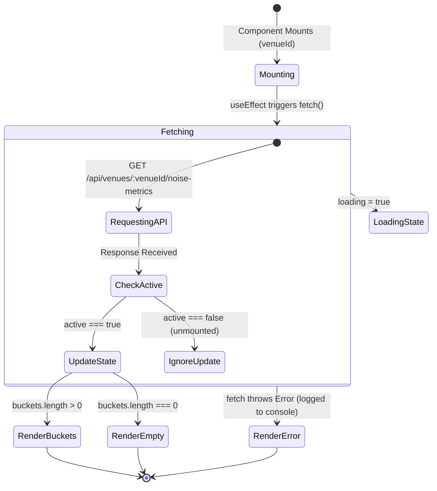

# `NoiseTimeChart` Component Documentation

The `NoiseTimeChart` component is a client-side React component designed to visualize crowdsourced ambient noise patterns by time of day for a specific venue in WorkSphere. It fetches time-bucketed decibel ($\text{dB}$) metrics from the backend API and renders a responsive visual histogram showing average sound intensity, peak noise levels, and total contributor sample counts.

---

## Table of Contents

- [Overview](#overview)
- [Component Signature](#component-signature)
- [Props Reference](#props-reference)
- [Data Models & API Contract](#data-models--api-contract)
  - [Response Schema](#response-schema)
  - [Bucket Interface](#bucket-interface)
- [Decibel Threshold Reference](#decibel-threshold-reference)
- [Visual Normalization Algorithm](#visual-normalization-algorithm)
- [Usage Examples](#usage-examples)
  - [Basic Dashboard Integration](#basic-dashboard-integration)
  - [Integration inside Venue Detail Modal](#integration-inside-venue-detail-modal)
  - [Server Component Container Wrapper](#server-component-container-wrapper)
- [Responsiveness & Styling](#responsiveness--styling)
  - [Dark Mode Support](#dark-mode-support)
  - [CSS Class Hierarchy](#css-class-hierarchy)
- [Accessibility (a11y)](#accessibility-a11y)
- [Testing & Mocking](#testing--mocking)
- [State Lifecycle Diagram](#state-lifecycle-diagram)

---

## Overview

WorkSphere collects ambient audio decibel telemetry submitted by users present at participating coworking spaces, cafes, and shared offices. The `NoiseTimeChart` aggregates these measurements into discrete temporal buckets (e.g., Morning, Afternoon, Evening, Night) to help remote workers choose optimal venues based on their noise tolerance.

Key features of `NoiseTimeChart`:
- **Automated Data Fetching:** Automatically initiates client-side data fetching on mount or whenever `venueId` changes.
- **Race Condition Protection:** Uses active mount flags (`active = false`) inside the `useEffect` cleanup hook to prevent state updates if unmounted mid-request.
- **Dynamic Scale Normalization:** Computes visual progress bar percentages relative to the maximum observed peak noise level across all available buckets (capped at a minimum ceiling of 100 dB).
- **Zero-Dependency Responsive Design:** Utilizes native flexbox layouts and custom CSS percentage widths without requiring bulky charting libraries.

---

## Component Signature

```tsx
import { NoiseTimeChart } from "@/components/noise/NoiseTimeChart";

// Basic Invocation
<NoiseTimeChart venueId="v_12345678" />
```

---

## Props Reference

### `NoiseTimeChartProps`

```typescript
export interface NoiseTimeChartProps {
  /**
   * Unique identifier of the venue whose noise telemetry is to be retrieved.
   * This value is URI-encoded prior to being appended to the API endpoint path.
   * 
   * @example "v_sf_downtown_01"
   */
  venueId: string;
}
```

| Prop | Type | Required | Default | Description |
| :--- | :--- | :--- | :--- | :--- |
| `venueId` | `string` | **Yes** | *None* | Target venue unique ID passed to `/api/venues/${encodeURIComponent(venueId)}/noise-metrics`. |

---

## Data Models & API Contract

### Response Schema

The component expects `GET /api/venues/:venueId/noise-metrics` to respond with a JSON object containing an array of `buckets`:

```json
{
  "venueId": "v_sf_downtown_01",
  "totalSamples": 142,
  "buckets": [
    {
      "label": "Morning (8 AM - 12 PM)",
      "averageDb": 48.5,
      "peakDb": 62.0,
      "samples": 38
    },
    {
      "label": "Afternoon (12 PM - 5 PM)",
      "averageDb": 64.2,
      "peakDb": 78.5,
      "samples": 74
    },
    {
      "label": "Evening (5 PM - 9 PM)",
      "averageDb": 52.1,
      "peakDb": 66.8,
      "samples": 30
    },
    {
      "label": "Night (9 PM - 12 AM)",
      "averageDb": null,
      "peakDb": null,
      "samples": 0
    }
  ]
}
```

### Bucket Interface

```typescript
export interface NoiseTimeChartBucket {
  /** Human-readable time range description (e.g. "Morning (8 AM - 12 PM)") */
  label: string;
  
  /** Arithmetic mean of sound pressure level in decibels (dBA), or null if no readings exist */
  averageDb: number | null;
  
  /** Maximum single recorded decibel reading within the temporal window */
  peakDb: number | null;
  
  /** Count of distinct crowdsourced noise telemetry submissions */
  samples: number;
}
```

---

## Decibel Threshold Reference

To help developers design surrounding UI indicators or tooltips around noise levels, use the following environmental sound classification standards:

| Decibel Range ($\text{dB}$) | Noise Classification | Workplace Suitability | Typical Environment |
| :--- | :--- | :--- | :--- |
| **$< 45 \text{ dB}$** | Quiet / Silent | Ideal for deep concentration, phone calls | Library reading room, private office |
| **$45 - 55 \text{ dB}$** | Moderate / Ambient | Suitable for general work & collaborative calls | Quiet cafe, background hum |
| **$55 - 68 \text{ dB}$** | Energetic / Busy | Suitable for co-working; headphones recommended | Busy coffee shop, active office |
| **$> 68 \text{ dB}$** | Loud / Noisy | High noise; calls and focus work difficult | Espresso bar, bistro during lunch peak |

---

## Visual Normalization Algorithm

The relative bar width $W_{\text{percent}}$ for each time bucket is dynamically calculated using the following formula:

$$\text{maxDb} = \max\left( \max_{b \in \text{buckets}} (\text{peakDb}_b), 100 \right)$$

$$W_{\text{percent}} = \begin{cases} 
0 & \text{if } \text{averageDb} = \text{null} \\
\max\left( 8, \min\left(100, \frac{\text{averageDb}}{\text{maxDb}} \times 100\right) \right) & \text{if } \text{averageDb} \neq \text{null} 
\end{cases}$$

This guarantees that:
1. Valid noise levels never render below an 8% visual width threshold for touch readability.
2. Unusually high noise spikes do not overflow the bounding container ($100\%$ upper bound).
3. Buckets without recorded sample data render with $0\%$ bar width and display `"No samples"`.

---

## Usage Examples

### Basic Dashboard Integration

```tsx
import { NoiseTimeChart } from "@/components/noise/NoiseTimeChart";

export default function WorkspaceDashboard({ venueId }: { venueId: string }) {
  return (
    <div className="mx-auto max-w-4xl space-y-6 p-6">
      <h1 className="text-2xl font-bold text-zinc-900 dark:text-white">
        Venue Noise Telemetry
      </h1>
      
      {/* Noise Time Chart Widget */}
      <NoiseTimeChart venueId={venueId} />
    </div>
  );
}
```

### Integration inside Venue Detail Modal

```tsx
"use client";

import { NoiseTimeChart } from "@/components/noise/NoiseTimeChart";
import { Dialog, DialogContent, DialogHeader, DialogTitle } from "@/components/ui/dialog";

interface VenueModalProps {
  isOpen: boolean;
  onClose: () => void;
  venue: {
    id: string;
    name: string;
  };
}

export function VenueDetailModal({ isOpen, onClose, venue }: VenueModalProps) {
  return (
    <Dialog open={isOpen} onOpenChange={onClose}>
      <DialogContent className="max-w-md">
        <DialogHeader>
          <DialogTitle>{venue.name}</DialogTitle>
        </DialogHeader>
        
        <div className="mt-4">
          <NoiseTimeChart venueId={venue.id} />
        </div>
      </DialogContent>
    </Dialog>
  );
}
```

### Server Component Container Wrapper

When using Next.js App Router, you can wrap `NoiseTimeChart` inside a Server Component layout:

```tsx
import { Suspense } from "react";
import { NoiseTimeChart } from "@/components/noise/NoiseTimeChart";

export default async function VenuePage({ params }: { params: { id: string } }) {
  const { id: venueId } = params;

  return (
    <main className="container mx-auto py-8">
      <h2 className="mb-4 text-xl font-semibold">Sound Environment Profile</h2>
      
      <Suspense fallback={<NoiseTimeChartSkeleton />}>
        <NoiseTimeChart venueId={venueId} />
      </Suspense>
    </main>
  );
}

function NoiseTimeChartSkeleton() {
  return (
    <div className="h-48 w-full animate-pulse rounded-2xl bg-zinc-100 dark:bg-zinc-800" />
  );
}
```

---

## Responsiveness & Styling

The component uses Tailwind CSS for layout, color themes, and dark mode adaptations:

- **Outer Wrapper:** `rounded-2xl border border-zinc-200 bg-white p-4 dark:border-zinc-700 dark:bg-zinc-900`
- **Header Icon:** Lucide React `<Volume2 />` rendered with `h-5 w-5 text-blue-500`.
- **Progress Track:** `h-2 overflow-hidden rounded-full bg-zinc-100 dark:bg-zinc-800`
- **Progress Fill:** `h-full rounded-full accent-bg transition-all`

### Dark Mode Support

`NoiseTimeChart` automatically adapts to system or class-based dark mode using Tailwind's `dark:` variant modifiers:

```html
<!-- Light Mode -->
<section class="border-zinc-200 bg-white">
  <h3 class="text-zinc-900">Community Noise Pattern</h3>
</section>

<!-- Dark Mode -->
<section class="dark:border-zinc-700 dark:bg-zinc-900">
  <h3 class="dark:text-white">Community Noise Pattern</h3>
</section>
```

---

## Accessibility (a11y)

To enhance web accessibility compliance (WCAG 2.1 AA):

1. **Semantic HTML Sectioning:** Enclosed within `<section>` with explicit `<h3>` heading structure.
2. **Text Contrast:** Text colors (`text-zinc-900`, `text-zinc-700`, `text-zinc-500`) maintain a minimum contrast ratio of $4.5:1$ against white/zinc-900 backgrounds.
3. **Screen Reader Text:** Average dB decibel numbers and sample totals are rendered in clear text format (`"54.2 dB avg · 12 samples"`), enabling screen readers to speak metrics naturally without requiring ARIA title overrides.

---

## Testing & Mocking

Here is an example unit test for `NoiseTimeChart` using React Testing Library and Vitest/Jest:

```tsx
import { render, screen, waitFor } from "@testing-library/react";
import { describe, it, expect, vi, beforeEach } from "vitest";
import { NoiseTimeChart } from "@/components/noise/NoiseTimeChart";

describe("NoiseTimeChart", () => {
  beforeEach(() => {
    vi.restoreAllMocks();
  });

  it("renders loading state initially", () => {
    vi.spyOn(global, "fetch").mockImplementation(() => new Promise(() => {}));
    render(<NoiseTimeChart venueId="v_test_01" />);
    
    expect(screen.getByText("Loading noise data…")).toBeInTheDocument();
  });

  it("renders noise metrics upon successful API response", async () => {
    const mockData = {
      buckets: [
        { label: "Morning", averageDb: 52.4, peakDb: 65.0, samples: 15 },
        { label: "Afternoon", averageDb: 68.1, peakDb: 80.0, samples: 30 }
      ]
    };

    vi.spyOn(global, "fetch").mockResolvedValue({
      ok: true,
      json: async () => mockData
    } as Response);

    render(<NoiseTimeChart venueId="v_test_01" />);

    await waitFor(() => {
      expect(screen.getByText("Morning")).toBeInTheDocument();
      expect(screen.getByText("52.4 dB avg · 15 samples")).toBeInTheDocument();
      expect(screen.getByText("Afternoon")).toBeInTheDocument();
      expect(screen.getByText("68.1 dB avg · 30 samples")).toBeInTheDocument();
    });
  });

  it("renders empty state message when no noise samples exist", async () => {
    vi.spyOn(global, "fetch").mockResolvedValue({
      ok: true,
      json: async () => ({ buckets: [] })
    } as Response);

    render(<NoiseTimeChart venueId="v_test_01" />);

    await waitFor(() => {
      expect(
        screen.getByText("No measured noise samples yet. Be the first contributor.")
      ).toBeInTheDocument();
    });
  });
});
```

---

## State Lifecycle Diagram


