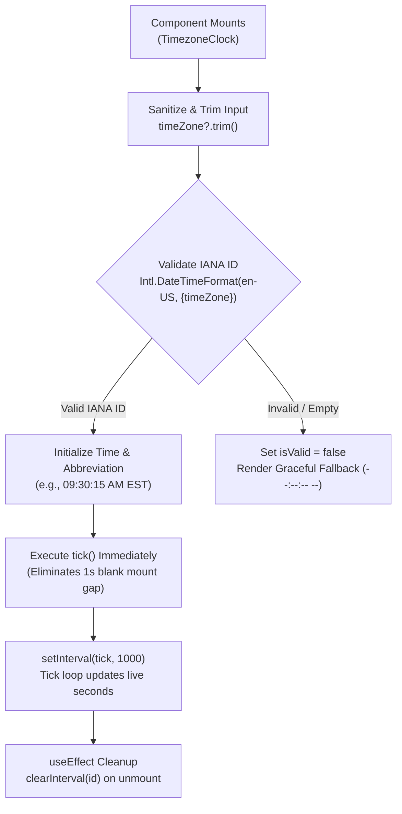

# TimezoneClock: Venue Timezone Rendering, IANA Resolution, and UTC Offset Indicators

## 1. Executive Summary

In global workspace networks and nomad booking workflows, travelers reserve desks, meeting rooms, and acoustic phone booths across divergent global timezones. The **`TimezoneClock`** component ([`src/components/bookings/TimezoneClock.tsx`](file:///c:/Users/admin/Desktop/workfere/src/components/bookings/TimezoneClock.tsx)) renders real-time, localized wall-clock time for any venue's designated IANA timezone, coupled with user auto-detection and UTC offset indicators.

This developer documentation covers:
- **Venue Timezone Rendering Pipeline:** 1-second interval live ticks, hydration mismatch prevention, and tabular numeral styling.
- **IANA Timezone Resolution & Fallbacks:** Safe string sanitization, validation against `Intl.DateTimeFormat`, and fallback mechanics handling unknown or malformed timezones without throwing runtime `RangeError`.
- **Local Browser Auto-Detection:** Browser timezone discovery via `Intl.DateTimeFormat().resolvedOptions().timeZone` in [`TimezoneBadge.tsx`](file:///c:/Users/admin/Desktop/workfere/src/components/TimezoneBadge.tsx).
- **World Clock Lists & UTC Offset Calculations:** Deriving localized offsets, Daylight Saving Time (DST) transitions, and multi-timezone displays.

---

## 2. Component Architecture & Props

### 2.1 Interface Definition

```typescript
export interface TimezoneClockProps {
  /** IANA timezone string e.g. "America/New_York", "Asia/Kolkata", "Europe/London" */
  timeZone: string;
  /** Optional descriptive label shown next to the clock (e.g. venue city name or branch) */
  label?: string;
}
```

### 2.2 Signal & Lifecycle Flow



---

## 3. Venue Timezone Rendering & Hydration Safety

Server-Side Rendering (SSR) in Next.js can trigger React hydration mismatches if the server's system clock or default timezone differs from the user's client browser or venue timezone.

### 3.1 Hydration Mismatch Defense
- **Lazy State Initializer:** Initial state computes safely using client-side execution closures.
- **`suppressHydrationWarning`:** Elements displaying live timestamps include `suppressHydrationWarning` to prevent React warnings when milliseconds differ between server markup and initial DOM hydration.
- **Immediate Initial Tick:** The component invokes `tick()` synchronously inside `useEffect` prior to starting the timer loop, preventing any blank or lagging timestamp flickers.

### 3.2 Visual Typography & Tabular Numerals
Timestamps utilize fixed-width numeric glyphs (`tabular-nums font-mono`) to prevent horizontal layout jank as digits transition from `1` to `0` or `8`:

```tsx
<div
  suppressHydrationWarning
  className="flex items-center gap-1.5 text-xs text-zinc-500 dark:text-zinc-400 font-mono tabular-nums mt-1"
>
  <Globe className="w-3 h-3 shrink-0 text-blue-400" />
  <span suppressHydrationWarning className="text-zinc-900 dark:text-zinc-100 font-semibold">
    {time}
  </span>
  <span suppressHydrationWarning className="text-zinc-400 dark:text-zinc-500">
    {tzAbbr}
  </span>
  {label && (
    <span className="text-zinc-400 dark:text-zinc-500 ml-0.5">· {label}</span>
  )}
</div>
```

---

## 4. IANA Timezone Resolution & Graceful Fallback

Attempting to construct an `Intl.DateTimeFormat` with an invalid timezone string in JavaScript produces an unhandled runtime error:

```
RangeError: Invalid time zone specified: Invalid/Timezone
```

`TimezoneClock` incorporates proactive validation and boundary checks to prevent application crashes:

```typescript
const [isValid, setIsValid] = useState(() => {
  if (!cleanTz) return false;
  try {
    new Intl.DateTimeFormat("en-US", { timeZone: cleanTz });
    return true;
  } catch {
    return false;
  }
});
```

### 4.1 Resolution Strategy in `venueHours.ts`

For backend and utility calculations, [`src/lib/venueHours.ts`](file:///c:/Users/admin/Desktop/workfere/src/lib/venueHours.ts) provides the `resolveTimezone` helper:

```typescript
export function resolveTimezone(
  timezone?: string | null,
  fallback = "UTC",
): string {
  if (!timezone || typeof timezone !== "string" || !timezone.trim()) {
    return fallback;
  }
  const trimmed = timezone.trim();
  try {
    new Intl.DateTimeFormat("en-US", { timeZone: trimmed });
    return trimmed;
  } catch {
    return fallback;
  }
}
```

### 4.2 Invalid State Fallback UI
When an invalid timezone identifier is supplied:
1. `isValid` evaluates to `false`.
2. Time renders as `--:--:-- --`.
3. The globe icon tints red (`text-red-400`).
4. The invalid string is displayed safely without bubbling exceptions.

---

## 5. Browser Auto-Detection & UTC Offset Indicators

### 5.1 Browser Auto-Detection (`TimezoneBadge.tsx`)

WorkSphere auto-detects the nomad's current browser timezone to determine check-in reminder schedules, quiet hours, and time comparisons:

```typescript
export function getUserTimezone(): string {
  try {
    return Intl.DateTimeFormat().resolvedOptions().timeZone || "UTC";
  } catch {
    return "UTC";
  }
}
```

### 5.2 UTC Offset & DST Calculation

To compute the active UTC offset (accounting for seasonal Daylight Saving Time transitions):

```typescript
export function getTimezoneOffsetIndicator(timeZone: string, date: Date = new Date()): string {
  try {
    const parts = new Intl.DateTimeFormat("en-US", {
      timeZone,
      timeZoneName: "longOffset",
    }).formatToParts(date);
    
    return parts.find((p) => p.type === "timeZoneName")?.value ?? "UTC";
  } catch {
    return "UTC";
  }
}
```

**Common Offset Outputs:**
- `America/New_York` (Winter / EST): `GMT-05:00`
- `America/New_York` (Summer / EDT): `GMT-04:00`
- `Asia/Kolkata` (Year-round / IST): `GMT+05:30`
- `Europe/London` (Summer / BST): `GMT+01:00`

---

## 6. World Clock List Implementation Pattern

For multi-hub booking dashboards or nomad itinerary overviews, `TimezoneClock` instances can be composed into a live World Clock list:

```tsx
import React from "react";
import { TimezoneClock } from "@/components/bookings/TimezoneClock";

interface WorldClockVenue {
  id: string;
  cityName: string;
  timeZone: string;
}

const GLOBAL_HUBS: WorldClockVenue[] = [
  { id: "hub-sf", cityName: "San Francisco", timeZone: "America/Los_Angeles" },
  { id: "hub-nyc", cityName: "New York", timeZone: "America/New_York" },
  { id: "hub-ldn", cityName: "London", timeZone: "Europe/London" },
  { id: "hub-blr", cityName: "Bengaluru", timeZone: "Asia/Kolkata" },
  { id: "hub-tyo", cityName: "Tokyo", timeZone: "Asia/Tokyo" },
];

export function NomadWorldClockPanel() {
  return (
    <div className="grid grid-cols-1 sm:grid-cols-2 lg:grid-cols-3 gap-3 p-4 rounded-2xl bg-zinc-50 dark:bg-zinc-900/50 border border-zinc-200 dark:border-zinc-800">
      {GLOBAL_HUBS.map((hub) => (
        <div key={hub.id} className="p-3 rounded-xl bg-white dark:bg-zinc-800/80 shadow-sm border border-zinc-100 dark:border-zinc-700">
          <div className="text-xs font-medium text-zinc-500 dark:text-zinc-400">
            {hub.cityName}
          </div>
          <TimezoneClock timeZone={hub.timeZone} label={hub.cityName} />
        </div>
      ))}
    </div>
  );
}
```
