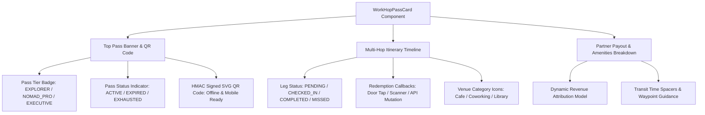
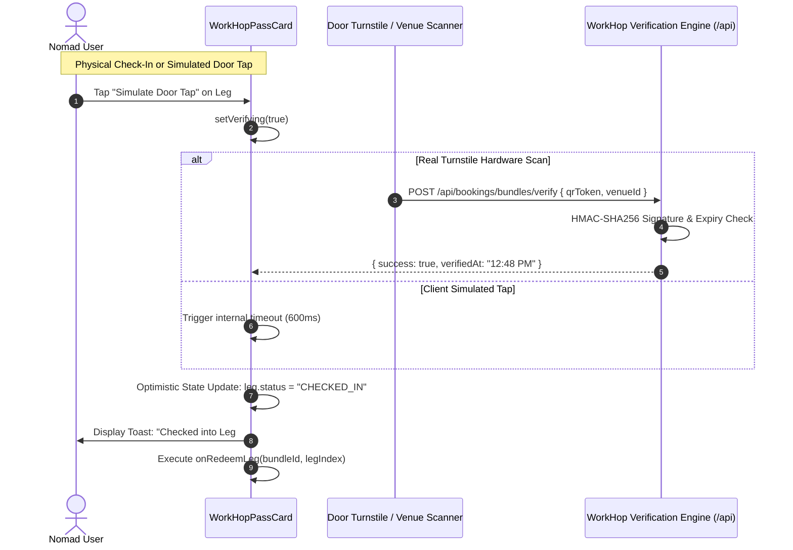

# WorkHopPassCard: Props, Badge Themes, and Pass Redemption Callbacks

This developer guide documents WorkSphere's **WorkHopPassCard** component ([`src/components/bookings/WorkHopPassCard.tsx`](file:///c:/Users/admin/Desktop/workfere/src/components/bookings/WorkHopPassCard.tsx)), including its props interface, pass status variants (`ACTIVE`, `EXPIRED`, `EXHAUSTED`), badge styling themes, QR token cryptography, and redemption handler callbacks.

---

## 1. Executive Summary & Component Overview

The **WorkHopPassCard** is an interactive, multi-venue day pass interface designed for digital nomads and hybrid workers who move across multiple workspaces in a single day (e.g., morning deep work at an artisan coffee lab, midday video meetings in an acoustic coworking booth, and evening collaborative wrap-ups at an executive lounge).



### Key Capabilities
- **Composite Multi-Leg Scheduling:** Visualizes sequentially timed workspace bookings across independent venues.
- **Dynamic QR Code Pass:** Encodes cryptographic tokens into vector SVG barcodes with one-click export.
- **Real-Time Leg Redemption:** Supports NFC/RFID door tap simulation, scanner validation, and redemption status progression.
- **Fair Revenue Attribution:** Displays allocated partner payouts and discount percentages.

---

## 2. Component Props Interface & TypeScript Schemas

Located in [`src/components/bookings/WorkHopPassCard.tsx`](file:///c:/Users/admin/Desktop/workfere/src/components/bookings/WorkHopPassCard.tsx) and backed by [`src/lib/bundles/workHopEngine.ts`](file:///c:/Users/admin/Desktop/workfere/src/lib/bundles/workHopEngine.ts).

### 2.1 `WorkHopPassCardProps`

```typescript
export interface WorkHopPassCardProps {
  /** Initial bundle data. If omitted, falls back to default sample bundle */
  initialBundle?: WorkHopBundle;
  /** Optional callback fired when a leg is successfully redeemed / checked-in */
  onRedeemLeg?: (bundleId: string, legIndex: number) => Promise<void> | void;
  /** Optional callback fired when the QR code SVG is exported */
  onDownloadQR?: (bundleId: string) => void;
  /** Optional callback fired when an occupant selects a leg in the itinerary */
  onSelectLeg?: (leg: WorkHopLeg) => void;
  /** Optional container style override */
  className?: string;
  /** Read-only mode disallows interactive redemption buttons */
  readOnly?: boolean;
}
```

### 2.2 Core Bundle & Leg Schemas

```typescript
export interface WorkHopLeg {
  legIndex: number;
  venueId: string;
  venueName: string;
  venueCategory: "cafe" | "coworking" | "library" | string;
  venueAddress?: string | null;
  seatId?: string | null;
  seatNumber?: string | null;
  startTime: string; // "HH:MM" e.g. "09:00"
  endTime: string;   // "HH:MM" e.g. "12:30"
  durationHours: number;
  amenities: string[];
  allocatedRevenue: number;
  status: "PENDING" | "CHECKED_IN" | "COMPLETED" | "MISSED";
  checkedInAt?: string | null;
}

export interface WorkHopBundle {
  bundleId: string;
  userId: string;
  date: string; // "YYYY-MM-DD"
  title: string;
  tier: "EXPLORER" | "NOMAD_PRO" | "EXECUTIVE";
  totalPrice: number;
  currency: string;
  discountPercentage: number;
  legs: WorkHopLeg[];
  qrToken: string;
  status: "ACTIVE" | "EXPIRED" | "EXHAUSTED" | "CANCELLED";
  createdAt: string;
}
```

---

## 3. Pass Status Variants & Badge Themes

The card dynamically renders status variants and badge themes corresponding to the lifecycle state of the overall pass and individual itinerary legs.

### 3.1 Pass Status Variants (`bundle.status`)

| Pass Status | Description | Visual Banner Theme | QR Code Behavior | Interaction Allowed |
| :--- | :--- | :--- | :--- | :---: |
| **`ACTIVE`** | Pass is valid for today's itinerary; pending legs remain to be visited. | `border-indigo-500/30 bg-gradient-to-br from-slate-900 via-indigo-950 to-slate-900` | High-contrast black/white QR code active for door turnstile scanning. | **Yes** (Door tap redemption enabled) |
| **`EXHAUSTED`** | All scheduled legs have been checked in or completed. | `border-emerald-500/40 bg-gradient-to-br from-slate-900 via-emerald-950/60 to-slate-900` | Displays verified checkmark overlay indicating full itinerary completion. | **No** (Completed state) |
| **`EXPIRED`** | Pass booking date is in the past, or booking validity window elapsed. | `border-zinc-700 bg-gradient-to-br from-slate-950 via-zinc-900 to-slate-950 opacity-70` | QR barcode dimmed with "Pass Expired" watermark. | **No** (Read-only historical view) |
| **`CANCELLED`** | Pass was refunded or cancelled prior to redemption. | `border-rose-900/60 bg-gradient-to-br from-slate-950 via-rose-950/40 to-slate-950` | Red outline badge with "Cancelled / Refunded" label. | **No** |

### 3.2 Tier Badge Themes

```typescript
export const TIER_THEMES = {
  EXPLORER: {
    badgeClass: "bg-cyan-500/20 border-cyan-500/40 text-cyan-300",
    label: "Explorer Day Pass",
    accentGlow: "shadow-cyan-950/30",
  },
  NOMAD_PRO: {
    badgeClass: "bg-indigo-500/20 border-indigo-500/40 text-indigo-300",
    label: "Nomad Pro Day Pass",
    accentGlow: "shadow-indigo-950/30",
  },
  EXECUTIVE: {
    badgeClass: "bg-amber-500/20 border-amber-500/40 text-amber-300",
    label: "Executive All-Access Pass",
    accentGlow: "shadow-amber-950/30",
  },
};
```

### 3.3 Leg Status Themes (`leg.status`)

```typescript
export const LEG_STATUS_THEMES = {
  PENDING: {
    container: "bg-slate-900/50 border-slate-800 hover:border-slate-700",
    badge: "bg-indigo-500/20 border-indigo-500/40 text-indigo-300",
    actionButton: "bg-indigo-600 hover:bg-indigo-500 text-white",
  },
  CHECKED_IN: {
    container: "bg-slate-900/80 border-emerald-500/40 shadow-lg shadow-emerald-950/20",
    badge: "bg-emerald-500/20 border-emerald-500/40 text-emerald-400",
    actionButton: null, // Displays checkmark badge
  },
  COMPLETED: {
    container: "bg-slate-950/60 border-slate-800/80 opacity-70",
    badge: "bg-slate-800 border-slate-700 text-slate-400",
    actionButton: null,
  },
  MISSED: {
    container: "bg-rose-950/20 border-rose-900/40",
    badge: "bg-rose-500/20 border-rose-500/40 text-rose-400",
    actionButton: null,
  },
};
```

---

## 4. Dynamic Pass Redemption & Check-In Handlers

### 4.1 Redemption Execution Lifecycle



### 4.2 Cryptographic Pass Token Generation & Verification

Pass tokens are signed using HMAC-SHA256 in [`src/lib/bundles/workHopEngine.ts`](file:///c:/Users/admin/Desktop/workfere/src/lib/bundles/workHopEngine.ts#L76-L115):

```typescript
// 1. Token Issuance
export function generateWorkHopPassToken(bundleId: string, userId: string, date: string): string {
  const payload = JSON.stringify({ bundleId, userId, date, issuedAt: Date.now() });
  const hmac = crypto.createHmac("sha256", PASS_SECRET).update(payload).digest("hex");
  return Buffer.from(JSON.stringify({ payload, sig: hmac })).toString("base64url");
}

// 2. Gate Verification at Entrance
export function verifyWorkHopPassToken(token: string): { isValid: boolean; bundleId?: string; error?: string } {
  try {
    const raw = Buffer.from(token, "base64url").toString("utf-8");
    const { payload, sig } = JSON.parse(raw);
    const expectedHmac = crypto.createHmac("sha256", PASS_SECRET).update(payload).digest("hex");
    if (sig !== expectedHmac) return { isValid: false, error: "Invalid cryptographic signature" };
    return { isValid: true, ...JSON.parse(payload) };
  } catch (err) {
    return { isValid: false, error: "Malformed pass token" };
  }
}
```

---

## 5. Revenue Attribution & Partner Payout Model

WorkSphere implements an automated revenue allocation engine dividing composite pass fees across participating partner venues fairly:

$$\text{Weight}_i = \text{Duration}_i \times M_{\text{category}}$$

Where:
- Coworking spaces: $M_{\text{category}} = 1.3$
- Standard cafes: $M_{\text{category}} = 1.0$
- Public/Library pods: $M_{\text{category}} = 0.8$

$$\text{Allocated Revenue}_i = \left( \frac{\text{Weight}_i}{\sum_{j=1}^N \text{Weight}_j} \right) \times \text{Pass Price}$$

This transparency ensures partner venue operators can verify incoming revenue directly on the pass card ticket summary.

---

## 6. Developer Integration Examples

### 6.1 Basic Integration

```tsx
import React from "react";
import WorkHopPassCard from "@/components/bookings/WorkHopPassCard";

export default function MyPassView() {
  return (
    <div className="p-6 bg-slate-950 min-h-screen">
      <WorkHopPassCard />
    </div>
  );
}
```

### 6.2 Custom Redemption Callback with API Mutation

```tsx
import React from "react";
import WorkHopPassCard from "@/components/bookings/WorkHopPassCard";
import type { WorkHopBundle } from "@/lib/bundles/workHopEngine";

export function ActiveBookingPassPage({ userBundle }: { userBundle: WorkHopBundle }) {
  const handleRedeem = async (bundleId: string, legIndex: number) => {
    // Send check-in event to analytics & database
    await fetch("/api/bookings/bundles/checkin", {
      method: "POST",
      headers: { "Content-Type": "application/json" },
      body: JSON.stringify({ bundleId, legIndex }),
    });
  };

  return (
    <WorkHopPassCard
      initialBundle={userBundle}
      onRedeemLeg={handleRedeem}
      onDownloadQR={(bundleId) => console.log(`QR exported for pass ${bundleId}`)}
    />
  );
}
```

---

## 7. Verification & Testing Matrix

| Test ID | Test Target | Verification Description | Expected Assertion |
| :--- | :--- | :--- | :--- |
| **PASS-TEST-001** | Default Bundle Fallback | Mount component without `initialBundle` prop. | Renders default San Francisco 3-leg sample itinerary cleanly. |
| **PASS-TEST-002** | QR Code SVG Generation | Verify QR canvas/markup mounts upon initialization. | Valid `<svg>` element with `viewBox="0 0 200 200"` rendered. |
| **PASS-TEST-003** | Door Tap State Transition | Click "Simulate Door Tap" on a pending leg. | Transitions status from `PENDING` to `CHECKED_IN`, populating timestamp. |
| **PASS-TEST-004** | QR Token Signature Verification | Pass valid token to `verifyWorkHopPassToken`. | Returns `isValid: true` with matching bundle identifier. |
| **PASS-TEST-005** | Category Icon Mapping | Provide leg with category `cafe`, `coworking`, `library`. | Renders corresponding Lucide icon (`Coffee`, `Building2`, `BookOpen`). |
| **PASS-TEST-006** | Pass Export Action | Click "Save Pass SVG" action button. | Triggers browser vector download without runtime errors. |
