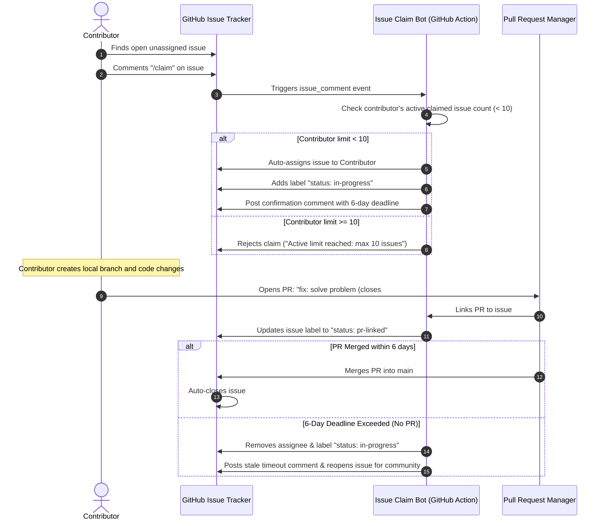
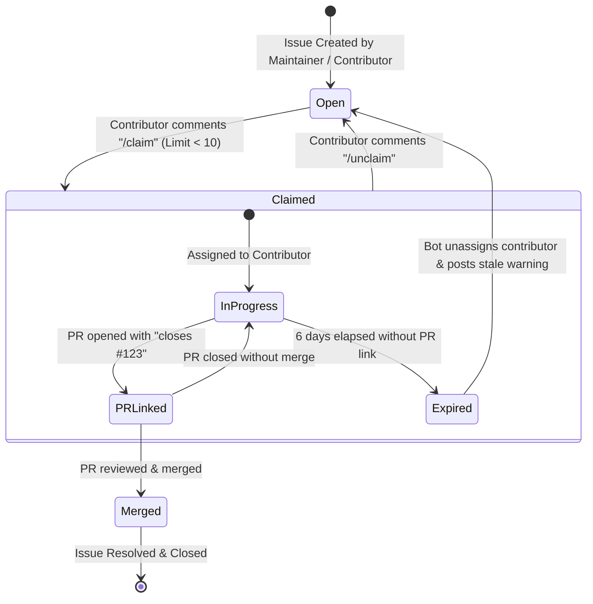
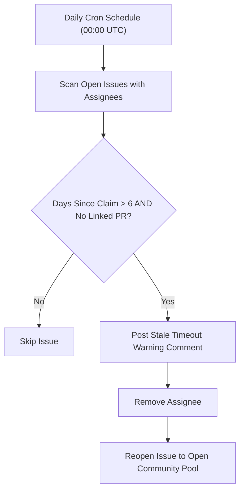

# Issue Claiming & Automated Lifecycle Guide

## Executive Summary

To maintain an open, fair, and automated development workflow, WorkSphere utilizes a bot-driven issue claiming system powered by GitHub Actions. Contributor assignments, progress tracking, stale issue timeouts, and pull request linking are managed automatically using explicit commands like `/claim` and `/unclaim`.

This guide documents the complete lifecycle of an issue—from initial creation and assignment to PR creation, automated checks, and final merging—along with rules, limits, sequence diagrams, terminal commands, and troubleshooting procedures.

---

## 1. End-to-End Workflow Architecture



---

## 2. Issue Lifecycle State Machine

The following state machine details how an issue transitions between states from initial creation to resolution or expiration:



---

## 3. Core Rules & Policy Specifications

### 3.1 Maximum Concurrent Claim Limit

To prevent single contributors from hoarding issues and locking out other community members, a hard concurrency limit is enforced:

> [!IMPORTANT]
> **Active Claim Limit**: A single contributor may have a **maximum of 10 active claimed issues** assigned to them simultaneously. Attempts to claim an 11th issue via `/claim` will be automatically rejected by the Bot.

- **Active Issue Definition**: An issue where `assignees` includes the contributor AND status is `open`.
- **Releasing Capacity**: Completing a PR (which merges and closes an issue) or running `/unclaim` immediately frees up capacity to claim new issues.

---

### 3.2 The 6-Day Completion Deadline (Timeout Window)

When an issue is successfully claimed, the bot records a 6-day completion SLA timer:

$$\text{Deadline} = \text{Claim Timestamp} + 6 \text{ Days } (144 \text{ Hours})$$

| Timeline Window | System Action | Contributor Guidance |
| :--- | :--- | :--- |
| **Day 0 (0 Hours)** | Issue assigned; confirmation comment posted | Create branch and begin implementation. |
| **Day 4 (96 Hours)** | Automated reminder comment posted by Bot | Push draft PR or request deadline extension if blocked. |
| **Day 6 (144 Hours)** | **Expiration Triggered**: Contributor unassigned, issue reopened | Issue becomes available for other community members. |

---

## 4. Step-by-Step Contributor Execution Guide

### Step 1: Locate an Open Unassigned Issue

Browse the repository issues tab or use the GitHub CLI to list open, unassigned issues:

```bash
gh issue list --state open --no-assignee --limit 20
```

### Step 2: Comment `/claim` on the Target Issue

To claim an issue, post a simple comment containing the command `/claim`:

```bash
gh issue comment 123 --body "/claim"
```

The GitHub Action runner will process the comment within 10–20 seconds and assign you to the issue.

---

### Step 3: Verify Your Assignment

Before writing code, verify that the bot successfully assigned the issue to your GitHub account:

```bash
gh issue view 123 --json assignees,labels
```

Expected JSON Output:
```json
{
  "assignees": [
    {
      "login": "your-github-username"
    }
  ],
  "labels": [
    {
      "name": "status: in-progress"
    }
  ]
}
```

---

### Step 4: Create a Dedicated Feature Branch

Create an isolated local git branch starting from the latest `main` commit. Follow the naming format `<type>/<short-description>-<issue_number>`:

```bash
# Checkout main and update
git checkout main
git pull origin main

# Create isolated branch for issue #123
git checkout -b fix/prevent-double-click-submit-123
```

---

### Step 5: Format Commit Messages

Use standard conventional commit formatting for all commits:

```
<type>: <short description>
```

Examples:
- `fix: prevent double-click submission on seat reservation modal`
- `feat: add quick duration selection chips`
- `docs: update API telemetry reference`

```bash
git add .
git commit -m "fix: prevent double-click submission on seat reservation modal"
```

---

### Step 6: Open Pull Request with Issue Linking Syntax

When opening a Pull Request, the PR Title **MUST** follow the exact repository formatting rule:

```
<type>: <short description> (closes #<issue_number>)
```

Example PR Title:
> `fix: prevent double-click submission on seat reservation modal (closes #123)`

#### Opening PR via GitHub CLI

```bash
gh pr create \
  --title "fix: prevent double-click submission on seat reservation modal (closes #123)" \
  --body "## Description
Fixes #123 by adding a disabled state to the submission button while processing.

## Testing
- Verified double-clicking submit button only triggers one API payload.
- Closes #123." \
  --base main
```

---

### Step 7: PR 24-Hour Window & Merge Rule Check

Before submitting PRs, respect the PR timing rules specified in project guidelines:

```powershell
# Powershell PR window verification script
$currentUtc = Get-Date -Format "yyyy-MM-dd HH:mm:ss UTC"
$lastPr = gh pr list --author Prathvikmehra --state merged --limit 1 --json createdAt --jq '.[0].createdAt'

Write-Output "Current Time: $currentUtc"
Write-Output "Last Merged PR: $lastPr"
```

> [!NOTE]
> If `current time < last PR time + 24h`, wait until the 24-hour merge window opens before creating additional PRs.

---

## 5. Unclaiming & Handing Off Issues

If you can no longer work on a claimed issue, unclaim it promptly so other contributors can take it over.

### 5.1 Using the `/unclaim` Command

Post a comment containing `/unclaim`:

```bash
gh issue comment 123 --body "/unclaim"
```

The Bot will:
1. Remove your assignment from the issue.
2. Remove the `status: in-progress` label.
3. Post a message confirming the issue is back in the open pool.
4. Decrement your active claimed issue count by 1.

---

## 6. Under the Hood: Bot Action Implementation (`claim-issue.yml`)

The issue claim system is powered by a GitHub Actions workflow located at `.github/workflows/claim-issue.yml`.

### 6.1 Workflow Trigger Events

```yaml
name: Issue Claim Automation

on:
  issue_comment:
    types: [created]

jobs:
  handle-claim:
    runs-on: ubuntu-latest
    if: contains(github.event.comment.body, '/claim') || contains(github.event.comment.body, '/unclaim')
    steps:
      - name: Checkout repository
        uses: actions/checkout@v4

      - name: Process Claim Request
        uses: actions/github-script@v7
        with:
          script: |
            const commentBody = context.payload.comment.body.trim();
            const commenter = context.payload.comment.user.login;
            const issueNumber = context.payload.issue.number;

            if (commentBody === '/claim') {
              // Fetch commenter's active issues
              const { data: userIssues } = await github.rest.issues.listForRepo({
                owner: context.repo.owner,
                repo: context.repo.repo,
                assignee: commenter,
                state: 'open'
              });

              if (userIssues.length >= 10) {
                await github.rest.issues.createComment({
                  owner: context.repo.owner,
                  repo: context.repo.repo,
                  issue_number: issueNumber,
                  body: `@${commenter} You currently have ${userIssues.length} active claimed issues (max limit is 10). Please complete or /unclaim an existing issue before claiming a new one.`
                });
                return;
              }

              // Assign issue
              await github.rest.issues.addAssignees({
                owner: context.repo.owner,
                repo: context.repo.repo,
                issue_number: issueNumber,
                assignees: [commenter]
              });

              await github.rest.issues.createComment({
                owner: context.repo.owner,
                repo: context.repo.repo,
                issue_number: issueNumber,
                body: `🎉 @${commenter} has claimed issue #${issueNumber}! You have 6 days to submit a PR containing \`closes #${issueNumber}\`.`
              });
            }
```

---

## 7. Stale Issue Cleanup Cron Job Implementation

A daily background workflow checks for claimed issues exceeding the 6-day deadline without a linked PR.



### 7.1 GitHub Actions Workflow Definition (`.github/workflows/stale-issue-cleanup.yml`)

```yaml
name: Stale Issue Cleanup

on:
  schedule:
    - cron: '0 0 * * *' # Run daily at midnight UTC
  workflow_dispatch:

jobs:
  cleanup-stale-claims:
    runs-on: ubuntu-latest
    steps:
      - name: Process Stale Issues
        uses: actions/github-script@v7
        with:
          script: |
            const SIX_DAYS_MS = 6 * 24 * 60 * 60 * 1000;
            const now = new Date().getTime();

            const { data: issues } = await github.rest.issues.listForRepo({
              owner: context.repo.owner,
              repo: context.repo.repo,
              state: 'open',
              per_page: 100
            });

            for (const issue of issues) {
              if (!issue.assignees || issue.assignees.length === 0) continue;

              const assignedAt = new Date(issue.updated_at).getTime();
              const elapsedMs = now - assignedAt;

              if (elapsedMs > SIX_DAYS_MS) {
                // Remove assignees
                const assigneesList = issue.assignees.map(a => a.login);
                await github.rest.issues.removeAssignees({
                  owner: context.repo.owner,
                  repo: context.repo.repo,
                  issue_number: issue.number,
                  assignees: assigneesList
                });

                // Post timeout notification comment
                await github.rest.issues.createComment({
                  owner: context.repo.owner,
                  repo: context.repo.repo,
                  issue_number: issue.number,
                  body: `⏱️ This issue was claimed over 6 days ago without a linked pull request. It has been automatically unassigned and returned to the open community pool.`
                });
              }
            }
```

---

## 8. Command-Line Helper Automation Scripts

To streamline issue claiming and branch creation for contributors, add these shell functions to your terminal profile.

### 8.1 Bash / Zsh Helper Functions (`~/.bashrc` or `~/.zshrc`)

```bash
# Claim issue and automatically checkout branch
claim_and_branch() {
  if [ -z "$1" ] || [ -z "$2" ]; then
    echo "Usage: claim_and_branch <issue_number> <branch_type/short-name>"
    echo "Example: claim_and_branch 123 fix/seat-double-click"
    return 1
  fi

  local ISSUE_NO="$1"
  local BRANCH_NAME="$2"

  echo "[1/3] Commenting /claim on issue #${ISSUE_NO}..."
  gh issue comment "$ISSUE_NO" --body "/claim"

  echo "[2/3] Waiting for bot assignment..."
  sleep 3

  echo "[3/3] Fetching latest main and creating branch ${BRANCH_NAME}-${ISSUE_NO}..."
  git checkout main
  git pull origin main
  git checkout -b "${BRANCH_NAME}-${ISSUE_NO}"

  echo "SUCCESS! Created branch ${BRANCH_NAME}-${ISSUE_NO} linked to issue #${ISSUE_NO}."
}
```

---

### 8.2 PowerShell Helper Function (`$PROFILE`)

```powershell
function Claim-WorkSphereIssue {
    param(
        [Parameter(Mandatory=$true)]
        [int]$IssueNumber,

        [Parameter(Mandatory=$true)]
        [string]$BranchName
    )

    Write-Host "[1/3] Sending /claim comment to Issue #$IssueNumber..." -ForegroundColor Cyan
    gh issue comment $IssueNumber --body "/claim"

    Start-Sleep -Seconds 3

    Write-Host "[2/3] Updating main branch..." -ForegroundColor Cyan
    git checkout main
    git pull origin main

    $fullBranchName = "$BranchName-$IssueNumber"
    Write-Host "[3/3] Creating branch $fullBranchName..." -ForegroundColor Green
    git checkout -b $fullBranchName

    Write-Host "Ready to write code for Issue #$IssueNumber on branch $fullBranchName!" -ForegroundColor Yellow
}
```

---

## 9. Code Review Etiquette & Maintainer Handoff

Once your pull request is opened:

1. **Respond Promptly to Review Comments**: Address any requested changes or automated linting/type-check failures within 48 hours.
2. **Avoid Unrelated Code Refactoring**: Keep the PR scoped strictly to resolving the claimed issue.
3. **Notify Maintainers when Ready**: Once all review feedback is resolved, tag the reviewing maintainer in a PR comment.

---

## 10. Frequently Asked Questions (FAQ)

### Q1: Can I claim multiple issues at once?
**A**: Yes, up to a maximum of 10 active claimed issues. However, we recommend claiming 1 or 2 issues at a time to maintain high code quality and finish before the 6-day timeout.

### Q2: What happens if I need more than 6 days to complete a complex feature?
**A**: Post a progress update on the issue thread before Day 4 requesting an extension. A maintainer can apply the `label: extension-granted` to pause the automatic 6-day cleanup runner.

### Q3: Why didn't the bot assign me when I typed `/claim`?
**A**: Check that:
1. You have fewer than 10 active claimed issues (`gh issue list --assignee your-username`).
2. The issue is not already assigned to another contributor.
3. Your comment contains exact `/claim` syntax without surrounding quotes or code blocks.

### Q4: What happens if another contributor submits a PR for an issue assigned to me?
**A**: Maintainers prioritize PRs submitted by the assigned contributor. Unassigned PRs for claimed issues will be placed on hold until the assigned contributor's 6-day window expires or the issue is unclaimed.

---

## 11. Summary Troubleshooting Matrix

| Problem | Root Cause | Solution / Fix |
| :--- | :--- | :--- |
| `/claim` comment ignored by Bot | Comment was edited or contains extra text around `/claim` | Post a new, clean comment containing only `/claim`. |
| Claim rejected with limit error | You have 10 open assigned issues | Submit PRs or run `/unclaim` on older issues to free up slots. |
| Issue unassigned automatically after 6 days | No PR linked with `closes #123` before deadline | Re-claim the issue using `/claim` if still available and open a PR immediately. |
| PR merged but issue remained open | PR title did not include `(closes #<issue_number>)` | Manually close the issue and reference the merged PR link. |

---

## 12. Contributor Verification Checklist

- [x] Claim issue via `/claim` comment before starting work.
- [x] Confirm assignment using `gh issue view <number> --json assignees`.
- [x] Verify active claim count does not exceed 10.
- [x] Format branch as `<type>/<short-description>-<issue_number>`.
- [x] Include `(closes #<issue_number>)` in PR Title.
- [x] Verify 24-hour PR window check before opening PRs.
