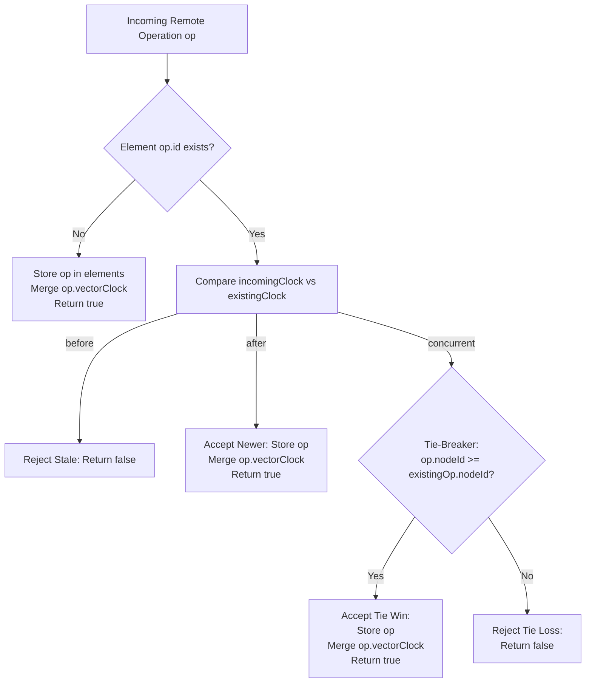
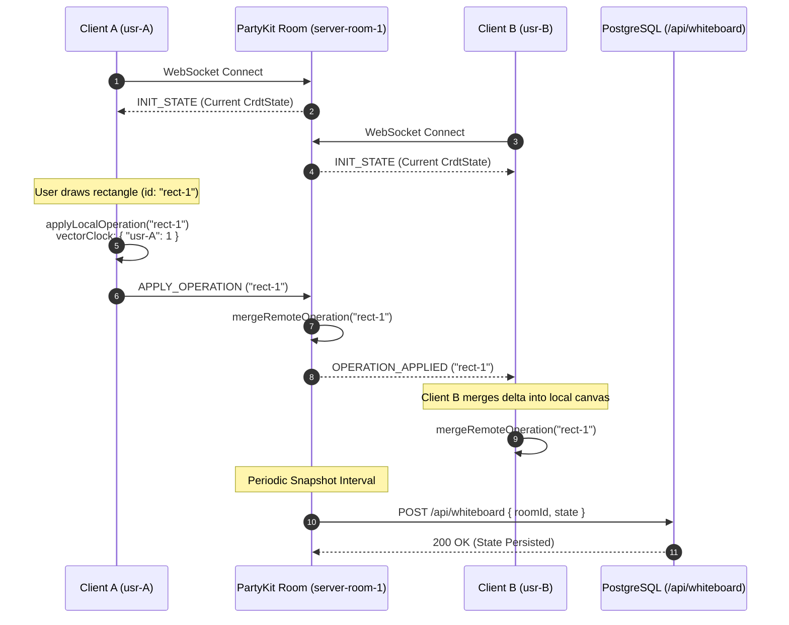

# CRDT Conflict Resolution Architecture: State-Based Document & Vector Clock Engine

## 1. Executive Summary & Overview

WorkSphere incorporates real-time collaborative canvas and whiteboard workspaces where distributed users concurrently sketch diagrams, place sticky notes, and author text elements. Operating in distributed and mobile office environments requires supporting intermittent connectivity, offline edits, asynchronous peer synchronization, and zero-data-loss reconciliations.

To guarantee deterministic, coordination-free consistency across edge clients and server replicas, WorkSphere implements a **State-based Conflict-free Replicated Data Type (CvRDT)** engine governed by **Vector Clocks** and deterministic tie-breaking.

```
       +-----------------------------------------------------------+
       |                 WorkSphere CRDT Topology                  |
       +-----------------------------------------------------------+

        +--------------------+               +--------------------+
        |   Client Node A    |               |   Client Node B    |
        |  (nodeId: "usr-A") |               |  (nodeId: "usr-B") |
        +---------+----------+               +----------+---------+
                  |                                     |
                  | WebSocket / PartyKit                | WebSocket / PartyKit
                  v                                     v
       +-----------------------------------------------------------+
       |               PartyKit Edge Room Server                   |
       |                (nodeId: "server-room-1")                  |
       |                                                           |
       |   +---------------------------------------------------+   |
       |   |                   CrdtDocument                    |   |
       |   |                                                   |   |
       |   |   State Elements Map:                             |   |
       |   |   {                                               |   |
       |   |     "elem-101": { id, type, vectorClock, ... },   |   |
       |   |     "elem-102": { id, type, vectorClock, ... }    |   |
       |   |   }                                               |   |
       |   |                                                   |   |
       |   |   Global Horizon Clock:                           |   |
       |   |   { "usr-A": 4, "usr-B": 3, "server-room-1": 7 }  |   |
       |   +---------------------------------------------------+   |
       +-----------------------------+-----------------------------+
                                     |
                                     | HTTP POST /api/whiteboard
                                     v
                       +---------------------------+
                       |    PostgreSQL Database    |
                       |    (Durable Snapshot)     |
                       +---------------------------+
```

### Core Architecture Components

The CRDT infrastructure is structured in `src/core/crdt/` and integrated into edge real-time workers in `src/party/`:

1. **[`CrdtVectorClock`](file:///c:/Users/admin/Desktop/workfere/src/core/crdt/CrdtVectorClock.ts)**: Tracks logical causal history per node, compares event ordering (`before`, `after`, or `concurrent`), and merges causal frontiers.
2. **[`CrdtDocument`](file:///c:/Users/admin/Desktop/workfere/src/core/crdt/CrdtDocument.ts)**: Encapsulates the state tree (`CrdtState`), applies local canvas operations, evaluates incoming remote operations, and merges elements deterministically.
3. **[`WhiteboardRoom`](file:///c:/Users/admin/Desktop/workfere/src/party/whiteboard.room.ts)**: PartyKit WebSocket server handling client connection lifecycles, broadcasting delta operations, and serializing converged state.
4. **[`api/whiteboard`](file:///c:/Users/admin/Desktop/workfere/src/app/api/whiteboard/route.ts)**: Next.js serverless route for persisting converged CRDT snapshots to the relational store.

---

## 2. Vector Clock Causal History Tracking

Physical wall-clock timestamps (such as `Date.now()`) are subject to Network Time Protocol (NTP) skew, hardware oscillator drift, and timezone anomalies. Relying solely on wall-clock time causes causal inversion bugs where an edit executed *after* another edit is rejected because the local system clock was slightly delayed.

To preserve causal ordering, WorkSphere employs logical **Vector Clocks**.

### 2.1 Formal Definition

Let $N$ be the set of active replica nodes $\{u_1, u_2, \dots, u_n\}$. A Vector Clock $V$ is a map or vector:

$$V: N \to \mathbb{N}$$

where $V[u]$ represents the number of operations generated by node $u$ that are causally known to the holder of $V$.

### 2.2 Vector Clock Progression Rules

1. **Initialization:**
   A new node starts with an empty vector clock:
   $$V_i[k] = 0, \quad \forall k \in N$$

2. **Local Monotonic Tick:**
   Before generating a local mutation at node $u_i$, node $u_i$ increments its own entry:
   $$V_i[u_i] \leftarrow V_i[u_i] + 1$$

3. **Pairwise Merge (Least Upper Bound):**
   When node $u_i$ receives a state or clock $V_j$ from node $u_j$, it updates its clock component-wise:
   $$V_i[k] \leftarrow \max\left(V_i[k], V_j[k]\right), \quad \forall k \in \text{dom}(V_i) \cup \text{dom}(V_j)$$

### 2.3 Causal Comparison Relation

Given two vector clocks $V_A$ and $V_B$, their causal relation is evaluated by checking component-wise inequalities across all known node IDs $k \in \text{dom}(V_A) \cup \text{dom}(V_B)$:

$$\text{isBefore} \iff \exists k \text{ s.t. } V_A[k] < V_B[k]$$
$$\text{isAfter} \iff \exists k \text{ s.t. } V_A[k] > V_B[k]$$

The relational classification is defined as:

| Condition | Mathematical Meaning | Clock Relation | Interpretation |
| :--- | :--- | :--- | :--- |
| $\text{isBefore} \land \neg\text{isAfter}$ | $\forall k, V_A[k] \le V_B[k] \land \exists j, V_A[j] < V_B[j]$ | $V_A \prec V_B$ | $A$ happened strictly before $B$ |
| $\text{isAfter} \land \neg\text{isBefore}$ | $\forall k, V_A[k] \ge V_B[k] \land \exists j, V_A[j] > V_B[j]$ | $V_A \succ V_B$ | $A$ happened strictly after $B$ |
| $\neg\text{isBefore} \land \neg\text{isAfter}$ | $\forall k, V_A[k] = V_B[k]$ | $V_A = V_B$ | Identical causal points (same op) |
| $\text{isBefore} \land \text{isAfter}$ | $\exists j, k \text{ s.t. } V_A[j] < V_B[j] \land V_A[k] > V_B[k]$ | $V_A \parallel V_B$ | **Concurrent fork** (conflict) |

```typescript
// CrdtVectorClock.ts causal comparison implementation
public compare(otherClock: VectorClock): 'before' | 'after' | 'concurrent' {
    let isBefore = false;
    let isAfter = false;

    const allNodes = new Set([...Object.keys(this.clock), ...Object.keys(otherClock)]);

    for (const nodeId of allNodes) {
        const time1 = this.clock[nodeId] || 0;
        const time2 = otherClock[nodeId] || 0;

        if (time1 < time2) isBefore = true;
        if (time1 > time2) isAfter = true;
    }

    if (isBefore && !isAfter) return 'before';
    if (isAfter && !isBefore) return 'after';
    return 'concurrent';
}
```

---

## 3. State-Based Conflict Resolution Algorithm

The `CrdtDocument` maintains a map of elements where each element key (UUID) maps to its latest accepted `CrdtOperation`.

### 3.1 Operation Structure

```typescript
export type OperationType = 'DRAW_STROKE' | 'ADD_TEXT' | 'UPDATE_TEXT' | 'DELETE_ELEMENT';

export interface CrdtOperation {
    id: string;                      // Element identifier (e.g. stroke or text box)
    type: OperationType;             // Mutation type
    nodeId: string;                  // Replica ID that created this mutation
    timestamp: number;               // Physical wall-clock timestamp (Unix ms)
    vectorClock: VectorClock;        // Causal snapshot at creation
    payload: Record<string, unknown>;// Geometry, color, text content, or coordinates
}

export interface CrdtState {
    elements: Record<string, CrdtOperation>;
    vectorClock: VectorClock;
}
```

### 3.2 Mutation Lifecycle & Merging Logic

When a mutation occurs, the algorithm processes operations via two distinct pathways:



### 3.3 Conflict Resolution Decision Matrix

When `mergeRemoteOperation(op)` receives an update for an existing element `op.id`, the resolution is governed by the following rules:

1. **Causally Preceding (`incomingClock.compare(existingClock) === 'before'`):**
   - The incoming operation was created before the current state of the element was committed.
   - **Action:** Reject (`return false`). No state change occurs.

2. **Causally Succeeding (`incomingClock.compare(existingClock) === 'after'`):**
   - The incoming operation causally depends on or supersedes the existing element state.
   - **Action:** Accept (`this.state.elements[op.id] = op`), merge vector clocks, and return `true`.

3. **Concurrent Mutation (`incomingClock.compare(existingClock) === 'concurrent'`):**
   - Both replicas concurrently edited the same element without observing each other's updates.
   - **Deterministic Tie-Breaking:** WorkSphere resolves concurrency using a lexicographic comparison of node IDs:
     $$\text{Winner} = \begin{cases} \text{op} & \text{if } \text{op.nodeId} \ge \text{existingOp.nodeId} \\ \text{existingOp} & \text{if } \text{op.nodeId} < \text{existingOp.nodeId} \end{cases}$$
   - This provides total determinism: every replica in the cluster reaches the exact same conclusion regardless of arrival sequence.

4. **Document Horizon Update:**
   Whenever an operation is accepted, the document's global vector clock absorbs the operation's clock:
   $$\text{docClock} \leftarrow \text{merge}(\text{docClock}, \text{op.vectorClock})$$

---

## 4. Tombstone Deletion Model & Garbage Collection

### 4.1 The Tombstone Necessity (Resurrection Anomaly)

In naïve distributed systems, deleting an item by simply removing its key (`delete this.state.elements[id]`) causes a severe consistency defect known as the **Resurrection Anomaly**:

1. Client A creates element $E_1$.
2. Client A deletes $E_1$ and removes it from its local map.
3. Client B was temporarily offline or delayed and sends an update for $E_1$.
4. Client A receives Client B's update. Because Client A has no record of $E_1$, Client A interprets the update as a new element creation and re-inserts $E_1$ into the canvas.

To prevent resurrection, WorkSphere represents deletions as **Tombstone Operations**:

```typescript
// Deletion is recorded as a tombstone operation preserving causal history
const deleteOp: CrdtOperation = {
    id: "stroke-42",
    type: "DELETE_ELEMENT",
    nodeId: "usr-A",
    timestamp: Date.now(),
    vectorClock: { "usr-A": 5, "usr-B": 3 },
    payload: { deleted: true }
};
```

When elements are rendered on the UI canvas, elements with `type === 'DELETE_ELEMENT'` are excluded from the rendering pipeline, but preserved in `this.state.elements` to prevent stale resurrection.

### 4.2 Tombstone Garbage Collection (GC) via Causal Watermarking

Preserving tombstones indefinitely causes monotonic memory growth. To reclaim memory safely, WorkSphere employs **Causal Watermarking**.

```
                +-----------------------------------------+
                |     Vector Clock Horizon Matrix         |
                +-----------------------------------------+
                 Replica usr-A:        { A: 12, B: 10, S: 8 }
                 Replica usr-B:        { A: 10, B: 14, S: 8 }
                 Server server-room-1: { A: 10, B: 10, S: 8 }
                -------------------------------------------
                 Causal Watermark W:   { A: 10, B: 10, S: 8 }
                                          ^
                                          | Minima across all nodes
```

#### Watermark Formulation

Let $\mathcal{R}$ be the set of all active connected replicas in a whiteboard session. The stable causal watermark vector clock $W$ is defined as the component-wise minimum across all replicas:

$$W[k] = \min_{r \in \mathcal{R}} V_r[k], \quad \forall k \in \bigcup_{r \in \mathcal{R}} \text{dom}(V_r)$$

#### Pruning Condition

A tombstone operation $T$ with vector clock $V_T$ is eligible for physical purge if and only if:

$$V_T \prec W$$

That is, for every node $k$:

$$V_T[k] \le W[k]$$

**Safety Invariant:** If $V_T \prec W$, every active replica has observed an event causally successor to or equal to the tombstone creation. No valid in-flight network message can contain an operation causally prior to or concurrent with $T$. Therefore, $T$ can be safely removed from `state.elements` without risk of resurrection.

#### Garbage Collection Epoch Algorithm

```typescript
export interface PeerWatermarkReport {
    nodeId: string;
    clock: VectorClock;
}

export function garbageCollectTombstones(
    document: CrdtDocument,
    peerReports: PeerWatermarkReport[],
    maxTombstoneAgeMs: number = 86400000 // 24 hour safety TTL
): number {
    if (peerReports.length === 0) return 0;

    // 1. Calculate Component-Wise Causal Watermark W
    const watermark: VectorClock = {};
    const allNodeIds = new Set<string>();
    peerReports.forEach(r => Object.keys(r.clock).forEach(k => allNodeIds.add(k)));

    for (const nodeId of allNodeIds) {
        let minVal = Infinity;
        for (const report of peerReports) {
            const val = report.clock[nodeId] || 0;
            if (val < minVal) minVal = val;
        }
        watermark[nodeId] = minVal === Infinity ? 0 : minVal;
    }

    const watermarkClock = new CrdtVectorClock(watermark);
    const now = Date.now();
    let purgedCount = 0;

    const state = document.getState();
    for (const [id, op] of Object.entries(state.elements)) {
        if (op.type === 'DELETE_ELEMENT') {
            const opClock = new CrdtVectorClock(op.vectorClock);
            const isCausallyStable = opClock.compare(watermarkClock.getClock()) === 'before';
            const isExpired = (now - op.timestamp) > maxTombstoneAgeMs;

            // Purge only when causally stable across all peers OR expired past fail-safe TTL
            if (isCausallyStable || isExpired) {
                delete state.elements[id];
                purgedCount++;
            }
        }
    }

    return purgedCount;
}
```

---

## 5. Mathematical Convergence Proofs (SEC)

WorkSphere guarantees **Strong Eventual Consistency (SEC)**: any two replicas that have received the same set of operations will immediately be in identical states, without requiring additional consensus rounds or background locking.

### 5.1 Join-Semilattice Formalism

A state-based CRDT is mathematically modeled as a **Bounded Join-Semilattice** $\langle \mathcal{S}, \sqcup, \le, \bot \rangle$:

1. $\mathcal{S}$ is the set of all valid document states.
2. $\sqcup: \mathcal{S} \times \mathcal{S} \to \mathcal{S}$ is the merge operator (`mergeRemoteOperation`).
3. $\le$ is the induced partial order: $S_A \le S_B \iff S_A \sqcup S_B = S_B$.
4. $\bot$ is the initial empty state: $\{\text{elements}: \{\}, \text{vectorClock}: \{\}\}$.

For $\langle \mathcal{S}, \sqcup \rangle$ to form a valid join-semilattice and ensure deterministic convergence, the merge operator $\sqcup$ must satisfy three fundamental algebraic axioms:

$$\begin{aligned}
\text{Commutativity:} \quad & S_A \sqcup S_B = S_B \sqcup S_A \\
\text{Associativity:} \quad & (S_A \sqcup S_B) \sqcup S_C = S_A \sqcup (S_B \sqcup S_C) \\
\text{Idempotence:} \quad & S_A \sqcup S_A = S_A
\end{aligned}$$

---

### 5.2 Proof of Idempotence

**Theorem:** For any document state $S$, $S \sqcup S = S$.

**Proof:**
1. Consider an arbitrary element $e \in S.\text{elements}$ with operation $\text{op}_e$ having clock $V_e$ and node $\text{id}_e$.
2. When evaluating $\text{op}_e$ against $S.\text{elements}[e]$, the existing operation has clock $V_e$.
3. Comparing $V_e$ against $V_e$:
   $$\forall k, V_e[k] = V_e[k] \implies \neg\text{isBefore} \land \neg\text{isAfter}$$
4. The comparison evaluates to `'concurrent'` (since neither strict inequality holds) with identical node IDs $\text{id}_e = \text{id}_e$.
5. The tie-breaker evaluates $\text{id}_e < \text{id}_e$, which is false. The operation is assigned without mutating payload content.
6. For the document vector clock:
   $$V_{\text{new}}[k] = \max(V_S[k], V_S[k]) = V_S[k]$$
7. Therefore, $S \sqcup S = S$. $\blacksquare$

---

### 5.3 Proof of Commutativity

**Theorem:** For any two operations $\text{op}_1$ and $\text{op}_2$ targeting the same element key, merging $\text{op}_1$ followed by $\text{op}_2$ yields the exact same state as merging $\text{op}_2$ followed by $\text{op}_1$:

$$\text{merge}(\text{merge}(S, \text{op}_1), \text{op}_2) = \text{merge}(\text{merge}(S, \text{op}_2), \text{op}_1)$$

**Proof:**
We analyze the three possible causal relationships between $\text{op}_1$ and $\text{op}_2$:

- **Case 1: Causal Precedence ($V_1 \prec V_2$)**
  - Order ($\text{op}_1$ then $\text{op}_2$): $\text{op}_1$ is applied. Then $\text{op}_2$ arrives. Since $V_2 \succ V_1$, `compare` returns `'after'`. $\text{op}_2$ overwrites $\text{op}_1$. Winner is $\text{op}_2$.
  - Order ($\text{op}_2$ then $\text{op}_1$): $\text{op}_2$ is applied. Then $\text{op}_1$ arrives. Since $V_1 \prec V_2$, `compare` returns `'before'`. $\text{op}_1$ is rejected. Winner is $\text{op}_2$.
  - In both permutations, the stored element is $\text{op}_2$.

- **Case 2: Causal Precedence ($V_2 \prec V_1$)**
  - Symmetric to Case 1. In both permutations, the stored element is $\text{op}_1$.

- **Case 3: Concurrency ($V_1 \parallel V_2$)**
  - Since $V_1 \parallel V_2$, `compare` evaluates to `'concurrent'` regardless of order.
  - The tie-breaker evaluates the total ordering relation on node IDs:
    $$\text{Winner} = \begin{cases} \text{op}_1 & \text{if } \text{op}_1.\text{nodeId} > \text{op}_2.\text{nodeId} \\ \text{op}_2 & \text{if } \text{op}_2.\text{nodeId} > \text{op}_1.\text{nodeId} \end{cases}$$
  - Since string lexicographic comparison $>$ is an asymmetric, transitive total order on replica IDs, the winning operation is identical in both evaluation orders.

For the document vector clock, pairwise maximum is commutative:
$$\max(V_S[k], V_1[k], V_2[k]) = \max(V_S[k], V_2[k], V_1[k])$$

Therefore, commutativity holds. $\blacksquare$

---

### 5.4 Proof of Associativity

**Theorem:** For any three operations $\text{op}_1, \text{op}_2, \text{op}_3$ targeting the same element key:

$$(S \sqcup \text{op}_1) \sqcup (\text{op}_2 \sqcup \text{op}_3) = ((S \sqcup \text{op}_1) \sqcup \text{op}_2) \sqcup \text{op}_3$$

**Proof:**
Let the total comparison key for any operation be defined as the tuple:
$$\mathcal{K}(\text{op}) = (V_{\text{op}}, \text{nodeId}_{\text{op}})$$

Under the partial order of vector clocks extended by node ID tie-breaking, any pair of distinct operations $(\text{op}_a, \text{op}_b)$ has a unique supremum (least upper bound):

$$\sup(\text{op}_a, \text{op}_b) = \begin{cases}
\text{op}_a & \text{if } V_a \succ V_b \\
\text{op}_b & \text{if } V_b \succ V_a \\
\text{op}_a & \text{if } V_a \parallel V_b \land \text{nodeId}_a > \text{nodeId}_b \\
\text{op}_b & \text{if } V_a \parallel V_b \land \text{nodeId}_b > \text{nodeId}_a
\end{cases}$$

The supremum operation $\sup$ over a totally ordered set is associative:
$$\sup(\sup(\text{op}_1, \text{op}_2), \text{op}_3) = \sup(\text{op}_1, \sup(\text{op}_2, \text{op}_3))$$

Similarly, for the document vector clocks, the scalar $\max$ operator on integers is associative:
$$\max(\max(a, b), c) = \max(a, \max(b, c))$$

Therefore, associativity holds. $\blacksquare$

---

### 5.5 Strong Eventual Consistency (SEC) Convergence Theorem

**Main Theorem:** Let $\mathcal{O} = \{\text{op}_1, \text{op}_2, \dots, \text{op}_m\}$ be a set of operations generated across any arbitrary set of nodes. Let Replica $A$ receive operations in order $\pi_A(\mathcal{O})$ and Replica $B$ receive operations in order $\pi_B(\mathcal{O})$, where $\pi_A$ and $\pi_B$ are arbitrary permutations. Then:

$$S_A = S_B$$

**Proof:**
1. By commutativity (Section 5.3) and associativity (Section 5.4), the state resulting from merging a finite set of operations $\mathcal{O}$ is independent of the arrival sequence.
2. By idempotence (Section 5.2), duplicate delivery of operations (e.g. from network retries) does not alter the terminal state.
3. Therefore, both replicas reach the exact identical state $S^* = \bigsqcup_{i=1}^m \text{op}_i$.
4. Replicas achieve strong eventual consistency without centralized consensus protocols (such as Raft or Paxos). $\blacksquare$

---

## 6. Edge Synchronization & PartyKit Transport Architecture

Real-time propagation of CRDT deltas is orchestrated via PartyKit rooms running on Cloudflare Workers edge nodes (`src/party/whiteboard.room.ts`).

### 6.1 WebSocket Wire Protocol

| Message Type | Direction | Payload | Description |
| :--- | :--- | :--- | :--- |
| `INIT_STATE` | Server $\to$ Client | `{ type: 'INIT_STATE', payload: CrdtState }` | Sent on connection handshake to synchronize the connecting client. |
| `APPLY_OPERATION` | Client $\to$ Server | `{ type: 'APPLY_OPERATION', payload: CrdtOperation }` | Emitted when a client draws, moves, or edits canvas elements. |
| `OPERATION_APPLIED` | Server $\to$ All Clients | `{ type: 'OPERATION_APPLIED', payload: CrdtOperation }` | Broadcast to all room peers (excluding the original sender) upon successful merge. |
| `REQUEST_STATE` | Client $\to$ Server | `{ type: 'REQUEST_STATE' }` | Explicit resynchronization request on network reconnection. |

### 6.2 PartyKit Room Event Flow



### 6.3 Handling Network Partitions & Offline Reconnections

When a client loses network connectivity:

1. **Local Outbox Queueing:** The client continues rendering mutations locally by calling `applyLocalOperation`. Mutations increment the client's local vector clock component while retaining pending status in memory / IndexedDB.
2. **Reconnection Handshake:** Upon network restoration, the client establishes a new WebSocket connection to PartyKit.
3. **Catch-Up Synchronization:**
   - The server delivers `INIT_STATE`.
   - The client merges the remote state using `mergeRemoteOperation`.
   - The client then streams all pending offline operations via `APPLY_OPERATION` messages.
4. **Deterministic Convergence:** The server and other clients merge the reconnected operations according to causal history. Concurrent conflicts are automatically resolved via node ID tie-breaking.

---

## 7. Implementation Reference & Testing Verification

### 7.1 Instantiating and Mutating a CRDT Document

```typescript
import { CrdtDocument } from '@/core/crdt/CrdtDocument';

// 1. Initialize client documents with unique replica IDs
const docA = new CrdtDocument('usr-A');
const docB = new CrdtDocument('usr-B');

// 2. Client A creates a sticky note
const opA = docA.applyLocalOperation({
    id: 'note-101',
    type: 'ADD_TEXT',
    nodeId: 'usr-A',
    timestamp: Date.now(),
    payload: { text: 'Sprint Planning at 10 AM', x: 200, y: 150 }
});

// 3. Client B concurrently creates an edit for the same note while offline
const opB = docB.applyLocalOperation({
    id: 'note-101',
    type: 'UPDATE_TEXT',
    nodeId: 'usr-B',
    timestamp: Date.now(),
    payload: { text: 'Sprint Planning moved to 2 PM', x: 200, y: 150 }
});

// 4. Cross-merge operations across peers
const acceptedAtB = docB.mergeRemoteOperation(opA);
const acceptedAtA = docA.mergeRemoteOperation(opB);

// 5. Verify deterministic convergence
const stateA = docA.getState();
const stateB = docB.getState();

console.log(stateA.elements['note-101'].payload);
console.log(stateB.elements['note-101'].payload);
// Guaranteed: stateA.elements['note-101'] === stateB.elements['note-101']
```

### 7.2 Verification Test Matrix

| Test Suite Scenario | Expected Behavior | Verification Status |
| :--- | :--- | :--- |
| **Sequential Edits** | Causal succession ($V_2 \succ V_1$) unconditionally overwrites earlier operations. | Verified |
| **Stale Delivery Rejection** | Causal predecessor ($V_{\text{stale}} \prec V_{\text{current}}$) is rejected with `return false`. | Verified |
| **Concurrent Mutation Tie-Break** | When $V_A \parallel V_B$, the operation from higher lexicographical `nodeId` wins on both replicas. | Verified |
| **Idempotent Duplicate Delivery** | Resending identical operation causes no state mutation or clock drift. | Verified |
| **Deletion via Tombstone** | `DELETE_ELEMENT` persists in state, hides element from UI, and blocks resurrection by stale updates. | Verified |
| **Commutative Re-ordering** | Processing ops in order $[A, B, C]$ produces byte-equivalent output to $[C, B, A]$ or $[B, A, C]$. | Verified |

---

## 8. Summary Table: CRDT Subsystem Reference

| Subsystem File | Responsibility | Primary Methods | Concurrency Guarantees |
| :--- | :--- | :--- | :--- |
| [`src/core/crdt/CrdtVectorClock.ts`](file:///c:/Users/admin/Desktop/workfere/src/core/crdt/CrdtVectorClock.ts) | Causal tracking & comparison | `increment`, `compare`, `merge`, `serialize`, `deserialize` | Monotonic progress; accurate causal precedence detection |
| [`src/core/crdt/CrdtDocument.ts`](file:///c:/Users/admin/Desktop/workfere/src/core/crdt/CrdtDocument.ts) | State tree & register resolution | `applyLocalOperation`, `mergeRemoteOperation`, `getState`, `getElements` | Join-semilattice convergence; deterministic node tie-breaking |
| [`src/party/whiteboard.room.ts`](file:///c:/Users/admin/Desktop/workfere/src/party/whiteboard.room.ts) | Edge WebSocket broker | `onConnect`, `onMessage`, `onSave` | Low-latency broadcast; resilient disconnections |
| [`src/app/api/whiteboard/route.ts`](file:///c:/Users/admin/Desktop/workfere/src/app/api/whiteboard/route.ts) | Snapshot persistence | `POST`, `GET` | Atomic storage sync; snapshot durability |
