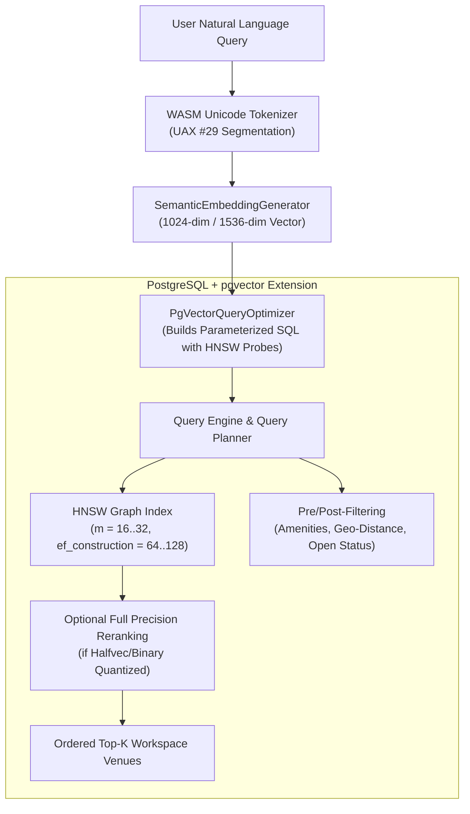

# PgVectorQueryOptimizer: HNSW Indexing, Vector Quantization, and Memory Sizing

## 1. Executive Summary

WorkSphere uses PostgreSQL with the [`pgvector`](https://github.com/pgvector/pgvector) extension to power real-time Approximate Nearest Neighbor (ANN) vector searches across high-dimensional semantic workspace embeddings. The query construction and parameter optimization are orchestrated through [`PgVectorQueryOptimizer.ts`](file:///c:/Users/admin/Desktop/workfere/src/core/search/PgVectorQueryOptimizer.ts) and consumed by the semantic search pipeline in [`src/app/api/search/semantic/route.ts`](file:///c:/Users/admin/Desktop/workfere/src/app/api/search/semantic/route.ts).

This engineering guide provides detailed specifications for:
- **HNSW (Hierarchical Navigable Small World) Indexing:** Selecting and tuning graph construction hyperparameters (`m`, `ef_construction`) and runtime probe depth (`hnsw.ef_search`).
- **IVFFlat vs. HNSW Trade-Offs:** Comparing recall guarantees, indexing overhead, build memory, and query latency across dataset scales.
- **Vector Quantization Strategies:** Evaluating scalar quantization (`halfvec` / FP16) and binary quantization (`bit` / Hamming distance) to cut memory footprints by $50\%\text{--}95\%$.
- **Index Memory Sizing & Sizing Mathematics:** Estimating RAM requirements, configuring PostgreSQL buffer pools (`shared_buffers`, `work_mem`, `maintenance_work_mem`), and maintaining indexes in cache.

---

## 2. Architecture Overview



The optimizer produces cosine distance queries:

$$\text{similarity} = 1 - (\mathbf{u} \cdot \mathbf{v}) = 1 - (\text{embedding} \Leftrightarrow \text{query\_vector})$$

where `<=>` denotes cosine distance in `pgvector`.

---

## 3. HNSW Indexing & Hyperparameter Selection

HNSW organizes vectors into a multi-layer hierarchical graph. Upper layers contain sparse long-range connections for fast exploration, while layer 0 contains dense short-range connections for fine-grained convergence.

### 3.1 DDL Specification

```sql
CREATE INDEX idx_venues_embedding_hnsw ON venues 
USING hnsw (embedding vector_cosine_ops)
WITH (m = 16, ef_construction = 128);
```

### 3.2 Hyperparameter Tuning Guidelines

#### `m` (Max Outgoing Connections Per Node)
- **Definition:** The maximum number of bi-directional edges attached to each vector node in layers $> 0$ (the ground layer 0 supports up to $2 \times m$ connections).
- **Default:** `16` (valid range: $2 \le m \le 100$).
- **Impact:**
  - Higher `m` ($32\text{--}64$) significantly improves recall on high-dimensional vectors ($> 768$ dimensions) with clustered topologies.
  - Higher `m` increases index size and construction time linearly ($\mathcal{O}(m \cdot N)$).
- **Recommendation:**
  - $d \le 384$: `m = 16`
  - $384 < d \le 1536$: `m = 24` or `m = 32`
  - $d > 1536$: `m = 32` to `64`

#### `ef_construction` (Candidate Queue Size During Index Build)
- **Definition:** The capacity of the dynamic priority queue explored when finding nearest neighbors during node insertion.
- **Default:** `64` (typical production range: `100` to `256`).
- **Impact:**
  - Controls graph quality and connectivity at build time.
  - Doubling `ef_construction` doubles index build duration without affecting query-time memory or index storage on disk.
  - Rule of thumb: Set $\text{ef\_construction} \ge 2 \times m$.
- **Recommendation:**
  - Development / Staging: `ef_construction = 64`
  - Production (Recall $\ge 98\%$): `ef_construction = 128` to `256`

#### `hnsw.ef_search` (Query-Time Exploration Beam Width)
- **Definition:** The dynamic candidate queue depth maintained during query traversal on layer 0.
- **Default:** `40` (valid range: $1 \le \text{ef\_search} \le 1000$).
- **Query Setting:**
  ```sql
  SET LOCAL hnsw.ef_search = 100;
  ```
- **Trade-Off:**
  - Higher values trade query latency for higher recall.
  - Must always be greater than or equal to the query's `LIMIT` ($k$).

| Goal | `m` | `ef_construction` | `hnsw.ef_search` | Target Recall | Query Latency |
| :--- | :---: | :---: | :---: | :---: | :---: |
| **Low Latency / High Throughput** | 16 | 64 | 32 | ~92–95% | < 2 ms |
| **Balanced (Production Default)** | 16–24 | 128 | 64–80 | ~96–98% | 3–6 ms |
| **High Accuracy / Enterprise** | 32 | 200 | 120–160 | > 99% | 8–15 ms |

---

## 4. IVFFlat vs. HNSW Trade-Offs

`pgvector` provides two principal vector index types: **HNSW** and **IVFFlat** (Inverted File Flat).

### 4.1 Comparative Matrix

| Characteristic | HNSW | IVFFlat |
| :--- | :--- | :--- |
| **Index Structure** | Multi-layer proximity graph | $K$-means cluster centroids (inverted lists) |
| **Recall Guarantee** | High to Very High (95%–99.9%) | Moderate to High (80%–95%) |
| **Query Latency** | Sub-millisecond to low ms ($\mathcal{O}(\log N)$) | Moderate ($\mathcal{O}(\text{probes} \cdot \frac{N}{\text{lists}})$) |
| **Build Time** | Moderate to Long | Fast to Very Fast |
| **Index Size / Memory** | High (~1.2× to 1.8× raw vector data) | Low (~0.1× to 0.2× vector data) |
| **Build Requirements** | Incremental inserts supported immediately | Requires training on pre-populated data ($N > 10,000$) |
| **Degradation Over Time** | Stable with frequent updates and deletes | Centroids become stale as data distribution drifts |

### 4.2 Architectural Decision Criteria

1. **Use HNSW When (WorkSphere Default):**
   - High search recall ($> 95\%$) is required for workspace discovery.
   - Vectors are inserted incrementally as new venues onboard.
   - Low query latency under concurrent load is critical.
   - The database server has sufficient RAM to host the index in buffer cache.

2. **Use IVFFlat When:**
   - Memory is strictly constrained and index RAM cannot exceed 20% of vector data.
   - High build throughput is required for batch ETL pipelines.
   - Bulk loading static corpora without continuous real-time additions.

---

## 5. Vector Quantization Strategies

High-dimensional float vectors (e.g., 1024 dimensions in FP32) consume $1024 \times 4 = 4,096$ bytes per row. For $1,000,000$ workspaces, raw vectors require $\sim 4.1\text{ GB}$, and the HNSW graph requires an additional $\sim 5.2\text{ GB}$. Vector quantization reduces memory requirements while preserving top-k ranking fidelity.

### 5.1 Scalar Quantization (`halfvec` / FP16)

`pgvector` 0.7.0+ supports 16-bit half-precision floating-point vectors (`halfvec`):

```sql
-- Convert 32-bit vector column to 16-bit halfvec
ALTER TABLE venues ADD COLUMN embedding_fp16 halfvec(1024);
UPDATE venues SET embedding_fp16 = embedding::halfvec(1024);

-- Build HNSW index on quantized vectors
CREATE INDEX idx_venues_embedding_halfvec ON venues 
USING hnsw (embedding_fp16 halfvec_cosine_ops)
WITH (m = 16, ef_construction = 128);
```

- **Memory Reduction:** Exactly $50\%$ ($2$ bytes per dimension vs $4$ bytes in FP32).
- **Recall Impact:** Negligible ($< 0.5\%$ loss in NDCG@10).
- **Query Flow:** Query embedding is cast to `halfvec`, evaluated against the halfvec index, and optionally reranked using the raw FP32 column for the top 50 candidates.

### 5.2 Binary Quantization (`bit` / Hamming Distance)

For ultra-large-scale datasets ($> 10\text{M}$ vectors), binary quantization thresholds vector coordinates around zero (or the coordinate mean):

$$\text{bit}_i = \begin{cases} 1 & \text{if } v_i > 0 \\ 0 & \text{if } v_i \le 0 \end{cases}$$

```sql
-- Generate binary embedding column
ALTER TABLE venues ADD COLUMN embedding_bin bit(1024);
UPDATE venues SET embedding_bin = binary_quantize(embedding)::bit(1024);

-- HNSW index using Hamming distance
CREATE INDEX idx_venues_embedding_bin ON venues 
USING hnsw (embedding_bin bit_hamming_ops)
WITH (m = 32, ef_construction = 200);
```

- **Memory Reduction:** $32\times$ reduction ($1$ bit per dimension vs $32$ bits in FP32). A 1024-dim vector drops from $4,096$ bytes to $128$ bytes.
- **Rerank Strategy:** Two-phase execution:
  1. Retrieve Top-100 nearest candidates using Hamming distance over `bit` HNSW.
  2. Compute exact cosine similarity using FP32 vector on the 100 candidate rows.

---

## 6. Index Memory Sizing Mathematics & Capacity Planning

To maintain sub-10ms response times, vector indexes must fit entirely within PostgreSQL's shared buffer cache or OS page cache.

### 6.1 Memory Sizing Formula

The memory footprint of a `pgvector` HNSW index is modeled as:

$$\text{Size}_{\text{HNSW}} \approx N \times \left( \left( d \times S_{\text{val}} \right) + \left( 2 \times m \times S_{\text{ptr}} \right) + S_{\text{overhead}} \right)$$

Where:
- $N$: Total number of vectors.
- $d$: Vector dimensionality (e.g., $1024$).
- $S_{\text{val}}$: Byte size per dimension ($4$ for FP32, $2$ for `halfvec`, $0.125$ for `bit`).
- $m$: HNSW graph out-degree parameter.
- $S_{\text{ptr}}$: Pointer/neighbor storage overhead ($\approx 8\text{ bytes}$ per edge).
- $S_{\text{overhead}}$: Tuple header, page header, and HNSW node structure overhead ($\approx 24\text{ bytes}$ per node).

### 6.2 Sizing Table (1,000,000 Vectors, $d = 1024$, $m = 16$)

| Format | Storage per Vector | Graph Edge Storage ($2m$) | Overhead | Total Index Size |
| :--- | :---: | :---: | :---: | :---: |
| **FP32 (`vector`)** | $4,096\text{ B}$ | $256\text{ B}$ | $24\text{ B}$ | **$\approx 4.38\text{ GB}$** |
| **FP16 (`halfvec`)** | $2,048\text{ B}$ | $256\text{ B}$ | $24\text{ B}$ | **$\approx 2.33\text{ GB}$** |
| **Binary (`bit`)** | $128\text{ B}$ | $256\text{ B}$ | $24\text{ B}$ | **$\approx 0.41\text{ GB}$** |

### 6.3 PostgreSQL Engine Buffer Configuration

To ensure index builds and query probes execute in memory without spilling to disk:

```ini
# postgresql.conf

# Minimum 25% of total system RAM dedicated to buffer pool
shared_buffers = 8GB

# Provide sufficient memory for building HNSW graph without disk temporary files
maintenance_work_mem = 4GB

# Ensure parallel workers are utilized during index build
max_parallel_maintenance_workers = 4

# Query working memory for complex filter queries
work_mem = 64MB

# Cost parameters to prevent planner from favoring full table scans over index scans
random_page_cost = 1.1
effective_cache_size = 24GB
```

---

## 7. Integration with `PgVectorQueryOptimizer`

[`PgVectorQueryOptimizer.ts`](file:///c:/Users/admin/Desktop/workfere/src/core/search/PgVectorQueryOptimizer.ts) combines vector distance metrics with structured metadata filters (amenities, minimum ratings, geographic bounds, opening status).

### 7.1 Dynamic Query Generation Pattern

```typescript
import { PgVectorQueryOptimizer, SearchFilters } from '@/core/search/PgVectorQueryOptimizer';

const optimizer = new PgVectorQueryOptimizer('venues', 'embedding');

const filters: SearchFilters = {
    minRating: 4.5,
    amenities: ['Ergonomic Chairs', 'Gigabit WiFi'],
    userLat: 37.7749,
    userLng: -122.4194,
    maxDistanceMeters: 5000,
    isOpenNow: true
};

const { sql, params } = optimizer.buildQuery(queryVector, filters, 10);
```

### 7.2 Generated SQL Query Structure

```sql
SELECT 
  id, name, description, rating, latitude, longitude,
  1 - (embedding <=> $1::vector) AS similarity_score
FROM venues
WHERE 1=1
  AND rating >= $2
  AND amenities @> $3::text[]
  AND ST_DistanceSphere(
    ST_MakePoint(longitude, latitude),
    ST_MakePoint($4, $5)
  ) <= $6
  AND is_currently_open = true
ORDER BY embedding <=> $1::vector ASC
LIMIT $7;
```

### 7.3 Multi-Index Planning Optimization (Iterative Filtering)

When combining structured SQL filters (`WHERE amenities @> ...`) with HNSW index scans:
1. **Iterative Scan:** `pgvector` retrieves nearest vectors from the HNSW graph and tests them against the relational filters until the `LIMIT` is satisfied.
2. **Partial Indexes:** For frequent filter subsets (e.g., active venues), build a partial index:
   ```sql
   CREATE INDEX idx_venues_active_hnsw ON venues 
   USING hnsw (embedding vector_cosine_ops)
   WHERE is_currently_open = true;
   ```
3. **Pre-Filtering Threshold:** If filters match fewer than $1\%$ of rows, PostgreSQL's query planner will prefer a Bitmap Index Scan on relational attributes followed by brute-force vector distance calculation. Tuning `ef_search` ensures adequate candidate retrieval even under restrictive predicates.
