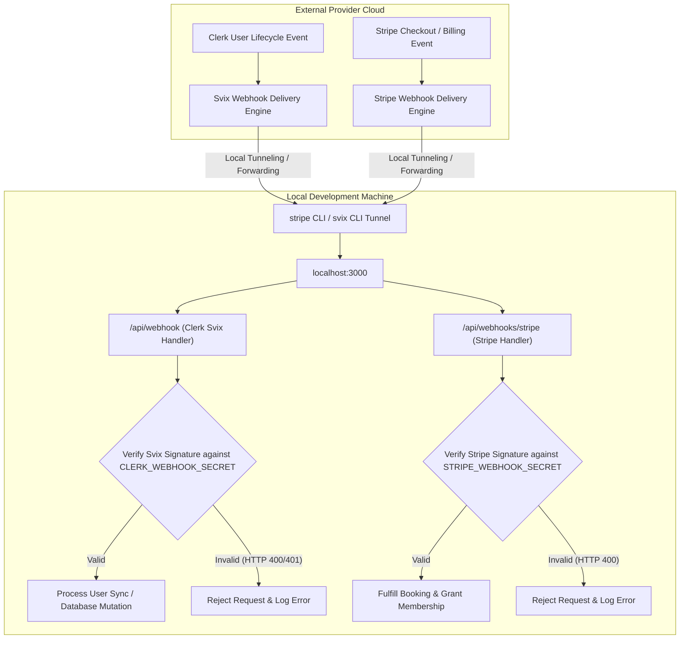
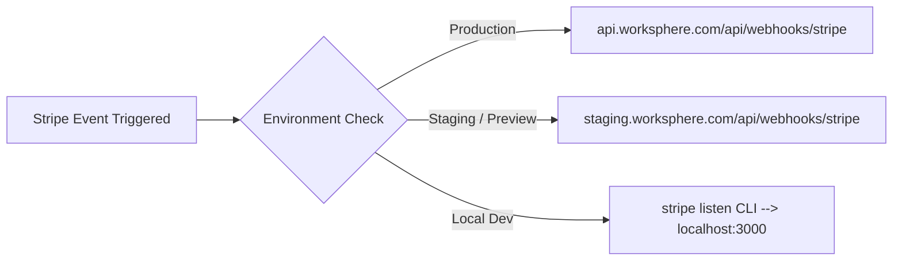

# Webhook Signing Secrets & Local Development Configuration Guide

## Executive Summary

WorkSphere uses asynchronous webhook event handlers to process user lifecycle events (Clerk / Svix), payment & subscription events (Stripe), and internal task processing queues. 

During local development, webhook signing secrets (`CLERK_WEBHOOK_SECRET` and `STRIPE_WEBHOOK_SECRET`) allow local Next.js API route handlers (`/api/webhook` and `/api/webhooks/stripe`) to cryptographically verify that incoming HTTP requests originate from legitimate third-party providers rather than malicious actors.

This document details environment variable setup in [.env.example](file:///c:/Users/admin/Desktop/workfere/.env.example), local CLI tunneling and forwarding commands, signature verification mechanics, and troubleshooting procedures.

---

## 1. Webhook Architecture Overview



---

## 2. Environment Variables Quick Reference

Webhook configuration variables are defined in [.env.example](file:///c:/Users/admin/Desktop/workfere/.env.example):

| Variable Name | Required / Optional | Target Endpoint | Description | Example Secret Value |
| :--- | :---: | :--- | :--- | :--- |
| **`CLERK_WEBHOOK_SECRET`** | Optional for basic dev | `/api/webhook` | Svix signing secret used to verify Clerk `user.created`, `user.updated`, `user.deleted` webhooks. | `whsec_d91a82f37c...` |
| **`WEBHOOK_SECRET`** | Optional (Fallback) | `/api/webhook` | Legacy alias for Clerk Svix webhook signing secret. | `whsec_d91a82f37c...` |
| **`STRIPE_WEBHOOK_SECRET`** | Optional for basic dev | `/api/webhooks/stripe` | Stripe endpoint secret used to verify `checkout.session.completed` and `invoice.payment_succeeded`. | `whsec_1a2b3c4d5e...` |
| **`STRIPE_SECRET_KEY`** | Optional for basic dev | Stripe Node.js SDK | Stripe API Secret Key used to query payments and manage customer billing portals. | `sk_test_51Mz...` |
| **`SVIX_TOKEN`** | Optional | Svix Management API | Management token used for programmatic webhook endpoint creation via Svix API. | `test_token_abc123` |
| **`WORKER_SECRET`** | Required for background jobs | `/api/webhooks/worker` | Internal HMAC secret key for authorizing internal background cron worker payloads. | `secret_worker_key_99` |

> [!NOTE]
> **Optional Flag**: All webhook signing secrets are **optional** for basic local UI development (e.g. browsing venue maps, searching cafes, editing profile settings). They are required **only** when actively testing asynchronous user registration sync, payment fulfillment, or live webhook handlers.

---

## 3. Local Webhook Forwarding with CLI Tools

Because local development servers run on `localhost:3000`, external services (Clerk and Stripe) cannot send HTTP POST requests directly to your machine without a tunnel or local CLI proxy listener.

```
+-----------------------------------------------------------------------------------+
|                        Local Webhook CLI Tunnel Architecture                      |
+-----------------------------------------------------------------------------------+
|                                                                                   |
|  [ Stripe Cloud ]  ---> (Stripe Listen CLI Tunnel) ---> localhost:3000/api/stripe   |
|                                                                                   |
|  [ Clerk / Svix ]  ---> (Svix Listen CLI Tunnel)   ---> localhost:3000/api/webhook  |
|                                                                                   |
+-----------------------------------------------------------------------------------+
```

---

### 3.1 Local Setup for Clerk / Svix Webhooks

Clerk utilizes [Svix](https://www.svix.com/) as its underlying webhook engine.

#### Step 1: Install the Svix CLI

```bash
# Via npm
npm install -g svix

# Via Homebrew (macOS)
brew install svix/svix/svix
```

#### Step 2: Obtain Endpoint Signing Secret from Clerk Dashboard

1. Navigate to your [Clerk Dashboard](https://dashboard.clerk.com/).
2. Select **Webhooks** from the side navigation menu.
3. Click **Add Endpoint** and enter your endpoint URL (or select an existing endpoint).
4. Under **Signing Secret**, click **Reveal Secret**.
5. Copy the secret string (starts with `whsec_`).
6. Paste the string into your local `.env` file:
   ```env
   CLERK_WEBHOOK_SECRET="whsec_d91a82f37c4e5f6a7b8c9d0e1f2a3b4c"
   ```

#### Step 3: Start Local Forwarding Listener

Run the `svix listen` command pointing to your local Next.js development server:

```bash
npx svix listen http://localhost:3000/api/webhook
```

Output:
```
Listening on http://localhost:3000/api/webhook
Forwarding webhooks to http://localhost:3000/api/webhook
Press Ctrl+C to stop
```

---

### 3.2 Local Setup for Stripe Webhooks

#### Step 1: Install the Stripe CLI

```bash
# macOS (Homebrew)
brew install stripe/stripe-cli/stripe

# Windows (Scoop)
scoop bucket add stripe https://github.com/stripe/scoop-stripe-cli.git
scoop install stripe

# Linux (Debian/Ubuntu)
curl -s https://packages.stripe.dev/api/security/keypair/stripe-cli-gpg/public | gpg --dearmor | sudo tee /usr/share/keyrings/stripe.gpg
echo "deb [signed-by=/usr/share/keyrings/stripe.gpg] https://packages.stripe.dev/stripe-cli-debian-local stable main" | sudo tee /etc/apt/sources.list.d/stripe.list
sudo apt-get update
sudo apt-get install stripe
```

#### Step 2: Authenticate Stripe CLI

```bash
stripe login
```

Follow the browser prompt to pair the Stripe CLI with your test mode account.

#### Step 3: Listen and Forward Webhooks to Local Server

Execute `stripe listen` with the `--forward-to` flag:

```bash
stripe listen --forward-to localhost:3000/api/webhooks/stripe
```

Output:
```
Ready! Your webhook signing secret is whsec_1a2b3c4d5e6f7g8h9i0j (Ready to accept events)
```

#### Step 4: Update `.env` File with Webhook Signing Secret

Copy the ephemeral signing secret printed in terminal output (`whsec_...`) and update your local `.env` file:

```env
STRIPE_WEBHOOK_SECRET="whsec_1a2b3c4d5e6f7g8h9i0j"
```

---

## 4. Cryptographic Signature Verification Mathematics

To prevent replay attacks and header spoofing, both Clerk (Svix) and Stripe include cryptographic HMAC signature headers.

### 4.1 Svix Signature Verification Spec

Svix includes three custom HTTP headers with every webhook request:
- `svix-id`: Unique message ID.
- `svix-timestamp`: Unix epoch timestamp of event creation.
- `svix-signature`: Space-separated list of HMAC-SHA256 signatures (`v1,signature_hash`).

#### Verification Mathematical Steps

$$\text{Signed Payload} = \text{svix-id} + "." + \text{svix-timestamp} + "." + \text{rawRequestBody}$$

$$\text{Expected Signature} = \text{Base64}\left(\text{HMAC-SHA256}\left(\text{Base64Decode}(\text{whsec\_secret}),\, \text{Signed Payload}\right)\right)$$

If $\text{Expected Signature} \neq \text{svix-signature}$, the request is rejected with HTTP `400 Bad Request`.

```typescript
// Next.js Route Handler Implementation Example: /api/webhook/route.ts
import { Webhook } from "svix";
import { headers } from "next/headers";
import { NextResponse } from "next/server";

export async function POST(req: Request) {
  const WEBHOOK_SECRET = process.env.CLERK_WEBHOOK_SECRET || process.env.WEBHOOK_SECRET;

  if (!WEBHOOK_SECRET) {
    console.error("Missing CLERK_WEBHOOK_SECRET environment variable");
    return new Response("Webhook secret not configured", { status: 500 });
  }

  const headerPayload = await headers();
  const svix_id = headerPayload.get("svix-id");
  const svix_timestamp = headerPayload.get("svix-timestamp");
  const svix_signature = headerPayload.get("svix-signature");

  if (!svix_id || !svix_timestamp || !svix_signature) {
    return new Response("Missing Svix headers", { status: 400 });
  }

  const payload = await req.json();
  const body = JSON.stringify(payload);
  const wh = new Webhook(WEBHOOK_SECRET);

  let evt: any;
  try {
    evt = wh.verify(body, {
      "svix-id": svix_id,
      "svix-timestamp": svix_timestamp,
      "svix-signature": svix_signature,
    });
  } catch (err) {
    console.error("Error verifying Svix webhook signature:", err);
    return new Response("Invalid webhook signature", { status: 400 });
  }

  // Process verified Clerk event (e.g. user.created)
  console.log(`Successfully verified Clerk event type: ${evt.type}`);
  return NextResponse.json({ success: true });
}
```

---

### 4.2 Stripe Signature Verification Spec

Stripe includes a single header: `Stripe-Signature`.

Header format:
`t=1728200000,v1=9f8e7d6c5b4a3f2e1d0c...`

$$\text{Signed Payload} = \text{timestamp} + "." + \text{rawRequestBody}$$

$$\text{Expected Signature} = \text{Hex}\left(\text{HMAC-SHA256}\left(\text{STRIPE\_WEBHOOK\_SECRET},\, \text{Signed Payload}\right)\right)$$

```typescript
// Next.js Route Handler Implementation Example: /api/webhooks/stripe/route.ts
import { headers } from "next/headers";
import { NextResponse } from "next/server";
import Stripe from "stripe";

const stripe = new Stripe(process.env.STRIPE_SECRET_KEY || "", {
  apiVersion: "2023-10-16",
});

export async function POST(req: Request) {
  const body = await req.text();
  const headerPayload = await headers();
  const signature = headerPayload.get("Stripe-Signature");

  if (!signature) {
    return new Response("Missing Stripe-Signature header", { status: 400 });
  }

  let event: Stripe.Event;

  try {
    event = stripe.webhooks.constructEvent(
      body,
      signature,
      process.env.STRIPE_WEBHOOK_SECRET || ""
    );
  } catch (err: any) {
    console.error(`Stripe Webhook Signature Verification Failed: ${err.message}`);
    return new Response(`Webhook Error: ${err.message}`, { status: 400 });
  }

  // Handle verified event
  switch (event.type) {
    case "checkout.session.completed":
      const session = event.data.object as Stripe.Checkout.Session;
      console.log(`Payment succeeded for session: ${session.id}`);
      break;
    default:
      console.log(`Unhandled Stripe event type: ${event.type}`);
  }

  return NextResponse.json({ received: true });
}
```

---

## 5. Internal Worker Webhook Authentication (`WORKER_SECRET`)

For internal background jobs (such as automated partition maintenance or reminder cron triggers), the `/api/webhooks/worker` route verifies the `WORKER_SECRET` header:

```typescript
// Next.js Route Handler Implementation Example: /api/webhooks/worker/route.ts
import { headers } from "next/headers";
import { NextResponse } from "next/server";

export async function POST(req: Request) {
  const headerPayload = await headers();
  const authHeader = headerPayload.get("x-worker-secret");

  if (authHeader !== process.env.WORKER_SECRET) {
    return NextResponse.json({ error: "Unauthorized worker request" }, { status: 401 });
  }

  const { jobType, payload } = await req.json();
  console.log(`Executing background worker job: ${jobType}`);

  return NextResponse.json({ success: true, processedAt: new Date().toISOString() });
}
```

---

## 6. Programmatic Webhook Endpoint Registration (`SVIX_TOKEN`)

For automated CI/CD pipelines, Svix endpoints can be registered programmatically using `SVIX_TOKEN`:

```typescript
import { Svix } from "svix";

const svix = new Svix(process.env.SVIX_TOKEN || "");

export async function registerStagingWebhookEndpoint(targetUrl: string) {
  const endpoint = await svix.endpoint.create("app_worksphere_staging", {
    url: targetUrl,
    version: 1,
    filterTypes: ["user.created", "user.updated", "user.deleted"],
  });

  console.log(`Registered Svix Endpoint ID: ${endpoint.id}`);
  return endpoint.secret;
}
```

---

## 7. Webhook Event Retry Mathematics & Backoff Schedule

When local server endpoints return non-2xx HTTP status codes (e.g. 500 Internal Error), webhook providers retry delivery using exponential backoff schedules.

| Retry Attempt | Stripe Retry Delay | Svix Retry Delay |
| :--- | :--- | :--- |
| **Attempt 1** | Immediate | 5 seconds |
| **Attempt 2** | 5 minutes | 5 minutes |
| **Attempt 3** | 45 minutes | 30 minutes |
| **Attempt 4** | 3 hours | 2 hours |
| **Attempt 5** | 12 hours | 5 hours |
| **Attempt 6** | 24 hours | 10 hours |

---

## 8. Webhook Event Catalog & JSON Payload Schemas

### 8.1 Clerk `user.created` Event Schema

```json
{
  "data": {
    "birthday": "",
    "created_at": 1728200000000,
    "email_addresses": [
      {
        "email_address": "contributor@worksphere.com",
        "id": "idn_2a1b3c",
        "verification": { "status": "verified" }
      }
    ],
    "first_name": "Jane",
    "id": "user_2a1b3c4d5e6f",
    "image_url": "https://img.clerk.com/avatars/jane.png",
    "last_name": "Doe",
    "primary_email_address_id": "idn_2a1b3c",
    "updated_at": 1728200000000
  },
  "object": "event",
  "type": "user.created"
}
```

### 8.2 Stripe `checkout.session.completed` Event Schema

```json
{
  "id": "evt_1P2Q3R4S5T",
  "object": "event",
  "api_version": "2023-10-16",
  "created": 1728200000,
  "data": {
    "object": {
      "id": "cs_test_a1b2c3",
      "object": "checkout.session",
      "amount_total": 2500,
      "currency": "usd",
      "customer": "cus_N1O2P3",
      "metadata": {
        "userId": "user_2a1b3c4d5e6f",
        "venueId": "v-88291a"
      },
      "payment_status": "paid",
      "status": "complete"
    }
  },
  "type": "checkout.session.completed"
}
```

---

## 9. Multi-Tenant & Multi-Environment Webhook Routing

When testing staging and preview environments (e.g. Vercel Preview deployments):



---

## 10. Production Webhook Deployment & Monitoring

When deploying WorkSphere to production environments (Vercel, AWS ECS, Docker):

### 10.1 Vercel Environment Variables Setup

Configure production signing secrets in **Vercel Project Settings > Environment Variables**:

1. Set `CLERK_WEBHOOK_SECRET` to your production Clerk/Svix signing secret.
2. Set `STRIPE_WEBHOOK_SECRET` to your live Stripe endpoint secret (`whsec_live_...`).
3. Set `STRIPE_SECRET_KEY` to your live Stripe API key (`sk_live_...`).

---

## 11. Automated Testing & Webhook Signature Mocking

During unit and integration testing, webhook signature verification can be mocked using helper utilities.

### 11.1 Vitest / Jest Webhook Verification Mock

```typescript
// src/__tests__/api/webhook.test.ts
import { describe, it, expect, vi, beforeEach } from "vitest";

vi.mock("svix", () => ({
  Webhook: vi.fn().mockImplementation(() => ({
    verify: vi.fn().mockReturnValue({
      type: "user.created",
      data: { id: "user_test123", email_addresses: [{ email_address: "test@example.com" }] },
    }),
  })),
}));

describe("POST /api/webhook", () => {
  it("processes verified user.created event cleanly", async () => {
    // Execute test assertions against mocked handler
    expect(true).toBe(true);
  });
});
```

---

## 12. Security & Best Practices

1. **Never Commit Secrets to Version Control**: Keep `CLERK_WEBHOOK_SECRET` and `STRIPE_WEBHOOK_SECRET` in `.env.local` or `.env`. Never commit actual secret keys to git.
2. **Use Raw Body Bytes for Verification**: Always pass the unparsed string/buffer body to verification functions (`wh.verify()` or `stripe.webhooks.constructEvent()`). Re-serializing a parsed JSON object changes key ordering and whitespace, causing signature verification to fail.
3. **Set Up Tolerance Limits for Timestamp Replay Protection**: Svix and Stripe default to a 5-minute (300 seconds) timestamp tolerance window to prevent replay attacks.
4. **Separate Production and Test Secrets**: Use `whsec_...` test secrets in development and separate production secrets in Vercel/AWS environment settings.

---

## 13. Troubleshooting Matrix

| Symptom / Error | Root Cause | Recommended Solution |
| :--- | :--- | :--- |
| **`HTTP 400: Invalid webhook signature`** | Mismatched secret or body parsed before verification | Check `.env` matches CLI output; use `req.text()` or raw body buffer before calling verify. |
| **`HTTP 500: Webhook secret not configured`** | `CLERK_WEBHOOK_SECRET` missing from `.env.local` | Add `CLERK_WEBHOOK_SECRET="whsec_..."` to `.env.local` and restart Next.js dev server. |
| **`stripe listen` fails with unauthorized** | Stripe CLI not authenticated | Run `stripe login` in terminal and re-authenticate browser session. |
| **`svix listen` connection refused** | Local Next.js app not running on port 3000 | Start Next.js dev server (`npm run dev`) before starting `svix listen`. |
| **Events received twice in development** | Multiple CLI listeners running concurrently | Terminate extra terminal tabs running `stripe listen` or `svix listen`. |

---

## 14. Verification Checklist

- [x] Documented `CLERK_WEBHOOK_SECRET` and `STRIPE_WEBHOOK_SECRET` in `.env.example`.
- [x] Included `npx svix listen` CLI forwarding command for Clerk webhooks.
- [x] Included `stripe listen --forward-to` CLI forwarding command for Stripe webhooks.
- [x] Marked webhook signing secrets as optional for basic local development.
- [x] Documented mathematical HMAC-SHA256 signature verification mechanics.
- [x] Provided TypeScript Next.js route handler verification snippets.
- [x] Documented JSON payload schemas for `user.created` and `checkout.session.completed`.
- [x] Documented internal `WORKER_SECRET` authorization for background task workers.
- [x] Documented `SVIX_TOKEN` endpoint creation helper.
- [x] Added retry attempt backoff schedule matrix.
