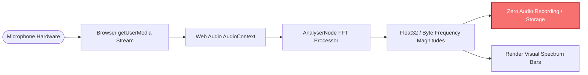
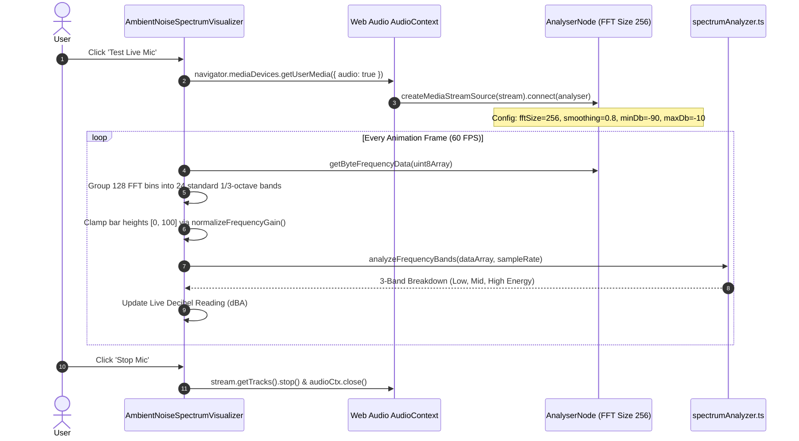

# Ambient Noise Monitoring & Microphone Calibration User Guide

## Overview

WorkSphere provides real-time acoustic awareness across coworking spaces, cafes, and libraries through the **Ambient Noise Spectrum Visualizer** (`src/components/noise/AmbientNoiseSpectrumVisualizer.tsx`) and the **Acoustic Calibration Engine** (`src/lib/noise/calibration.ts`).

Whether selecting a whisper-quiet spot for focused coding, checking background chatter levels before a client presentation, or crowdsourcing acoustic noise metrics, WorkSphere enables users to understand venue acoustics with precision and zero privacy intrusion.

---

## 1. Decibel (dBA) Categorization Scale

WorkSphere maps measured and crowdsourced sound pressure levels (SPL) into intuitive workspace noise categories:

| Range (dBA) | Category Classification | Status Badge & Color | Typical Acoustic Environment | Recommended Workspace Tasks |
| :--- | :--- | :--- | :--- | :--- |
| **$< 45\text{ dBA}$** | **Deep Focus (Quiet)** | `text-emerald-400 bg-emerald-500/10` | Quiet library, private phone booth, suburban reading room. | Deep problem solving, asynchronous writing, focused study. |
| **$45\text{--}62\text{ dBA}$** | **Gentle Ambience (Moderate)** | `text-teal-400 bg-teal-500/10` | Low-key cafe, open-plan workspace with mild typing. | Team pair programming, general desk work, reading. |
| **$63\text{--}74\text{ dBA}$** | **Lively Workspace (Active)** | `text-amber-400 bg-amber-500/10` | Busy coffee shop, cafe espresso machines, active brainstorm area. | Collaborative meetings, casual discussions, design reviews. |
| **$> 74\text{ dBA}$** | **Energetic / Loud (High)** | `text-rose-400 bg-rose-500/10` | High-traffic lounge, street-adjacent patio, active cafeteria. | Casual networking, social work, noise-cancelling headphones advised. |

---

## 2. Privacy Guarantees & Microphone Permissions

User privacy is fundamental to WorkSphere's acoustic telemetry design:



### Key Privacy Principles:
1. **Zero Raw Audio Storage:** Audio input is processed strictly in-memory within the local browser runtime. Raw audio streams are never recorded, compressed, or uploaded to any server.
2. **Ephemeral Fourier Transforms:** Audio signals are converted immediately into anonymous statistical frequency bins (energy per octave band) and discarded. Speech recognition or voice transcription is never performed.
3. **Explicit User Opt-In:** Microphone analysis operates only when the user explicitly clicks the **"Test Live Mic"** button. Permission can be revoked at any time via browser settings.
4. **Fallback Acoustic Telemetry:** If microphone access is denied or unavailable, the visualizer automatically falls back to simulated pink-noise telemetry derived from historical venue ratings.

---

## 3. Web Audio API & Fast Fourier Transform (FFT) Pipeline

The visualizer transforms raw time-domain sound pressure waves into a 24-band frequency spectrum using the Web Audio API:



### 3.1 24-Band 1/3 Octave Grouping
Frequencies ranging from $32\text{ Hz}$ to $16\text{ kHz}$ are distributed across 24 perceptual frequency bands:
- **Low / Bass ($20\text{--}250\text{ Hz}$):** HVAC units, traffic hum, building rumble (rendered in purple/indigo gradients).
- **Mid / Speech ($250\text{--}4\text{ kHz}$):** Vocal speech range and office conversation (rendered in emerald/teal gradients).
- **High / Clatter ($4\text{--}16\text{ kHz}$):** Steam wands, dish clatter, keyboard clicks, hiss (rendered in cyan/rose gradients).

---

## 4. Acoustic Calibration Mechanics (`src/lib/noise/calibration.ts`)

Microphone hardware varies widely in preamp sensitivity and frequency response. WorkSphere applies device-specific gain offsets to ensure accurate SPL readings:

```typescript
export interface MicCalibrationProfile {
  offsetDb: number;           // Calibration offset (-30 to +30 dB)
  sensitivity: number;        // Sensitivity multiplier (0.1 to 2.0)
  profileType: "built_in" | "smartphone" | "headset" | "studio_mic" | "custom";
}
```

### Hardware Presets

| Device Preset | Default Offset | Rationale |
| :--- | :--- | :--- |
| **Built-in Laptop / PC Mic** | $+0\text{ dB}$ | Standard integrated baseline omnidirectional microphone. |
| **Smartphone / Tablet Mic** | $+4\text{ dB}$ | Higher preamp gain tuned for close-proximity conversational speech. |
| **USB / Bluetooth Headset** | $-5\text{ dB}$ | Close-proximity boom microphone with background noise attenuation. |
| **Studio / Condenser Mic** | $-8\text{ dB}$ | High-sensitivity condenser capsule with wide dynamic range. |

### Calibrated Decibel Calculation Formula

$$\text{dBFS} = 20 \times \log_{10}\left(\text{RMS} \times \text{sensitivity}\right)$$

$$\text{dB}_{\text{calibrated}} = \max\left(0, \min\left(130, \text{round}\left((\text{dBFS} + 100 + \text{offsetDb}) \times 10\right) / 10\right)\right)$$

Output is strictly clamped between $0\text{ dBA}$ (absolute silence) and $130\text{ dBA}$ (threshold of pain) to eliminate acoustic burst distortion and clipping artifacts.
