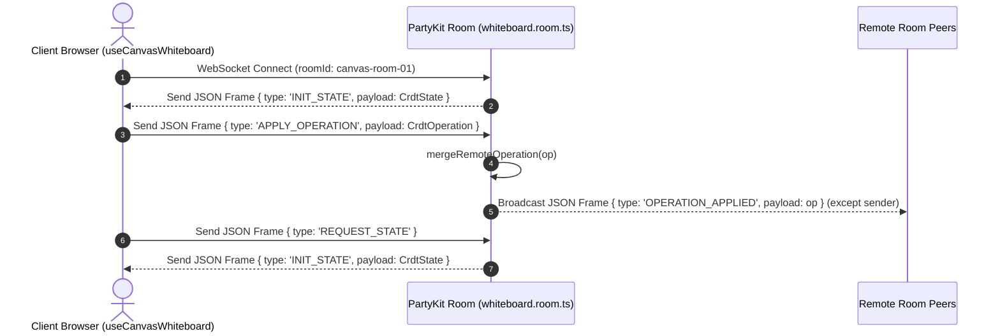

# Collaborative Whiteboard WebSocket Protocol & Tool Events

## 1. Executive Summary & Overview

WorkSphere provides a real-time collaborative canvas whiteboard powered by **PartyKit** edge WebSocket rooms (`src/party/whiteboard.room.ts`). Drawing events, shape mutations, remote cursors, and CRDT state operations are exchanged over WebSocket JSON frames.

```
+-----------------------------------------------------------------------------------+
|                              CLIENT DRAWING CANVAS UI                             |
|                 (DrawingCanvas.tsx & useCanvasWhiteboard.ts)                      |
+-----------------------------------------+-----------------------------------------+
                                          |
                      1. Drawing Input: STROKE_START / STROKE_MOVE
                                          |
                                          v
+-----------------------------------------------------------------------------------+
|                        STROKE POINT BUFFER & 60FPS THROTTLE                       |
|                       (THROTTLE_INTERVAL_MS = 16ms Buffer)                        |
+-----------------------------------------+-----------------------------------------+
                                          |
                      2. Send JSON Frame over PartyKit WebSocket
                                          |
                                          v
+-----------------------------------------------------------------------------------+
|                         PARTYKIT ROOM SERVER (whiteboard.room.ts)                 |
|  - Merges CRDT Operations & Lamport Clocks                                        |
|  - Broadcasts Frames to All Peer Connections: room.broadcast(..., [sender.id])   |
|  - Persists State Snapshots via onSave()                                          |
+-----------------------------------------+-----------------------------------------+
                                          |
                      3. Broadcast OPERATION_APPLIED / Drawing Event
                                          |
                                          v
+-----------------------------------------------------------------------------------+
|                           REMOTE PEER CANVAS RENDERING                            |
|                     (Remote Cursor & Stroke Replay Engine)                        |
+-----------------------------------------------------------------------------------+
```

Key protocol objectives:
- **Sub-50ms Stroke Broadcast:** Low-latency JSON frame relay across connected room peers.
- **60 FPS Point Throttling:** 16ms coordinate buffering (`THROTTLE_INTERVAL_MS = 16`) preventing WebSocket frame congestion during rapid stylus movement.
- **Deterministic CRDT Convergence:** State synchronization utilizing Lamport clocks and Last-Write-Wins (LWW) conflict resolution (`CrdtDocument.ts`).
- **Granular Tool Event Lifecycle:** Standardized JSON events (`STROKE_START`, `STROKE_MOVE`, `STROKE_END`, `CLEAR`).

---

## 2. Drawing Tool Events & JSON Protocol Format

When a user draws on the canvas, the client emits structured JSON messages over the active PartyKit WebSocket connection.

### 2.1 Event Types Overview

| Event Type | Direction | Description |
| :--- | :--- | :--- |
| `STROKE_START` | Client $\rightarrow$ Server $\rightarrow$ Peers | Triggered on pointer down; initializes a new stroke path instance |
| `STROKE_MOVE` | Client $\rightarrow$ Server $\rightarrow$ Peers | Emitted on pointer move (throttled to 16ms); streams incremental coordinate points |
| `STROKE_END` | Client $\rightarrow$ Server $\rightarrow$ Peers | Emitted on pointer up; finalizes stroke geometry and bounding box |
| `CLEAR` | Client $\rightarrow$ Server $\rightarrow$ Peers | Emitted when clearing the canvas; tombstone soft-deletes active shapes |

---

### 2.2 Event JSON Schemas

#### 2.2.1 `STROKE_START` Event
Initiates a new drawing path with selected tool type, color, stroke width, and initial coordinate point.

```json
{
  "type": "STROKE_START",
  "payload": {
    "id": "stroke_1728504000000_abc123",
    "tool": "pen",
    "color": "#3b82f6",
    "width": 3,
    "opacity": 1.0,
    "startPoint": { "x": 120.5, "y": 240.0 },
    "userId": "user_2a9x",
    "timestamp": 1728504000000
  }
}
```

#### 2.2.2 `STROKE_MOVE` Event
Streams buffered 2D coordinate pairs $(x, y)$ captured during pointer movement. Flattened array format: `[x0, y0, x1, y1, ...]`.

```json
{
  "type": "STROKE_MOVE",
  "payload": {
    "id": "stroke_1728504000000_abc123",
    "points": [120.5, 240.0, 125.0, 242.5, 130.2, 245.8, 136.0, 250.1],
    "userId": "user_2a9x",
    "timestamp": 1728504000016
  }
}
```

#### 2.2.3 `STROKE_END` Event
Signals completion of pointer interaction and commits final stroke attributes to document history.

```json
{
  "type": "STROKE_END",
  "payload": {
    "id": "stroke_1728504000000_abc123",
    "totalPoints": 42,
    "userId": "user_2a9x",
    "timestamp": 1728504000500
  }
}
```

#### 2.2.4 `CLEAR` Event
Clears all active shapes on the whiteboard room canvas.

```json
{
  "type": "CLEAR",
  "payload": {
    "userId": "user_2a9x",
    "canvasId": "canvas-room-01",
    "timestamp": 1728504001000
  }
}
```

---

## 3. PartyKit Room Server Messages (`whiteboard.room.ts`)

In addition to tool-specific events, `WhiteboardRoom` handles core CRDT document synchronization messages.



### 3.1 `INIT_STATE` (Server $\rightarrow$ Client)
Dispatched upon client connection to transmit the full initial CRDT document state:

```json
{
  "type": "INIT_STATE",
  "payload": {
    "shapes": [
      {
        "id": "shape-01",
        "type": "pen",
        "points": [10, 10, 50, 50],
        "color": "#ffffff",
        "width": 3,
        "userId": "user_1"
      }
    ],
    "clock": 142
  }
}
```

### 3.2 `APPLY_OPERATION` (Client $\rightarrow$ Server) & `OPERATION_APPLIED` (Server $\rightarrow$ Peers)
Carries CRDT operations (`ADD_SHAPE`, `UPDATE_SHAPE`, `DELETE_SHAPE`, `CLEAR_ALL`):

```json
{
  "type": "APPLY_OPERATION",
  "payload": {
    "type": "ADD_SHAPE",
    "shapeId": "stroke_1728504000000_abc123",
    "data": {
      "id": "stroke_1728504000000_abc123",
      "type": "pen",
      "points": [10, 10, 20, 20, 30, 30],
      "color": "#22c55e",
      "width": 4,
      "opacity": 1.0,
      "userId": "user_2a9x"
    },
    "nodeId": "client_node_99",
    "lamportClock": 15
  }
}
```

---

## 4. 60 FPS Throttling & Performance Optimization

To prevent high-rate mouse/stylus events (which fire at up to $240\text{Hz}$ on high-refresh displays) from overwhelming WebSockets:

1. **Buffer Storage:** `useCanvasWhiteboard.ts` buffers raw coordinates into `strokeBufferRef` (`Map<string, number[]>`).
2. **Interval Flush:** Points are flushed and dispatched every $16\text{ms}$ (`THROTTLE_INTERVAL_MS = 16`), aligning broadcasts with $60\text{ FPS}$ display refresh cycles.
3. **AnimationFrame Synchronization:** Point rendering uses `requestAnimationFrame` for smooth sub-pixel vector path updates.

---

## 5. Protocol Summary Reference

| Message Type | Direction | Payload Target | Purpose |
| :--- | :--- | :--- | :--- |
| `INIT_STATE` | Server $\rightarrow$ Client | Full `CrdtState` | Hydrates newly connected client with active room state |
| `APPLY_OPERATION` | Client $\rightarrow$ Server | `CrdtOperation` | Submits local drawing mutation for CRDT merge |
| `OPERATION_APPLIED` | Server $\rightarrow$ Peers | `CrdtOperation` | Relays merged mutation to all peer connections (excluding sender) |
| `REQUEST_STATE` | Client $\rightarrow$ Server | Empty / Null | Requests fresh room state snapshot from server memory |
| `STROKE_START` | Client $\rightarrow$ Room | `StrokeStartPayload` | Announces new path initiation |
| `STROKE_MOVE` | Client $\rightarrow$ Room | `StrokeMovePayload` | Streams 16ms throttled point array |
| `STROKE_END` | Client $\rightarrow$ Room | `StrokeEndPayload` | Finalizes path geometry |
| `CLEAR` | Client $\rightarrow$ Room | `ClearPayload` | Resets or clears canvas state |
