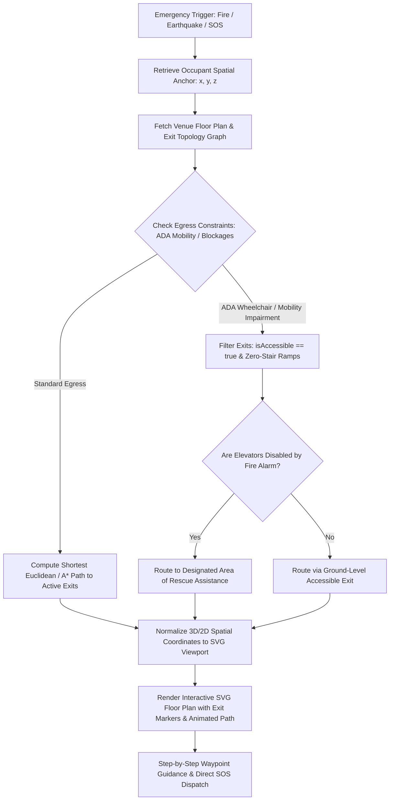
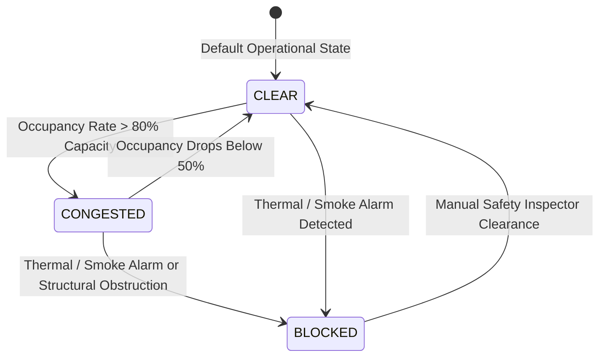
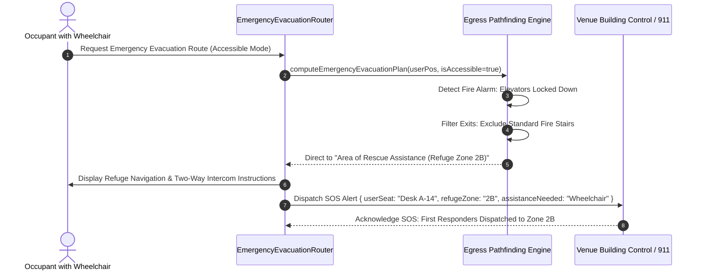
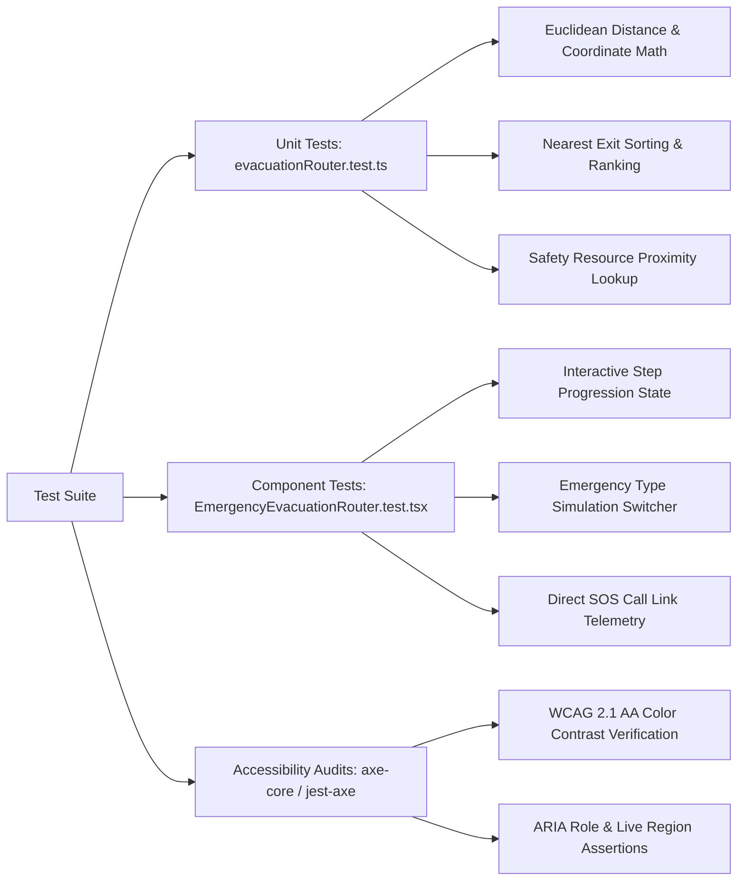

# EmergencyEvacuationRouter: Floor Plan SVG Mapping, Exit Markers, and ADA Accessible Egress

This technical specification documents WorkSphere's real-time emergency egress wayfinding engine (`EmergencyEvacuationRouter.tsx`, `evacuationRouter.ts`, and `/api/venue/evacuation`). It details the mathematical foundations of SVG floor plan coordinate normalization, exit node schemas, interactive visual exit marker rendering, and ADA-compliant accessible egress protocols.

---

## 1. Executive Summary & Life-Safety System Architecture

In high-density coworking campuses, hybrid offices, and multi-tenant venues, life-safety emergencies (fire alarms, structural seismic events, chemical spills, power outages, and medical incidents) demand rapid, barrier-free evacuation.

WorkSphere's **EmergencyEvacuationRouter** combines spatial venue telemetry, vector floor plans, and real-time egress pathfinding to calculate optimal evacuation trajectories from any occupant's assigned desk or current indoor position to verified ground-level fire exits, on-site Automated External Defibrillators (AEDs), and outdoor assembly muster points.



### Key Functional Capabilities
1. **Real-Time Egress Pathfinding:** Sub-second calculation of unobstructed evacuation routes using 2D/3D spatial Euclidean metrics and corridor graph topology.
2. **SVG Coordinate Normalization:** Mathematical mapping between physical venue dimensions (meters), CAD/BIM floor plans, and interactive vector SVG viewports (`viewBox`).
3. **Dynamic Exit Markers & Status Overlays:** Color-coded, animated visual beacons indicating exit status (`CLEAR`, `CONGESTED`, `BLOCKED`).
4. **ADA Accessible Egress Compliance:** Enforces ADA Title III, OSHA 1910.36, and NFPA 101 Life Safety Code standards for occupants requiring barrier-free egress.
5. **Critical Safety Equipment Proximity:** Immediate location and bearings to the closest AED defibrillator, first aid kit, and CO2 fire extinguisher.

---

## 2. Floor Plan SVG Coordinate Normalization & Projection Math

Venue floor plans are originally authored in CAD systems, architectural BIM models, or geographic survey coordinates where measurements are defined in physical units (meters or millimeters). To render these interactive floor plans across arbitrary browser viewports, mobile screens, and tablet displays, spatial points must undergo a standardized coordinate normalization pipeline.

### 2.1 Coordinate Systems

WorkSphere defines three distinct coordinate systems:

```
+-----------------------------------------------------------------------------+
| 1. Physical World Coordinates (W):                                          |
|    Continuous metric space measured in meters: (x_w, y_w, z_w) in R³        |
|    Origin (0, 0, 0): Venue ground datum / southwest structural corner        |
+-----------------------------------------------------------------------------+
                                       |
                                       v  [Bounding Box Linear Mapping]
+-----------------------------------------------------------------------------+
| 2. Normalized Venue Coordinates (N):                                        |
|    Dimensionless unit square: (u, v) in [0, 1] x [0, 1]                     |
|    u = (x_w - x_min) / (x_max - x_min)                                      |
|    v = (y_w - y_min) / (y_max - y_min)                                      |
+-----------------------------------------------------------------------------+
                                       |
                                       v  [SVG Viewport Projection Matrix]
+-----------------------------------------------------------------------------+
| 3. SVG Canvas Coordinates (S):                                              |
|    Target resolution viewBox: (x_svg, y_svg) in [0, W_svg] x [0, H_svg]     |
|    x_svg = u * W_svg                                                        |
|    y_svg = (1 - v) * H_svg  (or v * H_svg depending on Y-axis inversion)   |
+-----------------------------------------------------------------------------+
```

### 2.2 Mathematical Normalization Formulation

Let a venue floor bounding box be defined by minimum and maximum physical bounds:

$$\mathcal{B} = \left[ x_{\min}, x_{\max} \right] \times \left[ y_{\min}, y_{\max} \right]$$

The venue width $W_{\text{phys}}$ and height $H_{\text{phys}}$ in meters are:

$$W_{\text{phys}} = x_{\max} - x_{\min}, \quad H_{\text{phys}} = y_{\max} - y_{\min}$$

For any arbitrary spatial point $P_{\text{phys}} = (x, y)$, the normalized coordinates $(u, v) \in [0, 1]^2$ are:

$$u = \frac{x - x_{\min}}{W_{\text{phys}}}, \quad v = \frac{y - y_{\min}}{H_{\text{phys}}}$$

Given an SVG canvas defined with viewBox attributes `0 0 W_svg H_svg`, the mapped point $P_{\text{svg}} = (X_s, Y_s)$ is:

$$X_s = u \cdot W_{\text{svg}} = \left( \frac{x - x_{\min}}{W_{\text{phys}}} \right) \cdot W_{\text{svg}}$$

$$Y_s = v \cdot H_{\text{svg}} = \left( \frac{y - y_{\min}}{H_{\text{phys}}} \right) \cdot H_{\text{svg}}$$

### 2.3 Aspect Ratio Preservation & Viewport Fitting

To prevent architectural distortion (such as stretching corridors or rotating angles), the aspect ratio $\rho_{\text{phys}} = \frac{W_{\text{phys}}}{H_{\text{phys}}}$ must match the SVG container aspect ratio $\rho_{\text{svg}} = \frac{W_{\text{svg}}}{H_{\text{svg}}}$.

WorkSphere configures SVG viewBox scaling using `preserveAspectRatio="xMidYMid meet"`:

$$\text{Scale Factor } S = \min\left( \frac{W_{\text{container}}}{W_{\text{svg}}}, \frac{H_{\text{container}}}{H_{\text{svg}}} \right)$$

$$\text{Offsets: } \Delta X = \frac{W_{\text{container}} - (W_{\text{svg}} \cdot S)}{2}, \quad \Delta Y = \frac{H_{\text{container}} - (H_{\text{svg}} \cdot S)}{2}$$

### 2.4 Distance & Walking Time Calculation

Euclidean distance $d(P_1, P_2)$ between occupant position $P_1 = (x_1, y_1, z_1)$ and exit target $P_2 = (x_2, y_2, z_2)$ is:

$$d(P_1, P_2) = \sqrt{(x_2 - x_1)^2 + (y_2 - y_1)^2 + (z_2 - z_1)^2}$$

Estimated evacuation duration $T_{\text{evac}}$ (in seconds) assumes an emergency walking speed $v_{\text{walk}} = 1.2\text{ m/s}$ (NFPA standard average under stress), bounded by a minimum baseline reaction threshold:

$$T_{\text{evac}} = \max\left( 15, \text{round}\left( \frac{d_{\text{total}}}{v_{\text{walk}}} \right) \right) \quad \text{where } v_{\text{walk}} = 1.2\text{ m/s}$$

---

## 3. Emergency Exit Node Schemas & Topological Graph Model

The evacuation engine models the floor plan as a topological graph $G = (V, E)$, where vertices $V$ represent architectural waypoints, room portals, and emergency exits, while edges $E$ represent unobstructed corridor paths.

### 3.1 Core Data Schemas (`src/lib/safety/evacuationRouter.ts`)

```typescript
export type EmergencyType =
  | "FIRE_ALARM"
  | "EARTHQUAKE"
  | "POWER_OUTAGE"
  | "SEVERE_WEATHER"
  | "MEDICAL_EMERGENCY";

export interface SpatialPoint {
  x: number;  // Spatial X in venue units (meters)
  y: number;  // Spatial Y in venue units (meters)
  z?: number; // Elevation / Floor level (meters)
}

export type ExitType =
  | "PRIMARY_STAIRWELL"
  | "FIRE_EXIT_DOOR"
  | "OUTDOOR_GROUND_EXIT"
  | "AREA_OF_REFUGE";

export type ExitStatus = "CLEAR" | "CONGESTED" | "BLOCKED";

export interface EmergencyExit {
  id: string;
  name: string;
  type: ExitType;
  position: SpatialPoint;
  floor: number;
  isAccessible: boolean;        // ADA compliance (ramp/zero-step)
  status: ExitStatus;          // Real-time obstacle / congestion state
  distanceMeters: number;      // Euclidean or topological distance
  doorClearWidthMm?: number;   // Egress door clear width (>= 815 mm for ADA)
  fireRatingMinutes?: number;  // Stairwell enclosure fire barrier rating
}

export interface SafetyResource {
  id: string;
  name: string;
  type: "AED_DEFIBRILLATOR" | "FIRST_AID_KIT" | "FIRE_EXTINGUISHER";
  locationDescription: string;
  position: SpatialPoint;
  distanceMeters: number;
}

export interface EgressWaypoint {
  stepIndex: number;
  instruction: string;
  position: SpatialPoint;
  distanceToNextMeters: number;
  action:
    | "WALK_STRAIGHT"
    | "TURN_LEFT"
    | "TURN_RIGHT"
    | "TAKE_STAIRS_DOWN"
    | "EXIT_BUILDING"
    | "SHELTER_IN_PLACE";
}

export interface EvacuationPlan {
  emergencyType: EmergencyType;
  severity: "CRITICAL_EVACUATION" | "WARNING_PRECAUTION" | "SHELTER_IN_PLACE";
  venueName: string;
  userSeatNumber: string;
  nearestExit: EmergencyExit;
  totalDistanceMeters: number;
  estimatedEvacuationSeconds: number;
  waypoints: EgressWaypoint[];
  assemblyMusterPoint: {
    name: string;
    description: string;
    coordinates: string;
  };
  nearbySafetyResources: SafetyResource[];
  emergencyContacts: Array<{ label: string; number: string }>;
}
```

### 3.2 Dynamic Exit Status State Machine

Exits dynamically update their operational state based on sensor telemetry (smoke detectors, thermal sensors, IoT crowd counters):



- **CLEAR (Green):** Normal unobstructed egress route. Weight multiplier $w = 1.0$.
- **CONGESTED (Amber):** High crowd density at door bottleneck. Weight multiplier $w = 2.5$.
- **BLOCKED (Red):** Smoke, fire, or debris obstruction detected. Edge cost $w = \infty$ (excluded from path calculation).

---

## 4. Interactive SVG Exit Markers & Dynamic Visual Wayfinding

In [`src/components/venue/EmergencyEvacuationRouter.tsx`](file:///c:/Users/admin/Desktop/workfere/src/components/venue/EmergencyEvacuationRouter.tsx), the floor plan renders an interactive vector map overlaying exit waypoints onto the workspace layout.

### 4.1 Exit Marker Vector Visual Hierarchy

```
       +---------------------------------------------------+
       |          PRIMARY EMERGENCY EXIT MARKER            |
       |                                                   |
       |         ( ( (   [ RUNNING MAN ]   ) ) )           |
       |                "NORTH STAIRWELL"                  |
       |                  [ CLEAR - 28.5m ]                |
       +---------------------------------------------------+
                                 ^
                                 |  Animated Green Dash Path
                                 |  stroke-dasharray: 8 6
                                 |  stroke-dashoffset: -24px/s
       +---------------------------------------------------+
       |            INTERMEDIATE WAYPOINT NODE             |
       |              (o) Turn Left into Hall              |
       +---------------------------------------------------+
                                 ^
                                 |
       +---------------------------------------------------+
       |             OCCUPANT CURRENT POSITION             |
       |              [*] Desk A-14 (You Are Here)         |
       +---------------------------------------------------+
```

### 4.2 Animated SVG Path Rendering

The trajectory connecting the user's desk coordinates to the target exit marker is rendered using an SVG `<path>` or `<polyline>` element with CSS keyframe animation for continuous directional flow:

```html
<svg viewBox="0 0 800 600" className="w-full h-auto">
  <!-- Floorplan Structural Walls -->
  <path d="M 50 50 L 750 50 L 750 550 L 50 550 Z" stroke="#334155" strokeWidth="3" fill="none" />

  <!-- Animated Egress Path Polyline -->
  <polyline
    points="120,150 280,150 280,320 650,320"
    fill="none"
    stroke="#10b981"
    strokeWidth="4"
    strokeLinecap="round"
    strokeLinejoin="round"
    strokeDasharray="8 6"
    className="animate-egress-dash"
  />

  <!-- User Seat Marker -->
  <g transform="translate(120, 150)">
    <circle r="12" fill="#3b82f6" opacity="0.3" className="animate-ping" />
    <circle r="6" fill="#3b82f6" stroke="#ffffff" strokeWidth="2" />
    <text y="-10" textAnchor="middle" className="text-[10px] fill-blue-300 font-bold">You (Desk A-14)</text>
  </g>

  <!-- Emergency Exit Marker -->
  <g transform="translate(650, 320)">
    <circle r="18" fill="#10b981" opacity="0.25" className="animate-pulse" />
    <rect x="-14" y="-14" width="28" height="28" rx="6" fill="#059669" stroke="#34d399" strokeWidth="2" />
    <!-- Running person exit symbol -->
    <path d="M -4 4 L 4 -4 M 0 -8 L 0 -4" stroke="#ffffff" strokeWidth="2" strokeLinecap="round" />
    <text y="24" textAnchor="middle" className="text-[11px] fill-emerald-300 font-bold">EXIT A (28m)</text>
  </g>
</svg>
```

### 4.3 CSS Dash Animation Definition

```css
@keyframes egressDash {
  to {
    stroke-dashoffset: -28;
  }
}

.animate-egress-dash {
  animation: egressDash 1.2s linear infinite;
}
```

---

## 5. ADA Accessible Evacuation Egress Guidelines (NFPA 101 & ADA Title III)

Federal and municipal accessibility regulations require buildings to accommodate individuals with sensory, physical, cognitive, or mobility impairments during emergency situations.

### 5.1 Standards Reference Matrix

| Standard / Regulation | Scope | Requirement Enforced by WorkSphere |
| :--- | :--- | :--- |
| **ADA Title III (§ 36.304)** | Public Accommodations & Commercial Facilities | Removal of architectural barriers along primary egress paths; minimum door clear width of $32\text{ in}$ ($815\text{ mm}$). |
| **NFPA 101 Life Safety Code** | Means of Egress & Emergency Lighting | Continuous, unobstructed path of travel; maximum ramp slope of $1:12$ ($8.33\%$). |
| **OSHA 1910.36** | Emergency Action Plans & Exit Routes | Exit routes must be free of flammable materials and permanent obstructions. |
| **ICC/ANSI A117.1** | Accessible and Usable Buildings | Accessible areas of rescue assistance with active two-way communication systems. |
| **WCAG 2.1 AA / Section 508** | Digital Interface & Egress Wayfinding | Color contrast ratio $\ge 4.5:1$, screen reader announcements, and keyboard navigable controls. |

### 5.2 Fire Alarm Elevator Prohibition & Area of Rescue Refuge

When a fire alarm sounds, modern elevator control systems recall cars to the ground floor and remove them from occupant service (Phase I Emergency Recall).



1. **Refuge Zone Selection:** Mobility-impaired occupants unable to traverse fire stairwells are routed to designated **Areas of Rescue Assistance**. These areas are rated with 2-hour fire-resistant wall enclosures and equipped with two-way emergency call boxes directly connected to municipal emergency dispatch.
2. **Automated SOS Telemetry:** The evacuation router issues an immediate notification to building security and first responders containing the user's exact refuge zone coordinates.

---

## 6. Component Integration & Full API Contract

### 6.1 API Specification (`POST /api/venue/evacuation`)

Located in [`src/app/api/venue/evacuation/route.ts`](file:///c:/Users/admin/Desktop/workfere/src/app/api/venue/evacuation/route.ts):

#### Request Schema
```json
{
  "venueId": "venue-sf-01",
  "userSeatNumber": "Desk A-14 (2nd Floor West)",
  "emergencyType": "FIRE_ALARM",
  "isAccessibleRequired": true
}
```

#### Response Payload
```json
{
  "success": true,
  "evacuationPlan": {
    "emergencyType": "FIRE_ALARM",
    "severity": "CRITICAL_EVACUATION",
    "venueName": "Mission Focus Coworking & Cafe",
    "userSeatNumber": "Desk A-14 (2nd Floor West)",
    "nearestExit": {
      "id": "exit-north-stairwell",
      "name": "North Fire Stairwell A (Exit to Street)",
      "type": "PRIMARY_STAIRWELL",
      "position": { "x": 5, "y": 35 },
      "floor": 2,
      "isAccessible": true,
      "status": "CLEAR",
      "distanceMeters": 28.5
    },
    "totalDistanceMeters": 28.5,
    "estimatedEvacuationSeconds": 24,
    "waypoints": [
      {
        "stepIndex": 1,
        "instruction": "Immediately stand and exit Desk A-14. Leave heavy luggage behind.",
        "position": { "x": 20, "y": 20 },
        "distanceToNextMeters": 4.5,
        "action": "WALK_STRAIGHT"
      },
      {
        "stepIndex": 2,
        "instruction": "Turn left into the illuminated Green Exit Corridor. Do NOT use elevators.",
        "position": { "x": 12.5, "y": 20 },
        "distanceToNextMeters": 17.1,
        "action": "TURN_LEFT"
      },
      {
        "stepIndex": 3,
        "instruction": "Enter North Fire Stairwell A and descend stairs calmly on the right hand side.",
        "position": { "x": 5, "y": 35 },
        "distanceToNextMeters": 8.0,
        "action": "TAKE_STAIRS_DOWN"
      },
      {
        "stepIndex": 4,
        "instruction": "Push exit bar door to street level and proceed to Assembly Point across the road.",
        "position": { "x": 5, "y": 45 },
        "distanceToNextMeters": 0,
        "action": "EXIT_BUILDING"
      }
    ],
    "assemblyMusterPoint": {
      "name": "Muster Area Alpha (City Park Square)",
      "description": "Across main street, 50m clear of building facade and glass falling zones.",
      "coordinates": "37.7752° N, 122.4188° W"
    },
    "nearbySafetyResources": [
      {
        "id": "aed-1",
        "name": "Automated External Defibrillator (AED)",
        "type": "AED_DEFIBRILLATOR",
        "locationDescription": "Mounted by Elevator Bank 2 & Main Restrooms",
        "position": { "x": 20, "y": 22 },
        "distanceMeters": 2.0
      },
      {
        "id": "fe-1",
        "name": "CO2 Fire Extinguisher",
        "type": "FIRE_EXTINGUISHER",
        "locationDescription": "Adjacent to Kitchenette Bar",
        "position": { "x": 12, "y": 18 },
        "distanceMeters": 8.2
      }
    ],
    "emergencyContacts": [
      { "label": "Local Emergency Dispatch (Police/Fire/Medical)", "number: "911 / 112" },
      { "label": "Building Security Control Room", "number": "+1 (415) 555-0199" },
      { "label": "Venue Duty Manager Direct SOS", "number": "+1 (415) 555-0142" }
    ]
  }
}
```

---

## 7. Operational Threshold & Parameter Matrix

| Parameter | Symbol | Nominal Value | Safety Standard Rationale |
| :--- | :---: | :---: | :--- |
| **Stress Walking Velocity** | $v_{\text{walk}}$ | $1.2\text{ m/s}$ | NFPA 101 standard baseline speed for pedestrian evacuation. |
| **Minimum Evacuation Estimate** | $T_{\min}$ | $15\text{ seconds}$ | Accounts for initial reaction latency, situational orientation, and standing up. |
| **Maximum Ramp Gradient (ADA)**| $S_{\max}$ | $1:12$ ($8.33\%$) | Maximum slope permitted for unassisted wheelchair descent without tipping. |
| **Minimum Door Clear Opening** | $W_{\text{door}}$ | $\ge 815\text{ mm}$ ($32\text{ in}$) | Minimum opening width required for standard wheelchair clearance. |
| **Muster Assembly Setback** | $D_{\text{muster}}$ | $\ge 50\text{ m}$ | Safe distance from exterior glass curtain walls and structural collapse zones. |
| **Fire Door Enclosure Rating** | $R_{\text{fire}}$ | $60 - 120\text{ minutes}$ | Minimum duration stairwell fire door prevents smoke and thermal penetration. |
| **AED Defibrillator Max Travel**| $D_{\text{AED}}$ | $\le 45\text{ meters}$ | Ensures AED can be retrieved and applied within the critical 3-minute cardiac arrest window. |

---

## 8. Automated Verification & Testing Strategy

WorkSphere's automated test suite validates the evacuation router algorithms and UI components:



### Key Verification Cases
1. **Coordinate Normalization Accuracy:** Asserts that $(x, y)$ values mapped to $(X_{\text{svg}}, Y_{\text{svg}})$ lie within the defined viewBox boundaries without negative clipping or overflow.
2. **Blocked Exit Re-routing:** When primary exit status transitions to `BLOCKED`, verifies that the engine automatically falls back to the secondary exit without stalling.
3. **ADA Compliance Flag Filtering:** Confirms that querying with accessibility constraints strictly excludes stair-only exits.
4. **Accessible Color Palette & Contrast:** Confirms high-contrast theme meets minimum $4.5:1$ contrast ratio across all emergency warning text and exit indicators.
