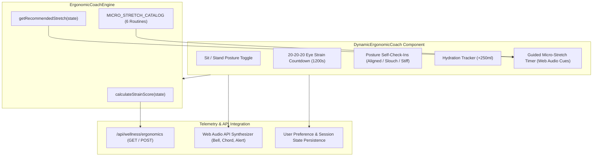
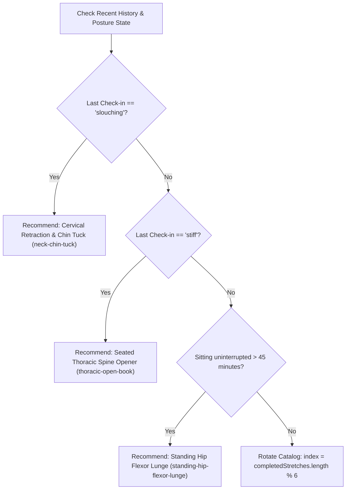

# Dynamic Ergonomic Health & Biometric Break Coach

## 1. Executive Summary & Architecture Overview

WorkSphere's **Dynamic Ergonomic Coach** ([`src/components/wellness/DynamicErgonomicCoach.tsx`](file:///c:/Users/admin/Desktop/workfere/src/components/wellness/DynamicErgonomicCoach.tsx)) and algorithmic evaluation engine ([`src/lib/wellness/ergonomicCoachEngine.ts`](file:///c:/Users/admin/Desktop/workfere/src/lib/wellness/ergonomicCoachEngine.ts)) provide real-time musculoskeletal fatigue prevention, 20-20-20 ocular reset countdowns, sit-to-stand posture cadence tracking, and dynamic Strain Risk Index (SRI) scoring for remote and in-office desk workers.

Prolonged static seating, forward-head monitor hunching ("tech-neck"), repetitive wrist flexion, and unmitigated display glare lead to cumulative trauma disorders and musculoskeletal injuries. The coach mitigates these risks by continuously computing an ergonomic strain score, triggering acoustic feedback chimes, recommending targeted micro-stretches, and guiding users through workplace ergonomics geometry standards (OSHA & ISO 9241-5).



---

## 2. User Guide

### 2.1 Live Telemetry Header & Audio Cues

The top navigation bar displays the real-time telemetry badge, current posture mode, and an audio cue toggle:
- **Audio Cues Enabled:** Synthesizes calming harmonic chimes on timer expirations, stretch completions, and check-in registrations using the browser's native `AudioContext`.
- **Mute Mode:** Disables audio output for quiet co-working spaces and library focus zones.

### 2.2 Posture Mode Toggle & Cadence

Workers operating sit-stand or height-adjustable desks can toggle between **Sitting** and **Standing** modes:
- Clicking **"Switch to Standing"** or **"Switch to Sitting"** updates the active posture state, records the state change timestamp, and increments the respective cumulative counter (`totalSittingSeconds` or `totalStandingSeconds`).
- The engine calculates the **Sit-to-Stand Ratio**, targeting the ergonomic 3:1 cadence (approximately 45 minutes seated to 15 minutes standing per hour).

### 2.3 20-20-20 Ocular Reset Protection

To counter digital asthenopia (eye strain) and ciliary muscle spasm caused by sustained close-range screen focus:
1. A background countdown counts down from **20 minutes (1,200 seconds)** during active work sessions.
2. Upon reaching zero, the coach emits a two-tone bell chime ($587.33\text{ Hz} \to 880\text{ Hz}$, musical notes D5 to A5) and launches an active **20-second ocular reset timer**.
3. The user looks at an object at least **20 feet (6 meters)** away and blinks deliberately 10 times to re-moisturize the cornea.
4. Once the 20 seconds elapse, a 4-note major chord ($C_5 - E_5 - G_5 - C_6$) signals the completion of the break and increments `eyeBreaksCompleted`.

### 2.4 Self-Reported Posture Check-Ins

Users can log their alignment at any point by selecting one of three status buttons:
- **Aligned:** Reinforces optimal spinal stacking (earlobes vertically aligned over shoulders, scapular retraction).
- **Slouching:** Flags thoracic kyphosis and forward head translation. Triggers an instant recommendation for cervical retraction / chin tucks.
- **Stiff:** Flags muscular hypertonicity from static posture. Triggers a thoracic spine opener recommendation.

### 2.5 Hydration Tracker

Clicking **"+250ml"** logs water consumption against the daily target (default: $2,000\text{ ml}$). The engine expects approximately $250\text{ ml}$ per hour of desk work to maintain disc hydration and cognitive vigilance.

---

## 3. Ergonomic Recommendation & Strain Scoring Algorithms

### 3.1 Composite Ergonomic Strain Score Formulation

The overall Ergonomic Strain Score ($S \in [0, 100]$) is computed by [`ErgonomicCoachEngine.calculateStrainScore`](file:///c:/Users/admin/Desktop/workfere/src/lib/wellness/ergonomicCoachEngine.ts):

$$S = \text{clamp}_{[0, 100]}\left(0.35 \cdot S_{\text{posture}} + 0.30 \cdot S_{\text{stretch}} + 0.20 \cdot S_{\text{eye}} + 0.15 \cdot S_{\text{hydration}}\right)$$

#### 1. Posture Balance Score ($S_{\text{posture}}$)

For height-adjustable sit-stand desks with more than 10 minutes of active tracking ($T_{\text{total}} > 600\text{ s}$):
- Let $R_{\text{stand}} = \frac{T_{\text{standing}}}{T_{\text{total}}}$:
  - If $R_{\text{stand}} < 0.15$:
    $$S_{\text{posture}} = \max\left(40, 100 - (0.15 - R_{\text{stand}}) \times 300\right)$$
  - If $R_{\text{stand}} > 0.65$:
    $$S_{\text{posture}} = \max\left(50, 100 - (R_{\text{stand}} - 0.65) \times 200\right)$$

For standard seated desks or continuous static postures:
- If uninterrupted sitting time $T_{\text{continuous}} > 3,600\text{ s}$ (1 hour):
  $$S_{\text{posture}} = \max\left(30, 100 - \left(\frac{T_{\text{continuous}} - 3600}{60}\right) \times 1.5\right)$$

Check-in penalties are deducted directly from $S_{\text{posture}}$:
$$S_{\text{posture}} \leftarrow \max\left(20, S_{\text{posture}} - (10 \times N_{\text{slouch}} + 5 \times N_{\text{stiff}})\right)$$

#### 2. Stretch Compliance Score ($S_{\text{stretch}}$)

Expected stretches scale with elapsed session duration ($H = \frac{T_{\text{elapsed}}}{3600}$):
$$E_{\text{stretch}} = \max(1, \lfloor 1.5 \times H \rfloor)$$
$$S_{\text{stretch}} = \min\left(100, \text{round}\left(\min\left(1.2, \frac{N_{\text{completed\_stretches}}}{E_{\text{stretch}}}\right) \times 100\right)\right)$$

#### 3. Eye Rest Score ($S_{\text{eye}}$)

Based on 20-minute 20-20-20 interval compliance:
$$E_{\text{eye}} = \max(1, \lfloor 3 \times H \rfloor)$$
$$S_{\text{eye}} = \min\left(100, \text{round}\left(\min\left(1.2, \frac{N_{\text{eye\_breaks}}}{E_{\text{eye}}}\right) \times 100\right)\right)$$

#### 4. Hydration Score ($S_{\text{hydration}}$)

Expected intake scales at $250\text{ ml}$ per hour:
$$E_{\text{water}} = \max(250, \text{round}(250 \times H))$$
$$S_{\text{hydration}} = \min\left(100, \text{round}\left(\min\left(1.2, \frac{V_{\text{water}}}{E_{\text{water}}}\right) \times 100\right)\right)$$

---

### 3.2 Strain Tier Classification Matrix

| Score Tier | Score Range | Visual Badge & Border | Clinical State & Risk | Immediate Next Action |
| :--- | :--- | :--- | :--- | :--- |
| **Optimal** | $85 - 100$ | Emerald (`#10B981`) | Musculoskeletal equilibrium maintained. | Next micro-stretch scheduled in 25 minutes. |
| **Good** | $70 - 84$ | Cyan (`#06B6D4`) | Healthy baseline; minor localized fatigue. | Take a 20-20-20 ocular reset. |
| **Mild Strain** | $50 - 69$ | Amber (`#F59E0B`) | Static posture fatigue accumulating. | Perform Seated Thoracic Spine Opener; hydrate. |
| **High Strain** | $35 - 49$ | Orange (`#F97316`) | Elevated cervical and lumbar load detected. | Stand up immediately; hip flexor & chin tucks. |
| **Critical Fatigue**| $< 35$ | Rose (`#F43F5E`) | Severe musculoskeletal strain and eye fatigue. | Step away from screen for a full 5-minute break. |

---

### 3.3 Dynamic Stretch Recommendation Engine

[`ErgonomicCoachEngine.getRecommendedStretch`](file:///c:/Users/admin/Desktop/workfere/src/lib/wellness/ergonomicCoachEngine.ts) selects the next priority stretch using the following decision tree:



---

## 4. Biomechanical Micro-Stretch Catalog

All routines in `MICRO_STRETCH_CATALOG` require zero gym equipment and can be executed at or beside any standard office desk.

| Routine ID | Exercise Name | Category | Target Muscles | Duration | Difficulty | Primary Biomechanical Benefit |
| :--- | :--- | :--- | :--- | :--- | :--- | :--- |
| `neck-chin-tuck` | Cervical Retraction & Chin Tuck | `neck_spine` | Deep Neck Flexors, Suboccipitals, Upper Trapezius | $30\text{ s}$ | Easy | Counters forward head posture (tech-neck) and relieves cervical disc compression. |
| `thoracic-open-book` | Seated Thoracic Spine Opener | `neck_spine` | Thoracic Spine, Pectoralis Major, Rhomboids | $45\text{ s}$ | Easy | Mobilizes mid-back and opens chest muscles tight from keyboard hunching. |
| `carpal-median-nerve-glide` | Median Nerve Glide & Wrist Extension | `wrists_hands` | Flexor Carpi Radialis, Median Nerve, Extensor Digitorum | $30\text{ s}$ | Easy | Reduces carpal tunnel intra-neural pressure and repetitive strain injury (RSI) risks. |
| `standing-hip-flexor-lunge` | Standing Desk Iliopsoas & Hip Release | `lower_body` | Iliopsoas, Rectus Femoris, Gluteus Maximus | $60\text{ s}$ | Moderate | Relieves prolonged hip flexion shortening and lumbar anterior pull from long sitting. |
| `scapular-retraction-pinch` | Shoulder Blade Angels (W-to-Y) | `upper_body` | Rhomboids, Middle/Lower Traps, Posterior Deltoid | $40\text{ s}$ | Easy | Strengthens postural stabilizers and counteracts rounded shoulder slouch. |
| `twenty-twenty-eye-reset` | 20-20-20 Ocular Reset & Palming | `eyes_focus` | Ciliary Muscle, Extraocular Muscles | $20\text{ s}$ | Easy | Relaxes ciliary spasm, combats digital asthenopia, and prevents corneal dryness. |

---

## 5. Workstation Ergonomic Geometry Checklist

The coach includes an interactive setup checklist based on OSHA computer workstation and ISO 9241-5 ergonomics standards:

1. **Monitor Eye-Level Height:** The top one-third of the display must align horizontally with natural eye level at an arm's length ($50 - 70\text{ cm}$) distance to prevent sustained neck flexion.
2. **90-90-90 Neutral Joint Angles:** Elbows bent at $90^\circ - 100^\circ$ resting parallel to the desk surface; hips and knees at $90^\circ$ with feet firmly supported.
3. **Wrist & Forearm Neutrality:** Wrists must float freely or rest on soft palm supports without resting hard against sharp desk edges.
4. **Sit-to-Stand Interval Cadence:** Height-adjustable desk users should maintain a 3:1 ratio (45 minutes seated, 15 minutes standing per hour).

---

## 6. Developer Guide & API Reference

### 6.1 State Data Model

```typescript
export interface ErgonomicSessionState {
  sessionId: string;
  userId?: string;
  deskType: 'standard_seated' | 'height_adjustable_sit_stand' | 'standing_only';
  currentPostureState: 'sitting' | 'standing';
  sessionStartTime: number;            // Unix timestamp (ms)
  lastPostureStateChange: number;      // Unix timestamp (ms)
  totalSittingSeconds: number;
  totalStandingSeconds: number;
  completedStretches: string[];        // Array of stretch IDs
  postureCheckIns: Array<{
    timestamp: number;
    rating: 'aligned' | 'slouching' | 'stiff';
  }>;
  waterIntakeMl: number;
  waterTargetMl: number;
  eyeBreaksCompleted: number;
  skippedBreaksCount: number;
}
```

### 6.2 REST API Endpoints

#### `GET /api/wellness/ergonomics`

Retrieves active micro-stretch routines, a initialized session state, baseline strain score, and recommended stretch.

- **Query Parameters:**
  - `category` *(optional)*: Filter routines by category (`neck_spine`, `upper_body`, `wrists_hands`, `lower_body`, `eyes_focus`).

- **Response:**
```json
{
  "success": true,
  "routines": [...],
  "defaultState": {
    "sessionId": "ergo-1728498000000",
    "deskType": "height_adjustable_sit_stand",
    "currentPostureState": "sitting",
    "totalSittingSeconds": 3600,
    "totalStandingSeconds": 1800,
    "completedStretches": ["neck-chin-tuck"],
    "waterIntakeMl": 500,
    "waterTargetMl": 1500,
    "eyeBreaksCompleted": 3,
    "skippedBreaksCount": 1
  },
  "initialScore": {
    "score": 85,
    "tier": "optimal",
    "factors": {
      "postureBalanceScore": 88,
      "stretchComplianceScore": 80,
      "hydrationScore": 85,
      "eyeRestScore": 90
    },
    "recommendation": "Ergonomic equilibrium maintained. Great postural variability and eye rest rhythm.",
    "nextSuggestedAction": "Next micro-stretch scheduled in 25 minutes."
  },
  "nextStretch": {
    "id": "thoracic-open-book",
    "name": "Seated Thoracic Spine Opener",
    "durationSeconds": 45
  }
}
```

#### `POST /api/wellness/ergonomics`

Recomputes ergonomic strain scores and recommended stretches given an updated session payload.

- **Request Body:** Partial or complete `ErgonomicSessionState`.
- **Response:**
```json
{
  "success": true,
  "strainScore": {
    "score": 72,
    "tier": "good",
    "factors": {
      "postureBalanceScore": 75,
      "stretchComplianceScore": 70,
      "hydrationScore": 70,
      "eyeRestScore": 75
    },
    "recommendation": "Healthy baseline. Consider a quick 30-second shoulder roll or wrist extension.",
    "nextSuggestedAction": "Take a 20-20-20 ocular reset."
  },
  "recommendedStretch": {
    "id": "carpal-median-nerve-glide",
    "name": "Median Nerve Glide & Wrist Extension"
  },
  "updatedState": { ... },
  "timestamp": "2026-10-09T13:30:00.000Z"
}
```

---

## 7. User Preference Persistence

Session metrics, completed stretch history, and audio preferences are persisted across reloads using `localStorage` key `worksphere_ergo_session_v1`:

```typescript
// Save session state to localStorage
export function persistErgonomicPreferences(state: ErgonomicSessionState, soundEnabled: boolean) {
  if (typeof window === 'undefined') return;
  const payload = {
    state,
    soundEnabled,
    savedAt: Date.now()
  };
  localStorage.setItem('worksphere_ergo_session_v1', JSON.stringify(payload));
}

// Restore session on component mount
export function loadErgonomicPreferences(): { state?: Partial<ErgonomicSessionState>; soundEnabled?: boolean } | null {
  if (typeof window === 'undefined') return null;
  try {
    const raw = localStorage.getItem('worksphere_ergo_session_v1');
    if (!raw) return null;
    return JSON.parse(raw);
  } catch {
    return null;
  }
}
```
