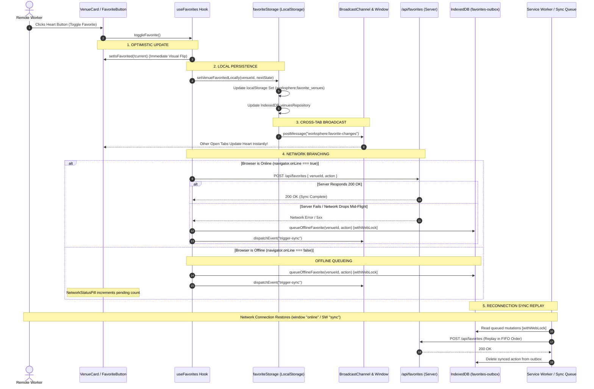

# Offline Favorites Synchronization: Optimistic UI, IndexedDB Caching, and Background Queueing

## 1. Executive Summary & Architectural Overview

In WorkSphere, favoriting or bookmarking a workspace is one of the highest-frequency micro-interactions performed by mobile and desktop users. Users save quiet study spots, favorite meeting desks, and bookmark cafes with dependable Wi-Fi while navigating the application on the move.

Because remote workers frequently traverse areas with spotty cellular coverage (e.g., subway commutes, elevators, rural transit), the bookmarking pipeline is engineered with an **offline-first, zero-latency optimistic synchronization architecture**:

### Core Pillars:
1. **Instant Optimistic UI Updates**: The visual heart icon state flips within a single animation frame ($< 16\text{ ms}$) without blocking on backend HTTP network roundtrips ([`src/hooks/useFavorites.ts`](file:///c:/Users/admin/Desktop/workfere/src/hooks/useFavorites.ts)).
2. **Dual-Tier Local Persistence**:
   - **Fast-Path Memory/LocalStorage** (`worksphere:favorite_venues`): Provides instant $O(1)$ set lookups for list and card rendering.
   - **Full-Payload IndexedDB Cache** (`venuesRepository`): Caches complete venue metadata (`OfflineVenue`) for offline browsing without network.
3. **Cross-Tab Real-Time Broadcasting**: Uses `BroadcastChannel("worksphere:favorite-changes")` and window `CustomEvent` to synchronize heart toggle states instantly across all open browser tabs and windows.
4. **Resilient Background Outbox Queueing**: When disconnected or when `/api/favorites` fails, mutations are enqueued in IndexedDB's `favorites-outbox` via `queueOfflineFavorite` ([`src/lib/offlineStore.ts`](file:///c:/Users/admin/Desktop/workfere/src/lib/offlineStore.ts)).
5. **Multi-Tab Web Locks Serialization**: Prevents IndexedDB transaction collisions across tabs using the Web Locks API (`withWebLock`).
6. **Automatic Reconnection Replay**: Flushes queued mutations via Service Worker Background Sync (`public/sw.js`) or window `online` event handlers once connectivity restores.

---

## 2. Sequence Diagram of Favorite Toggle Request Lifecycle



---

## 3. Optimistic UI Updates & Cross-Tab Synchronization

### 3.1 Single-Frame Reactivity (`useFavorites.ts`)

Traditional web applications await server responses before updating the UI, introducing a perceptible $150\text{--}600\text{ ms}$ delay:
```
Traditional (Pessimistic):
Click Heart ──> Spinner ──> Network Request (300ms) ──> Heart Fills (Sluggish UX)

WorkSphere (Optimistic):
Click Heart ──> Heart Fills (16ms) ──> Background Network Sync (Invisible to User)
```

The `useFavorites` hook implements this pattern cleanly:

```typescript
export function useFavorites(venueId: string, initialIsFavorited: boolean) {
  const [isFavorited, setIsFavorited] = useState(initialIsFavorited);
  const [isOnline, setIsOnline] = useState(true);

  // Monitor network status
  useEffect(() => {
    if (typeof window !== "undefined") {
      setIsOnline(navigator.onLine);
      const handleOnline = () => setIsOnline(true);
      const handleOffline = () => setIsOnline(false);

      window.addEventListener("online", handleOnline);
      window.addEventListener("offline", handleOffline);

      return () => {
        window.removeEventListener("online", handleOnline);
        window.removeEventListener("offline", handleOffline);
      };
    }
  }, []);

  const toggleFavorite = async () => {
    const nextState = !isFavorited;

    // 1. Optimistic Update: Change the visual heart state instantly
    setIsFavorited(nextState);

    const actionType = nextState ? "add" : "remove";

    if (isOnline) {
      try {
        const response = await fetch("/api/favorites", {
          method: "POST",
          headers: { "Content-Type": "application/json" },
          body: JSON.stringify({ venueId, action: actionType }),
        });

        if (!response.ok) throw new Error("Network response failed");
      } catch {
        // Fallback: If live request fails, stage into offline queue
        console.warn("Live request failed. Routing to offline queue.");
        await queuePendingFavorite(venueId, actionType);
        window.dispatchEvent(new CustomEvent("trigger-sync"));
      }
    } else {
      // 2. Offline Mode: Stage directly to background sync outbox
      await queuePendingFavorite(venueId, actionType);
      window.dispatchEvent(new CustomEvent("trigger-sync"));
    }
  };

  return { isFavorited, toggleFavorite, isOnline };
}
```

### 3.2 Cross-Tab Real-Time Sync via `BroadcastChannel`

When a user opens WorkSphere in two side-by-side tabs (e.g., exploring search results in Tab 1 and viewing a venue detail modal in Tab 2), clicking the heart button in Tab 1 must update Tab 2 immediately.

In [`src/lib/venues/favoriteStorage.ts`](file:///c:/Users/admin/Desktop/workfere/src/lib/venues/favoriteStorage.ts):

```typescript
const BROADCAST_CHANNEL_NAME = "worksphere:favorite-changes";

export function setVenueFavoritedLocally(
  venueId: string,
  isFavorited: boolean,
  venueData?: Partial<OfflineVenue>,
): void {
  // 1. Update localStorage
  const current = new Set(getLocalFavoriteIds());
  if (isFavorited) {
    current.add(venueId);
  } else {
    current.delete(venueId);
  }
  localStorage.setItem("worksphere:favorite_venues", JSON.stringify(Array.from(current)));

  // 2. Dispatch CustomEvent for intra-window components
  const eventPayload: FavoriteChangeEvent = {
    venueId,
    isFavorited,
    timestamp: Date.now(),
  };

  window.dispatchEvent(
    new CustomEvent("worksphere:favorite-change", { detail: eventPayload })
  );

  // 3. Broadcast across all other open tabs / windows
  const channel = getBroadcastChannel();
  channel?.postMessage(eventPayload);
}
```

Components subscribe to real-time events via `subscribeToFavoriteChanges`:
```typescript
export function subscribeToFavoriteChanges(
  callback: (event: FavoriteChangeEvent) => void,
): () => void {
  const handleCustomEvent = (e: Event) => {
    const custom = e as CustomEvent<FavoriteChangeEvent>;
    if (custom.detail) callback(custom.detail);
  };

  const channel = getBroadcastChannel();
  const handleChannel = (e: MessageEvent<FavoriteChangeEvent>) => {
    if (e.data) callback(e.data);
  };

  window.addEventListener("worksphere:favorite-change", handleCustomEvent);
  channel?.addEventListener("message", handleChannel);

  return () => {
    window.removeEventListener("worksphere:favorite-change", handleCustomEvent);
    channel?.removeEventListener("message", handleChannel);
  };
}
```

---

## 4. Background Queueing Mechanism for Offline Mutations

When offline, mutations cannot reach the server immediately. WorkSphere routes mutations to an IndexedDB outbox named `favorites-outbox` within `WorkSphereOfflineDB`.

### 4.1 `OfflineAction` Data Model

```typescript
export interface OfflineAction {
  id?: number;          // Auto-incremented primary key in IndexedDB
  venueId: string;      // Target venue ID
  action: "ADD" | "REMOVE"; // Mutation intent
  timestamp: number;    // High-resolution epoch timestamp
  retryCount?: number;  // Failed sync count (max 3 retries)
}
```

### 4.2 Idempotent Deduplication Guard

Users frequently toggle hearts rapidly (e.g., clicking favorite, unfavorite, and favorite again within seconds). Inserting multiple opposing actions into the outbox creates network bloat.

In `queueOfflineFavorite` ([`src/lib/offlineStore.ts`](file:///c:/Users/admin/Desktop/workfere/src/lib/offlineStore.ts)), the engine inspects existing queued actions before adding new ones:

```typescript
export async function queueOfflineFavorite(
  venueId: string,
  action: "ADD" | "REMOVE",
): Promise<void> {
  return withWebLock(async () => {
    const db = await getDB();

    // Check for existing identical action in the outbox
    const existing = await new Promise<OfflineAction | undefined>((resolve, reject) => {
      const tx = db.transaction("favorites-outbox", "readonly");
      const store = tx.objectStore("favorites-outbox");
      const request = store.getAll();
      request.onsuccess = () =>
        resolve(
          (request.result || []).find(
            (a) => a.venueId === venueId && a.action === action
          )
        );
      request.onerror = () => reject(request.error);
    });

    // If exact same operation is already queued, skip duplicate insertion
    if (existing) return;

    // Atomically append mutation to outbox
    return new Promise<void>((resolve, reject) => {
      const tx = db.transaction("favorites-outbox", "readwrite");
      const store = tx.objectStore("favorites-outbox");
      store.add({
        venueId,
        action,
        timestamp: Date.now(),
        retryCount: 0,
      });
      tx.oncomplete = () => resolve();
      tx.onerror = () => reject(tx.error);
    });
  });
}
```

### 4.3 Serialization via Web Locks (`withWebLock`)

To prevent multi-tab race conditions where Tab A and Tab B attempt to write to `favorites-outbox` concurrently, all operations are wrapped in `withWebLock()`:
- **Lock Key**: `"worksphere-offline-write-lock"`.
- Guarantees strict sequential execution across all tabs, dedicated workers, and service workers.
- Avoids the infamous Safari multi-worker IndexedDB deadlock bug (WebKit Bug 226547).

---

## 5. Offline Storage Repository: `venuesRepository`

While `localStorage` holds a lightweight array of favorited venue IDs (`["v1", "v2", "v3"]`), the IndexedDB `venuesRepository` caches full venue records so that users can view their saved venues in the **Favorites Screen** even while completely disconnected.

### 5.1 `OfflineVenue` Schema

```typescript
export interface OfflineVenue {
  id: string;
  name: string;
  latitude: number;
  longitude: number;
  category: string;
  address: string | null;
  rating: number | null;
  wifiQuality: string | number | boolean | null;
  hasOutlets: boolean;
  noiseLevel: string | number | null;
  imageUrl: string | null;
  isFavorite: boolean;
  isPinned: boolean;
  cachedAt: number;
  lastAccessedAt: number;
}
```

### 5.2 Storage Lifecycle

- **On Favorite**: When a venue is favorited, `venuesRepository.saveFavorite(offlineVenue)` writes the full record to the `favorites` object store in IndexedDB.
- **On Unfavorite**: `venuesRepository.removeFavorite(venueId)` deletes the venue from the offline store to reclaim client device storage.
- **Least Recently Used (LRU) Pruning**: When total cached venues exceed `MAX_OFFLINE_VENUES` (100 items), the background engine prunes un-favorited venues first, protecting saved bookmarks from automatic deletion.

---

## 6. Service Worker Background Sync Replay

WorkSphere registers a Service Worker Background Sync tag (`sync-favorites-outbox`) in [`public/sw.js`](file:///c:/Users/admin/Desktop/workfere/public/sw.js) to replay queued mutations as soon as the network restores.

### 6.1 Sync Handler in `public/sw.js`

```javascript
self.addEventListener("sync", (event) => {
  if (event.tag === "sync-favorites-outbox") {
    event.waitUntil(syncFavoritesOutbox());
  }
});

async function syncFavoritesOutbox() {
  return self.navigator.locks.request("worksphere-offline-write-lock", async () => {
    const db = await openOfflineDB();
    const tx = db.transaction("favorites-outbox", "readwrite");
    const store = tx.objectStore("favorites-outbox");
    const actions = await getAllPromised(store);

    for (const item of actions) {
      try {
        const response = await fetch("/api/favorites", {
          method: "POST",
          headers: { "Content-Type": "application/json" },
          body: JSON.stringify({
            venueId: item.venueId,
            action: item.action.toLowerCase(),
          }),
        });

        if (response.ok) {
          // Successfully synchronized: remove from outbox
          await deletePromised(store, item.id);
        } else {
          // Increment retry count
          item.retryCount = (item.retryCount || 0) + 1;
          if (item.retryCount >= MAX_SYNC_RETRIES) {
            // Poison pill threshold reached: remove and notify client
            await deletePromised(store, item.id);
            notifyClientsOfFailedSync(item);
          } else {
            await putPromised(store, item);
          }
        }
      } catch (err) {
        // Network still unavailable; stop processing and await next sync trigger
        break;
      }
    }
  });
}
```

### 6.2 Poison Pill Handling & User Notification (Issue #712)

If a venue has been deleted from the database by an administrator, the server will permanently return `404 Not Found` for any favorite attempt:
- Attempting to sync forever would wedge the outbox queue indefinitely.
- After `MAX_SYNC_RETRIES = 3` failures, the item is purged from the outbox.
- The Service Worker sends a `postMessage` to all open client windows, prompting a gentle toast:
  > *"Could not synchronize favorite for Venue X. The venue may no longer be available."*

---

## 7. API Network Contract & Server-Side Persistence

### 7.1 HTTP Endpoint

```http
POST /api/favorites HTTP/1.1
Content-Type: application/json

{
  "venueId": "venue_clx8q2z01000",
  "action": "add"
}
```

### 7.2 Idempotent Server-Side SQL Execution (Prisma)

The backend handler enforces idempotency so that duplicate replay attempts do not create database errors:

```typescript
// Adding a favorite (Idempotent upsert)
await prisma.userFavorite.upsert({
  where: {
    userId_venueId: { userId, venueId },
  },
  create: { userId, venueId },
  update: {}, // No-op if already favorited
});

// Removing a favorite (Idempotent delete)
await prisma.userFavorite.deleteMany({
  where: { userId, venueId },
});
```

---

## 8. Integration Code Snippets & Developer Recipes

### Recipe 1: Building a Reactive Heart Toggle Button

```tsx
"use client";

import React from "react";
import { Heart } from "lucide-react";
import { useFavorites } from "@/hooks/useFavorites";

interface FavoriteButtonProps {
  venueId: string;
  initialIsFavorited?: boolean;
}

export function FavoriteButton({
  venueId,
  initialIsFavorited = false,
}: FavoriteButtonProps) {
  const { isFavorited, toggleFavorite } = useFavorites(venueId, initialIsFavorited);

  return (
    <button
      type="button"
      onClick={(e) => {
        e.preventDefault();
        e.stopPropagation();
        toggleFavorite();
      }}
      aria-label={isFavorited ? "Remove from favorites" : "Save to favorites"}
      className="p-2 rounded-full bg-white/80 dark:bg-zinc-900/80 backdrop-blur-md hover:scale-110 active:scale-95 transition-transform"
    >
      <Heart
        className={`w-5 h-5 transition-colors ${
          isFavorited
            ? "fill-red-500 text-red-500"
            : "text-zinc-600 dark:text-zinc-400 hover:text-red-500"
        }`}
      />
    </button>
  );
}
```

### Recipe 2: Subscribing to Global Favorite Changes in a Header Counter

```tsx
"use client";

import { useEffect, useState } from "react";
import { getLocalFavoriteIds, subscribeToFavoriteChanges } from "@/lib/venues/favoriteStorage";

export function FavoritesNavCounter() {
  const [count, setCount] = useState(0);

  useEffect(() => {
    // Initial count
    setCount(getLocalFavoriteIds().length);

    // Subscribe to cross-tab updates
    const unsubscribe = subscribeToFavoriteChanges(() => {
      setCount(getLocalFavoriteIds().length);
    });

    return unsubscribe;
  }, []);

  if (count === 0) return null;

  return (
    <span className="inline-flex items-center justify-center px-1.5 py-0.5 text-[10px] font-bold rounded-full bg-red-500 text-white">
      {count}
    </span>
  );
}
```

---

## 9. Unit Testing Recipes & Mocking Patterns

```typescript
import { renderHook, act } from "@testing-library/react";
import { useFavorites } from "@/hooks/useFavorites";
import { queuePendingFavorite } from "@/lib/offlineStorage";

jest.mock("@/lib/offlineStorage", () => ({
  queuePendingFavorite: jest.fn().mockResolvedValue(undefined),
}));

describe("useFavorites Optimistic & Offline Behavior", () => {
  beforeEach(() => {
    jest.clearAllMocks();
    global.fetch = jest.fn();
  });

  it("updates state optimistically upon toggle", async () => {
    (global.fetch as jest.Mock).mockResolvedValue({ ok: true });

    const { result } = renderHook(() => useFavorites("venue-1", false));

    expect(result.current.isFavorited).toBe(false);

    await act(async () => {
      result.current.toggleFavorite();
    });

    // Flipped instantly without waiting for fetch
    expect(result.current.isFavorited).toBe(true);
    expect(global.fetch).toHaveBeenCalledWith("/api/favorites", expect.any(Object));
  });

  it("queues mutation into offline store when network fails", async () => {
    (global.fetch as jest.Mock).mockRejectedValue(new Error("Network Error"));

    const { result } = renderHook(() => useFavorites("venue-1", false));

    await act(async () => {
      result.current.toggleFavorite();
    });

    // Optimistic state remains true
    expect(result.current.isFavorited).toBe(true);

    // Mutation routed to offline outbox
    expect(queuePendingFavorite).toHaveBeenCalledWith("venue-1", "add");
  });
});
```

---

## 10. Common Edge Cases & Troubleshooting Runbook

### Q1: What happens if a user favorites a venue while offline, and then unfavorites it before reconnecting?
The deduplication logic in `queueOfflineFavorite` evaluates the outbox. When the user unfavorites, an action of type `REMOVE` is queued with a later timestamp. When the sync worker drains the outbox, the actions execute in chronological FIFO order; the final server state mirrors the user's intent.

### Q2: How does Safari Private Browsing affect offline favorites?
Safari Private Browsing disables IndexedDB access and throws `SecurityError`. WorkSphere catches `SecurityError` gracefully, falls back cleanly to ephemeral in-memory state, and alerts the user that offline storage is disabled in private browsing mode.

### Q3: How do we prevent duplicate sync runs when multiple tabs reconnect simultaneously?
The Service Worker and foreground listeners use **Web Locks** (`navigator.locks.request("worksphere-offline-write-lock")`). Only one tab or worker can hold the outbox lock at a time. The first worker flushes and clears the queue; subsequent workers acquire the lock, discover an empty queue, and return immediately.

---

## 11. Engineering Checklist & Verification

- [x] **Optimistic UI Execution**: Heart state flips in $<16\text{ ms}$ via local React state.
- [x] **Multi-Tab Synchronization**: Real-time cross-tab updates via `BroadcastChannel` and `CustomEvent`.
- [x] **Dual-Tier Local Persistence**: Fast $O(1)$ set in `localStorage` + full records in `venuesRepository`.
- [x] **IndexedDB Outbox Queueing**: Outbox writes serialized via Web Locks API (`withWebLock`).
- [x] **Deduplication Safeguards**: Prevents duplicate identical mutations in `favorites-outbox`.
- [x] **Automatic Replay on Reconnect**: Background sync integration via `public/sw.js` and `online` window events.
- [x] **Poison Pill Eviction**: Maximum 3 retries before purging un-syncable records with client notification.
