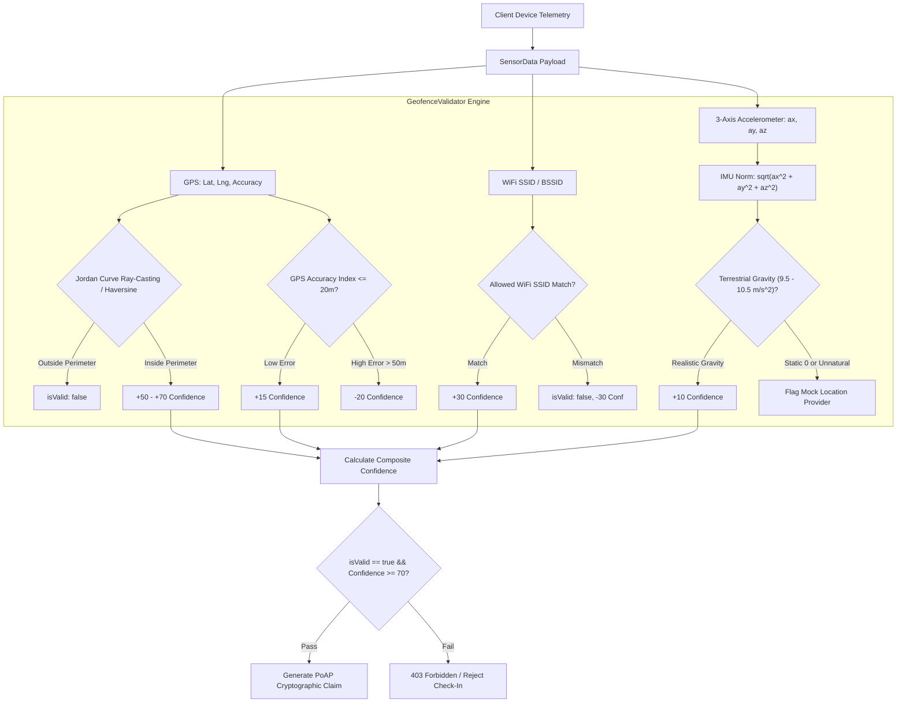

# GeofenceValidator: Polygon Ray-Casting & Anti-Spoofing Architecture

Comprehensive technical documentation for [`GeofenceValidator.ts`](file:///c:/Users/admin/Desktop/workfere/src/core/attestation/GeofenceValidator.ts), detailing the computational geometry algorithms (Jordan curve theorem ray-casting), multi-vector sensor fusion, and anti-spoofing heuristics used to establish proof of physical presence for WorkSphere's Proof of Attendance Protocol (PoAP) check-ins.

---

## 1. Overview & System Context

The Proof of Attendance Protocol (PoAP) relies on tamper-resistant verification of a user's location before minting digital attendance attestations. Traditional GPS check-ins are easily circumvented via Android mock location providers, browser developer tools overrides, or virtual GPS spoofing applications.

[`GeofenceValidator.ts`](file:///c:/Users/admin/Desktop/workfere/src/core/attestation/GeofenceValidator.ts) eliminates these vulnerabilities through two core mechanisms:
1. **Computational Geometry Boundary Validation:** Uses the **Jordan Curve Theorem Ray-Casting Algorithm** to verify whether client coordinates lie strictly within complex venue polygon footprints and geofences.
2. **Multi-Vector Sensor Fusion & Anti-Spoofing Heuristics:** Combines GPS horizontal accuracy bounds, venue-authorized WiFi SSID/BSSID beacons, and 3-axis accelerometer gravity norms to detect synthetic or emulated sensor streams.



---

## 2. Computational Geometry: Jordan Curve Theorem Ray-Casting

To determine whether a coordinate point $P(x_0, y_0)$ (where $x_0 = \text{lng}$, $y_0 = \text{lat}$) is located inside a venue boundary polygon $V = \{V_0, V_1, \dots, V_{n-1}\}$ with $V_n = V_0$, the engine uses the **Ray-Casting Algorithm** derived from the Jordan Curve Theorem.

### 2.1 Mathematical Formulation

The Jordan curve theorem establishes that any continuous, non-self-intersecting closed curve divides a 2D plane into an "interior" region and an "exterior" region. 

A semi-infinite horizontal ray $R$ is cast from the test point $P(x_0, y_0)$ in the positive $x$-direction:
$$R = \{(x, y_0) \in \mathbb{R}^2 \mid x \ge x_0\}$$

For each polygon edge $E_i = (V_i, V_{i+1})$ with endpoints $(x_i, y_i)$ and $(x_{i+1}, y_{i+1})$:
1. **Straddle Condition:** An edge crosses the horizontal ray if and only if one endpoint lies above the ray and the other lies at or below:
   $$\min(y_i, y_{i+1}) \le y_0 < \max(y_i, y_{i+1})$$
2. **Intersection $x$-Coordinate Calculation:** The exact $x$-intercept $x_{\text{int}}$ of edge $E_i$ at latitude $y_0$ is computed via linear interpolation:
   $$x_{\text{int}} = x_i + \frac{(y_0 - y_i)}{(y_{i+1} - y_i)} \cdot (x_{i+1} - x_i)$$
3. **Ray Intersection Test:** If $x_0 < x_{\text{int}}$, the ray intersects the edge to the right of the test point:
   $$\text{crossings} = \text{crossings} + 1$$

### 2.2 Parity Rule (Odd-Even Invariant)

- If the total intersection count is **odd**, $P$ lies **strictly inside** the polygon.
- If the total intersection count is **even**, $P$ lies **outside** the polygon.

```typescript
/**
 * Determines whether a given coordinate point lies inside a polygon
 * using the Jordan Curve Theorem Ray-Casting algorithm.
 */
export function isPointInPolygon(
    lat: number,
    lng: number,
    polygon: Array<[number, number]> // [lat, lng] pairs
): boolean {
    let inside = false;
    const n = polygon.length;

    for (let i = 0, j = n - 1; i < n; j = i++) {
        const [latI, lngI] = polygon[i];
        const [latJ, lngJ] = polygon[j];

        const intersects = ((latI > lat) !== (latJ > lat)) &&
            (lng < ((lngJ - lngI) * (lat - latI)) / (latJ - latI) + lngI);

        if (intersects) {
            inside = !inside;
        }
    }

    return inside;
}
```

---

## 3. Geodesic Proximity: Haversine Formulation

When circular geofences are configured with a radial threshold $r$ around venue centroid $(\varphi_c, \lambda_c)$, spherical geodesic distance $d$ is derived via the **Haversine formula** with Earth's volumetric mean radius $R = 6371\text{ km}$:

$$\Delta \varphi = \frac{\pi}{180} (\varphi_{\text{user}} - \varphi_c), \quad \Delta \lambda = \frac{\pi}{180} (\lambda_{\text{user}} - \lambda_c)$$

$$a = \sin^2\left(\frac{\Delta \varphi}{2}\right) + \cos\left(\frac{\pi \varphi_c}{180}\right) \cos\left(\frac{\pi \varphi_{\text{user}}}{180}\right) \sin^2\left(\frac{\Delta \lambda}{2}\right)$$

$$c = 2 \cdot \operatorname{atan2}\left(\sqrt{a}, \sqrt{1 - a}\right)$$

$$d = R \cdot c \cdot 1000 \quad (\text{meters})$$

- If $d \le r$, baseline confidence increases by **$+50$**.
- If $d \le 0.5 \cdot r$ (high-proximity core), an additional **$+20$** points are awarded.
- If $d > r$, `isValid` is immediately flagged `false`.

---

## 4. Anti-Spoofing & Mock GPS Detection Heuristics

Software-based location mockers (e.g., FakeGPS, Xcode Location Simulator, Chrome DevTools Sensors) manipulate high-level GPS APIs but leave distinct kinematic and network anomalies. [`GeofenceValidator.ts`](file:///c:/Users/admin/Desktop/workfere/src/core/attestation/GeofenceValidator.ts) applies layered heuristic checks to identify emulated telemetry.

### 4.1 Kinematic Dynamics & Gravitational Norm

Physical handheld devices on Earth experience a constant terrestrial gravitational acceleration vector pointing toward Earth's center:
$$\mathbf{g} \approx 9.80665\text{ m/s}^2$$

The Euclidean norm of 3-axis accelerometer readings $(a_x, a_y, a_z)$ is calculated as:
$$\|\mathbf{a}\|_2 = \sqrt{a_x^2 + a_y^2 + a_z^2}$$

#### Heuristic Classification:
- **Terrestrial Handheld Range ($9.5\text{ m/s}^2 \le \|\mathbf{a}\|_2 \le 10.5\text{ m/s}^2$):** Awarded **$+10$** confidence points. Reflects natural micro-tremors, device tilt, and Earth gravity.
- **Static Zero Vector ($\|\mathbf{a}\|_2 = 0$):** Typical of headless browser emulators and synthetic test runners where sensor APIs return zeroes.
- **Micro-Jitter Absence:** Real device sensors feature floating-point noise in the 3rd and 4th decimal places; perfect integer numbers ($a_x = 0, a_y = 10, a_z = 0$) indicate mock injection.

### 4.2 GPS Horizontal Accuracy Index

GPS accuracy values represent the 68% confidence radius (1-sigma circular error probable) of the satellite fix:
- **High-Precision Fix ($\text{accuracy} \le 20\text{ m}$):** Awarded **$+15$** points. Indicates authentic line-of-sight satellite reception with GNSS multi-constellation lock.
- **Degraded Accuracy ($\text{accuracy} > 50\text{ m}$):** Deducted **$-20$** points. Signals indoor multipath reflections or coarse cellular/IP-based geolocation fallback.
- **Artificial Perfection ($\text{accuracy} = 0.0$ or $\pm 1\text{m}$):** Commonly output by mock location software that hardcodes synthetic zero-variance readings.

### 4.3 Network Co-Location: WiFi SSID/BSSID Verification

Because radio frequency WiFi broadcasts have an effective physical radius of $30\text{--}80$ meters and cannot be spoofed over the global internet without local hardware access:
- The device's current connected WiFi SSID must match `venueBounds.allowedWifiSsids`.
- **Authorized Match:** Grants **$+30$** confidence points.
- **Missing or Unauthorized Network:** Imposes a **$-30$** point penalty and triggers immediate validation failure (`isValid = false`).

---

## 5. Scoring Matrix & Decision Boundary

| Validation Factor | Condition | Confidence Delta | Gatekeeper Rule |
| :--- | :--- | :---: | :--- |
| **Geodesic / Polygon Containment** | Inside perimeter ($d \le r$) | $+50$ | Mandatory (`isValid = false` if outside) |
| **Centroid Core Proximity** | $d \le 0.5 \cdot r$ | $+20$ | Additive bonus |
| **GPS Accuracy Threshold** | $\text{accuracy} \le 20\text{m}$ | $+15$ | High precision bonus |
| **GPS Accuracy Degradation** | $\text{accuracy} > 50\text{m}$ | $-20$ | Penalty |
| **Authorized WiFi SSID** | Matches venue AP whitelist | $+30$ | Mandatory (`isValid = false` if mismatch) |
| **Kinematic Gravity Norm** | $9.5 < \|\mathbf{a}\|_2 < 10.5$ | $+10$ | Natural physical terrestrial motion |

### Decision Formula
$$\text{Attestation Approval} = \text{isValid} \land (\text{Composite Confidence} \ge 70)$$

Where `confidence` is clamped to $[0, 100]$:
$$\text{confidence} = \max(0, \min(100, \sum \Delta \text{scores}))$$

---

## 6. Implementation Reference

The validation logic is implemented in [`GeofenceValidator.ts`](file:///c:/Users/admin/Desktop/workfere/src/core/attestation/GeofenceValidator.ts) and consumed by the PoAP check-in API route:
- API Handler: [`src/app/api/checkin/poap/route.ts`](file:///c:/Users/admin/Desktop/workfere/src/app/api/checkin/poap/route.ts)
- Generator Service: [`src/core/attestation/PoAPGenerator.ts`](file:///c:/Users/admin/Desktop/workfere/src/core/attestation/PoAPGenerator.ts)
- WASM Verification Loader: [`src/lib/wasm-loader/attestation.ts`](file:///c:/Users/admin/Desktop/workfere/src/lib/wasm-loader/attestation.ts)
