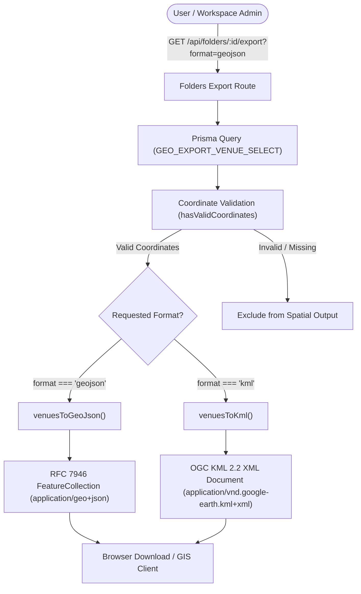

# Feature Specification: GeoJSON & KML Spatial Boundary Export for Venue Folders

## 1. Executive Summary & GIS Capabilities Overview

WorkSphere enables users and team administrators to organize workspace venues, desks, and meeting hubs into curated folders and collections. To support external geographic information systems (GIS), spatial planning tools, and field navigation apps, WorkSphere implements automated export capabilities in two standard geospatial data formats:

1. **GeoJSON (IETF RFC 7946):** The standard JSON-based geospatial format widely utilized in modern web mapping frameworks (Mapbox GL JS, Leaflet, OpenLayers), spatial analysis engines (PostGIS, Turf.js), and desktop GIS suites (QGIS, ArcGIS).
2. **KML (OGC KML 2.2):** The XML-based Keyhole Markup Language standard optimized for 3D globe visualization in Google Earth, Google Earth Pro, and custom pin overlays in Google My Maps.

The geographic transformation subsystem is implemented in [`src/lib/folderGeoExport.ts`](file:///c:/Users/admin/Desktop/workfere/src/lib/folderGeoExport.ts) and backed by the core domain logic in [`src/lib/export/domain/geoExporter.ts`](file:///c:/Users/admin/Desktop/workfere/src/lib/export/domain/geoExporter.ts).



---

## 2. Coordinate Reference System (CRS): EPSG:4326 (WGS 84)

All geospatial data exported by WorkSphere strictly adheres to the **World Geodetic System 1984 (WGS 84)** coordinate reference system, universally recognized under the European Petroleum Survey Group code **EPSG:4326**.

### 2.1 Coordinate Conventions & Dimensionality

| Parameter | Specification | Notes |
| :--- | :--- | :--- |
| **Datum** | WGS 84 (`urn:ogc:def:crs:OGC:1.3:CRS84`) | Standard reference ellipsoid used by GPS satellites and web map platforms. |
| **Units** | Decimal Degrees ($^{\circ}$) | Angular displacement from Prime Meridian and Equator. |
| **Precision** | Up to 6 decimal places | Provides $\approx 0.11\text{ m}$ spatial resolution at the equator, exceeding workspace locating requirements. |
| **Altitude / Elevation** | 0 meters above sea level | Set to ground level clamp for all 2D venue locations. |
| **Axis Bounds** | Latitude: $[-90.0, +90.0]$, Longitude: $[-180.0, +180.0]$ | Checked during data ingestion and export validation. |

### 2.2 The Critical Axis-Order Rule: `[Longitude, Latitude]`

A universal pitfall in geospatial software is the inversion of coordinate axes (often described as the "Latitude/Longitude vs Longitude/Latitude dilemma"):
*   **Colloquial human speech:** "Latitude, Longitude" ($Y, X$ order).
*   **Cartesian geometry & RFC 7946 standard:** **`[Longitude, Latitude]`** ($X, Y$ order).

RFC 7946 Section 3.1.1 strictly mandates:
> *"A position is an array of numbers. There MUST be two or more elements. The first two elements are longitude and latitude, or easting and northing, precisely in that order and using decimal numbers."*

In [`src/lib/export/domain/geoExporter.ts`](file:///c:/Users/admin/Desktop/workfere/src/lib/export/domain/geoExporter.ts), coordinate pairs are mapped as:

```typescript
geometry: {
  type: "Point" as const,
  coordinates: [venue.longitude, venue.latitude], // [X (Easting), Y (Northing)]
}
```

Inverting these values would cause venues located in London or San Francisco to plot into the Southern Ocean or Antarctica.

### 2.3 Coordinate Validation Engine

To prevent malformed geometries or application crashes in downstream GIS parsers, WorkSphere filters every candidate record through `hasValidCoordinates`:

```typescript
export function hasValidCoordinates(venue: {
  latitude: unknown;
  longitude: unknown;
}): boolean {
  if (
    typeof venue.latitude !== "number" ||
    typeof venue.longitude !== "number" ||
    !Number.isFinite(venue.latitude) ||
    !Number.isFinite(venue.longitude)
  ) {
    return false;
  }
  return (
    venue.latitude >= -90 &&
    venue.latitude <= 90 &&
    venue.longitude >= -180 &&
    venue.longitude <= 180
  );
}
```

Any venue with missing coordinates, `NaN`, non-numeric strings, or values exceeding geographic limits is dropped from the spatial collection, while being recorded in server diagnostics.

---

## 3. GeoJSON Specification (RFC 7946 Compliance)

### 3.1 Schema Architecture

WorkSphere exports a top-level `FeatureCollection` object comprising individual venue `Feature` records and structured administrative metadata:

```typescript
export function venuesToGeoJson(
  folder: GeoExportFolder,
  exportedAt = new Date(),
) {
  const features = folder.items
    .map((item) => item.venue)
    .filter(hasValidCoordinates)
    .map((venue) => ({
      type: "Feature" as const,
      id: venue.id,
      geometry: {
        type: "Point" as const,
        coordinates: [venue.longitude, venue.latitude],
      },
      properties: venueProperties(venue),
    }));

  return {
    type: "FeatureCollection" as const,
    metadata: {
      folderId: folder.id,
      folderName: folder.name,
      description: folder.description ?? null,
      exportedAt: exportedAt.toISOString(),
      featureCount: features.length,
      generator: "WorkSphere",
    },
    features,
  };
}
```

### 3.2 Feature Properties Specification

Every point feature carries a typed `properties` hash holding descriptive metadata:

```typescript
export function venueProperties(venue: GeoExportVenue) {
  return {
    id: venue.id,
    name: venue.name,
    category: venue.category,
    address: venue.address,
    wifiQuality: venue.wifiQuality ?? null,
    wifiSpeed: venue.wifiSpeed ?? null,
    amenities: extractAmenities(venue),
    url: appUrl(`/venues/${venue.id}`),
  };
}
```

| Field Name | Type | Description | Example |
| :--- | :--- | :--- | :--- |
| `id` | `string` | Unique identifier of the venue in WorkSphere. | `"venue_clq9z21..."` |
| `name` | `string` | Display name of the workspace venue. | `"Workshop Cafe & Cowork"` |
| `category` | `string` | Primary venue categorization. | `"Cafe"`, `"Coworking Space"` |
| `address` | `string \| null` | Physical street address. | `"250 Montgomery St, San Francisco, CA"` |
| `wifiQuality` | `number \| null` | WiFi reliability rating (scale 1 to 5). | `4` |
| `wifiSpeed` | `number \| null` | Verified network download bandwidth in Mbps. | `150` |
| `amenities` | `string[]` | Human-readable amenity labels extracted from flags. | `["Power outlets", "Dog friendly"]` |
| `url` | `string` | Deep link to venue detail page on WorkSphere. | `"https://worksphere.app/venues/..."` |

### 3.3 Sample GeoJSON Export Payload

```json
{
  "type": "FeatureCollection",
  "metadata": {
    "folderId": "fld_eng_remote_work",
    "folderName": "Engineering Remote Hotspots",
    "description": "High-speed WiFi cafes with ergonomic seating in downtown.",
    "exportedAt": "2026-10-08T11:20:00.000Z",
    "featureCount": 1,
    "generator": "WorkSphere"
  },
  "features": [
    {
      "type": "Feature",
      "id": "ven_sf_montgomery_01",
      "geometry": {
        "type": "Point",
        "coordinates": [-122.401925, 37.791542]
      },
      "properties": {
        "id": "ven_sf_montgomery_01",
        "name": "Montgomery Tech Lounge",
        "category": "Coworking Space",
        "address": "250 Montgomery St, San Francisco, CA 94104",
        "wifiQuality": 5,
        "wifiSpeed": 250,
        "amenities": [
          "Power outlets",
          "Ergonomic seating",
          "Phone booths",
          "Quiet zone",
          "Specialty espresso"
        ],
        "url": "https://worksphere.app/venues/ven_sf_montgomery_01"
      }
    }
  ]
}
```

---

## 4. OGC KML 2.2 Specification & Google Earth Representation

### 4.1 XML Namespace & Document Container

KML files generated by WorkSphere conform to the **OGC KML 2.2 standard** (`http://www.opengis.net/kml/2.2`).

```xml
<?xml version="1.0" encoding="UTF-8"?>
<kml xmlns="http://www.opengis.net/kml/2.2">
  <Document>
    <name>Engineering Remote Hotspots</name>
    <description>High-speed WiFi cafes with ergonomic seating in downtown.</description>
    <ExtendedData>
      <Data name="folderId"><value>fld_eng_remote_work</value></Data>
      <Data name="exportedAt"><value>2026-10-08T11:20:00.000Z</value></Data>
      <Data name="generator"><value>WorkSphere</value></Data>
    </ExtendedData>
    ...
  </Document>
</kml>
```

### 4.2 Placemark Structure

Each workspace is serialized as a distinct `<Placemark>` element containing identification tags, an interactive HTML description bubble, physical address, and 3D coordinate point:

```xml
<Placemark id="venue-ven_sf_montgomery_01">
  <name>Montgomery Tech Lounge</name>
  <description><![CDATA[
    <div style="font-family:sans-serif;line-height:1.4">
      <p><strong>Category:</strong> Coworking Space</p>
      <ul>
        <li><strong>Address:</strong> 250 Montgomery St, San Francisco, CA 94104</li>
        <li><strong>WiFi Quality:</strong> 5/5</li>
        <li><strong>WiFi Speed:</strong> 250 Mbps</li>
        <li><strong>Amenities:</strong> Power outlets, Ergonomic seating, Phone booths, Quiet zone</li>
      </ul>
      <p><a href="https://worksphere.app/venues/ven_sf_montgomery_01">View on WorkSphere</a></p>
    </div>
  ]]></description>
  <address>250 Montgomery St, San Francisco, CA 94104</address>
  <Point>
    <coordinates>-122.401925,37.791542,0</coordinates>
  </Point>
</Placemark>
```

#### Key KML Construction Rules:
1.  **Coordinate String Syntax:** `<coordinates>longitude,latitude,altitude</coordinates>`. Notice that coordinates are comma-delimited with **zero spaces**, followed by altitude `0`.
2.  **HTML Balloon Presentation (`<![CDATA[ ... ]]>`):** When clicked in Google Earth or Google My Maps, the description displays an interactive inspection bubble with clean typography, WiFi speed badges, amenity highlights, and deep links.
3.  **Address Tag:** The `<address>` element allows Google Earth's geocoding engine to cross-reference search queries with the placemark pin.

### 4.3 XML Escaping & Sanitization

To prevent malformed XML parse crashes when users save venues with special characters (e.g., `&`, `<`, `>`, quotes, or non-printable ASCII codes), [`src/lib/folderGeoExport.ts`](file:///c:/Users/admin/Desktop/workfere/src/lib/folderGeoExport.ts) applies strict character scrubbing:

```typescript
const INVALID_XML_CHARS =
  /[\u0000-\u0008\u000B\u000C\u000E-\u001F\uFFFE\uFFFF]|[\uD800-\uDBFF](?![\uDC00-\uDFFF])|(?<![\uD800-\uDBFF])[\uDC00-\uDFFF]/g;

export function escapeXml(value: unknown): string {
  return String(value ?? "")
    .replace(INVALID_XML_CHARS, "")
    .replace(/&/g, "&amp;")
    .replace(/</g, "&lt;")
    .replace(/>/g, "&gt;")
    .replace(/"/g, "&quot;")
    .replace(/'/g, "&apos;");
}
```

This guarantees 100% XML parser compatibility with strict XML parsers across desktop and mobile devices.

---

## 5. Domain Data Mapping & Amenity Extraction

WorkSphere maintains rich boolean amenity flags in PostgreSQL. During geographic export, internal database columns are translated into standardized human-readable labels:

```typescript
export const AMENITY_FLAGS = [
  ["hasOutlets", "Power outlets"],
  ["hasErgonomic", "Ergonomic seating"],
  ["hasPhoneBooths", "Phone booths"],
  ["hasQuietZone", "Quiet zone"],
  ["hasNoMusic", "No music"],
  ["hasAncHeadsetRental", "ANC headset rental"],
  ["singleOriginBeans", "Single-origin beans"],
  ["specialtyEspresso", "Specialty espresso"],
  ["oatAlmondMilk", "Oat/almond milk"],
  ["pourOverAvailable", "Pour-over coffee"],
  ["petsAllowedIndoors", "Pets allowed indoors"],
  ["dogFriendly", "Dog friendly"],
  ["catsAllowed", "Cats allowed"],
  ["waterBowlsProvided", "Water bowls provided"],
] as const;
```

### Extraction Algorithm:
```typescript
export function extractAmenities(venue: GeoExportVenue): string[] {
  const result: string[] = [];
  for (const [key, label] of AMENITY_FLAGS) {
    if (venue[key] === true) {
      result.push(label);
    }
  }
  return result;
}
```

---

## 6. HTTP API Export Architecture & Content Negotiation

### 6.1 MIME Types & Format Parsers

The export subsystem registers official IANA media types:

```typescript
export const GEO_EXPORT_FORMATS = ["geojson", "kml"] as const;
export type GeoExportFormat = (typeof GEO_EXPORT_FORMATS)[number];

export const GEOJSON_CONTENT_TYPE = "application/geo+json";
export const KML_CONTENT_TYPE = "application/vnd.google-earth.kml+xml";
```

### 6.2 Slugified Filename Generation

To deliver safe download file names across Windows, macOS, Linux, and Android, `buildGeoExportFilename` sanitizes folder names into URL-safe ASCII slugs:

```typescript
export function buildGeoExportFilename(
  folderName: string,
  format: GeoExportFormat,
): string {
  const slug = (folderName ?? "")
    .toLowerCase()
    .replace(/[^a-z0-9]+/g, "-")
    .replace(/^-+|-+$/g, "")
    .slice(0, 80)
    .replace(/-+$/g, "");
  return `${slug || "collection"}.${format}`;
}
```

*Example:* A folder named `"Quiet Cafes & Workspaces (Q3)!"` produces:
*   GeoJSON: `quiet-cafes-workspaces-q3.geojson`
*   KML: `quiet-cafes-workspaces-q3.kml`

### 6.3 HTTP Response Headers

When serving downloads, the API returns:

```http
HTTP/1.1 200 OK
Content-Type: application/geo+json; charset=utf-8
Content-Disposition: attachment; filename="engineering-remote-hotspots.geojson"
Cache-Control: private, no-cache, no-store, must-revalidate
```

---

## 7. Third-Party GIS Client Integration Recipes

### 7.1 Importing into Google Earth & Google My Maps

1. **Google My Maps (Web):**
   - Navigate to [Google My Maps](https://www.google.com/mymaps).
   - Create a new map and select **Add Layer** $\rightarrow$ **Import**.
   - Upload the exported `.kml` or `.geojson` file.
   - All venues will populate as map pins with customized pop-up balloons displaying WiFi details and amenities.
2. **Google Earth Pro (Desktop):**
   - Launch Google Earth Pro.
   - Select **File $\rightarrow$ Open** and choose the `.kml` file.
   - The collection mounts under the **Places** sidebar as a grouped `Document`.

### 7.2 Web Client Rendering with Mapbox GL JS

```typescript
import mapboxgl from "mapbox-gl";

async function loadVenueFolderLayer(map: mapboxgl.Map, folderId: string) {
  const response = await fetch(`/api/folders/${folderId}/export?format=geojson`);
  const data = await response.json();

  map.addSource("venue-folder", {
    type: "geojson",
    data,
  });

  map.addLayer({
    id: "venue-pins",
    type: "circle",
    source: "venue-folder",
    paint: {
      "circle-radius": 8,
      "circle-color": "#2563eb",
      "circle-stroke-width": 2,
      "circle-stroke-color": "#ffffff",
    },
  });

  // Display popups on pin click
  map.on("click", "venue-pins", (e) => {
    const coordinates = (e.features![0].geometry as any).coordinates.slice();
    const props = e.features![0].properties as any;

    new mapboxgl.Popup()
      .setLngLat(coordinates)
      .setHTML(`<h3>${props.name}</h3><p>${props.address}</p><p>WiFi: ${props.wifiSpeed} Mbps</p>`)
      .addTo(map);
  });
}
```

### 7.3 Desktop GIS: QGIS Integration

1. In QGIS, open **Layer $\rightarrow$ Add Layer $\rightarrow$ Add Vector Layer...**
2. Point the source to the downloaded `.geojson` file.
3. Open the layer's **Attribute Table** to inspect typed properties (`wifiQuality`, `wifiSpeed`, `amenities`).

---

## 8. Security & Data Protection Considerations

1. **HTML Balloon Injection Defense:** The KML description generator sanitizes all input strings (`venue.name`, `venue.address`, `venue.category`) using `escapeHtml()`. This prevents stored cross-site scripting (XSS) when KML files are rendered in browsers or desktop webviews.
2. **Access Control:** Spatial export endpoints require authentication and verify user ownership or public visibility of the requested folder.
3. **Information Scrubbing:** Internal database fields such as internal payment IDs, user host tokens, and private host phone numbers are excluded from the `GEO_EXPORT_VENUE_SELECT` database projection.

---

## 9. Automated Testing Recipes & Schema Assertions

### 9.1 GeoJSON Specification Test (`geoExporter.test.ts`)

```typescript
import { venuesToGeoJson, hasValidCoordinates } from "@/lib/export/domain/geoExporter";

describe("venuesToGeoJson", () => {
  const mockFolder = {
    id: "fld-1",
    name: "Design Cafes",
    description: "Quiet spots for creative work",
    items: [
      {
        venue: {
          id: "ven-1",
          name: "Cafe Artisan",
          latitude: 37.7749,
          longitude: -122.4194,
          address: "123 Market St",
          category: "Cafe",
          wifiQuality: 5,
          wifiSpeed: 100,
          hasOutlets: true,
          dogFriendly: true,
        },
      },
      {
        venue: {
          id: "ven-invalid",
          name: "Ghost Venue",
          latitude: null as any,
          longitude: 200, // Invalid longitude > 180
          address: null,
          category: "Unknown",
        },
      },
    ],
  };

  it("produces RFC 7946 compliant FeatureCollection and filters invalid coordinates", () => {
    const result = venuesToGeoJson(mockFolder, new Date("2026-10-08T00:00:00Z"));

    expect(result.type).toBe("FeatureCollection");
    expect(result.metadata.featureCount).toBe(1);
    expect(result.features).toHaveLength(1);

    const feature = result.features[0];
    expect(feature.geometry.type).toBe("Point");
    // Verify [longitude, latitude] axis ordering
    expect(feature.geometry.coordinates).toEqual([-122.4194, 37.7749]);
    expect(feature.properties.name).toBe("Cafe Artisan");
    expect(feature.properties.amenities).toContain("Power outlets");
    expect(feature.properties.amenities).toContain("Dog friendly");
  });
});
```

### 9.2 KML Structure & XML Escaping Test

```typescript
import { venuesToKml, escapeXml } from "@/lib/folderGeoExport";

describe("venuesToKml", () => {
  it("escapes unsafe characters and wraps descriptions in CDATA blocks", () => {
    const mockFolder = {
      id: "fld-2",
      name: "Cafes & 'Bistros' <Downtown>",
      items: [
        {
          venue: {
            id: "ven-2",
            name: "Bread & Butter <Cafe>",
            latitude: 40.7128,
            longitude: -74.006,
            address: "45 Broadway & 5th",
            category: "Bakery",
          },
        },
      ],
    };

    const kml = venuesToKml(mockFolder);

    expect(kml).toContain('xmlns="http://www.opengis.net/kml/2.2"');
    expect(kml).toContain("<name>Cafes &amp; &apos;Bistros&apos; &lt;Downtown&gt;</name>");
    expect(kml).toContain("<coordinates>-74.006,40.7128,0</coordinates>");
    expect(kml).toContain("<![CDATA[");
  });
});
```

---

## 10. Operational Runbook & Common Pitfalls

| Issue | Root Cause | Remediation |
| :--- | :--- | :--- |
| **Pins render in ocean / poles** | Inverted latitude and longitude axes. | Verify coordinate array is formatted as `[longitude, latitude]` per RFC 7946. |
| **Google Earth XML Parse Error** | Unescaped ampersand (`&`) or unprintable control character in venue name. | Verify input passes through `escapeXml` and strips control characters `\u0000-\u001F`. |
| **Venue missing from export** | Coordinate fields are `null`, non-numeric, or outside $[-90, 90]$ / $[-180, 180]$. | Inspect database record in Prisma; ensure geolocation geocoding step succeeded. |
| **Filename contains strange characters** | Folder title containing emojis, quotes, or slashes. | Verify filename generation uses `buildGeoExportFilename()` slugification. |
