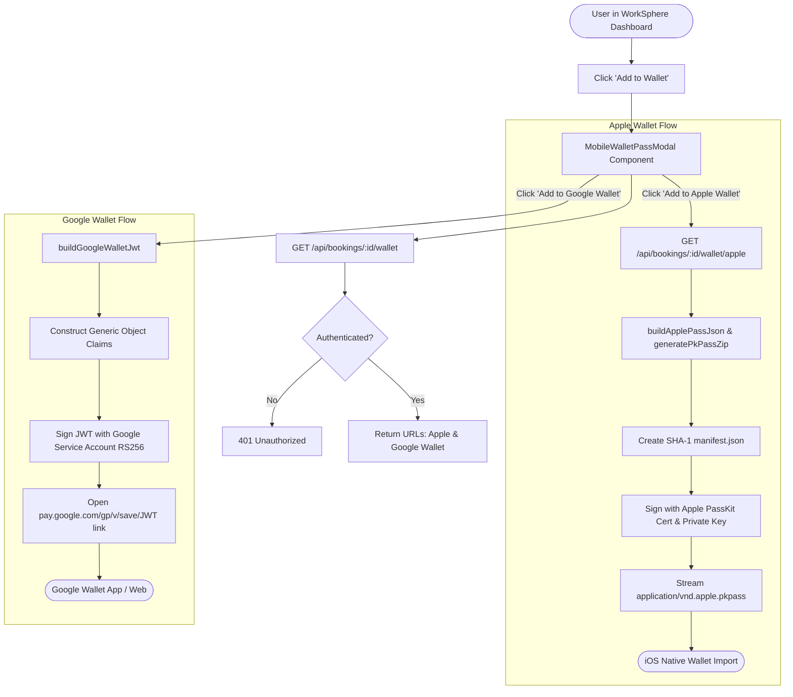

# Mobile Wallet Passes Architecture: Apple Wallet & Google Wallet

## Overview

WorkSphere provides native digital wallet integration allowing users to add desk and workspace reservations directly to Apple Wallet (iOS/watchOS/macOS) and Google Wallet (Android/WearOS/Web). 

Mobile wallet passes eliminate the need for printing paper confirmations or opening emails at venue check-in. Passes support lock-screen geofenced notifications (alerting the user when they arrive within proximity of the venue), integrated QR codes for optical turnstile/reception scanners, and real-time reservation updates.

This architecture document details the implementation across:
- `src/lib/wallet/passService.ts`: Core pass payload builders, PKPass ZIP generator, and Google Wallet JWT constructor.
- `src/components/bookings/MobileWalletPassModal.tsx`: Client-side modal UI with pass previews, QR codes, and direct download links.
- `src/app/api/bookings/[bookingId]/wallet/route.ts`: Overview API returning pass download URLs and metadata.
- `src/app/api/bookings/[bookingId]/wallet/apple/route.ts`: Streaming API delivering signed Apple `.pkpass` bundles.

---

## 1. System Architecture



---

## 2. Apple Wallet (.pkpass) Architecture

Apple Wallet passes are structured as signed ZIP archives with the file extension `.pkpass` and MIME type `application/vnd.apple.pkpass`.

### 2.1 PKPass Package Structure

A valid `.pkpass` bundle contains the following required artifacts:

```text
reservation.pkpass (ZIP Archive)
├── pass.json            // Pass layout, field keys, colors, barcodes, locations
├── manifest.json        // SHA-1 checksums of every file in the package
├── signature            // PKCS#7 detached signature of manifest.json
├── icon.png             // Notification icon (29x29)
├── icon@2x.png          // Notification icon Retina (58x58)
├── logo.png             // Header logo (160x50)
├── logo@2x.png          // Header logo Retina (320x100)
└── strip.png            // Banner / strip image
```

### 2.2 `pass.json` Specification (`buildApplePassJson`)

Generated via `buildApplePassJson(booking)`:

```typescript
export interface ApplePassPayload {
  formatVersion: 1;
  passTypeIdentifier: string; // e.g., pass.com.worksphere.booking
  teamIdentifier: string;     // Apple Developer Team ID
  organizationName: "WorkSphere";
  serialNumber: string;       // booking.confirmationId
  description: string;
  foregroundColor: "rgb(255, 255, 255)";
  backgroundColor: "rgb(15, 23, 42)"; // Tailwind slate-900
  labelColor: "rgb(148, 163, 184)";     // Tailwind slate-400
  logoText: "WorkSphere";
  relevantDate?: string;      // ISO string: Triggers lock-screen alert before reservation
  locations?: Array<{
    latitude: number;
    longitude: number;
    relevantText: string;     // Shown on lock screen when within ~100m of venue
  }>;
  barcodes: Array<{
    format: "PKBarcodeFormatQR";
    message: string;          // Optical scanning payload
    messageEncoding: "iso-8859-1";
    altText: string;
  }>;
  generic: {
    headerFields: Array<{ key: string; label: string; value: string }>;
    primaryFields: Array<{ key: string; label: string; value: string }>;
    secondaryFields: Array<{ key: string; label: string; value: string }>;
    auxiliaryFields: Array<{ key: string; label: string; value: string }>;
    backFields: Array<{ key: string; label: string; value: string }>;
  };
}
```

### 2.3 Manifest & Cryptographic Signing

1. **Manifest Calculation:** A SHA-1 hash is computed for each non-signature file in the archive and stored in `manifest.json`.
2. **PKCS#7 Signing:** The `manifest.json` file is signed using an Apple Pass Type ID Certificate (`.p12` or `.pem`), Apple Worldwide Developer Relations (WWDR) intermediate certificate, and private key.
3. **Packaging:** The archive is zipped and sent to the client with `Content-Disposition: attachment; filename="worksphere-booking-[id].pkpass"`.

---

## 3. Google Wallet (JWT) Architecture

Google Wallet uses the Google Wallet REST API and signed JSON Web Tokens (JWT) based on Generic Pass Objects (`GenericObject`).

### 3.1 Google Wallet Payload Structure (`buildGoogleWalletPayload`)

```typescript
export interface GoogleWalletPassPayload {
  iss: string;    // Service account client email
  aud: "google";
  typ: "savetovallet";
  origins: string[];
  payload: {
    genericObjects: Array<{
      id: string;                      // IssuerId.ObjectId
      classId: string;                 // IssuerId.ClassId
      cardTitle: { defaultValue: { language: "en-US"; value: "WorkSphere Workspace Pass" } };
      header: { defaultValue: { language: "en-US"; value: venueName } };
      subheader?: { defaultValue: { language: "en-US"; value: seatInfo } };
      hexBackgroundColor: "#0f172a";
      barcode: {
        type: "QR_CODE";
        value: string;
        alternateText: string;
      };
      textModulesData: Array<{
        id: string;
        header: string;
        body: string;
      }>;
      linksModuleData?: {
        uris: Array<{
          uri: string;
          description: string;
        }>;
      };
    }>;
  };
}
```

### 3.2 Client "Save to Google Wallet" Trigger

The signed JWT is embedded into the Google Save URL:

$$\text{URL} = \text{https://pay.google.com/gp/v/save/} + \text{SignedJWT}$$

When clicked on an Android device or browser, Google Wallet opens natively, allowing 1-tap addition without downloading a raw file.

---

## 4. API Endpoints Reference

### 1. `GET /api/bookings/[bookingId]/wallet`
Returns metadata and direct wallet addition URLs for the given booking ID.

**Response (200 OK):**
```json
{
  "booking": {
    "id": "b-1234",
    "confirmationId": "WS-987654",
    "venueName": "Central Hub",
    "date": "2026-10-15",
    "time": "09:00 AM",
    "seat": "Desk 4A"
  },
  "wallet": {
    "apple": "/api/bookings/b-1234/wallet/apple",
    "google": "https://pay.google.com/gp/v/save/eyJhbGciOiJSUzI1NiIs..."
  }
}
```

### 2. `GET /api/bookings/[bookingId]/wallet/apple`
Streams the generated `.pkpass` bundle with binary headers:
- `Content-Type: application/vnd.apple.pkpass`
- `Content-Disposition: attachment; filename="worksphere-booking-WS-987654.pkpass"`

---

## 5. UI Integration (`MobileWalletPassModal.tsx`)

The `MobileWalletPassModal` component provides:
- Visual interactive preview of the pass in dark mode slate styling.
- QR code rendering for on-screen scanning.
- Dynamic OS detection (highlighting Apple Wallet on iOS/Safari and Google Wallet on Android/Chrome).
- Error handling and loading states during pass generation.
