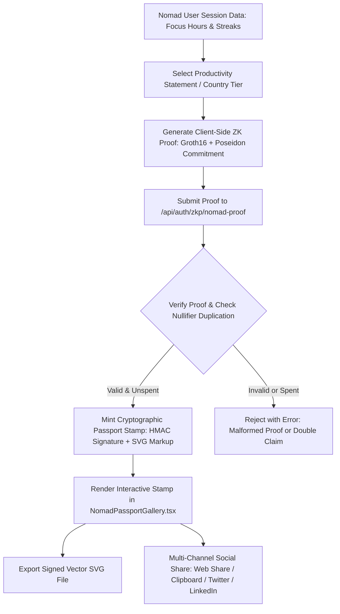
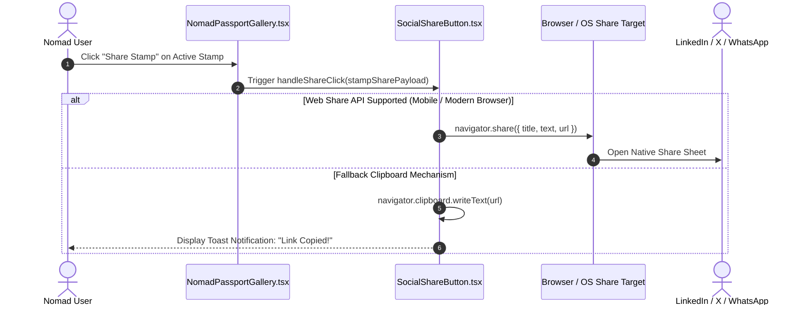

# Nomad Passport: Digital Nomad Stamp Metadata, Badge Structure, and Social Sharing Integration

This technical manual documents WorkSphere's **Digital Nomad Passport** system (`NomadPassportGallery.tsx`, `nomadProof.ts`, and `/api/auth/zkp/nomad-proof`), detailing the badge hierarchy, country stamp metadata schema, Zero-Knowledge verification mechanisms, and multi-channel social sharing integration.

---

## 1. Executive Summary & System Overview

In the global remote work ecosystem, digital nomads frequently cross international borders, establish temporary residencies, and rotate across coworking hubs across multiple continents. Proving professional productivity, steady income, or sustained workspace activity is often necessary for digital nomad visa compliance, tax residency verification, client credibility, and community recognition.

However, traditional proof-of-work mechanisms expose sensitive location histories, check-in timestamps, and personal movement timelines.

WorkSphere solves this with the **Zero-Knowledge Nomad Passport**:
- **Privacy-Preserving Attestation:** Occupants generate Circom ZK-SNARK proofs of productivity (e.g., proving $>100\text{ verified focus hours}$ or a $30\text{-day}$ continuous workspace streak) without revealing individual venues, timestamps, or geographic coordinates.
- **Cryptographic Stamp Minting:** Validated claims yield tamper-proof, signed SVG vector passport stamps with unique cryptographic nullifier hashes.
- **Cross-Platform Social Sharing:** Integrated Web Share API, clipboard fallbacks, and OpenGraph link unfurling enable seamless sharing across LinkedIn, Twitter/X, WhatsApp, and nomad communities.



---

## 2. Nomad Passport Badge Structure & Tier Hierarchy

WorkSphere organizes nomad credentials into a structured taxonomy of badges categorized by focus milestones, workspace consistency, and geographic mobility.

### 2.1 Badge Classification & Requirements

| Badge Type Identifier | Badge Title | Minimum Streak (Days) | Minimum Focus (Hours) | Verification Epoch | Target Persona |
| :--- | :--- | :---: | :---: | :---: | :--- |
| `NOMAD_50_HOURS` | 50-Hour Focus Veteran | $7\text{ days}$ | $50\text{ hours}$ | Active Year (e.g. 2026) | Emerging digital nomads establishing consistent remote routines. |
| `NOMAD_100_HOURS` | 100-Hour Deep Work Focus Master | $14\text{ days}$ | $100\text{ hours}$ | Active Year | Established remote professionals demonstrating sustained output. |
| `STREAK_30_DAYS` | 30-Day Workspace Streak Champion | $30\text{ days}$ | $60\text{ hours}$ | Active Year | High-discipline nomads maintaining unbroken daily workspace sessions. |
| `MULTI_CITY_EXPLORER`| Multi-City Global Nomad Explorer | $10\text{ days}$ | $40\text{ hours}$ | Active Year | Nomads operating across $\ge 3$ distinct cities or international regions. |
| `COUNTRY_STAMP_ID` | Verified Country Resident Stamp | $14\text{ days}$ | $50\text{ hours}$ | Active Year | Nomads with verified local workspace presence within a specific country. |

### 2.2 Statement Schema (`src/lib/zkp/nomadProof.ts`)

```typescript
export interface NomadProductivityStatement {
  badgeType: "NOMAD_50_HOURS" | "NOMAD_100_HOURS" | "STREAK_30_DAYS" | "MULTI_CITY_EXPLORER";
  tierTitle: string;
  minThresholdStreak: number; // Minimum verified consecutive workspace days
  minThresholdHours: number;  // Minimum verified deep work hours
  epoch: number;              // Attestation epoch year (e.g. 2026)
}
```

---

## 3. Country Stamp & Passport Stamp Metadata Schema

Each minted passport stamp is a self-contained cryptographic asset containing proof metadata, identity commitments, tamper-evident HMAC signatures, and scalable vector graphics.

### 3.1 Metadata Specification (`PassportStamp`)

```typescript
export interface PassportStamp {
  stampId: string;               // Unique human-readable stamp identifier
  badgeType: string;             // Badge enum classification
  tierTitle: string;             // Human-readable achievement label
  epoch: number;                 // Issuance epoch
  issuedAt: string;              // ISO-8601 UTC timestamp
  nullifierHash: string;         // Unique anti-replay / anti-double-claim hash
  verificationSignature: string; // Server-generated HMAC-SHA256 signature
  svgMarkup: string;             // Complete stand-alone SVG XML payload
  countryMetadata?: {
    countryCode: string;         // ISO 3166-1 alpha-2 (e.g., "TH", "PT", "JP")
    countryName: string;         // Country name (e.g., "Thailand", "Portugal")
    cityName: string;            // City name (e.g., "Chiang Mai", "Lisbon")
    flagEmoji: string;           // Country flag representation (e.g., "🇹🇭", "🇵🇹")
  };
}
```

### 3.2 JSON Payload Example

```json
{
  "stampId": "STAMP-NOMAD_100_HOURS-2026-E4D909C2",
  "badgeType": "NOMAD_100_HOURS",
  "tierTitle": "100-Hour Deep Work Focus Master",
  "epoch": 2026,
  "issuedAt": "2026-10-09T18:30:00.000Z",
  "nullifierHash": "e4d909c290d0fb1ca068ffaddf22cbd0ffd823ef45a2789123456789abcdef01",
  "verificationSignature": "8f7e2a9b3c4d5e6f1a2b3c4d5e6f7a8b9c0d1e2f3a4b5c6d7e8f9a0b1c2d3e4f",
  "countryMetadata": {
    "countryCode": "PT",
    "countryName": "Portugal",
    "cityName": "Lisbon",
    "flagEmoji": "🇵🇹"
  },
  "svgMarkup": "<svg xmlns=\"http://www.w3.org/2000/svg\" viewBox=\"0 0 400 400\">...</svg>"
}
```

### 3.3 Cryptographic Integrity & Nullifier Verification

To guarantee that users cannot double-claim or transfer credentials:
1. **User Commitment:** 
   $$\text{Commitment} = \text{SHA256}(\text{identitySecret} \parallel \text{epoch} \parallel \text{"worksphere\_nomad\_v1"})$$
2. **Nullifier Hash:**
   $$\text{Nullifier} = \text{SHA256}(\text{identitySecret} \parallel \text{epoch} \parallel \text{"nullifier\_salt\_42"})$$
   The nullifier is stored in the database registry upon minting. Any subsequent request with an already-spent nullifier is rejected with HTTP `409 Conflict`.
3. **HMAC Signature:**
   $$\text{Signature} = \text{HMAC-SHA256}_{K_{\text{passport}}}(\text{stampId} \parallel \text{badgeType} \parallel \text{nullifierHash} \parallel \text{epoch})$$

---

## 4. Vector SVG Stamp Graphics & Rendering Pipeline

WorkSphere dynamically generates standalone, mathematically styled SVG passport stamps styled after traditional consular ink entry visas and modern digital emblems.

### 4.1 SVG Structural Anatomy

```
+-------------------------------------------------------------------+
|                        SVG ROOT (400 x 400)                       |
|  <defs>                                                           |
|    LinearGradient (Indigo #4f46e5 -> Cyan #06b6d4)                |
|  </defs>                                                          |
|                                                                   |
|  1. Outer Dashed Border:                                          |
|     r=185, stroke-width=8, stroke-dasharray="12,6"                |
|                                                                   |
|  2. Inner Concentric Ring:                                        |
|     r=155, stroke-width=2, stroke="#334155"                       |
|                                                                   |
|  3. Header Legend:                                                |
|     "WORKSPHERE NOMAD PASSPORT" (letter-spacing: 3px)             |
|                                                                   |
|  4. Tier Title Text:                                              |
|     "100-HOUR DEEP WORK FOCUS MASTER" (font-weight: 900)          |
|                                                                   |
|  5. Central Verification Badge & Checkmark:                       |
|     circle r=32 + polyline checkmark                              |
|                                                                   |
|  6. Cryptographic Footnote:                                       |
|     Truncated Nullifier Hash & Unique Stamp ID                    |
+-------------------------------------------------------------------+
```

### 4.2 Standalone SVG Template Generation (`nomadProof.ts`)

```typescript
export function renderStampSvg(
  tierTitle: string,
  badgeType: string,
  epoch: number,
  nullifierHash: string,
  stampId: string
): string {
  return `
<svg xmlns="http://www.w3.org/2000/svg" viewBox="0 0 400 400" width="100%" height="100%">
  <defs>
    <linearGradient id="stampGrad" x1="0%" y1="0%" x2="100%" y2="100%">
      <stop offset="0%" stop-color="#4f46e5" />
      <stop offset="100%" stop-color="#06b6d4" />
    </linearGradient>
  </defs>
  <circle cx="200" cy="200" r="185" fill="#0f172a" stroke="url(#stampGrad)" stroke-width="8" stroke-dasharray="12,6" />
  <circle cx="200" cy="200" r="155" fill="none" stroke="#334155" stroke-width="2" />
  <text x="200" y="85" text-anchor="middle" fill="#38bdf8" font-family="system-ui, sans-serif" font-size="14" font-weight="bold" letter-spacing="3">WORKSPHERE NOMAD PASSPORT</text>
  <text x="200" y="145" text-anchor="middle" fill="#f8fafc" font-family="system-ui, sans-serif" font-size="18" font-weight="900">${tierTitle.toUpperCase()}</text>
  <text x="200" y="175" text-anchor="middle" fill="#94a3b8" font-family="monospace" font-size="12">EPOCH ${epoch} • ZERO-KNOWLEDGE VERIFIED</text>
  <circle cx="200" cy="230" r="32" fill="#1e293b" stroke="#38bdf8" stroke-width="3" />
  <path d="M190 230 l8 8 l16 -16" fill="none" stroke="#38bdf8" stroke-width="4" stroke-linecap="round" stroke-linejoin="round" />
  <text x="200" y="295" text-anchor="middle" fill="#64748b" font-family="monospace" font-size="10">NULLIFIER: ${nullifierHash.slice(0, 24)}...</text>
  <text x="200" y="325" text-anchor="middle" fill="#38bdf8" font-family="monospace" font-size="11" font-weight="bold">ID: ${stampId}</text>
</svg>`.trim();
}
```

---

## 5. Social Media Sharing Integration

WorkSphere provides comprehensive sharing functionality allowing digital nomads to publish their verified stamps across professional networks, social feeds, and instant messaging channels.

### 5.1 Sharing Architecture Flow



### 5.2 Social Channel Integrations & URL Schemas

WorkSphere formats custom share payloads for specific platforms:

| Platform | Channel Target | Query Parameter Schema | Link Preview Behavior |
| :--- | :--- | :--- | :--- |
| **LinkedIn** | Professional Feed | `https://www.linkedin.com/sharing/share-offsite/?url={url}` | Renders OpenGraph card with verified focus badge and ZK proof attestation. |
| **Twitter / X** | Social Post | `https://twitter.com/intent/tweet?text={text}&url={url}&hashtags=DigitalNomad,RemoteWork` | Pre-fills tweet text with achievement title, epoch year, and verification link. |
| **WhatsApp** | Instant Messaging | `https://api.whatsapp.com/send?text={encodedTextUrl}` | Formats mobile-friendly message with direct deep link. |
| **Direct SVG** | Offline / Portfolio | Direct browser download via `downloadSVG(svgMarkup, filename)` | Saves standalone vector `.svg` file for personal portfolio embedding. |

### 5.3 Web Share API & Clipboard Fallback Implementation

WorkSphere implements a robust multi-layered clipboard copy fallback:
1. **Modern Async Clipboard API:** Uses `navigator.clipboard.writeText(text)` when available under secure contexts (`https://`).
2. **Hidden Textarea Fallback:** For older mobile browsers or embedded webviews, creates a hidden `<textarea>`, selects the content, and executes `document.execCommand('copy')`.

---

## 6. Component Architecture & UI Integration (`NomadPassportGallery.tsx`)

The gallery interface is accessible at [`/user-profile/passport`](file:///c:/Users/admin/Desktop/workfere/src/app/user-profile/passport/page.tsx) and rendered by [`src/components/profile/NomadPassportGallery.tsx`](file:///c:/Users/admin/Desktop/workfere/src/components/profile/NomadPassportGallery.tsx).

### 6.1 State Management

```typescript
// Active state management in NomadPassportGallery
const [selectedStatement, setSelectedStatement] = useState<NomadProductivityStatement>(AVAILABLE_STATEMENTS[0]);
const [generatingProof, setGeneratingProof] = useState<boolean>(false);
const [mintedStamps, setMintedStamps] = useState<PassportStamp[]>([]);
const [activeStamp, setActiveStamp] = useState<PassportStamp | null>(null);
const [successMsg, setSuccessMsg] = useState<string | null>(null);
```

### 6.2 Key User Interactions
1. **Statement Selection:** Occupants browse available tier criteria (e.g., $100\text{ hours}$ focus or $30\text{-day}$ streak).
2. **One-Click ZK Generation:** Clicking **"Generate ZK Proof & Mint Passport Stamp"** executes client-side Groth16 witness calculations and submits the proof payload to `/api/auth/zkp/nomad-proof`.
3. **Stamp Inspector:** Selecting any stamp renders the high-resolution SVG preview, full cryptographic nullifier, issuance timestamp, and verification ID.
4. **Export & Social Share:** Enables one-click SVG file download and social link distribution.

---

## 7. Verification Matrix & Testing Strategy

| Test Identifier | Test Target | Verification Description | Expected Outcome |
| :--- | :--- | :--- | :--- |
| **PASSPORT-TEST-001** | Proof Witness Validation | Client streak and hours exceed statement thresholds. | `generateClientNomadProof` succeeds with valid `pi_a`, `pi_b`, `pi_c`. |
| **PASSPORT-TEST-002** | Insufficient Threshold Rejection | Client streak is below required minimum threshold. | Generates descriptive error: `Insufficient streak: X < Y`. |
| **PASSPORT-TEST-003** | Anti-Replay Nullifier Check | Submit proof with an already-spent nullifier hash. | API rejects with duplicate nullifier conflict error. |
| **PASSPORT-TEST-004** | HMAC Signature Verification | Verify issued stamp signature against `PASSPORT_SIGNING_KEY`. | Valid signature verifies payload integrity. |
| **PASSPORT-TEST-005** | SVG XML Well-Formedness | Parse generated `svgMarkup` with XML DOM parser. | Returns valid XML without unclosed tags or syntax errors. |
| **PASSPORT-TEST-006** | Social Share Fallback | Execute share in headless browser without `navigator.share`. | Gracefully executes clipboard fallback without unhandled exceptions. |
