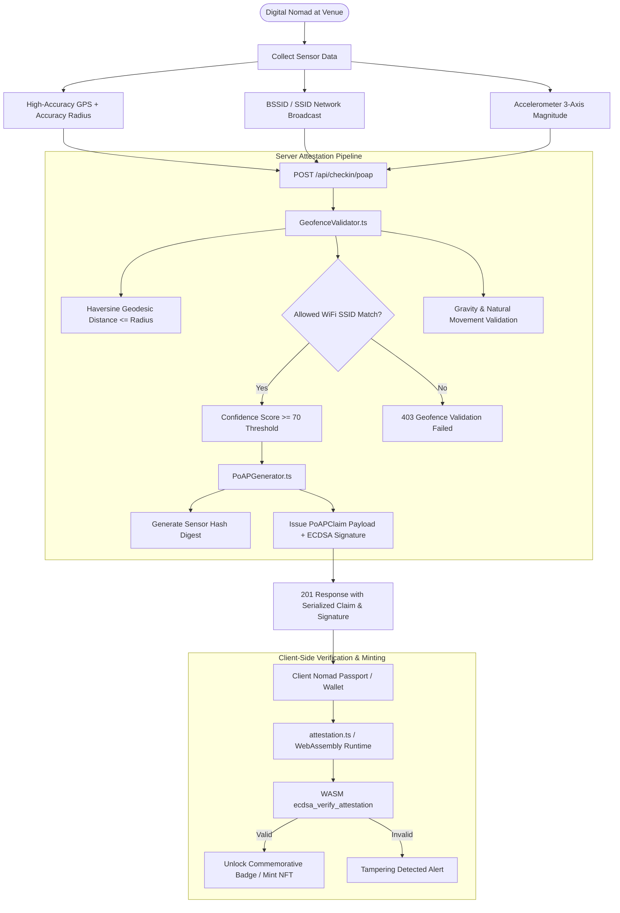
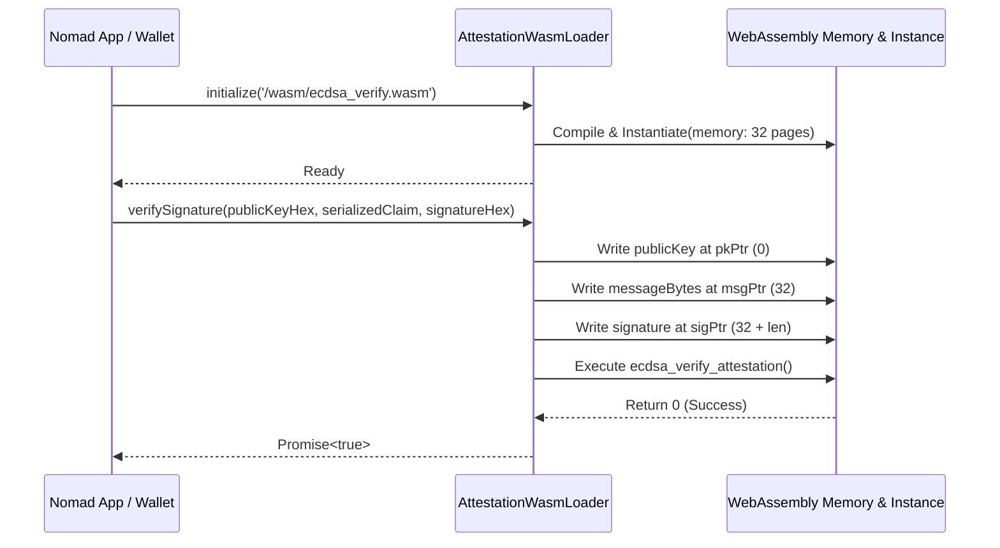

# Proof of Attendance Protocol (PoAP): Check-In Criteria, Cryptographic Attestation, and Commemorative NFT Badges

## 1. Executive Summary & Overview

In the distributed WorkSphere ecosystem, digital nomads, remote professionals, and hybrid teams frequent verified partner venues, coworking spaces, and private hubs around the globe. To foster community engagement, commemorate physical presence, and establish provable work history, WorkSphere incorporates the **Proof of Attendance Protocol (PoAP)** subsystem.

The PoAP subsystem issues cryptographically verifiable attendance claims and mints commemorative non-fungible token (NFT) badges. Rather than relying on simple self-reported check-ins or single-source GPS pings—which are vulnerable to location spoofing and emulators—WorkSphere implements a **multi-modal sensor fusion validation model**, server-side ECDSA attestation signatures, and client-side WebAssembly (WASM) verification.



---

## 2. Physical Presence Verification Criteria

To ensure that PoAP badges maintain institutional-grade integrity and represent bona fide on-premise presence, the `GeofenceValidator` evaluates three distinct physical sensor vectors before approving any attestation claim.

### 2.1 Multi-Modal Sensor Fusion Engine

The presence validation criteria are governed by [`GeofenceValidator.ts`](file:///c:/Users/admin/Desktop/workfere/src/core/attestation/GeofenceValidator.ts):

| Sensor Vector | Measurement Parameter | Validation Criteria | Weight / Confidence Impact |
| :--- | :--- | :--- | :--- |
| **Geodesic Distance** | Haversine distance between device GPS $(lat, lng)$ and venue coordinates | Device distance $\le$ `venueBounds.radiusMeters` | $+50$ points baseline; $+20$ additional points if distance $\le 50\%$ of radius |
| **GPS Accuracy Index** | Horizontal accuracy circle radius ($\pm$ meters) | $\le 20\text{ m}$ preferred; $> 50\text{ m}$ penalized | $+15$ points for $\le 20\text{ m}$; $-20$ points penalty if $> 50\text{ m}$ |
| **BSSID / WiFi SSID** | Local network SSID broadcast by venue access points | Must strictly match `venueBounds.allowedWifiSsids` | $+30$ points for authorized match; $-30$ points & hard rejection if missing |
| **Kinematic Dynamics** | Accelerometer Euclidean norm $\sqrt{a_x^2 + a_y^2 + a_z^2}$ | Earth gravity norm ($9.5\text{ m/s}^2$ to $10.5\text{ m/s}^2$) | $+10$ points for realistic terrestrial physical reading |

### 2.2 Geodesic Proximity: Haversine Calculation

Distance is computed on a spherical earth model using the Haversine formula with mean radius $R = 6371\text{ km}$:

$$\Delta \varphi = \frac{\pi}{180} (\text{lat}_2 - \text{lat}_1), \quad \Delta \lambda = \frac{\pi}{180} (\text{lng}_2 - \text{lng}_1)$$

$$a = \sin^2\left(\frac{\Delta \varphi}{2}\right) + \cos\left(\frac{\pi \cdot \text{lat}_1}{180}\right) \cos\left(\frac{\pi \cdot \text{lat}_2}{180}\right) \sin^2\left(\frac{\Delta \lambda}{2}\right)$$

$$c = 2 \cdot \operatorname{atan2}\left(\sqrt{a}, \sqrt{1 - a}\right), \quad d = R \cdot c \cdot 1000 \quad (\text{meters})$$

### 2.3 Confidence Threshold Formulation

The attestation is granted only when:
$$\text{isValid} = (\text{Geofence Satisfied}) \land (\text{WiFi SSID Matched}) \land (\text{Confidence Score} \ge 70)$$

If the nomad is outside the geofence perimeter, fails the authorized venue Wi-Fi SSID check, or accumulates a confidence score below $70$, the validation returns `isValid: false`, and the server returns `403 Forbidden`.

---

## 3. Cryptographic Claim Architecture (`PoAPGenerator`)

Once physical presence criteria are satisfied, the server generates a standardized, tamper-evident cryptographic claim using [`PoAPGenerator.ts`](file:///c:/Users/admin/Desktop/workfere/src/core/attestation/PoAPGenerator.ts).

### 3.1 Claim Data Model

The `PoAPClaim` encapsulates spatial, temporal, and sensory dimensions:

```typescript
export interface PoAPClaim {
    userId: string;       // Unique ID of the authenticated nomad
    venueId: string;      // Unique identifier of the verified venue
    timestamp: number;    // UTC epoch milliseconds of claim creation
    latitude: number;     // Physical GPS latitude coordinate
    longitude: number;    // Physical GPS longitude coordinate
    wifiSsid: string;     // Verified venue WiFi SSID
    sensorHash: string;   // Cryptographic digest of complete raw sensor telemetry
}
```

### 3.2 Sensor Digest Generation

To guarantee that sensory inputs cannot be altered post-validation, the `PoAPGenerator` derives a deterministic hexadecimal hash of the serialized raw sensor data:

```typescript
private hashString(str: string): string {
    let hash = 0;
    for (let i = 0; i < str.length; i++) {
        const char = str.charCodeAt(i);
        hash = ((hash << 5) - hash) + char;
        hash = hash & hash;
    }
    return Math.abs(hash).toString(16);
}
```

This digest is permanently bound within the claim before serialization into canonical JSON.

---

## 4. API Endpoints & Attestation Lifecycle

The attestation workflow is exposed via HTTP POST at `/api/checkin/poap` ([`src/app/api/checkin/poap/route.ts`](file:///c:/Users/admin/Desktop/workfere/src/app/api/checkin/poap/route.ts)).

### 4.1 Request Payload

```json
{
  "userId": "usr_nomad_984712",
  "venueId": "ven_shibuya_hub_01",
  "sensorData": {
    "gpsLat": 35.6595,
    "gpsLng": 139.7005,
    "gpsAccuracy": 12.5,
    "wifiSsid": "WorkSphere-Shibuya-5G",
    "accelerometerX": 0.12,
    "accelerometerY": 9.81,
    "accelerometerZ": 0.24
  },
  "venueBounds": {
    "centerLat": 35.6594,
    "centerLng": 139.7004,
    "radiusMeters": 45.0,
    "allowedWifiSsids": ["WorkSphere-Shibuya-5G", "WorkSphere-Guest"]
  }
}
```

### 4.2 Successful Attestation Response (`201 Created`)

```json
{
  "success": true,
  "message": "PoAP issued successfully",
  "claim": "{\"userId\":\"usr_nomad_984712\",\"venueId\":\"ven_shibuya_hub_01\",\"timestamp\":1775806300000,\"latitude\":35.6595,\"longitude\":139.7005,\"wifiSsid\":\"WorkSphere-Shibuya-5G\",\"sensorHash\":\"7a9f8b2c\"}",
  "confidence": 95,
  "signature": "3045022100e4b7c1...mock_server_signature_hex_string"
}
```

### 4.3 Error Responses

- **`400 Bad Request`**: Missing required check-in fields (`userId`, `venueId`, `sensorData`, or `venueBounds`).
- **`403 Forbidden`**: Validation failure when the device is outside the bounding radius, fails SSID verification, or fails the 70-point confidence threshold.
- **`500 Internal Server Error`**: Unexpected server-side processing error.

---

## 5. Client-Side WebAssembly (WASM) Verification

To allow mobile wallets, progressive web applications (PWAs), and offline decentralized clients to verify badges without querying central infrastructure or leaking user location queries, WorkSphere utilizes WebAssembly-accelerated ECDSA verification ([`src/lib/wasm-loader/attestation.ts`](file:///c:/Users/admin/Desktop/workfere/src/lib/wasm-loader/attestation.ts)).

### 5.1 Architecture of `AttestationWasmLoader`

The loader initializes the WebAssembly binary compiled from native cryptographic libraries (`/wasm/ecdsa_verify.wasm`), allocating dedicated linear memory.



### 5.2 Linear Memory Layout

| Offset Pointer | Buffer Content | Description |
| :--- | :--- | :--- |
| `pkPtr = 0` | Public Key Bytes | WorkSphere attestation authority public key |
| `msgPtr = 32` | UTF-8 Encoded Claim | Serialized JSON string of the `PoAPClaim` |
| `sigPtr = 32 + msgLen` | Signature Bytes | ECDSA DER/raw signature bytes |

If the return code from `ecdsa_verify_attestation` is `0`, the cryptographic proof is mathematically guaranteed to be issued by WorkSphere.

---

## 6. Commemorative NFT Badges & Metadata Schema

Following successful verification, digital nomads can claim and mint unique non-transferable (soulbound) or commemorative ERC-721/ERC-1155 NFT badges linked to their WorkSphere Nomad Passport.

### 6.1 Badge Tiering & Rarity Hierarchy

| Badge Tier | Eligibility Criteria | Visual Accents | Nomad Privileges |
| :--- | :--- | :--- | :--- |
| **Explorer** | First verified check-in at any new partner venue | Bronze brushed finish, venue coordinates stamp | Unlocks community venue chat room |
| **Nomad Pioneer** | Check-in at 5 distinct cities or countries within a calendar year | Silver holographic border, globe insignia | Priority booking during peak workspace hours |
| **Venue Resident** | >= 20 check-ins at a single venue with >= 60 min dwell | Gold embossed foil, venue monogram | 10% workspace pass discount; dedicated desk reservation |
| **Summit Sovereign** | Exclusive flagship hubs (e.g., Tokyo Shibuya Sky, Zurich Alps) | Obsidian prismatic luster, animated particle metadata | Access to global partner VIP lounges & invite-only events |

### 6.2 ERC-721 / OpenSea Compliant Metadata Schema

The minted NFT metadata strictly adheres to decentralized token metadata standards:

```json
{
  "name": "WorkSphere PoAP: Shibuya Creative Hub #104",
  "description": "Cryptographically verified proof of attendance at WorkSphere Shibuya Creative Hub, Tokyo, Japan.",
  "image": "ipfs://QmZ4tDuMTnxQD5y6.../shibuya-creative-hub.png",
  "external_url": "https://worksphere.io/passport/badges/poap-shibuya-104",
  "attributes": [
    {
      "trait_type": "Venue ID",
      "value": "ven_shibuya_hub_01"
    },
    {
      "trait_type": "City",
      "value": "Tokyo"
    },
    {
      "trait_type": "Country",
      "value": "Japan"
    },
    {
      "trait_type": "Verification Confidence",
      "value": 95,
      "max_value": 100
    },
    {
      "trait_type": "Sensor Hash",
      "value": "7a9f8b2c"
    },
    {
      "trait_type": "Check-In Timestamp",
      "display_type": "date",
      "value": 1775806300
    },
    {
      "trait_type": "Rarity Tier",
      "value": "Explorer"
    }
  ]
}
```

---

## 7. Security Safeguards & Anti-Spoofing Mitigations

To protect the ecosystem against fraudulent claims and badge farming:

1. **Replay Protection via Monotonic Timestamps:** Claims feature millisecond-precision timestamps. Any attempt to replay a previous claim beyond the 5-minute issuance window is rejected.
2. **Sensor Hash Tampering Defense:** Because `sensorHash` is computed across raw accelerometer, GPS accuracy, and network parameters, modifying GPS coordinates without re-signing the entire payload invalidates the signature.
3. **Hardware-Assisted Geofence Validation:** Single GPS readings from emulator mock locations exhibit uniform accuracy and static accelerometer data. WorkSphere enforces terrestrial gravity boundaries (~ 9.8 m/s^2) and low GPS jitter accuracy.
4. **Offline WASM Integrity:** The client-side WASM verification guarantees that badges stored in nomad wallets remain independently verifiable during global travels even without active internet connectivity.
