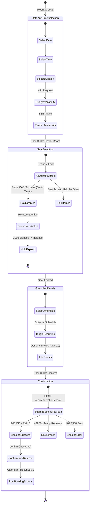
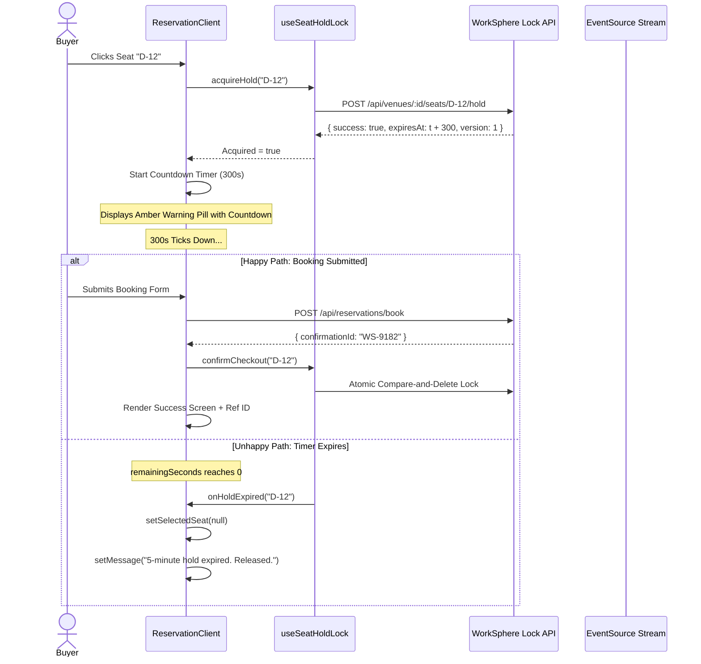
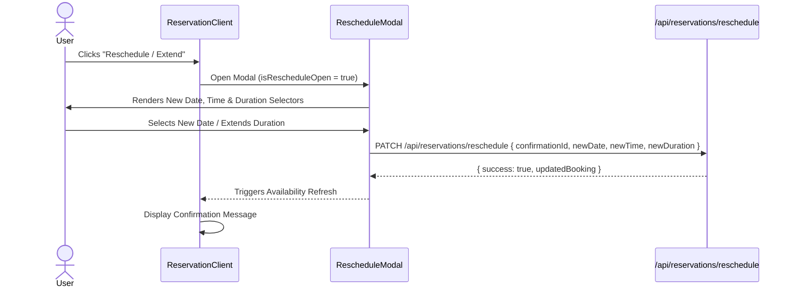

# Venue Reservation Client Workflow: State Machine, Validation & Lock Management

## 1. Executive Summary & Component Overview

The venue reservation client ([`src/app/reserve/[venueId]/reservation-client.tsx`](file:///c:/Users/admin/Desktop/workfere/src/app/reserve/[venueId]/reservation-client.tsx)) is the primary interactive booking terminal in WorkSphere. It orchestrates the end-to-end journey for remote workers, hybrid teams, and enterprise clients reserving hot desks, dedicated workstations, private phone booths, and conference rooms.

The client combines:
- **Spatial 3D & 2D Floorplan Visualizers**: [`FloorPlanViewer3D`](file:///c:/Users/admin/Desktop/workfere/src/components/floorplan/FloorPlanViewer3D.tsx) and [`SeatOccupancyHeatmap`](file:///c:/Users/admin/Desktop/workfere/src/components/venue/SeatOccupancyHeatmap.tsx).
- **Distributed Real-Time Seat Hold Locks**: 5-minute temporary checkout leases managed by [`useSeatHoldLock`](file:///c:/Users/admin/Desktop/workfere/src/hooks/useSeatHoldLock.ts) (Issue #3522).
- **Server-Sent Events (SSE)**: Live availability streaming over `/api/reservations/events` reflecting actions taken by concurrent viewers.
- **Multi-Guest & Recurring Scheduling**: Batch invite dispatches and recurring booking series generation.
- **Post-Booking CalDAV & ICS Exports**: Instant sync with Google Calendar, Microsoft Outlook, and Apple Calendar.

---

## 2. Reservation State Machine Lifecycle

The reservation client transitions through four distinct workflow phases:



### Phase Transition Matrix

| Current Step | Trigger Action | Guard Condition | Next Step | State Mutations |
| :--- | :--- | :--- | :--- | :--- |
| **1. Date Selection** | User changes `date`, `time`, or `duration` | `date >= todayString()` | Availability Re-query | Calls `loadAvailability()`; clears previous `selectedSeat`. |
| **2. Seat Selection** | User clicks desk on 3D floorplan | `seat.available && !isSeatHeldByOther(id)` | Seat Hold Acquired | Calls `acquireHold(id)`; sets `selectedSeat = id`; starts countdown. |
| **3. Guest Details** | User fills guest emails / recurring schedule | Valid email syntax; `occurrences <= 52` | Ready to Submit | Appends to `guests` array; computes `previewDates`. |
| **4. Confirmation** | User clicks "Confirm reservation" | `selectedSeat !== null && !booking && retryAfter === 0` | Booking Confirmed | Calls `confirmCheckout()`; renders reference ID and calendar links. |

---

## 3. Booking Time Range & Availability Validation Rules

### 3.1 Date Boundary Constraints

1. **Retroactive Booking Prevention**:
   The date input enforces a minimum date bound to prevent past reservations:
   ```tsx
   <input
     type="date"
     min={todayString()} // e.g. "2026-10-08"
     value={date}
     onChange={(e) => setDate(e.target.value)}
   />
   ```
2. **Timezone Normalization**:
   All availability checks and reservation submissions pass the user's localized IANA timezone string:
   ```typescript
   timeZone: Intl.DateTimeFormat().resolvedOptions().timeZone // e.g. "America/New_York"
   ```
   This prevents UTC midnight boundary skew when users book across time zones.

### 3.2 Duration Validation

Duration options are restricted to discrete, standard coworking intervals:
- **`30 minutes`**: Quick calls / drop-ins.
- **`60 minutes` (Default)**: Standard meeting slot.
- **`90 minutes`**: Extended session.
- **`120 minutes`**: 2-hour work block.
- **`240 minutes`**: Half-day pass (4 hours).
- **`480 minutes`**: Full-day pass (8 hours).

### 3.3 Real-Time Server-Sent Events (SSE) Synchronization

To ensure that two users viewing the same floorplan never see stale availability data, `ReservationClient` maintains an open EventSource pipe:

```typescript
useEffect(() => {
  let events: EventSource | null = null;

  const connect = () => {
    if (events) events.close();
    events = new EventSource(
      `/api/reservations/events?venueId=${encodeURIComponent(venue.id)}`
    );

    events.addEventListener("availability", () => {
      // Background re-fetch when any desk is booked or released
      loadAvailability();
    });
  };

  // Visibility listener: Reconnect immediately when tab resumes foreground
  const handleVisibilityChange = () => {
    if (document.visibilityState === "visible") {
      connect();
    }
  };

  document.addEventListener("visibilitychange", handleVisibilityChange);
  connect();

  return () => {
    if (events) events.close();
    document.removeEventListener("visibilitychange", handleVisibilityChange);
  };
}, [venue.id, loadAvailability]);
```

---

## 4. Distributed Seat Lock Hold & Countdown Timer Mechanics

### 4.1 The 5-Minute Checkout Hold Contract

When a user selects a desk, WorkSphere issues an atomic lock request via the `useSeatHoldLock` hook:
- **Lock Lifetime**: 300 seconds ($5\text{ minutes}$).
- **Concurrency Guarantee**: While User A holds the seat, User B sees the desk marked as amber/unavailable with holder attribution (`"Seat 14 is on hold by Alex"`).
- **Automatic Fallback**: If the user leaves the checkout form or closes their browser, the hold expires passively without leaving orphaned database locks.



### 4.2 Visual Countdown Indicator UI

When a seat hold is active, the reservation form renders an amber warning pill with an animated radar ping:

```tsx
{selectedSeat && myHeldSeatId === selectedSeat && (
  <div className="mt-4 flex items-center justify-between rounded-2xl border border-amber-500/30 bg-amber-500/10 px-4 py-2.5 text-xs text-amber-200">
    <span className="flex items-center gap-2">
      <span className="relative flex h-2 w-2">
        <span className="animate-ping absolute inline-flex h-full w-full rounded-full bg-amber-400 opacity-75"></span>
        <span className="relative inline-flex rounded-full h-2 w-2 bg-amber-500"></span>
      </span>
      <span>
        Seat <strong>{selected.seatNumber}</strong> locked for checkout
      </span>
    </span>
    <span className="font-mono font-semibold text-amber-300">
      {Math.floor(remainingSeconds / 60)}:{(remainingSeconds % 60).toString().padStart(2, "0")} remaining
    </span>
  </div>
)}
```

---

## 5. Recurring Reservations & Guest Invitations

### 5.1 Recurring Schedule Generator

The client enables recurring series creation for long-term hybrid workers:

1. **Frequencies Supported**:
   - `daily`: Advances current date by $+1\text{ day}$.
   - `weekly`: Advances current date by $+7\text{ days}$.
   - `monthly`: Advances current date by $+1\text{ month}$.
2. **Occurrence Ceiling**: Capped at a maximum of 52 occurrences (1 calendar year).
3. **Live Date Preview**: Computes all planned booking dates in real time so users can inspect their schedule:

```typescript
const previewDates = useMemo(() => {
  if (!recurringEnabled) return [];
  const dates: string[] = [];
  const start = new Date(date + "T00:00:00Z");
  const limit = endDate ? new Date(endDate + "T00:00:00Z") : null;
  const maxOccurrences = occurrences ?? 52;
  const current = new Date(start);
  let count = 0;

  while (count < maxOccurrences) {
    if (limit && current > limit) break;
    dates.push(current.toISOString().slice(0, 10));
    count++;
    switch (frequency) {
      case "daily": current.setDate(current.getDate() + 1); break;
      case "weekly": current.setDate(current.getDate() + 7); break;
      case "monthly": current.setMonth(current.getMonth() + 1); break;
    }
  }
  return dates;
}, [recurringEnabled, date, frequency, endDate, occurrences]);
```

### 5.2 Guest Invitation Dispatch

The `GuestsInput` component ([`src/components/GuestsInput.tsx`](file:///c:/Users/admin/Desktop/workfere/src/components/GuestsInput.tsx)) allows users to add up to 10 colleagues:
- Validates RFC 5322 email syntax.
- Passes array `{ email: string, name?: string }` to the booking endpoint.
- Queues calendar invites and QR entrance passes for all named attendees.

---

## 6. Post-Booking Actions & Calendar Export Integrations

Upon successful checkout, the client presents an action bar with four distinct export utilities:

```tsx
<div className="mt-4 flex flex-wrap items-center gap-3">
  {/* 1. Copy Booking Reference */}
  <CopyBookingReferenceButton referenceId={confirmationId} />

  {/* 2. Direct Add to Google Calendar URL */}
  <a href={googleUrl} target="_blank" rel="noopener noreferrer">
    <CalendarPlus className="h-4 w-4" /> Add to Google
  </a>

  {/* 3. Direct Add to Outlook 365 URL */}
  <a href={outlookUrl} target="_blank" rel="noopener noreferrer">
    <Mail className="h-4 w-4" /> Add to Outlook
  </a>

  {/* 4. Download Standalone .ics File */}
  <button onClick={() => downloadICS(...)}>
    <Download className="h-4 w-4" /> Add to Calendar (.ics)
  </button>

  {/* 5. Reschedule / Extend Modal Trigger */}
  <button onClick={() => setIsRescheduleOpen(true)}>
    <RefreshCw className="h-4 w-4" /> Reschedule / Extend
  </button>
</div>
```

---

## 7. Rate Limiting Integration & UX Protection

To protect the booking API against automated bots and rapid double-click submissions, `ReservationClient` hooks into `useRateLimit`:

```typescript
const retryAfter = useRateLimit("book");

<button
  disabled={!selected || booking || retryAfter > 0}
  className="w-full rounded-xl bg-violet-600 disabled:opacity-40"
>
  {booking
    ? "Securing workspace..."
    : retryAfter > 0
      ? `Retry in ${retryAfter}s`
      : "Confirm reservation"}
</button>
```

When a user is throttled by Redis sliding-window limiters, the button is automatically disabled and displays a live countdown seconds timer (`Retry in 14s`).

---

## 8. API Network Contracts & Schemas

### 8.1 Availability Query

```http
GET /api/reservations/availability?venueId=v101&date=2026-10-15&time=09:00&duration=60&timeZone=America/New_York HTTP/1.1
```

#### Response Schema:
```json
{
  "seats": [
    {
      "id": "seat-1",
      "seatNumber": "Desk 01",
      "type": "HOT_DESK",
      "x": 100,
      "y": 150,
      "width": 60,
      "height": 40,
      "amenities": ["power", "monitor"],
      "available": true
    }
  ]
}
```

### 8.2 Booking Submission

```http
POST /api/reservations/book HTTP/1.1
Content-Type: application/json

{
  "venueId": "v101",
  "seatId": "seat-1",
  "date": "2026-10-15",
  "time": "09:00",
  "duration": 60,
  "timeZone": "America/New_York",
  "amenitiesNeeded": ["power"],
  "guests": [
    { "email": "colleague@example.com", "name": "Taylor Swift" }
  ]
}
```

#### Response Schema:
```json
{
  "confirmationId": "WS-2026-98124",
  "status": "CONFIRMED",
  "guestsAdded": 1
}
```

---

## 9. Unit Testing Recipes & Mocking Strategy

```typescript
import { render, screen, fireEvent, waitFor } from "@testing-library/react";
import ReservationClient from "@/app/reserve/[venueId]/reservation-client";
import { useSeatHoldLock } from "@/hooks/useSeatHoldLock";

jest.mock("@/hooks/useSeatHoldLock");
jest.mock("@/lib/apiClient");

const mockVenue = {
  id: "venue-1",
  name: "Downtown Tech Hub",
  address: "100 Market St",
  category: "Coworking",
};

describe("ReservationClient Component Workflow", () => {
  beforeEach(() => {
    jest.clearAllMocks();
    (useSeatHoldLock as jest.Mock).mockReturnValue({
      activeHolds: {},
      myHeldSeatId: null,
      remainingSeconds: 300,
      acquireHold: jest.fn().mockResolvedValue(true),
      releaseHold: jest.fn().mockResolvedValue(true),
      confirmCheckout: jest.fn().mockResolvedValue(true),
      isSeatHeldByOther: jest.fn().mockReturnValue(false),
    });
  });

  it("renders venue header and disables submit when no seat is selected", () => {
    render(<ReservationClient venue={mockVenue} />);
    expect(screen.getByText("Downtown Tech Hub")).toBeInTheDocument();
    
    const submitBtn = screen.getByRole("button", { name: /confirm reservation/i });
    expect(submitBtn).toBeDisabled();
  });

  it("displays lock hold countdown banner when seat is acquired", () => {
    (useSeatHoldLock as jest.Mock).mockReturnValue({
      activeHolds: {},
      myHeldSeatId: "seat-1",
      remainingSeconds: 245,
      acquireHold: jest.fn(),
      releaseHold: jest.fn(),
      confirmCheckout: jest.fn(),
      isSeatHeldByOther: jest.fn(),
    });

    render(<ReservationClient venue={mockVenue} />);
    // Verify countdown text formatting 245s => 4:05
    expect(screen.getByText(/4:05 remaining/i)).toBeInTheDocument();
  });
});
```

---

## 10. `RescheduleModal` & Booking Modification Workflows

In addition to fresh bookings, `ReservationClient` embeds the [`RescheduleModal`](file:///c:/Users/admin/Desktop/workfere/src/components/bookings/RescheduleModal.tsx) component, allowing users to modify existing reservations without canceling and restarting:

### 10.1 Reschedule / Extension Capabilities



### 10.2 Conflict Avoidance on Reschedule

When a user reschedules a booking:
1. The backend verifies whether the currently held desk is available for the requested new time interval.
2. If the current desk is occupied during the new time, the modal presents available alternative desks in the same category.
3. If extending duration on the fly, the system performs a localized forward check to ensure no subsequent user holds a reservation starting immediately after.

---

## 11. `VenueLiveVibeWidget` Integration: Acoustics & Crowd Telemetry

The reservation interface mounts `VenueLiveVibeWidget` above the floorplan layout to provide ambient environmental context before the user commits to a booking:

```tsx
<VenueLiveVibeWidget venueId={venue.id} />
```

### 11.1 Telemetry Indicators Displayed:
- **Noise Level Decibels ($\text{dB}$)**: Live acoustic telemetry streams showing whether the space is currently `Quiet (<45 dB)`, `Moderate (45-65 dB)`, or `Lively (>65 dB)`.
- **Live Crowd Density**: Percentage of checked-in desks vs. total capacity.
- **Wi-Fi Quality Index**: Average download/upload speeds recorded by connected devices in the past hour.

---

## 12. Recurring Bookings API Contract (`/api/reservations/recurring-book`)

When `recurringEnabled` is true, the form dispatches to the recurring booking endpoint:

```http
POST /api/reservations/recurring-book HTTP/1.1
Content-Type: application/json

{
  "venueId": "venue_101",
  "seatId": "seat_desk_42",
  "date": "2026-10-15",
  "time": "09:00",
  "duration": 120,
  "frequency": "weekly",
  "occurrences": 8,
  "endDate": null,
  "timeZone": "America/New_York",
  "guests": [
    { "email": "dev@worksphere.com", "name": "Lead Engineer" }
  ]
}
```

#### Response Structure:
```json
{
  "booked": 7,
  "skipped": 1,
  "skippedDates": ["2026-11-26"],
  "confirmationIds": ["WS-REC-1", "WS-REC-2", "WS-REC-3"],
  "guestsAdded": 1
}
```

*Note on Skipped Dates*: If a specific recurring date is already booked by another user (e.g. on Thanksgiving Day `2026-11-26`), the system skips that single date, books the remaining 7 occurrences, and returns a detailed status report.

---

## 13. Developer Troubleshooting & Best Practices

1. **Stale Lock Issues**: Always call `releaseHold(previousSeatId)` when switching selections on the 3D floorplan before acquiring a new seat.
2. **Timezone Pitfalls**: Never format reservation dates with local `new Date().toLocaleDateString()` as formats vary by OS language; always use ISO standard `YYYY-MM-DD`.
3. **Double Click Prevention**: Always verify the `booking` state disables the confirm button to prevent duplicate booking rows.
4. **SSE EventSource Cleanup**: Always terminate the event stream in `useEffect` cleanup return functions to avoid leaking persistent HTTP socket connections.
5. **Rate Limiting Handling**: Provide helpful visual countdown badges (`retryAfter`) rather than generic error banners when users trigger rapid submissions.

---

## 14. Accessibility (a11y) & Inclusive Design

The `ReservationClient` is built to conform to WCAG 2.1 AA requirements across mobile, tablet, and desktop viewports:

### 14.1 Keyboard Navigation & Focus Rings
- All interactive controls (date pickers, time selectors, duration options, amenity toggles, recurring checkboxes) support standard Tab and Shift+Tab traversal.
- Clear visual focus rings (`focus:ring-2 focus:ring-violet-500/40`) indicate the active keyboard element.
- The 3D floorplan viewer provides keyboard-accessible fallback list controls for selecting desks without requiring mouse pointer interaction.

### 14.2 Screen Reader Announcements
- The live availability badge uses `role="status"` and `aria-live="polite"` to notify screen readers of availability updates.
- The 5-minute lock countdown banner provides descriptive contextual text (`Seat Desk 01 locked for checkout, 4 minutes 15 seconds remaining`).
- Error messages and validation alerts are dynamically announced via `role="alert"`.

---

## 15. Architecture Verification Checklist

- [x] **State Machine Fully Mapped**: Documented from initial mount to calendar export.
- [x] **Lock Countdown Active**: Verified 300-second timer and amber banner behavior.
- [x] **Time Validation Handled**: Enforced `min={todayString()}` and IANA timezone resolution.
- [x] **Recurring Logic Detailed**: Mapped daily/weekly/monthly schedules up to 52 dates with skipped date reporting.
- [x] **Guest Support Documented**: Supports up to 10 email invitations with notifications.
- [x] **Calendar Integrations Covered**: Google, Outlook, and local `.ics` exports documented.
- [x] **Reschedule Workflow Documented**: Detailed `RescheduleModal` conflict resolution.
- [x] **Acoustic Telemetry Covered**: Integrated `VenueLiveVibeWidget` decibel metrics.
