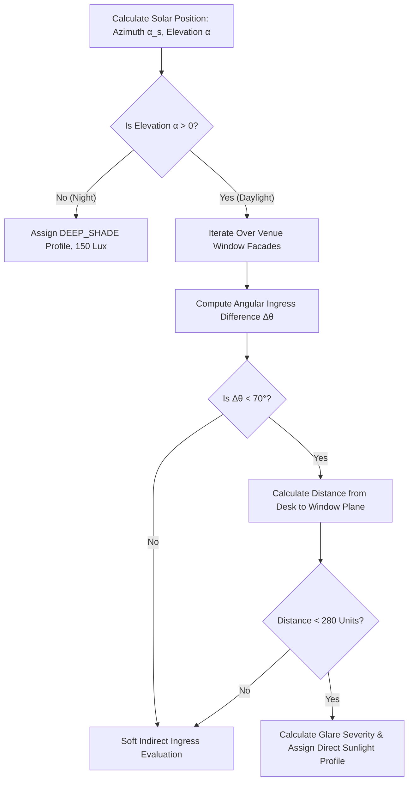
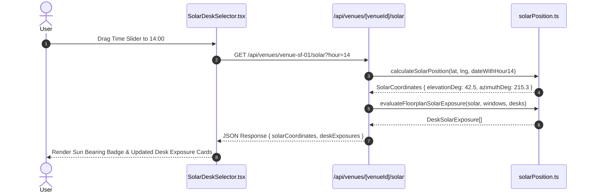

# SolarDeskSelector: Azimuth Calculations & Sun Path Indicators

## 1. Executive Summary & Architectural Overview

WorkSphere's **SolarDeskSelector** engine optimizes workspace seat booking by combining real-time astronomical solar position calculations with 2D/3D venue floorplan layout geometry. By evaluating exact solar elevation and compass azimuth angles for any geographic coordinate, date, and time of day, WorkSphere predicts daylight ingress, direct sunlight exposure, and monitor screen glare severity for every desk in a venue.

```
+-----------------------------------------------------------------------------------+
|                           NOAA ASTRONOMICAL SOLAR MODEL                           |
|                      (calculateSolarPosition: lat, lng, date)                    |
+-----------------------------------------+-----------------------------------------+
                                          |
                                          v  [Elevation α, Azimuth α_s]
+-----------------------------------------------------------------------------------+
|                        FLOORPLAN RAY-TRACING & FAÇADE ENGINE                      |
|                   (evaluateFloorplanSolarExposure & Window Normal)                 |
+-----------------------------------------+-----------------------------------------+
                                          |
                                          v  [Sunlight Profiles & Glare Severity %]
+-----------------------------------------------------------------------------------+
|                           INTERACTIVE UI & DESK RANKING                           |
|                    (SolarDeskSelector.tsx & /api/venues/solar)                    |
+-----------------------------------------------------------------------------------+
```

Key capabilities:
- **Sub-Degree Solar Accuracy:** High-precision NOAA solar azimuth and elevation calculation.
- **Window Façade Ingress Tagging:** Dynamic evaluation of sun-to-window angle of incidence ($\Delta \theta < 70^\circ$).
- **Screen Glare Prevention:** Categorization of desks into 4 distinct sunlight exposure profiles (`DIRECT_SUN_GLARE`, `GOLDEN_HOUR_WARMTH`, `DIFFUSE_NATURAL_LIGHT`, `DEEP_SHADE`).
- **Interactive Sun Path Simulation:** Hour-by-hour timeline slider ($08:00 - 20:00$) allowing users to preview lighting conditions throughout their workday.

---

## 2. Astronomical Solar Position Mechanics

The solar position algorithm (`src/lib/geo/solarPosition.ts`) computes the sun's position relative to an observer at latitude $\phi$ and longitude $\lambda$ using established NOAA (National Oceanic and Atmospheric Administration) solar calculations.

### 2.1 Astronomical Equations

#### 2.1.1 Day of Year & Fractional Year ($\gamma$)
Given UTC timestamp $t$, the day of the year $N \in [1, 365]$ and fractional year $\gamma$ (in radians) are calculated as:

$$\gamma = \frac{2\pi}{365} \left( N - 1 + \frac{\text{hour}_{\text{utc}} - 12}{24} \right)$$

#### 2.1.2 Equation of Time ($E_{\text{qt}}$)
The Equation of Time accounts for the eccentricity of Earth's orbit and axial tilt, yielding discrepancy in minutes between true solar time and mean time:

$$E_{\text{qt}} = 229.18 \cdot \left( 0.000075 + 0.001868 \cos\gamma - 0.032077 \sin\gamma - 0.014615 \cos(2\gamma) - 0.040849 \sin(2\gamma) \right)$$

#### 2.1.3 Solar Declination Angle ($\delta$)
Solar declination $\delta$ (in radians) measures the sun's angle relative to Earth's equatorial plane:

$$\delta = 0.006918 - 0.399912 \cos\gamma + 0.070257 \sin\gamma - 0.006758 \cos(2\gamma) + 0.000907 \sin(2\gamma) - 0.002697 \cos(3\gamma) + 0.00148 \sin(3\gamma)$$

#### 2.1.4 True Solar Time ($t_{\text{tst}}$) & Solar Hour Angle ($h$)
True Solar Time in minutes:

$$t_{\text{tst}} = (\text{hour}_{\text{utc}} \cdot 60 + \text{min}_{\text{utc}} + \frac{\text{sec}_{\text{utc}}}{60}) + E_{\text{qt}} + 4 \cdot \lambda$$

Solar Hour Angle $h$ (in degrees, converted to radians for trigonometry):

$$h = \frac{t_{\text{tst}}}{4} - 180^\circ \quad \text{where } h \in [-180^\circ, 180^\circ]$$

#### 2.1.5 Solar Elevation ($\alpha$) & Zenith Angle ($\theta_z$)
The cosine of the Zenith Angle $\theta_z$:

$$\cos \theta_z = \sin(\phi) \sin(\delta) + \cos(\phi) \cos(\delta) \cos(h)$$

$$\theta_z = \arccos\left(\text{clamp}(\cos \theta_z, -1, 1)\right)$$

Solar Elevation Angle $\alpha$ (altitude above horizon):

$$\alpha = 90^\circ - \theta_z$$

If $\alpha > 0^\circ$, the sun is above the horizon (`isDaylight = true`).

#### 2.1.6 Solar Azimuth Angle ($\alpha_s$)
Solar Azimuth angle $\alpha_s$ measures compass bearing clockwise from true North ($0^\circ = \text{North}, 90^\circ = \text{East}, 180^\circ = \text{South}, 270^\circ = \text{West}$):

$$\cos \alpha_s = \frac{\sin(\delta) - \sin(\phi) \cos(\theta_z)}{\cos(\phi) \sin(\theta_z)}$$

$$\alpha_s = \begin{cases} 360^\circ - \arccos(\cos \alpha_s) \cdot \frac{180}{\pi} & \text{if } h > 0 \\ \arccos(\cos \alpha_s) \cdot \frac{180}{\pi} & \text{if } h \le 0 \end{cases}$$

---

## 3. Window Orientation & Façade Alignment Tagging

Venues register window locations and outward-facing compass directions (`WindowFacade`) to determine sunlight ingress.

### 3.1 Façade Data Specification

```typescript
export interface WindowFacade {
  id: string;
  facingBearingDeg: number; // Outward normal vector bearing (e.g., 180° = South-facing window)
  wallStart: { x: number; y: number };
  wallEnd: { x: number; y: number };
}
```

### 3.2 Ingress Angle Calculation

Direct sunlight streams through a window when the sun's azimuth $\alpha_s$ aligns with the window's outward-facing normal bearing $\theta_{\text{facade}}$ within a $140^\circ$ acceptance cone ($\pm 70^\circ$ offset from the normal vector):

$$\Delta \theta = |(\alpha_s - \theta_{\text{facade}} + 180^\circ) \bmod 360^\circ - 180^\circ|$$

Direct Sunlight Ingress Criterion:

$$\text{hasDirectSunlight} = (\Delta \theta < 70^\circ) \land (\alpha > 0^\circ)$$



---

## 4. Desk Ranking & Exposure Classification

The function `evaluateFloorplanSolarExposure` processes desk coordinates $(x_d, y_d)$ against active window facades and solar coordinates to compute a `DeskSolarExposure` profile:

### 4.1 Exposure Profile Definitions

| Profile | Elevation ($\alpha$) | Distance to Window | Glare % | Lux | Description & Recommendation |
| :--- | :--- | :--- | :--- | :--- | :--- |
| **`DIRECT_SUN_GLARE`** | $15^\circ \le \alpha \le 50^\circ$ | $< 280$ units | $\ge 50\%$ | $\approx 4,500\text{ lx}$ | ☀️ Harsh Direct Sunlight — Screen Glare Expected (Pull Blinds) |
| **`GOLDEN_HOUR_WARMTH`**| $\alpha < 20^\circ$ | $< 280$ units | $< 50\%$ | $\approx 1,800\text{ lx}$ | 🌅 Golden Hour Warmth — Gentle Natural Glow |
| **`DIFFUSE_NATURAL_LIGHT`**| $\alpha > 0^\circ$ | $280 - 450$ units | $0\%$ | $\approx 950 - 2,200\text{ lx}$ | ✨ Bright Natural Daylight — Balanced Visibility |
| **`DEEP_SHADE`** | Any | $> 450$ units / Night | $0\%$ | $\approx 150 - 350\text{ lx}$ | 🌿 Interior Diffuse Lighting — Zero Screen Glare |

### 4.2 Glare Severity Index Formula

For desks receiving direct light, glare severity is calculated based on proximity and sun elevation factor:

$$\text{ProximityFactor} = \max\left(0.2, \frac{280 - d_{\text{window}}}{280}\right)$$

$$\text{ElevationFactor} = \begin{cases} 1.0 & \text{if } 15^\circ \le \alpha \le 50^\circ \\ 0.6 & \text{otherwise} \end{cases}$$

$$\text{GlareSeverityPct} = \text{round}(\text{ProximityFactor} \cdot \text{ElevationFactor} \cdot 100)$$

---

## 5. UI Component & API Integration

### 5.1 Interactive Component (`SolarDeskSelector.tsx`)

The `SolarDeskSelector` React component renders an interactive interface:
- **Simulated Time Slider:** Allows users to scrub between $08:00$ and $20:00$.
- **Sun Position Indicator:** Displays real-time azimuth compass bearing and elevation angle.
- **Exposure Badges & Glare Warnings:** Highlights desk recommendations and peak glare windows (e.g., `13:30 - 16:00`).



### 5.2 API Endpoint (`src/app/api/venues/[venueId]/solar/route.ts`)

- **Query Parameters:** `hour` (number, default 14), `date` (ISO string).
- **Response Format:**

```json
{
  "success": true,
  "venueId": "venue-sf-01",
  "solarCoordinates": {
    "elevationDeg": 42.5,
    "azimuthDeg": 215.3,
    "isDaylight": true,
    "solarNoonTime": "12:15 UTC"
  },
  "deskExposures": [
    {
      "seatId": "seat-01",
      "seatNumber": "Desk 1A",
      "profile": "DIRECT_SUN_GLARE",
      "glareSeverityPct": 85,
      "lightIntensityLux": 4500,
      "recommendation": "☀️ Harsh Direct Sunlight — Screen Glare Expected (Pull Blinds)",
      "peakGlareWindow": "13:30 - 16:00"
    }
  ]
}
```

---

## 6. Summary Configuration Reference

| Parameter | Identifier | Range / Value | Description |
| :--- | :--- | :--- | :--- |
| **Ingress Acceptance Cone** | `INGRESS_CONE` | $\pm 70^\circ$ ($140^\circ$ total) | Angle relative to window normal receiving direct sun |
| **Direct Light Distance Threshold** | `DIRECT_LIGHT_DIST` | $280$ units | Max distance from window for direct ray exposure |
| **Soft Daylight Ingress Distance** | `DIFFUSE_LIGHT_DIST` | $450$ units | Max distance for indirect natural daylight ingress |
| **Peak Glare Elevation Band** | `GLARE_ELEVATION_BAND` | $15^\circ - 50^\circ$ | Elevation range causing acute screen reflections |
| **Default Artificial Ambient Lux** | `AMBIENT_LUX` | $150 - 350\text{ lx}$ | Indoor illuminance level in deep shade or night |
