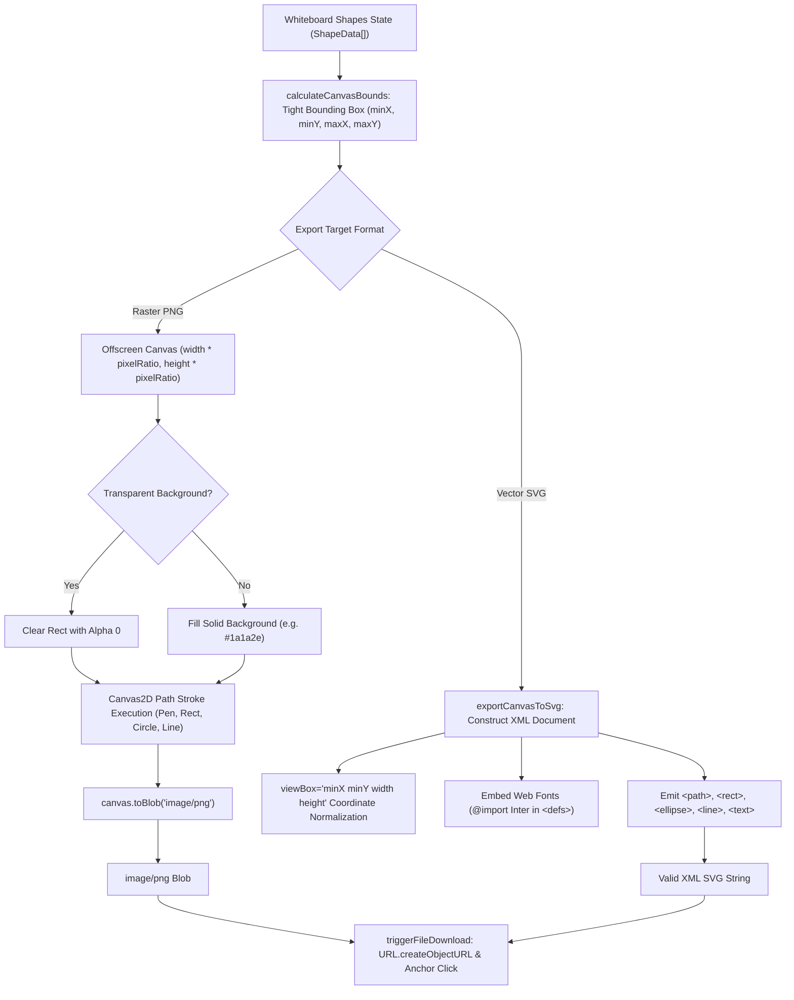

# Whiteboard Canvas Export: Transparent PNG and Vector SVG Specifications

This developer guide details the canvas export pipeline in [`src/lib/whiteboard/canvasExport.ts`](file:///c:/Users/admin/Desktop/workfere/src/lib/whiteboard/canvasExport.ts), explaining how WorkSphere converts real-time collaborative whiteboard drawings into **raster PNG** (with alpha channel transparency) and **vector SVG** (with coordinate scaling and font embedding), along with browser download trigger implementations.

---

## 1. Executive Summary & Architecture Overview

WorkSphere whiteboards enable synchronous brainstorming, system diagramming, and sprint retrospectives. When teams export sketches for documentation, design reviews, or presentations, they require two distinct output modes:
1. **Raster Transparent PNG:** A high-DPI bitmap snapshot rendered via an offscreen HTML5 2D canvas, preserving alpha channel transparency.
2. **Scalable Vector SVG:** An XML-based vector graphic representation that scales infinitely without pixelation, embedding CSS font declarations for textual sticky notes.



---

## 2. Raster PNG vs. Vector SVG: Comparison & Trade-Offs

| Capability / Attribute | Raster PNG (`exportCanvasToBlob`) | Vector SVG (`exportCanvasToSvg`) |
| :--- | :--- | :--- |
| **Data Representation** | 2D pixel grid matrix (compressed RGBA) | XML mathematical paths and geometry tags |
| **Alpha Transparency** | True 8-bit alpha channel transparency (`rgba(0,0,0,0)`) | Transparent canvas background by omitting background `<rect>` |
| **Scaling & Resolution** | Dependent on `pixelRatio` ($2\times$ or $3\times$ Retina scaling) | Resolution-independent (scales to billboard size without blur) |
| **File Size Profile** | $50\text{ KB} - 800\text{ KB}$ depending on dimension and complexity | Typically $2\text{ KB} - 50\text{ KB}$ (compact XML text) |
| **Text & Font Handling** | Baked directly into pixels (no external font required) | Requires embedded `<style>` definitions or system font fallback |
| **Primary Use Cases** | Slack/Discord shares, Notion pastes, presentation slides | Figma imports, print publication, CAD & vector editing |

---

## 3. Coordinate Scaling & Bounding Box Normalization

Whiteboards often span thousands of virtual canvas units. Exporting the entire infinite plane results in massive wasted space. WorkSphere calculates a tight bounding box around drawn content with padding:

```typescript
export function calculateCanvasBounds(shapes: ShapeData[], padding = 20): BoundingBox {
  let minX = Infinity, minY = Infinity;
  let maxX = -Infinity, maxY = -Infinity;

  for (const s of shapes) {
    if (s.deleted) continue;
    for (let i = 0; i < s.points.length; i += 2) {
      const x = s.points[i];
      const y = s.points[i + 1];
      if (x < minX) minX = x;
      if (x > maxX) maxX = x;
      if (y < minY) minY = y;
      if (y > maxY) maxY = y;
    }
  }
  // ...
  return {
    minX: Math.max(0, minX - padding),
    minY: Math.max(0, minY - padding),
    maxX: maxX + padding,
    maxY: maxY + padding,
  };
}
```

### 3.1 Device Pixel Ratio (HiDPI / Retina) Scaling
For PNG exports, `pixelRatio` scales the internal canvas dimensions (`offscreen.width = width * pixelRatio`) while maintaining proportional stroke widths via `ctx.scale(pixelRatio, pixelRatio)`. This prevents blurry strokes on high-resolution displays.

---

## 4. Vector SVG Export & Font Embedding

When generating SVG graphics, the root element configures the viewport coordinate space:

```xml
<svg xmlns="http://www.w3.org/2000/svg" 
     viewBox="120 80 640 480" 
     width="640" 
     height="480">
```

### 4.1 Embedding Web Fonts

When the whiteboard contains Sticky Notes or textual labels, enabling `embedFonts: true` injects a `<defs>` stylesheet into the SVG header:

```xml
<defs>
  <style>
    @import url('https://fonts.googleapis.com/css2?family=Inter:wght@400;600&amp;display=swap');
    text { font-family: 'Inter', -apple-system, BlinkMacSystemFont, 'Segoe UI', Roboto, sans-serif; }
  </style>
</defs>
```

This ensures sticky notes render identically when opened in Adobe Illustrator, Inkscape, or standalone web browsers without missing font substitutions.

---

## 5. API Reference (`CanvasExportOptions`)

```typescript
export interface CanvasExportOptions {
  /** Target output width in CSS pixels (defaults to bounding box width) */
  width?: number;
  /** Target output height in CSS pixels (defaults to bounding box height) */
  height?: number;
  /** Device pixel ratio multiplier (defaults to window.devicePixelRatio or 2) */
  pixelRatio?: number;
  /** When true, omits solid background to preserve alpha transparency */
  transparentBackground?: boolean;
  /** Solid background color applied when transparentBackground is false (default: #1a1a2e) */
  backgroundColor?: string;
  /** Padding around the outer bounding box in pixels (default: 20) */
  padding?: number;
  /** Whether to inject Google Web Font stylesheets into the SVG defs */
  embedFonts?: boolean;
}
```

---

## 6. Client-Side Download Trigger Implementation

The `triggerFileDownload()` utility leverages an ephemeral object URL and anchor element click trigger:

```typescript
export function triggerFileDownload(data: Blob | string, filename: string): void {
  const blob = typeof data === "string" 
    ? new Blob([data], { type: "image/svg+xml;charset=utf-8" }) 
    : data;

  const url = URL.createObjectURL(blob);
  const anchor = document.createElement("a");
  anchor.href = url;
  anchor.download = filename;
  document.body.appendChild(anchor);
  anchor.click();
  document.body.removeChild(anchor);
  setTimeout(() => URL.revokeObjectURL(url), 1000);
}
```

### 6.1 Complete Integration Example

```tsx
import { 
  exportCanvasToBlob, 
  exportCanvasToSvg, 
  triggerFileDownload 
} from "@/lib/whiteboard/canvasExport";
import type { ShapeData } from "@/hooks/useCanvasWhiteboard";

export function ExportActions({ shapes }: { shapes: ShapeData[] }) {
  const handleExportPng = async () => {
    const blob = await exportCanvasToBlob(shapes, {
      transparentBackground: true,
      pixelRatio: 2,
    });
    triggerFileDownload(blob, "worksphere-whiteboard.png");
  };

  const handleExportSvg = () => {
    const svgString = exportCanvasToSvg(shapes, {
      transparentBackground: true,
      embedFonts: true,
    });
    triggerFileDownload(svgString, "worksphere-whiteboard.svg");
  };

  return (
    <div className="flex gap-2">
      <button onClick={handleExportPng} className="rounded bg-blue-600 px-3 py-1.5 text-white">
        Export PNG (Transparent)
      </button>
      <button onClick={handleExportSvg} className="rounded bg-purple-600 px-3 py-1.5 text-white">
        Export Vector SVG
      </button>
    </div>
  );
}
```
