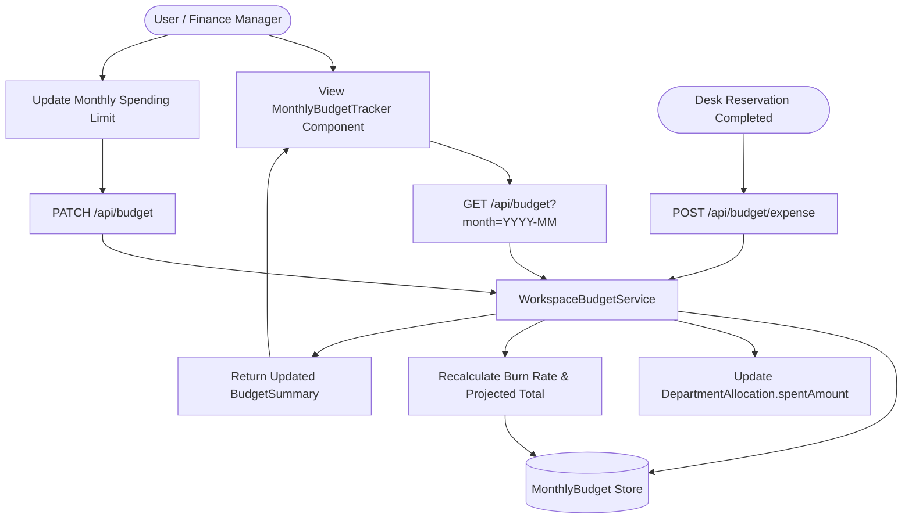
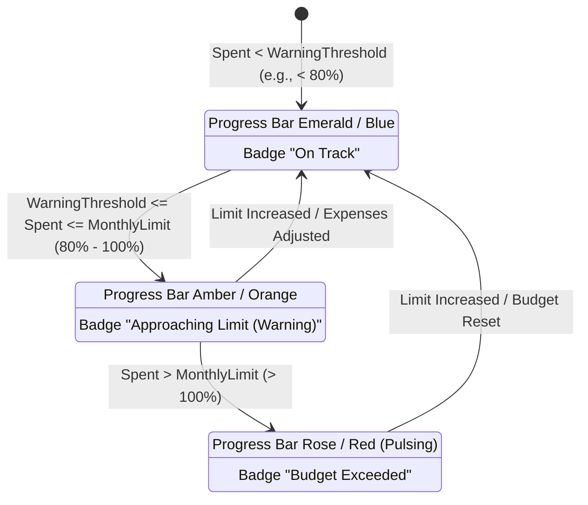

# Monthly Workspace Budget & Team Expense Tracker

## Overview

The Monthly Workspace Budget Tracker (`src/components/billing/MonthlyBudgetTracker.tsx` and `src/lib/billing/budgetService.ts`) provides automated financial oversight for individual professionals, distributed teams, and enterprise departments booking workspaces through WorkSphere.

The tracker calculates real-time budget utilization, visualizes departmental cost-center allocations, monitors daily burn rates, forecasts end-of-month expenditure, and triggers contextual warnings when spending approaches or exceeds allocated caps.

---

## 1. System Architecture & Data Flow



---

## 2. Core Concepts & Business Logic (`src/lib/billing/budgetService.ts`)

### 2.1 Budget Configuration (`MonthlyBudgetConfig`)
Every user or team profile maintains an active budget object partitioned by calendar month:

```typescript
export interface MonthlyBudgetConfig {
  userId: string;
  month: string;                     // "YYYY-MM"
  currency: string;                  // e.g., "USD"
  monthlyLimit: number;              // Monthly ceiling (e.g., $500.00)
  warningThresholdPercentage: number;// Threshold triggering warning (e.g., 80%)
  departments: DepartmentAllocation[];
  expenses: ExpenseRecord[];
  updatedAt: string;
}
```

### 2.2 Department Allocations & Cost Centers
Budgets are subdivided across operational departments (e.g., Engineering, Design & Creative, Product & Operations, General):

```typescript
export interface DepartmentAllocation {
  id: string;
  name: string;
  allocatedAmount: number;
  spentAmount: number;
  color: string;
}
```

### 2.3 Burn Rate & Month-End Projections

$$\text{utilizationPercentage} = \min\left(100, \text{round}\left(\frac{\text{totalSpent}}{\text{monthlyLimit}} \times 100\right)\right)$$

$$\text{burnRatePerDay} = \frac{\text{totalSpent}}{\text{dayOfMonth}}$$

$$\text{projectedMonthEndSpend} = \text{round}\left(\text{burnRatePerDay} \times \text{daysInMonth}\right)$$

---

## 3. Visual Budget Progress States

The UI dynamically updates status indicators based on calculated utilization and threshold boundaries:



### UI Progress Bar Color Mapping:
- **Normal / Healthy ($< 80\%$):** `bg-gradient-to-r from-blue-500 to-indigo-500` with emerald status badge.
- **Near Limit Warning ($80\% - 100\%$):** `bg-gradient-to-r from-amber-500 to-orange-500` with amber warning banner.
- **Over Limit ($> 100\%$):** `bg-gradient-to-r from-rose-500 to-red-600` with pulsing red alert and warning icon.

---

## 4. REST API Endpoints Reference

### 4.1 Retrieve Monthly Budget Summary
**Endpoint:** `GET /api/budget`  
**Query Parameters:**  
- `month` *(optional)*: Specific calendar month in format `YYYY-MM`. Defaults to current calendar month.

**Example Response (200 OK):**
```json
{
  "success": true,
  "summary": {
    "month": "2026-10",
    "monthlyLimit": 500,
    "totalSpent": 325,
    "remainingBudget": 175,
    "utilizationPercentage": 65,
    "burnRatePerDay": 46.43,
    "projectedMonthEndSpend": 1439,
    "isNearLimit": false,
    "isOverLimit": false,
    "departments": [
      {
        "id": "dept_eng",
        "name": "Engineering",
        "allocatedAmount": 200,
        "spentAmount": 145,
        "color": "#3b82f6"
      }
    ],
    "recentExpenses": []
  }
}
```

---

### 4.2 Update Budget Limits & Allocations
**Endpoint:** `PATCH /api/budget`  
**Request Body:**
```json
{
  "monthlyLimit": 750,
  "warningThresholdPercentage": 85,
  "departments": [
    {
      "id": "dept_eng",
      "name": "Engineering",
      "allocatedAmount": 350,
      "spentAmount": 145,
      "color": "#3b82f6"
    }
  ]
}
```

**Example Response (200 OK):**
```json
{
  "success": true,
  "message": "Monthly workspace budget updated successfully.",
  "summary": { ... }
}
```

---

### 4.3 Record Workspace Booking Expense
**Endpoint:** `POST /api/budget/expense`  
**Request Body:**
```json
{
  "bookingId": "bk_789456",
  "venueName": "Mindspace Coworking",
  "category": "Dedicated Desk",
  "department": "Engineering",
  "costCenter": "CC-204",
  "amount": 65.00
}
```

**Example Response (201 Created):**
```json
{
  "success": true,
  "message": "Workspace expense allocated successfully.",
  "expense": {
    "id": "exp_1728345678",
    "venueName": "Mindspace Coworking",
    "department": "Engineering",
    "amount": 65.00,
    "date": "2026-10-07"
  },
  "summary": { ... }
}
```

---

## 5. Client UI Component Features (`MonthlyBudgetTracker.tsx`)

1. **KPI Stat Cards:** Four primary metrics displaying Total Spent, Remaining Budget, Projected Month-End, and Daily Burn Rate.
2. **Visual Department Stack:** Interactive progress bars detailing department-level spend vs. allocated threshold.
3. **Recent Expense Feed:** Categorized chronological feed of recent workspace receipts.
4. **Interactive Limit Modal:** Modal dialog allowing instant adjustment of the monthly limit with optimistic UI feedback.
5. **CSV Expense Export:** Generates downloadable RFC 4180 compliant CSV reports directly from the client.
