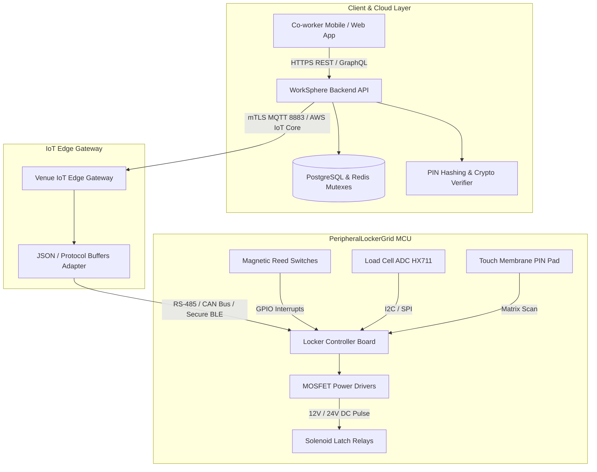
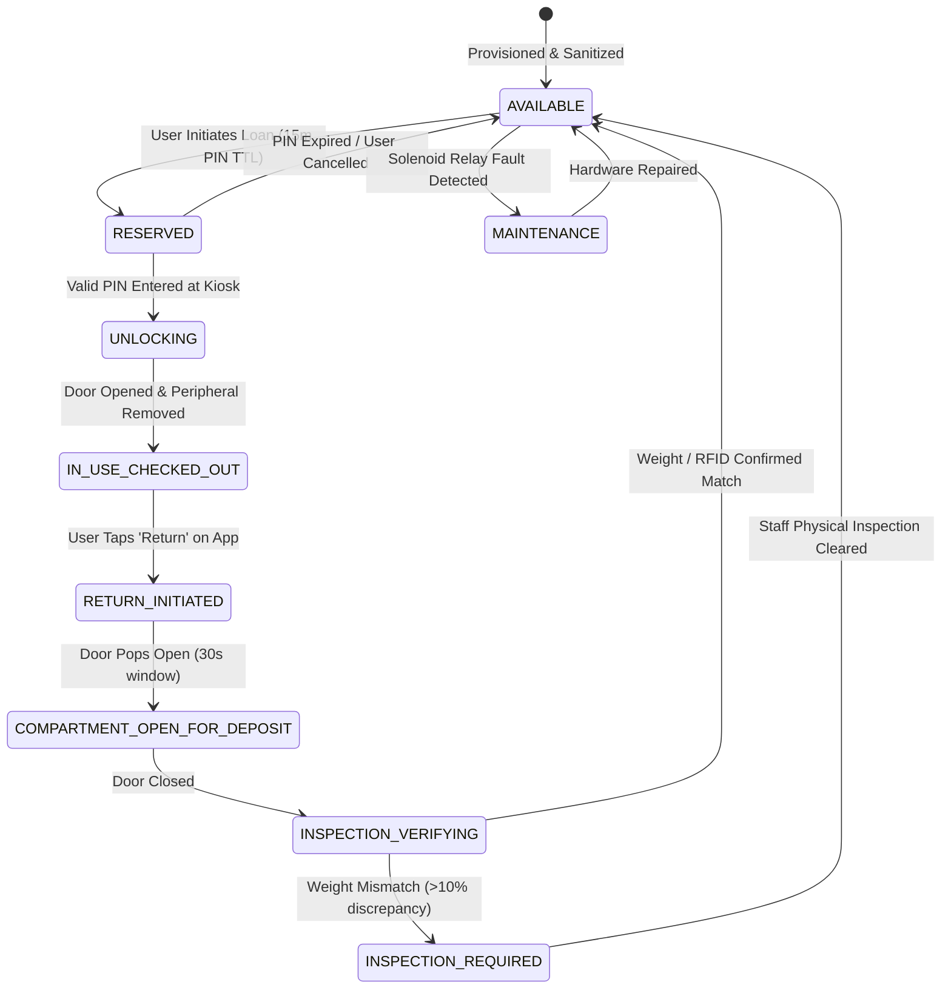

# Peripheral Locker Grid (`PeripheralLockerGrid`) Hardware Integration & PIN Verification Architecture

Comprehensive hardware integration manual, cryptographic verification specification, and inventory lifecycle documentation for WorkSphere's **Peripheral Locker Grid (`PeripheralLockerGrid`)**. 

The Peripheral Locker Grid provides automated, secure self-service loaning of high-value computer peripherals (4K USB-C displays, ergonomic mechanical keyboards, high-precision mice, active noise-cancelling headsets, multi-port docking stations, and graphics tablets) across remote co-working spaces and enterprise flex offices.

---

## 1. System Overview & Hardware Architecture

The smart locker system interfaces client applications, cloud scheduling microservices, edge MQTT broker relays, and embedded microcontroller hardware (ESP32 / STM32) driving electro-mechanical solenoid latch locks and optical/reed contact sensors.



---

## 2. IoT Smart Locker Integration Protocol

### 2.1 Communication Protocol & Topic Hierarchy

Edge gateways and locker microcontroller units communicate via **MQTT 5.0 over TLS 1.3** utilizing mutually authenticated X.509 client certificates.

#### Topic Taxonomy
* **Command Topic (Cloud to Locker MCU):**
  `worksphere/v1/venues/{venueId}/lockers/{gridId}/unit/{bayIndex}/cmd/unlock`
* **Telemetry & State Topic (Locker MCU to Cloud):**
  `worksphere/v1/venues/{venueId}/lockers/{gridId}/unit/{bayIndex}/state`
* **Peripheral Return Event Topic:**
  `worksphere/v1/venues/{venueId}/lockers/{gridId}/unit/{bayIndex}/return_sensor`
* **Heartbeat & Health Topic:**
  `worksphere/v1/venues/{venueId}/lockers/{gridId}/heartbeat`

### 2.2 Wire Frame Specification (Protocol Buffers / JSON)

```json
{
  "protocolVersion": "1.4.0",
  "messageId": "msg_98f4e21a_602b",
  "timestamp": "2026-10-09T13:20:00.000Z",
  "gridId": "plg-sf-soma-01",
  "bayIndex": 4,
  "command": "TRIGGER_UNLOCK_PULSE",
  "durationMs": 500,
  "ephemeralToken": "tok_sec_8f912c7d91e2b4"
}
```

---

## 3. Timeout Tolerances & Safety Failsafes

Electro-mechanical hardware requires strict physical tolerances to protect solenoid coils from thermal burnout while ensuring dependable user operation:

| Parameter | Threshold | Safety Failsafe Mechanism |
| :--- | :---: | :--- |
| **Solenoid Unlock Pulse** | $500\text{ ms} \pm 50\text{ ms}$ | Hardware capacitor-discharge timer cuts power if GPIO locks high. Prevents coil melting. |
| **Door Sensor Debounce** | $50\text{ ms}$ | Digital low-pass filtering on magnetic reed switches eliminates false bounces from vibration. |
| **Door Ajar Warning** | $60\text{ seconds}$ | Local buzzer chirps and UI displays "Please shut Bay 4 door firmly". |
| **Door Ajar Security Alert** | $120\text{ seconds}$ | Issues high-priority alert to venue staff; flags locker as `AJAR_UNATTENDED`. |
| **Hardware Heartbeat Interval** | $15\text{ seconds}$ | If 3 consecutive heartbeats ($45\text{s}$) are missed, cloud sets grid status to `OFFLINE_FAILSAFE`. |
| **Return Deposit Verification** | $30\text{ seconds}$ | User has 30 seconds after opening the compartment to place peripheral and close door. |

---

## 4. PIN Hash Verification & Cryptographic Security

To ensure offline survivability and prevent credential replay attacks, locker authorization uses **ephemeral salted HMAC-SHA256 tokens** and strict rate-limited PIN verification:

### 4.1 Cryptographic Hash Formulation

When a user reserves a peripheral, the cloud generates a cryptographically secure 6-digit numeric PIN:

$$\text{PIN Hash} = \text{HMAC-SHA256}\left(\text{Salt} = \text{ReservationId} \parallel \text{VenueSecret}, \, \text{Key} = \text{PIN}\right)$$

```typescript
import crypto from "crypto";

export function generateLockerPinHash(
  pin: string,
  reservationId: string,
  venueSecret: string,
): string {
  const salt = `${reservationId}:${venueSecret}`;
  return crypto.createHmac("sha256", salt).update(pin.trim()).digest("hex");
}
```

### 4.2 Brute-Force Rate Limiting & Anti-Tamper Security

1. **Attempt Threshold:** Maximum of **3 consecutive failed PIN attempts** per locker bay within a 5-minute rolling window.
2. **Lockout Action:** Upon 3rd failure, the locker bay enters `SECURITY_LOCKOUT` state for 300 seconds ($5\text{ mins}$).
3. **Audit Trail:** Sends security webhook triggering timestamped CCTV camera snapshot associated with the locker kiosk.
4. **PIN Time-to-Live (TTL):** Pickup PIN expires automatically after **15 minutes** if uncollected, returning the peripheral to the public inventory pool.

---

## 5. Peripheral Inventory Lifecycle & State Machine

Every peripheral unit (monitors, keyboards, webcams) transitions through a deterministic state machine:



### State Definitions
* **`AVAILABLE`:** Locked in bay; optical and load cell sensor confirm item present; ready for immediate booking.
* **`RESERVED`:** Held for specific coworker; 6-digit pickup PIN dispatched via app and SMS.
* **`IN_USE_CHECKED_OUT`:** Door opened, item retrieved, door securely re-latched; user active session running.
* **`INSPECTION_REQUIRED`:** Item returned, but load cell detects unexpected weight (e.g. empty box or missing accessories like power cables). Bay quarantined until staff review.

---

## 6. API Route Contracts & Schemas

### 6.1 Checkout / Loan Endpoint
`POST /api/hardware/lockers/:lockerId/checkout`

#### Request Payload
```json
{
  "venueId": "venue-ny-flat-02",
  "bayIndex": 3,
  "peripheralId": "periph-4k-dell-u2723qe",
  "userId": "user-8f9210",
  "expectedDurationHours": 4
}
```

#### Response Payload
```json
{
  "reservationId": "res_lock_99214a",
  "gridId": "plg-ny-flat-02",
  "bayIndex": 3,
  "status": "RESERVED",
  "pickupPin": "481029",
  "pinExpiresAt": "2026-10-09T13:35:00.000Z",
  "instructions": "Enter 481029 on Bay 3 keypad or tap 'Open Locker' in the WorkSphere app."
}
```

### 6.2 Locker Return Telemetry Webhook
`POST /api/hardware/lockers/webhook/telemetry`

#### Payload
```json
{
  "gridId": "plg-ny-flat-02",
  "bayIndex": 3,
  "eventType": "DOOR_CLOSED",
  "sensorReadings": {
    "doorClosed": true,
    "lockLatched": true,
    "loadCellGrams": 4520,
    "expectedGrams": 4500,
    "variancePercent": 0.44
  },
  "timestamp": "2026-10-09T17:15:22.000Z"
}
```
