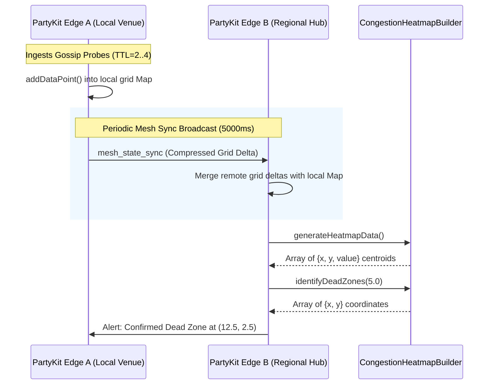

# CongestionHeatmapBuilder: Multi-Hop Packet Routing & TTL Telemetry Specification

## 1. Executive Summary & Problem Context

In dense co-working venues, hybrid campuses, and multi-region nomadic workspaces, localized wireless degradation—such as access point (AP) overload, RF multipath attenuation, physical obstruction (e.g., soundproof meeting pods), and captive portal queuing—frequently leads to severe latency spikes and connection dropouts.

While centralized monitoring tools report aggregated venue bandwidth from internet service gateways, they fail to capture intra-venue spatial blindspots or peer-to-peer transit bottlenecks. WorkSphere addresses this challenge through the **`CongestionHeatmapBuilder`** spatial aggregation engine ([`src/core/network/CongestionHeatmapBuilder.ts`](file:///c:/Users/admin/Desktop/workfere/src/core/network/CongestionHeatmapBuilder.ts)) coupled with a decentralized, multi-hop telemetry dissemination protocol operating across **PartyKit edge rooms** ([`src/party/speedtest.room.ts`](file:///c:/Users/admin/Desktop/workfere/src/party/speedtest.room.ts)) and inter-edge server mesh sync ([`src/lib/edge/edgeMeshSync.ts`](file:///c:/Users/admin/Desktop/workfere/src/lib/edge/edgeMeshSync.ts)).

This specification details:
1. **Multi-hop packet routing and gossip dissemination** of peer-to-peer telemetry probes.
2. **Time-To-Live (TTL) bounding and hop-limit mechanics** preventing broadcast storms and looping packets in dense meshes.
3. **Decentralized spatial discretization and grid cell binning** in 2D continuous metric space.
4. **Consensus and conflict resolution** across distributed PartyKit edge servers.
5. **Dead-zone identification thresholds and proactive remediation workflows**.

---

## 2. Distributed Architecture & Topology Model

WorkSphere's spatial congestion monitoring operates as a multi-tier distributed pipeline:

```mermaid
flowchart TD
    subgraph VenueClients ["Venue Clients (Laptops / Mobile Browsers)"]
        C1["Client A (x1, y1)"]
        C2["Client B (x2, y2)"]
        C3["Client C (x3, y3)"]
    end

    subgraph P2PTelemetry ["P2P Multi-Hop Telemetry Mesh"]
        C1 <-->|Direct WebRTC DataChannel / Ping Probe| C2
        C2 <-->|Direct WebRTC DataChannel / Ping Probe| C3
    end

    subgraph EdgeLayer ["PartyKit Edge Layer (Cloudflare Workers)"]
        P1["PartyKit Room: speedtest (Local Venue Edge)"]
        P2["PartyKit Room: venue-mesh (Regional Edge)"]
    end

    subgraph AggregationEngine ["Spatial Processing Engine"]
        CHB["CongestionHeatmapBuilder (Spatial Grid Discretization)"]
        DZ["Dead Zone Detector (thresholdMbps < 5.0)"]
    end

    subgraph VisualizationDash ["Admin & Venue Operations"]
        HeatmapUI["Heatmap Canvas / Floor Plan Overlay"]
        OpsAlert["Automated AP Band Steering Alert"]
    end

    C1 -->|Gossip Telemetry Packet (TTL=4)| P1
    C2 -->|Gossip Telemetry Packet (TTL=4)| P1
    C3 -->|Gossip Telemetry Packet (TTL=4)| P1
    P1 <-->|Inter-Server EdgeMeshSync| P2
    P1 --> CHB
    CHB --> DZ
    CHB --> HeatmapUI
    DZ --> OpsAlert
```

### Component Roles

1. **Client Probes (WebRTC DataChannels):**
   - Execute continuous or on-demand micro-benchmarks (RTT pings, jitter probes, chunk throughput) between peer browsers in the same physical venue.
   - Tag each diagnostic measurement with client spatial coordinates $(x, y)$, download/upload throughput ($\text{Mbps}$), round-trip time ($\text{ms}$), and local timestamps.

2. **Gossip Dissemination Protocol:**
   - Instead of every client flooding the centralized PartyKit server with raw per-second pings, clients gossip summary vectors to immediate WebRTC peers using bounded Time-To-Live (TTL) packets.

3. **PartyKit Edge Collectors (`speedtest.room.ts` & `venue-mesh`):**
   - Receive deduplicated gossip packets from peer clients.
   - Maintain ephemeral in-memory state of active venue nodes.
   - Synchronize aggregate metrics across regional edge nodes via `EdgeMeshSync` WebSocket channels.

4. **Congestion Heatmap Discretizer (`CongestionHeatmapBuilder.ts`):**
   - Partitions the continuous 2D venue floor plane into discrete metric grid squares ($5\text{m} \times 5\text{m}$ default).
   - Aggregates throughput and latency samples per cell into geometric centroids.
   - Computes dead-zone coordinates where average capacity falls below SLA thresholds (e.g., $5\text{ Mbps}$).

---

## 3. Multi-Hop Telemetry Packet Structure & TTL Semantics

### 3.1 Telemetry Packet Wire Schema

To minimize serialization overhead over constrained WebRTC DataChannels and PartyKit WebSocket pipes, the telemetry packet is encoded as a compact binary or strict JSON frame:

```typescript
export interface HopTrace {
  /** Unique identifier of the forwarding node */
  nodeId: string;
  /** Ingress timestamp at the forwarding hop (Unix epoch ms) */
  receivedAt: number;
  /** Observed link latency to previous hop (ms) */
  linkLatencyMs: number;
}

export interface TelemetryGossipPacket {
  /** Globally unique packet identifier (UUIDv4 or hash of originId + seqNum) */
  packetId: string;
  /** Origin client / sensor identifier */
  originNodeId: string;
  /** Sequence counter monotonically incremented by origin */
  sequenceNumber: number;
  /** Physical or trilaterated venue coordinates of origin */
  originCoordinates: {
    x: number; // meters from venue origin
    y: number; // meters from venue origin
    floorLevel: number;
  };
  /** Measured network metrics */
  metrics: {
    downloadSpeedMbps: number;
    uploadSpeedMbps: number;
    rttMs: number;
    jitterMs: number;
    packetLossRatio: number;
  };
  /** Generation timestamp at origin (Unix epoch ms) */
  timestamp: number;
  /** Time-To-Live: decremented at each hop; discarded when <= 0 */
  ttl: number;
  /** Maximum allowable hops before drop (initial TTL) */
  initialTtl: number;
  /** Ordered list of intermediate hops */
  hopHistory: HopTrace[];
}
```

### 3.2 Time-To-Live (TTL) Bounding Mechanics

In dense mesh environments where dozens of client browsers establish partial WebRTC meshes, naive broadcast dissemination leads to the classic **broadcast storm problem**, causing severe network saturation and redundant CPU processing.

#### TTL Enforcement Rules

1. **Initial TTL Assignment:**
   - Telemetry packets originating at client devices are initialized with $\text{TTL}_{\text{init}} \in [3, 5]$.
   - In standard venues ($< 10,000\text{ m}^2$), a network diameter rarely exceeds 4 hops. A maximum TTL of 5 guarantees that telemetry can traverse across edge peers to reach a PartyKit collector or designated mesh broker without looping indefinitely.

2. **Hop Decrement & Forwarding Condition:**
   - When node $k$ receives a packet $P$:
     $$\text{TTL}_{k} = \text{TTL}_{\text{in}} - 1$$
   - If $\text{TTL}_{k} \le 0$, the packet has expired:
     - **Action:** Drop packet immediately.
     - **Telemetry Metric:** Increment `dropped_ttl_expired_total`.

3. **Temporal Horizon Bounding ($\Delta t_{\text{expiry}}$):**
   - Independent of hop counts, packets have an absolute wall-clock validity lifetime ($\tau_{\text{max}} = 15,000\text{ ms}$):
     $$\text{Age} = t_{\text{current}} - P.\text{timestamp}$$
   - If $\text{Age} > \tau_{\text{max}}$, the telemetry data is considered stale and dropped, preventing out-of-order replayed metrics from distorting real-time heatmaps.

4. **Loop Detection & Deduplication Cache:**
   - Every peer and PartyKit room maintains a high-speed sliding bloom filter or LRU cache of recently seen `packetId` values:
     ```typescript
     class PacketDeduplicator {
       private seenPackets = new Set<string>();
       private packetTimestamps = new Map<string, number>();
       private readonly windowMs = 30_000;

       public isDuplicate(packetId: string): boolean {
         const now = Date.now();
         this.pruneOldPackets(now);

         if (this.seenPackets.has(packetId)) {
           return true;
         }

         this.seenPackets.add(packetId);
         this.packetTimestamps.set(packetId, now);
         return false;
       }

       private pruneOldPackets(now: number): void {
         for (const [id, time] of this.packetTimestamps.entries()) {
           if (now - time > this.windowMs) {
             this.packetTimestamps.delete(id);
             this.seenPackets.delete(id);
           } else {
             break;
           }
         }
       }
     }
     ```

---

## 4. Multi-Hop Routing Algorithms: Peer-to-Edge Gossip

```
+-------------------------------------------------------------------------+
|                    STEP-BY-STEP MULTI-HOP ROUTING                       |
+-------------------------------------------------------------------------+
| 1. Node A conducts speed/latency probe against neighbor Node B.         |
| 2. Node A constructs TelemetryGossipPacket(TTL = 4).                    |
| 3. Node A forwards packet to k random WebRTC peers (Fanout = 3).        |
| 4. Peer receives packet:                                                |
|    a. Checks Deduplicator Cache. If duplicate -> DROP.                  |
|    b. Checks Wall Clock Age. If > 15s -> DROP.                          |
|    c. Decrements TTL. If TTL <= 0 -> DROP.                              |
|    d. Appends local nodeId to hopHistory.                               |
| 5. If Peer has active PartyKit WebSocket connection:                    |
|    -> Transmit directly to PartyKit room edge collector.                |
| 6. Else:                                                                |
|    -> Re-broadcast to (Fanout - 1) random adjacent WebRTC neighbors.    |
+-------------------------------------------------------------------------+
```

### 4.1 Probabilistic Fanout & Epidemic Dissemination

To balance reliability against bandwidth consumption, WorkSphere employs a parameterized epidemic gossip protocol:

- **Fanout Factor ($k$):**
  - When forwarding an unexpired, non-duplicate telemetry packet, a node selects $k = 3$ random connected peers.
  - In a connected graph of $N$ nodes, epidemic gossip achieves $\mathcal{O}(\log N)$ broadcast latency with high probability ($1 - \epsilon$), while bounding total message traffic to $\mathcal{O}(k \cdot N)$.

- **Link Quality Weighting:**
  - Rather than purely uniform random peer selection, the router biases peer selection towards peers with lower observed RTT:
    $$P(\text{peer}_j) = \frac{\frac{1}{\text{RTT}_j}}{\sum_{i=1}^m \frac{1}{\text{RTT}_i}}$$
  - This ensures that latency telemetry travels rapidly along low-latency backbone paths towards edge servers.

---

## 5. Spatial Discretization & Heatmap Binning Mathematics

The **`CongestionHeatmapBuilder`** converts unstructured, asynchronously received point samples into a regularized spatial matrix.

```
       Grid Coordinate Space (gridSize = 5m)
       
       (x=0, y=10)       (x=5, y=10)       (x=10, y=10)
       +-----------------+-----------------+-----------------+
       | Cell (0, 2)     | Cell (1, 2)     | Cell (2, 2)     |
       | Samples: 3      | Samples: 0      | Samples: 12     |
       | Avg: 18.2 Mbps  | Avg: N/A        | Avg: 2.1 Mbps   |
       |                 |                 | [DEAD ZONE]     |
       +-----------------+-----------------+-----------------+
       | Cell (0, 1)     | Cell (1, 1)     | Cell (2, 1)     |
       | Samples: 8      | Samples: 15     | Samples: 4      |
       | Avg: 45.0 Mbps  | Avg: 38.6 Mbps  | Avg: 8.4 Mbps   |
       +-----------------+-----------------+-----------------+
       | Cell (0, 0)     | Cell (1, 0)     | Cell (2, 0)     |
       | Center (2.5,2.5)| Center (7.5,2.5)| Center (12.5,2.5|
       | Samples: 5      | Samples: 2      | Samples: 1      |
       | Avg: 52.1 Mbps  | Avg: 48.0 Mbps  | Avg: 1.8 Mbps   |
       |                 |                 | [DEAD ZONE]     |
       +-----------------+-----------------+-----------------+
       (0, 0)            (5, 0)            (10, 0)           (15, 0)
```

### 5.1 Spatial Hash Key Derivation

For continuous metric coordinates $(x, y) \in \mathbb{R}^2$ and grid bin size $G$ (default $5\text{ meters}$):

$$\text{gridX} = \left\lfloor \frac{x}{G} \right\rfloor, \quad \text{gridY} = \left\lfloor \frac{y}{G} \right\rfloor$$
$$\text{key} = \text{gridX} \mathbin{\Vert} \text{","} \mathbin{\Vert} \text{gridY}$$

#### Cell Centroid Recovery
When rendering visual contours or publishing dead-zone points, the cell center is recovered via:

$$x_{\text{center}} = \text{gridX} \cdot G + \frac{G}{2}$$
$$y_{\text{center}} = \text{gridY} \cdot G + \frac{G}{2}$$

### 5.2 Throughput & Latency Statistical Aggregation

For each grid cell $C_k$ containing $M_k$ measurements $\{p_1, p_2, \dots, p_{M_k}\}$ collected within time window $W$:

#### 1. Arithmetic Mean Throughput:
$$\bar{v}_{\text{down}, k} = \frac{1}{M_k} \sum_{i=1}^{M_k} p_i.\text{downloadSpeedMbps}$$
$$\bar{v}_{\text{up}, k} = \frac{1}{M_k} \sum_{i=1}^{M_k} p_i.\text{uploadSpeedMbps}$$

#### 2. Weighted Temporal Decay (Exponential Moving Average):
To prioritize fresh readings over historic samples while retaining stability:
$$v_{\text{decay}, k} = \frac{\sum_{i=1}^{M_k} p_i.\text{speed} \cdot e^{-\lambda (t_{\text{now}} - p_i.\text{timestamp})}}{\sum_{i=1}^{M_k} e^{-\lambda (t_{\text{now}} - p_i.\text{timestamp})}}$$
where $\lambda = \frac{\ln(2)}{T_{\text{half}}}$ ($T_{\text{half}} = 120\text{ seconds}$).

#### 3. Dead Zone Detection Condition:
$$\text{IsDeadZone}(C_k) \iff \bar{v}_{\text{down}, k} < \theta_{\text{deadZone}} \quad (\text{default } \theta = 5.0\text{ Mbps})$$

---

## 6. PartyKit Edge Consensus & Conflict Resolution

When multiple PartyKit regional edge instances (`speedtest.room.ts` running in `ord`, `iad`, `fra`, `sin`) receive telemetry from geographically distributed venue gateways or roving clients, state synchronization must resolve clock skew and concurrent updates.

### 6.1 State Reconciliation Flow via `EdgeMeshSync`



### 6.2 Conflict-Free Delta Replication (CRDT LWW-Map)

Each spatial grid cell maintains an internal Last-Write-Wins (LWW) or bounded vector register:
- **Identifier:** `gridKey` (`"gx,gy"`)
- **State Tuple:** $\langle \bar{v}, M, t_{\text{latest}}, \text{nodeId} \rangle$
- **Merge Rule:** When receiving remote cell update $\langle \bar{v}_R, M_R, t_R, \text{id}_R \rangle$ for existing local cell $\langle \bar{v}_L, M_L, t_L, \text{id}_L \rangle$:
  1. If $|t_R - t_L| \le \delta_{\text{window}}$ ($10\text{s}$), merge sample counts and compute pooled average:
     $$\bar{v}_{\text{merged}} = \frac{M_L \bar{v}_L + M_R \bar{v}_R}{M_L + M_R}, \quad M_{\text{merged}} = M_L + M_R$$
  2. If $t_R > t_L + \delta_{\text{window}}$, remote overwrites local.
  3. If $t_L > t_R + \delta_{\text{window}}$, local update dominates.

---

## 7. Implementation Blueprint & Code Integrations

### 7.1 Enhanced Congestion Heatmap Builder with TTL & Age Validation

Below is the production TypeScript integration combining spatial binning with telemetry TTL filtering and decay:

```typescript
import { CongestionHeatmapBuilder, SpatialSpeedResult } from '@/core/network/CongestionHeatmapBuilder';

export interface TelemetryProbeSample extends SpatialSpeedResult {
  packetId: string;
  ttl: number;
  initialTtl: number;
  rttMs?: number;
  hopCount?: number;
}

export class DistributedCongestionHeatmapEngine extends CongestionHeatmapBuilder {
  private sampleMaxAgeMs: number;
  private minHopsForVerification: number;

  constructor(gridSize: number = 5, sampleMaxAgeMs: number = 60_000) {
    super(gridSize);
    this.sampleMaxAgeMs = sampleMaxAgeMs;
    this.minHopsForVerification = 1;
  }

  /**
   * Ingests a telemetry packet after validating TTL bounds and age freshness.
   */
  public ingestTelemetryPacket(sample: TelemetryProbeSample): boolean {
    const now = Date.now();

    // 1. Validate TTL boundary
    if (sample.ttl <= 0) {
      console.warn(`[HeatmapEngine] Dropping packet ${sample.packetId}: TTL expired`);
      return false;
    }

    // 2. Validate sample age freshness
    if (now - sample.timestamp > this.sampleMaxAgeMs) {
      console.warn(`[HeatmapEngine] Dropping packet ${sample.packetId}: Stale timestamp`);
      return false;
    }

    // 3. Register valid data point into underlying grid map
    this.addDataPoint({
      x: sample.x,
      y: sample.y,
      downloadSpeedMbps: sample.downloadSpeedMbps,
      uploadSpeedMbps: sample.uploadSpeedMbps,
      timestamp: sample.timestamp,
    });

    return true;
  }
}
```

### 7.2 PartyKit Room Integration (`src/party/speedtest.room.ts`)

```typescript
import type * as Party from 'partykit/server';
import { CongestionHeatmapBuilder } from '@/core/network/CongestionHeatmapBuilder';

export default class SpeedtestHeatmapRoom implements Party.Server {
  private heatmapBuilder = new CongestionHeatmapBuilder(5);
  private deduplicationCache = new Set<string>();

  constructor(readonly room: Party.Room) {}

  async onMessage(message: string, sender: Party.Connection) {
    try {
      const data = JSON.parse(message);

      if (data.type === 'telemetry-gossip') {
        const { packetId, x, y, downloadSpeedMbps, uploadSpeedMbps, ttl, timestamp } = data;

        // Dedup check
        if (this.deduplicationCache.has(packetId)) {
          return;
        }
        this.deduplicationCache.add(packetId);

        // Discard expired packets
        if (ttl <= 0 || Date.now() - timestamp > 30_000) {
          return;
        }

        // Add to spatial builder
        this.heatmapBuilder.addDataPoint({
          x,
          y,
          downloadSpeedMbps,
          uploadSpeedMbps,
          timestamp,
        });

        // Broadcast updated dead zones if newly discovered
        const deadZones = this.heatmapBuilder.identifyDeadZones(5.0);
        if (deadZones.length > 0) {
          this.room.broadcast(JSON.stringify({
            type: 'dead-zones-detected',
            deadZones,
          }));
        }
      }
    } catch (err) {
      console.error('Failed to parse telemetry gossip packet', err);
    }
  }
}
```

---

## 8. Operational Telemetry, SLAs & Troubleshooting

### 8.1 Critical Performance Metrics & OpenTelemetry Alerts

| Metric Name | Type | Unit | Threshold | Operational Response |
| :--- | :--- | :---: | :---: | :--- |
| `p2p_telemetry_hops_distribution` | Histogram | Hops | $p_{99} \ge 5$ | Investigate network partition or routing loop in WebRTC mesh. |
| `p2p_telemetry_dropped_ttl_expired` | Counter | Packets/s | $> 50\text{ /s}$ | Broadcast storm detected; reduce gossip fanout factor $k$. |
| `heatmap_dead_zones_count` | Gauge | Count | $> 0$ | Trigger automated access point RF recalibration or IT dispatch. |
| `heatmap_grid_cell_sample_density` | Histogram | Samples/cell | $< 2$ | Trigger active probe request to idle connected clients. |
| `edge_mesh_sync_replication_lag` | Gauge | ms | $> 2500\text{ ms}$ | High cross-region WAN latency; throttle state delta frequency. |

### 8.2 Common Failure Modes & Runbook

#### 1. Symptom: Broadcast Storm (High CPU on Client Browsers)
- **Root Cause:** TTL decrement missing in intermediate forwarding node; circular forwarding loop.
- **Diagnostic:** Inspect `hopHistory` in incoming packets. If the same `nodeId` appears multiple times, loop detection is failing.
- **Mitigation:** Enforce `PacketDeduplicator` check before evaluating TTL. Clamp max initial TTL to 4.

#### 2. Symptom: Ghost Dead Zones (False Positives)
- **Root Cause:** A single transient speed test failure (e.g., user closing browser mid-test) skewed the grid cell average.
- **Diagnostic:** Check sample count $M_k$ in the affected cell.
- **Mitigation:** Require minimum sample threshold ($M_k \ge 3$) before flagging a cell as a confirmed dead zone:
  ```typescript
  public identifyConfirmedDeadZones(minSamples: number = 3, thresholdMbps: number = 5): { x: number; y: number }[]
  ```

#### 3. Symptom: Spatial Misalignment Across Floors
- **Root Cause:** 2D $(x, y)$ coordinates mixing measurements across distinct physical stories (e.g., Floor 1 vs Floor 2).
- **Mitigation:** Incorporate `floorLevel` into spatial hash key:
  $$\text{key} = \text{floorLevel} \mathbin{\Vert} \text{":"} \mathbin{\Vert} \text{gridX} \mathbin{\Vert} \text{","} \mathbin{\Vert} \text{gridY}$$
