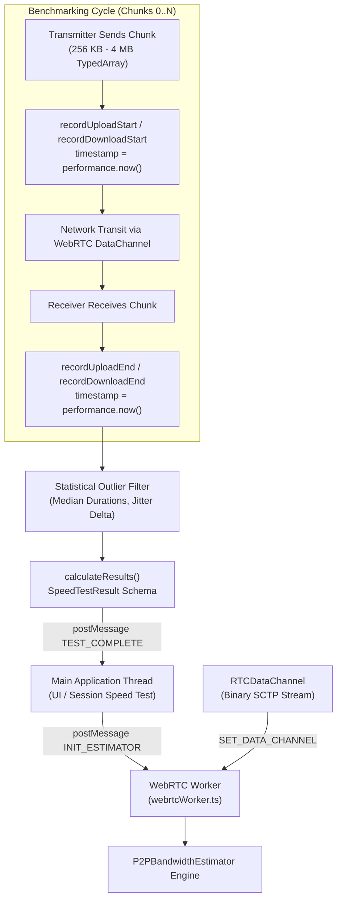

# P2PBandwidthEstimator: Peer Chunk Transfer Benchmarking Protocol

## 1. Executive Summary

In distributed mesh workspaces and nomad co-working sessions, direct WebRTC peer connections support live file synchronization, audio/video streaming, and decentralized diagnostics. The **`P2PBandwidthEstimator`** engine ([`src/core/network/P2PBandwidthEstimator.ts`](file:///c:/Users/admin/Desktop/workfere/src/core/network/P2PBandwidthEstimator.ts)), coupled with the background Web Worker ([`src/workers/webrtcWorker.ts`](file:///c:/Users/admin/Desktop/workfere/src/workers/webrtcWorker.ts)), implements an off-thread peer-to-peer bandwidth testing protocol.

This technical specification details:
- **Chunk Size Matrix (256 KB to 4 MB):** Staged payload sizes for ramp-up, sustained measurement, and high-throughput saturation.
- **Round-Trip Time (RTT) & Jitter Estimation:** Inter-arrival delta calculations and statistical smoothing to discard network outliers.
- **Sliding Window Throughput:** Median-based transfer rate evaluation across upload and download streams.
- **Standardized Diagnostic Reporting:** JSON schema for throughput metrics, packet loss percentages, and export formats.

---

## 2. Protocol Architecture & Threading Model



### Thread Offloading Benefits
- **Zero UI Freezing:** Cryptographic payload generation and multi-megabyte binary allocations execute inside `webrtcWorker.ts`, keeping the main UI thread at 60 FPS.
- **Microsecond Precision:** High-resolution timers (`performance.now()`) capture transfer intervals unaffected by DOM rendering delays.

---

## 3. Chunk Sizing Matrix & Ramp-Up Sequence

To accurately measure peer throughput without choking high-latency connections or under-saturating gigabit fiber links, the benchmarking protocol uses structured chunk sizes:

| Phase | Chunk Size | Chunk Count | Cumulative Volume | Primary Objective |
| :--- | :---: | :---: | :---: | :--- |
| **Warm-Up / Probe** | $256\text{ KB}$ ($262,144\text{ B}$) | 4 | $1\text{ MB}$ | Detect initial RTT, baseline SCTP window size, establish connection path |
| **Ramp-Up** | $512\text{ KB}$ ($524,288\text{ B}$) | 4 | $2\text{ MB}$ | Expand congestion window, observe initial jitter |
| **Standard Benchmark** | $1\text{ MB}$ ($1,048,576\text{ B}$) | 10 | $10\text{ MB}$ | **Default Production:** Balanced load testing across mobile and desktop peers |
| **High-Throughput Saturation** | $2\text{ MB}\text{--}4\text{ MB}$ | 5–10 | $10\text{--}40\text{ MB}$ | Gigabit LAN and low-latency metro fiber benchmarking |

```typescript
// Initializing the estimator with custom chunk parameters
const chunkSize = 1024 * 1024; // 1 MB default
const totalChunks = 10;
const estimator = new P2PBandwidthEstimator(chunkSize, totalChunks);
```

---

## 4. Throughput & Latency Estimation Mathematics

### 4.1 Throughput Calculation

Rather than using a simple arithmetic mean—which is easily corrupted by initial TCP/SCTP slow-start delays or transient buffer spikes—the estimator calculates the **median duration** across all completed chunk transfers:

$$\Delta t_i = t_{\text{end}, i} - t_{\text{start}, i}$$

$$\Delta t_{\text{median}} = \text{median}(\{\Delta t_i \mid \Delta t_i > 0\})$$

$$\text{Throughput (Mbps)} = \frac{\text{ChunkSize (Bytes)} \times 8}{\Delta t_{\text{median}} (\text{ms}) \times 1000}$$

```typescript
const avgDownloadDuration = this.calculateMedian(downloadDurations);
const downloadSpeedMbps = (this.chunkSize * 8) / (avgDownloadDuration * 1000);
```

### 4.2 Jitter Estimation

Jitter measures the statistical variance in packet and chunk arrival intervals:

$$\text{Jitter (ms)} = \frac{1}{N - 1} \sum_{i=1}^{N - 1} \left| \Delta t_{i} - \Delta t_{i - 1} \right|$$

```typescript
private calculateJitter(durations: number[]): number {
    if (durations.length < 2) return 0;
    let jitterSum = 0;
    for (let i = 1; i < durations.length; i++) {
        jitterSum += Math.abs(durations[i] - durations[i - 1]);
    }
    return jitterSum / (durations.length - 1);
}
```

### 4.3 Packet & Chunk Loss Percentage

Calculates unacknowledged chunks within the allocated test timeout:

$$\text{Loss Rate (\%)} = \frac{\text{Expected Chunks} - \text{Received Chunks}}{\text{Expected Chunks}} \times 100$$

```typescript
private calculatePacketLoss(durations: number[]): number {
    const expected = this.totalChunks;
    const received = durations.length;
    return ((expected - received) / expected) * 100;
}
```

---

## 5. Diagnostic Reporting Schema

The benchmarking protocol outputs a normalized [`SpeedTestResult`](file:///c:/Users/admin/Desktop/workfere/src/core/network/P2PBandwidthEstimator.ts#L7) structure:

### 5.1 TypeScript Interface

```typescript
export interface SpeedTestResult {
    /** Estimated peer download speed in Megabits per second */
    downloadSpeedMbps: number;
    /** Estimated peer upload speed in Megabits per second */
    uploadSpeedMbps: number;
    /** Inter-chunk arrival variation in milliseconds */
    jitterMs: number;
    /** Percentage of dropped or timed-out chunks (0.0 - 100.0) */
    packetLossPercent: number;
    /** Combined median duration in milliseconds */
    durationMs: number;
}
```

### 5.2 Sample Diagnostic JSON Report

```json
{
  "testId": "speedtest_mesh_8849",
  "protocol": "WebRTC-DataChannel-SCTP",
  "chunkConfig": {
    "chunkSizeBytes": 1048576,
    "chunkSizeLabel": "1 MB",
    "totalChunks": 10
  },
  "metrics": {
    "downloadSpeedMbps": 84.32,
    "uploadSpeedMbps": 42.15,
    "jitterMs": 4.12,
    "packetLossPercent": 0.0,
    "durationMs": 194.5
  },
  "networkHealth": "EXCELLENT",
  "timestamp": "2026-10-10T13:45:00.000Z"
}
```

---

## 6. Worker Lifecycle & Message Protocol

```typescript
// Worker communication protocol in webrtcWorker.ts
worker.postMessage({
  type: 'INIT_ESTIMATOR',
  payload: {
    chunkSize: 1024 * 1024,
    totalChunks: 10
  }
});

// Pass active data channel reference
worker.postMessage({
  type: 'SET_DATA_CHANNEL',
  payload: { dataChannel: rtcDataChannel }
});

// Trigger download benchmark
worker.postMessage({ type: 'START_DOWNLOAD_TEST' });

// Receive final calculated benchmark results
worker.onmessage = (event) => {
  if (event.data.type === 'TEST_COMPLETE') {
    const results: SpeedTestResult = event.data.payload;
    console.log(`Download: ${results.downloadSpeedMbps} Mbps, Jitter: ${results.jitterMs} ms`);
  }
};
```
