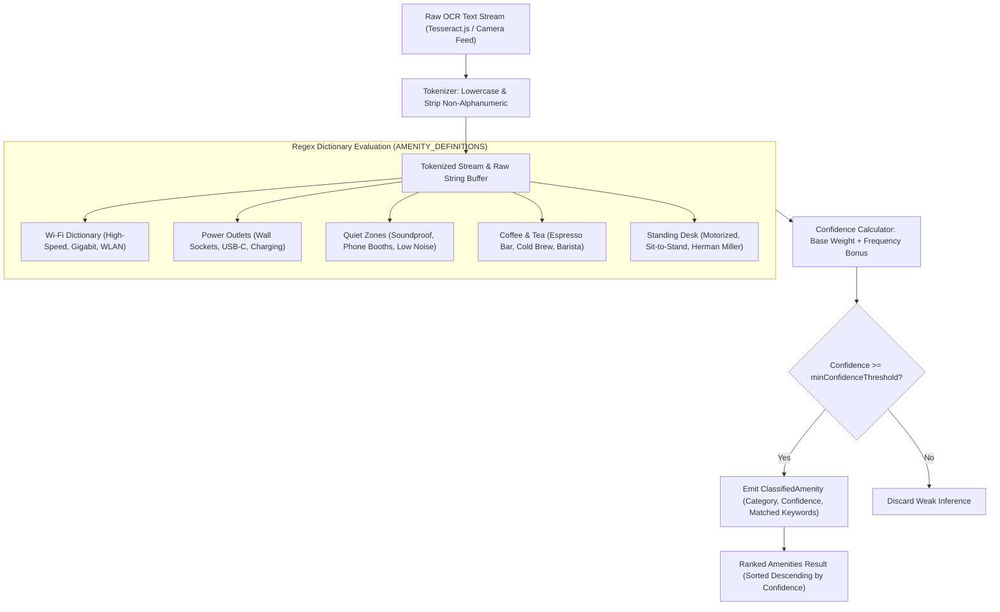

# AmenityClassifier: Tokenization, Regex Pattern Matching, and Confidence Scoring Pipeline

This document details the architecture, regex dictionary dictionaries, tokenization pipeline, and confidence score calculation methodology of **AmenityClassifier** ([`src/core/ocr/AmenityClassifier.ts`](file:///c:/Users/admin/Desktop/workfere/src/core/ocr/AmenityClassifier.ts)), used for extracting structured workspace amenities from OCR-scanned venue flyers, menu photos, signage, and user reviews.

---

## 1. Executive Summary & OCR Pipeline Overview

When remote workers upload images of cafe menus, venue window signs, or workspace flyers, the optical character recognition (OCR) engine converts bitmap images into raw, unformatted text strings. Raw OCR text often contains typos, broken hyphenation, and irregular whitespace.

The **AmenityClassifier** takes this raw OCR text stream and extracts high-value workspace amenities (e.g. Wi-Fi speed, power outlet density, quiet zones, standing desks, artisan coffee) through:
1. **Preprocessing & Tokenization:** Cleaning punctuation, lowercasing, and whitespace normalization.
2. **Regex Dictionary Matching:** Tiered regular expression patterns capturing compound phrases and variations.
3. **Confidence Scoring Engine:** Weighted scoring model that combines base phrase strength with frequency reinforcement.
4. **Threshold Gatekeeping:** Filters out speculative or weak inferences below category-specific minimum confidence bars.



---

## 2. Supported Amenity Categories & Regex Dictionaries

The classifier recognizes 5 primary workspace amenity categories defined in `AMENITY_DEFINITIONS`:

### 2.1 Wi-Fi (`wifi`)
- **Display Name:** High-Speed Wi-Fi
- **Minimum Confidence Threshold:** `0.60`
- **Regex Patterns & Weights:**

| Pattern Expression | Target Matches | Weight | Rationale |
| :--- | :--- | :---: | :--- |
| `/\b(high[- ]?speed\|gigabit\|fiber\|ultra[- ]?fast)\s+(wi[- ]?fi\|wifi\|internet)\b/i` | "high-speed wifi", "gigabit internet", "fiber wifi" | `0.95` | Explicit speed descriptor combined with network noun |
| `/\b(\d+)\s*(mbps\|gbps)\b/i` | "500 mbps", "1 gbps" | `0.85` | Bandwidth speed metric |
| `/\b(wi[- ]?fi\|wifi\|wlan\|internet)\b/i` | "wifi", "wlan", "free internet" | `0.75` | Standard network availability mention |
| `/\b(broadband\|ethernet\|lan)\b/i` | "ethernet", "wired broadband" | `0.70` | Wired network infrastructure |

### 2.2 Power Outlets (`power`)
- **Display Name:** Power Outlets
- **Minimum Confidence Threshold:** `0.55`
- **Regex Patterns & Weights:**

| Pattern Expression | Target Matches | Weight | Rationale |
| :--- | :--- | :---: | :--- |
| `/\b(outlets?\|sockets?\|plugs?\|chargers?)\s+at\s+every\s+(desk\|seat\|table)\b/i` | "outlets at every seat", "sockets at every desk" | `0.95` | High-density desk power guarantee |
| `/\b(power\s+outlets?\|wall\s+sockets?\|charging\s+stations?)\b/i` | "power outlets", "wall sockets", "charging station" | `0.90` | Standard dedicated power feature |
| `/\b(usb[- ]?c\|power\s+strip\|surge\s+protector)\b/i` | "usb-c charging", "power strip" | `0.80` | Modern peripheral charging options |
| `/\b(electric\|power\|ac\s+outlet)\b/i` | "ac power", "electric plugs" | `0.60` | Generic electrical supply keyword |

### 2.3 Quiet Zone / Soundproof (`quiet`)
- **Display Name:** Quiet Zone / Soundproof
- **Minimum Confidence Threshold:** `0.60`
- **Regex Patterns & Weights:**

| Pattern Expression | Target Matches | Weight | Rationale |
| :--- | :--- | :---: | :--- |
| `/\b(soundproof\s+booths?\|phone\s+booths?\|quiet\s+zones?\|silent\s+rooms?)\b/i` | "soundproof booth", "phone booth", "silent room" | `0.95` | Isolated acoustic focus architecture |
| `/\b(acoustic\s+(panels?\|insulation\|baffles?))\b/i` | "acoustic panels", "acoustic baffles" | `0.85` | Specialized sound treatment materials |
| `/\b(no\s+calls\|silent\s+study\|focus\s+area)\b/i` | "no calls zone", "focus area" | `0.80` | Behavioral quiet policy |
| `/\b(quiet\|peaceful\|silent\|noise[- ]?free\|low\s+noise)\b/i` | "quiet atmosphere", "low noise" | `0.75` | General ambient noise descriptor |

### 2.4 Specialty Coffee & Tea (`coffee`)
- **Display Name:** Specialty Coffee & Tea
- **Minimum Confidence Threshold:** `0.55`
- **Regex Patterns & Weights:**

| Pattern Expression | Target Matches | Weight | Rationale |
| :--- | :--- | :---: | :--- |
| `/\b(specialty\s+coffee\|espresso\s+bar\|artisan\s+roast\|barista)\b/i` | "artisan roast", "espresso bar", "on-site barista" | `0.95` | Premium coffee craft designation |
| `/\b(free\s+coffee\|unlimited\s+tea\|pour[- ]?over\|cappuccino\|latte)\b/i` | "unlimited tea", "free coffee", "pour-over" | `0.85` | Complimentary or handcrafted beverages |
| `/\b(beverage\s+station\|kettle\|coffee\s+machine)\b/i` | "coffee machine", "beverage station" | `0.75` | Self-serve workspace drink setup |
| `/\b(coffee\|tea\|cafe\|cafeteria\|cold\s+brew)\b/i` | "cafe", "cold brew", "coffee" | `0.70` | General beverage keyword |

### 2.5 Ergonomic Standing Desks (`standing_desk`)
- **Display Name:** Ergonomic Standing Desks
- **Minimum Confidence Threshold:** `0.60`
- **Regex Patterns & Weights:**

| Pattern Expression | Target Matches | Weight | Rationale |
| :--- | :--- | :---: | :--- |
| `/\b(motorized\s+standing\s+desks?\|electric\s+height[- ]?adjustable\s+desks?)\b/i` | "motorized standing desk", "electric height-adjustable desk" | `0.95` | Top-tier active workstation setup |
| `/\b(standing\s+desks?\|sit[- ]?to[- ]?stand\|height[- ]?adjustable\s+desks?)\b/i` | "standing desk", "sit-to-stand table" | `0.90` | Standard adjustable desk terminology |
| `/\b(stand[- ]?up\s+desks?\|adjustable\s+workstations?)\b/i` | "stand-up desk", "adjustable workstation" | `0.85` | Alternate ergonomic phrasing |
| `/\b(ergonomic\s+(chairs?\|workstations?\|desks?)\|herman\s+miller)\b/i` | "ergonomic chairs", "herman miller" | `0.80` | Premium postural furniture brands |

---

## 3. Tokenization & Preprocessing Logic

OCR engines frequently output broken ligatures, stray punctuation, and irregular line breaks. The `tokenize()` function cleans and segments the input stream:

```typescript
public tokenize(text: string): string[] {
  if (!text) return [];
  return text
    .toLowerCase()
    .replace(/[^\w\s-]/g, " ")
    .split(/\s+/)
    .filter((token) => token.length > 1);
}
```

1. **Lowercasing:** Converts text to lowercase to ensure case-insensitive dictionary lookups.
2. **Punctuation Stripping:** Replaces non-alphanumeric characters (except hyphens) with whitespace to prevent punctuation from gluing adjacent words together.
3. **Whitespace Splitting:** Collapses consecutive spaces, tabs, and line breaks into discrete tokens.
4. **Length Filtering:** Removes isolated single-character OCR artifacts (e.g., stray dots or isolated letters).

---

## 4. Confidence Score Calculation Methodology

The confidence scoring algorithm rewards high-specificity regex matches while giving a boost when multiple distinct patterns in the same category are confirmed in the text.

### 4.1 Formula

Given a matched amenity category with $K$ pattern matches:
- Let $w_{\text{max}} = \max(\{w_1, w_2, \dots, w_K\})$ be the highest base weight among all triggered regex patterns.
- Let $M = K$ be the total count of distinct patterns matched.

The confidence score $C$ is computed as:
$$C = \min\left(1.0, \, w_{\text{max}} + \min\left(0.15, \, (M - 1) \cdot 0.05\right)\right)$$

### 4.2 Scoring Dynamics
1. **Single Strong Match:** Matching `"gigabit fiber wifi"` ($w = 0.95$, $M = 1$) yields:
   $$C = 0.95 + 0.0 = 0.95$$
2. **Multiple Reinforcing Matches:** Matching `"coffee"` ($w = 0.70$), `"espresso bar"` ($w = 0.95$), and `"free coffee"` ($w = 0.85$) produces $w_{\text{max}} = 0.95$ and $M = 3$:
   $$C = \min(1.0, \, 0.95 + 2 \cdot 0.05) = \min(1.0, 1.05) = 1.00$$
3. **Weak Isolated Match:** A passing mention of `"power"` ($w = 0.60$, $M = 1$) yields $C = 0.60$. Because the threshold for `power` is $0.55$, it passes with low confidence ($60\%$). If a threshold were $0.65$, it would be filtered out.

---

## 5. API Types & Developer Usage

```typescript
import { amenityClassifier } from "@/core/ocr/AmenityClassifier";

const ocrText = `
  Welcome to Nomad Corner Shibuya!
  Enjoy our gigabit fiber wifi (800 mbps) and power outlets at every desk.
  Upstairs features quiet zones with soundproof phone booths.
  All workstations equipped with electric motorized standing desks.
  Complimentary artisan roast pour-over coffee available at the bar.
`;

const result = amenityClassifier.classify(ocrText);
console.log(result.amenities);
```

### Sample Output Payload:

```json
{
  "amenities": [
    {
      "category": "standing_desk",
      "displayName": "Ergonomic Standing Desks",
      "confidence": 1.0,
      "matchedKeywords": ["motorized standing desk", "standing desk"]
    },
    {
      "category": "wifi",
      "displayName": "High-Speed Wi-Fi",
      "confidence": 1.0,
      "matchedKeywords": ["fiber wifi", "wifi", "800 mbps"]
    },
    {
      "category": "quiet",
      "displayName": "Quiet Zone / Soundproof",
      "confidence": 1.0,
      "matchedKeywords": ["soundproof phone booth", "quiet zone"]
    },
    {
      "category": "power",
      "displayName": "Power Outlets",
      "confidence": 0.95,
      "matchedKeywords": ["outlets at every desk"]
    },
    {
      "category": "coffee",
      "displayName": "Specialty Coffee & Tea",
      "confidence": 0.95,
      "matchedKeywords": ["artisan roast", "pour-over"]
    }
  ]
}
```
